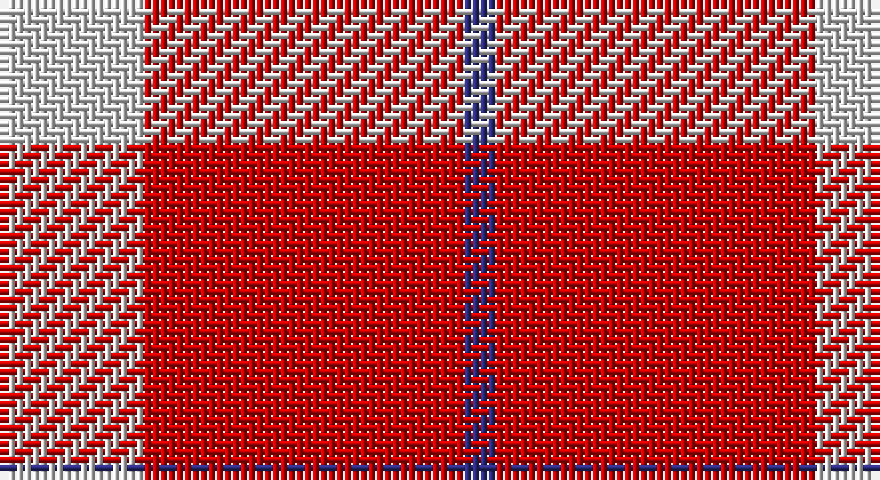

This page is one **sett** — a single exact thread-count. It belongs to the [tartan](/setts/lb9r20db2/)
(the same proportion at any scale), whose colour order is pattern [BRW](/stripes/brw/).

Sourced from tartans-authority.  It is a [3 stripe tartan](/stripes/stripes3/).

Original link http://www.tartansauthority.com/tartan-ferret/display/7288/

## Register references

External register numbers recorded for this tartan.

- Scottish Tartans Authority (ITI): 7288

## Thread count
LN/18 R40 DB/4

One full sett is **102 threads**.

## Palette

Palette: <strong>Tartan Register</strong> <small style="color:#888">(2 of 3 colours)</small>
<table><thead><tr><th>Colour</th><th>Threads</th><th>Shade</th><th>Base</th><th>OKLCh</th></tr></thead><tbody><tr><td>LN/</td><td style="text-align:right;font-variant-numeric:tabular-nums">18</td><td><code style="background-color:#D4D4D4;">#D4D4D4</code> <small style="color:#888">#D4D4D4</small></td><td>W <code style="background-color:#F7F7F7;">#F7F7F7</code></td><td><small style="color:#888">oklch(87.0% 0.000 89.9)</small></td></tr><tr><td>R</td><td style="text-align:right;font-variant-numeric:tabular-nums">40</td><td><code style="background-color:#C80000;">#C80000</code> <small style="color:#888">#C80000</small></td><td>R <code style="background-color:#CC0000;">#CC0000</code></td><td><small style="color:#888">oklch(52.3% 0.215 29.2)</small></td></tr><tr><td>DB/</td><td style="text-align:right;font-variant-numeric:tabular-nums">4</td><td><code style="background-color:#2C2C80;">#2C2C80</code> <small style="color:#888">#2C2C80</small></td><td>B <code style="background-color:#2A418A;">#2A418A</code></td><td><small style="color:#888">oklch(35.0% 0.138 276.6)</small></td></tr></tbody></table>

# Sample pattern

## Nearest tartans

The nearest existing variants by ΔTartan distance, with this tartan at the top so the swatches line up against it.

ΔTartan

Tartan

Sett

—

<a href="/ttd/edit/#slug=lb9r20db2~x2">Masai Shuka 28 (Artefact)</a> <a class="nn-out" href="/variants/s3/lb9r20db2~x2/" title="open its dictionary page">↗</a>

1.53

<a href="/ttd/edit/#slug=ly3k2r10k1~x4&amp;base=lb9r20db2~x2">Masai Shuka 26 (Artefact)</a> <a class="nn-out" href="/variants/s4/ly3k2r10k1~x4/" title="open its dictionary page">↗</a>

1.53

<a href="/ttd/edit/#slug=r30k10ly3~x4&amp;base=lb9r20db2~x2">Masai Shuka 20 (Artefact)</a> <a class="nn-out" href="/variants/s3/r30k10ly3~x4/" title="open its dictionary page">↗</a>

1.63

<a href="/ttd/edit/#slug=r125k26lb20lo16&amp;base=lb9r20db2~x2">McPeek (Fashion)</a> <a class="nn-out" href="/variants/s4/r125k26lb20lo16/" title="open its dictionary page">↗</a>

1.66

<a href="/ttd/edit/#slug=r13k1lb13~x4&amp;base=lb9r20db2~x2">Hose (Dunmore)</a> <a class="nn-out" href="/variants/s3/r13k1lb13~x4/" title="open its dictionary page">↗</a>

1.68

<a href="/ttd/edit/#slug=r38w9r3do9w3~x2&amp;base=lb9r20db2~x2">Loch Morar Trade Tartan</a> <a class="nn-out" href="/variants/s5/r38w9r3do9w3~x2/" title="open its dictionary page">↗</a>

1.70

<a href="/ttd/edit/#slug=r38w9r3dr9w3~x2&amp;base=lb9r20db2~x2">Loch Morar</a> <a class="nn-out" href="/variants/s5/r38w9r3dr9w3~x2/" title="open its dictionary page">↗</a>

1.80

<a href="/ttd/edit/#slug=r34w4t7ly10t7r18~x2&amp;base=lb9r20db2~x2">Ploysongsang, Edward Thiravej (Pers</a> <a class="nn-out" href="/variants/s6/r34w4t7ly10t7r18~x2/" title="open its dictionary page">↗</a>

1.81

<a href="/ttd/edit/#slug=r3dg20r25w3~x4&amp;base=lb9r20db2~x2">MacKinnon #6</a> <a class="nn-out" href="/variants/s4/r3dg20r25w3~x4/" title="open its dictionary page">↗</a>

1.88

<a href="/ttd/edit/#slug=r4w35r31w4~x2&amp;base=lb9r20db2~x2">Lewis, Red (Dance)</a> <a class="nn-out" href="/variants/s4/r4w35r31w4~x2/" title="open its dictionary page">↗</a>

1.91

<a href="/ttd/edit/#slug=r24dp16w3~x4&amp;base=lb9r20db2~x2">National Autistic Society Scotland</a> <a class="nn-out" href="/variants/s3/r24dp16w3~x4/" title="open its dictionary page">↗</a>

## Neighbour map

Every grey dot is one of 14360 variants placed by the first two principal components of the ΔTartan feature space (44% of its variance). Red is this tartan; blue dots are its nearest — click one to open its page.

<svg viewBox="0 0 640 380" role="img" style="max-width:100%;height:auto;border:1px solid #e0e0e0;border-radius:4px;display:block" xmlns="http://www.w3.org/2000/svg"><image href="/nn/cloud.v1.png" width="640" height="380"/><a href="/variants/s4/ly3k2r10k1~x4/"><circle cx="365.8" cy="212.9" r="4" fill="#3465a4"><title>Masai Shuka 26 (Artefact)</title></circle></a><a href="/variants/s3/r30k10ly3~x4/"><circle cx="432.9" cy="241.2" r="4" fill="#3465a4"><title>Masai Shuka 20 (Artefact)</title></circle></a><a href="/variants/s4/r125k26lb20lo16/"><circle cx="375.1" cy="201.5" r="4" fill="#3465a4"><title>McPeek (Fashion)</title></circle></a><a href="/variants/s3/r13k1lb13~x4/"><circle cx="304.0" cy="235.5" r="4" fill="#3465a4"><title>Hose (Dunmore)</title></circle></a><a href="/variants/s5/r38w9r3do9w3~x2/"><circle cx="412.9" cy="182.7" r="4" fill="#3465a4"><title>Loch Morar Trade Tartan</title></circle></a><a href="/variants/s5/r38w9r3dr9w3~x2/"><circle cx="411.1" cy="183.0" r="4" fill="#3465a4"><title>Loch Morar</title></circle></a><a href="/variants/s6/r34w4t7ly10t7r18~x2/"><circle cx="351.9" cy="201.1" r="4" fill="#3465a4"><title>Ploysongsang, Edward Thiravej (Pers</title></circle></a><a href="/variants/s4/r3dg20r25w3~x4/"><circle cx="333.9" cy="240.8" r="4" fill="#3465a4"><title>MacKinnon #6</title></circle></a><a href="/variants/s4/r4w35r31w4~x2/"><circle cx="347.5" cy="233.9" r="4" fill="#3465a4"><title>Lewis, Red (Dance)</title></circle></a><a href="/variants/s3/r24dp16w3~x4/"><circle cx="342.4" cy="268.4" r="4" fill="#3465a4"><title>National Autistic Society Scotland</title></circle></a><circle cx="384.9" cy="239.4" r="5" fill="#c00000"/></svg>

ID: /variants/s3/lb9r20db2~x2/
