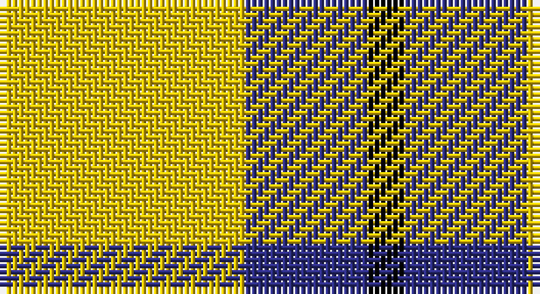

This page is one **sett** — a single exact thread-count. It belongs to the [tartan](/setts/ly20db10k3/)
(the same proportion at any scale), whose colour order is pattern [KBY](/stripes/kby/).

Sourced from tartans-authority.  It is a [3 stripe tartan](/stripes/stripes3/).

Original link http://www.tartansauthority.com/tartan-ferret/display/7191/

## Register references

External register numbers recorded for this tartan.

- Scottish Tartans Authority (ITI): 7191

## Thread count
Y/40 DB20 K/6

One full sett is **86 threads**.

## Palette

Palette: <strong>Tartan Register</strong>
<table><thead><tr><th>Colour</th><th>Threads</th><th>Shade</th><th>Base</th><th>OKLCh</th></tr></thead><tbody><tr><td>Y/</td><td style="text-align:right;font-variant-numeric:tabular-nums">40</td><td><code style="background-color:#E8C000;">#E8C000</code> <small style="color:#888">#E8C000</small></td><td>Y <code style="background-color:#F2BF00;">#F2BF00</code></td><td><small style="color:#888">oklch(81.9% 0.168 93.7)</small></td></tr><tr><td>DB</td><td style="text-align:right;font-variant-numeric:tabular-nums">20</td><td><code style="background-color:#2C2C80;">#2C2C80</code> <small style="color:#888">#2C2C80</small></td><td>B <code style="background-color:#2A418A;">#2A418A</code></td><td><small style="color:#888">oklch(35.0% 0.138 276.6)</small></td></tr><tr><td>K/</td><td style="text-align:right;font-variant-numeric:tabular-nums">6</td><td><code style="background-color:#000000;">#000000</code> <small style="color:#888">#000000</small></td><td>K <code style="background-color:#000000;">#000000</code></td><td><small style="color:#888">oklch(0.0% 0.000 0.0)</small></td></tr></tbody></table>

# Sample pattern

## Nearest tartans

The nearest existing variants by ΔTartan distance, with this tartan at the top so the swatches line up against it.

ΔTartan

Tartan

Sett

—

<a href="/ttd/edit/#slug=ly20db10k3~x2">Masai Shuka 04 (Artefact)</a> <a class="nn-out" href="/variants/s3/ly20db10k3~x2/" title="open its dictionary page">↗</a>

0.99

<a href="/ttd/edit/#slug=k15ly20w3~x2&amp;base=ly20db10k3~x2">Silvicola (Corporate)</a> <a class="nn-out" href="/variants/s3/k15ly20w3~x2/" title="open its dictionary page">↗</a>

1.25

<a href="/ttd/edit/#slug=w5ly32dt32ly5~x2&amp;base=ly20db10k3~x2">Barclay Dress</a> <a class="nn-out" href="/variants/s4/w5ly32dt32ly5~x2/" title="open its dictionary page">↗</a>

1.30

<a href="/ttd/edit/#slug=w1ly6k6ly1~x8&amp;base=ly20db10k3~x2">Barclay Dress Clan Tartan</a> <a class="nn-out" href="/variants/s4/w1ly6k6ly1~x8/" title="open its dictionary page">↗</a>

1.53

<a href="/variants/s4/dg20w5r3~x2/">Juchter (Personal)</a>

1.61

<a href="/ttd/edit/#slug=k4lo15k4w2~x2&amp;base=ly20db10k3~x2">Takla Makan #2 (Artefact)</a> <a class="nn-out" href="/variants/s4/k4lo15k4w2~x2/" title="open its dictionary page">↗</a>

1.64

<a href="/ttd/edit/#slug=ly49r16k11~x2&amp;base=ly20db10k3~x2">Quenouille (2011)</a> <a class="nn-out" href="/variants/s3/ly49r16k11~x2/" title="open its dictionary page">↗</a>

1.70

<a href="/ttd/edit/#slug=p2g4ly1~x4&amp;base=ly20db10k3~x2">Wilson's, No 201</a> <a class="nn-out" href="/variants/s3/p2g4ly1~x4/" title="open its dictionary page">↗</a>

1.72

<a href="/ttd/edit/#slug=o22ly10w3k8~x2&amp;base=ly20db10k3~x2">Louisburg Canadian District Tartan</a> <a class="nn-out" href="/variants/s4/o22ly10w3k8~x2/" title="open its dictionary page">↗</a>

1.74

<a href="/ttd/edit/#slug=dg4w35g31w4~x2&amp;base=ly20db10k3~x2">Lewis, Green (Dance)</a> <a class="nn-out" href="/variants/s4/dg4w35g31w4~x2/" title="open its dictionary page">↗</a>

1.76

<a href="/ttd/edit/#slug=w1ly6k6ly1~x2&amp;base=ly20db10k3~x2">Barclay Dress</a> <a class="nn-out" href="/variants/s4/w1ly6k6ly1~x2/" title="open its dictionary page">↗</a>

## Neighbour map

Every grey dot is one of 14360 variants placed by the first two principal components of the ΔTartan feature space (44% of its variance). Red is this tartan; blue dots are its nearest — click one to open its page.

<svg viewBox="0 0 640 380" role="img" style="max-width:100%;height:auto;border:1px solid #e0e0e0;border-radius:4px;display:block" xmlns="http://www.w3.org/2000/svg"><image href="/nn/cloud.v1.png" width="640" height="380"/><a href="/variants/s3/k15ly20w3~x2/"><circle cx="242.7" cy="268.6" r="4" fill="#3465a4"><title>Silvicola (Corporate)</title></circle></a><a href="/variants/s4/w5ly32dt32ly5~x2/"><circle cx="248.2" cy="242.4" r="4" fill="#3465a4"><title>Barclay Dress</title></circle></a><a href="/variants/s4/w1ly6k6ly1~x8/"><circle cx="240.6" cy="245.8" r="4" fill="#3465a4"><title>Barclay Dress Clan Tartan</title></circle></a><a href="/variants/s4/dg20w5r3~x2/"><circle cx="305.6" cy="243.6" r="4" fill="#3465a4"><title>Juchter (Personal)</title></circle></a><a href="/variants/s4/k4lo15k4w2~x2/"><circle cx="307.3" cy="236.7" r="4" fill="#3465a4"><title>Takla Makan #2 (Artefact)</title></circle></a><a href="/variants/s3/ly49r16k11~x2/"><circle cx="299.7" cy="262.4" r="4" fill="#3465a4"><title>Quenouille (2011)</title></circle></a><a href="/variants/s3/p2g4ly1~x4/"><circle cx="260.9" cy="311.8" r="4" fill="#3465a4"><title>Wilson's, No 201</title></circle></a><a href="/variants/s4/o22ly10w3k8~x2/"><circle cx="200.1" cy="228.9" r="4" fill="#3465a4"><title>Louisburg Canadian District Tartan</title></circle></a><a href="/variants/s4/dg4w35g31w4~x2/"><circle cx="280.9" cy="231.6" r="4" fill="#3465a4"><title>Lewis, Green (Dance)</title></circle></a><a href="/variants/s4/w1ly6k6ly1~x2/"><circle cx="233.8" cy="250.5" r="4" fill="#3465a4"><title>Barclay Dress</title></circle></a><circle cx="286.9" cy="261.2" r="5" fill="#c00000"/></svg>

ID: /variants/s3/ly20db10k3~x2/
