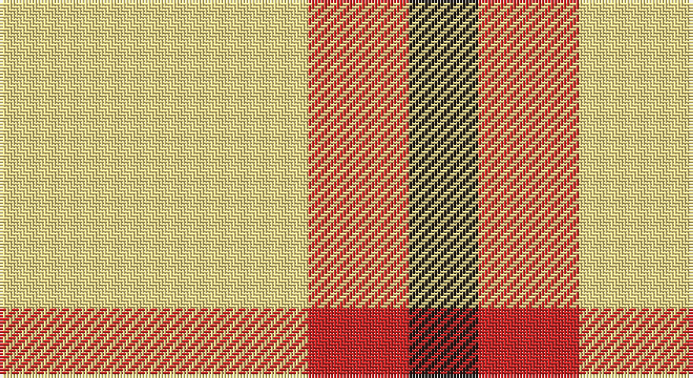

This page is one **sett** — a single exact thread-count. It belongs to the [tartan](/setts/ly49r16k11/)
(the same proportion at any scale), whose colour order is pattern [KRY](/stripes/kry/).

Sourced from register-of-tartans.  It is a [3 stripe tartan](/stripes/stripes3/).

Original link https://www.tartanregister.gov.uk/tartanDetails.aspx?ref=10479

## Register references

External register numbers recorded for this tartan.

- Scottish Register of Tartans: [10479](https://www.tartanregister.gov.uk/tartanDetails.aspx?ref=10479)

## Thread count
LY/98 R32 K/22

One full sett is **184 threads**.

## Palette

Palette: <strong>Tartan Register</strong> <small style="color:#888">(2 of 3 colours)</small>
<table><thead><tr><th>Colour</th><th>Threads</th><th>Shade</th><th>Base</th><th>OKLCh</th></tr></thead><tbody><tr><td>LY/</td><td style="text-align:right;font-variant-numeric:tabular-nums">98</td><td><code style="background-color:#F8E38C;">#F8E38C</code> <small style="color:#888">#F8E38C</small></td><td>Y <code style="background-color:#F2BF00;">#F2BF00</code></td><td><small style="color:#888">oklch(91.4% 0.110 96.2)</small></td></tr><tr><td>R</td><td style="text-align:right;font-variant-numeric:tabular-nums">32</td><td><code style="background-color:#CA2625;">#CA2625</code> <small style="color:#888">#CA2625</small></td><td>R <code style="background-color:#CC0000;">#CC0000</code></td><td><small style="color:#888">oklch(54.4% 0.199 27.2)</small></td></tr><tr><td>K/</td><td style="text-align:right;font-variant-numeric:tabular-nums">22</td><td><code style="background-color:#1C1714;">#1C1714</code> <small style="color:#888">#1C1714</small></td><td>K <code style="background-color:#000000;">#000000</code></td><td><small style="color:#888">oklch(20.9% 0.010 52.9)</small></td></tr></tbody></table>

# Sample pattern

## Nearest tartans

The nearest existing variants by ΔTartan distance, with this tartan at the top so the swatches line up against it.

ΔTartan

Tartan

Sett

—

<a href="/ttd/edit/#slug=ly49r16k11~x2">Quenouille (2011)</a> <a class="nn-out" href="/variants/s3/ly49r16k11~x2/" title="open its dictionary page">↗</a>

1.57

<a href="/ttd/edit/#slug=ly6r1ly4r4db2~x5&amp;base=ly49r16k11~x2">Sands-Pingot Family, Alabama (Personal)</a> <a class="nn-out" href="/variants/s5/ly6r1ly4r4db2~x5/" title="open its dictionary page">↗</a>

1.64

<a href="/ttd/edit/#slug=ly20db10k3~x2&amp;base=ly49r16k11~x2">Masai Shuka 04 (Artefact)</a> <a class="nn-out" href="/variants/s3/ly20db10k3~x2/" title="open its dictionary page">↗</a>

1.72

<a href="/ttd/edit/#slug=lo40g13lo6db13lo22~x2&amp;base=ly49r16k11~x2">Burt's Highlanders (Fashion)</a> <a class="nn-out" href="/variants/s5/lo40g13lo6db13lo22~x2/" title="open its dictionary page">↗</a>

1.83

<a href="/ttd/edit/#slug=ly20k15ly20w3~x2&amp;base=ly49r16k11~x2">Silvicola</a> <a class="nn-out" href="/variants/s4/ly20k15ly20w3~x2/" title="open its dictionary page">↗</a>

1.94

<a href="/ttd/edit/#slug=g10w7ly41k7~x2&amp;base=ly49r16k11~x2">Hogan (2014)</a> <a class="nn-out" href="/variants/s4/g10w7ly41k7~x2/" title="open its dictionary page">↗</a>

2.06

<a href="/ttd/edit/#slug=k15ly20w3~x2&amp;base=ly49r16k11~x2">Silvicola (Corporate)</a> <a class="nn-out" href="/variants/s3/k15ly20w3~x2/" title="open its dictionary page">↗</a>

2.18

<a href="/ttd/edit/#slug=w5ly32dt32ly5~x2&amp;base=ly49r16k11~x2">Barclay Dress</a> <a class="nn-out" href="/variants/s4/w5ly32dt32ly5~x2/" title="open its dictionary page">↗</a>

2.20

<a href="/ttd/edit/#slug=k5w37r37w5~x2&amp;base=ly49r16k11~x2">MacRae of Conchra #2</a> <a class="nn-out" href="/variants/s4/k5w37r37w5~x2/" title="open its dictionary page">↗</a>

2.27

<a href="/ttd/edit/#slug=w8r14w8r14w35k4~x2&amp;base=ly49r16k11~x2">Clayton Dress (Dance)</a> <a class="nn-out" href="/variants/s6/w8r14w8r14w35k4~x2/" title="open its dictionary page">↗</a>

2.29

<a href="/ttd/edit/#slug=w1ly6k6ly1~x8&amp;base=ly49r16k11~x2">Barclay Dress Clan Tartan</a> <a class="nn-out" href="/variants/s4/w1ly6k6ly1~x8/" title="open its dictionary page">↗</a>

## Neighbour map

Every grey dot is one of 14360 variants placed by the first two principal components of the ΔTartan feature space (44% of its variance). Red is this tartan; blue dots are its nearest — click one to open its page.

<svg viewBox="0 0 640 380" role="img" style="max-width:100%;height:auto;border:1px solid #e0e0e0;border-radius:4px;display:block" xmlns="http://www.w3.org/2000/svg"><image href="/nn/cloud.v1.png" width="640" height="380"/><a href="/variants/s5/ly6r1ly4r4db2~x5/"><circle cx="255.5" cy="243.3" r="4" fill="#3465a4"><title>Sands-Pingot Family, Alabama (Personal)</title></circle></a><a href="/variants/s3/ly20db10k3~x2/"><circle cx="286.9" cy="261.2" r="4" fill="#3465a4"><title>Masai Shuka 04 (Artefact)</title></circle></a><a href="/variants/s5/lo40g13lo6db13lo22~x2/"><circle cx="373.0" cy="245.5" r="4" fill="#3465a4"><title>Burt's Highlanders (Fashion)</title></circle></a><a href="/variants/s4/ly20k15ly20w3~x2/"><circle cx="320.8" cy="266.7" r="4" fill="#3465a4"><title>Silvicola</title></circle></a><a href="/variants/s4/g10w7ly41k7~x2/"><circle cx="291.3" cy="213.7" r="4" fill="#3465a4"><title>Hogan (2014)</title></circle></a><a href="/variants/s3/k15ly20w3~x2/"><circle cx="242.7" cy="268.6" r="4" fill="#3465a4"><title>Silvicola (Corporate)</title></circle></a><a href="/variants/s4/w5ly32dt32ly5~x2/"><circle cx="248.2" cy="242.4" r="4" fill="#3465a4"><title>Barclay Dress</title></circle></a><a href="/variants/s4/k5w37r37w5~x2/"><circle cx="279.9" cy="222.5" r="4" fill="#3465a4"><title>MacRae of Conchra #2</title></circle></a><a href="/variants/s6/w8r14w8r14w35k4~x2/"><circle cx="301.9" cy="199.1" r="4" fill="#3465a4"><title>Clayton Dress (Dance)</title></circle></a><a href="/variants/s4/w1ly6k6ly1~x8/"><circle cx="240.6" cy="245.8" r="4" fill="#3465a4"><title>Barclay Dress Clan Tartan</title></circle></a><circle cx="299.7" cy="262.4" r="5" fill="#c00000"/></svg>

ID: /variants/s3/ly49r16k11~x2/
