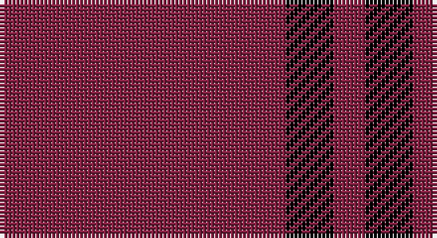

This page is one **sett** — a single exact thread-count. It belongs to the [tartan](/setts/m18k3m2/)
(the same proportion at any scale), whose colour order is pattern [RKR](/stripes/rkr/).

Sourced from weddslist.  It is a [3 stripe tartan](/stripes/stripes3/).

Original link http://www.weddslist.com/cgi-bin/tartans/pg.pl?source=sts

## Thread count
DR/72 K12 DR/8

One full sett is **104 threads**.

## Palette

Palette: <strong>Ingles Buchan</strong> <small style="color:#888">(1 of 2 colours)</small>
<table><thead><tr><th>Colour</th><th>Threads</th><th>Shade</th><th>Base</th><th>OKLCh</th></tr></thead><tbody><tr><td>DR/</td><td style="text-align:right;font-variant-numeric:tabular-nums">72</td><td><code style="background-color:#802040;">#802040</code> <small style="color:#888">#802040</small></td><td>R <code style="background-color:#CC0000;">#CC0000</code></td><td><small style="color:#888">oklch(40.8% 0.132 5.2)</small></td></tr><tr><td>K</td><td style="text-align:right;font-variant-numeric:tabular-nums">12</td><td><code style="background-color:#000000;">#000000</code> <small style="color:#888">#000000</small></td><td>K <code style="background-color:#000000;">#000000</code></td><td><small style="color:#888">oklch(0.0% 0.000 0.0)</small></td></tr><tr><td>DR/</td><td style="text-align:right;font-variant-numeric:tabular-nums">8</td><td><code style="background-color:#802040;">#802040</code> <small style="color:#888">#802040</small></td><td>R <code style="background-color:#CC0000;">#CC0000</code></td><td><small style="color:#888">oklch(40.8% 0.132 5.2)</small></td></tr></tbody></table>

# Sample pattern

## Nearest tartans

The nearest existing variants by ΔTartan distance, with this tartan at the top so the swatches line up against it.

ΔTartan

Tartan

Sett

—

<a href="/ttd/edit/#slug=m18k3m2~x4">Buie</a> <a class="nn-out" href="/variants/s3/m18k3m2~x4/" title="open its dictionary page">↗</a>

2.06

<a href="/ttd/edit/#slug=r9lr1~x20&amp;base=m18k3m2~x4">Roddy &quot;Rowdy&quot; Piper (Personal)</a> <a class="nn-out" href="/variants/s2/r9lr1~x20/" title="open its dictionary page">↗</a>

2.15

<a href="/ttd/edit/#slug=r8w1k1~x20&amp;base=m18k3m2~x4">International Karate Fed. (Corporat)</a> <a class="nn-out" href="/variants/s3/r8w1k1~x20/" title="open its dictionary page">↗</a>

2.36

<a href="/ttd/edit/#slug=r27w3r6w2dg3~x4&amp;base=m18k3m2~x4">Martin, Robert N (Personal)</a> <a class="nn-out" href="/variants/s5/r27w3r6w2dg3~x4/" title="open its dictionary page">↗</a>

2.40

<a href="/ttd/edit/#slug=r18k3r2~x4&amp;base=m18k3m2~x4">Buie</a> <a class="nn-out" href="/variants/s3/r18k3r2~x4/" title="open its dictionary page">↗</a>

2.43

<a href="/variants/s6/dp3g1dp9r3~x4/">Highland Spring (1988)</a>

2.44

<a href="/ttd/edit/#slug=dp3g1dp9r3~x4&amp;base=m18k3m2~x4">Highland Spring (1988) (Corporate)</a> <a class="nn-out" href="/variants/s4/dp3g1dp9r3~x4/" title="open its dictionary page">↗</a>

2.70

<a href="/ttd/edit/#slug=db1r9db2r9lo1~x4&amp;base=m18k3m2~x4">Brooks Brothers Tattersall Red</a> <a class="nn-out" href="/variants/s5/db1r9db2r9lo1~x4/" title="open its dictionary page">↗</a>

2.71

<a href="/ttd/edit/#slug=r40db2r6db15~x2&amp;base=m18k3m2~x4">Masai Shuka 21 (Artefact)</a> <a class="nn-out" href="/variants/s4/r40db2r6db15~x2/" title="open its dictionary page">↗</a>

2.91

<a href="/ttd/edit/#slug=o5k2o28k10o26k4o4~x2&amp;base=m18k3m2~x4">Dunbar, John Telfer (Personal)</a> <a class="nn-out" href="/variants/s7/o5k2o28k10o26k4o4~x2/" title="open its dictionary page">↗</a>

2.91

<a href="/ttd/edit/#slug=dp5g2dp19r5~x2&amp;base=m18k3m2~x4">Highland Spring Corporate Tartan</a> <a class="nn-out" href="/variants/s4/dp5g2dp19r5~x2/" title="open its dictionary page">↗</a>

## Neighbour map

Every grey dot is one of 14360 variants placed by the first two principal components of the ΔTartan feature space (44% of its variance). Red is this tartan; blue dots are its nearest — click one to open its page.

<svg viewBox="0 0 640 380" role="img" style="max-width:100%;height:auto;border:1px solid #e0e0e0;border-radius:4px;display:block" xmlns="http://www.w3.org/2000/svg"><image href="/nn/cloud.v1.png" width="640" height="380"/><a href="/variants/s2/r9lr1~x20/"><circle cx="626.0" cy="314.6" r="4" fill="#3465a4"><title>Roddy &quot;Rowdy&quot; Piper (Personal)</title></circle></a><a href="/variants/s3/r8w1k1~x20/"><circle cx="521.8" cy="246.8" r="4" fill="#3465a4"><title>International Karate Fed. (Corporat)</title></circle></a><a href="/variants/s5/r27w3r6w2dg3~x4/"><circle cx="547.8" cy="196.1" r="4" fill="#3465a4"><title>Martin, Robert N (Personal)</title></circle></a><a href="/variants/s3/r18k3r2~x4/"><circle cx="606.3" cy="252.3" r="4" fill="#3465a4"><title>Buie</title></circle></a><a href="/variants/s6/dp3g1dp9r3~x4/"><circle cx="550.9" cy="265.9" r="4" fill="#3465a4"><title>Highland Spring (1988)</title></circle></a><a href="/variants/s4/dp3g1dp9r3~x4/"><circle cx="501.3" cy="276.3" r="4" fill="#3465a4"><title>Highland Spring (1988) (Corporate)</title></circle></a><a href="/variants/s5/db1r9db2r9lo1~x4/"><circle cx="605.6" cy="274.2" r="4" fill="#3465a4"><title>Brooks Brothers Tattersall Red</title></circle></a><a href="/variants/s4/r40db2r6db15~x2/"><circle cx="546.2" cy="226.0" r="4" fill="#3465a4"><title>Masai Shuka 21 (Artefact)</title></circle></a><a href="/variants/s7/o5k2o28k10o26k4o4~x2/"><circle cx="601.1" cy="251.2" r="4" fill="#3465a4"><title>Dunbar, John Telfer (Personal)</title></circle></a><a href="/variants/s4/dp5g2dp19r5~x2/"><circle cx="560.6" cy="272.3" r="4" fill="#3465a4"><title>Highland Spring Corporate Tartan</title></circle></a><circle cx="626.0" cy="281.8" r="5" fill="#c00000"/></svg>

ID: /variants/s3/m18k3m2~x4/
