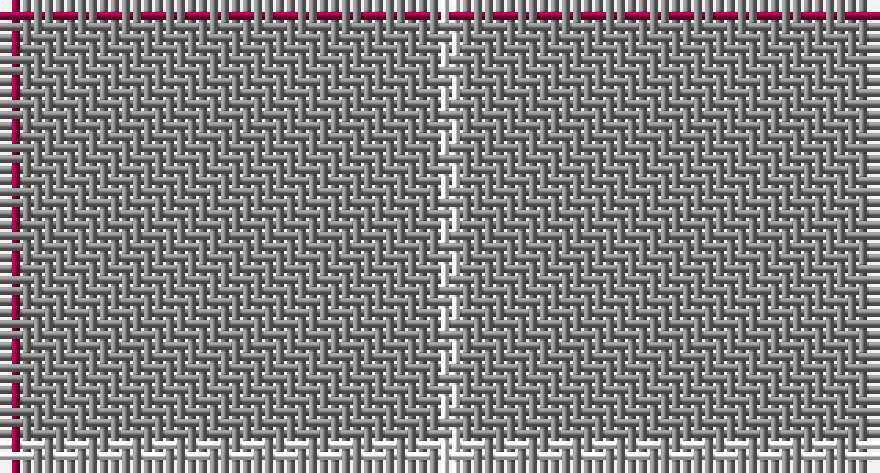

This page is one **sett** — a single exact thread-count. It belongs to the [tartan](/setts/m1o19w1/)
(the same proportion at any scale), whose colour order is pattern [RRW](/stripes/rrw/).

Part of the [Dunbar of Pitgaveny](/tartans/dunbar-of-pitgaveny/) tartan — the named design grouping this sett with its other cloths.

Sourced from tartans-authority.  It is a [3 stripe tartan](/stripes/stripes3/).

Original link http://www.tartansauthority.com/tartan-ferret/display/1634/

## Provenance

Earliest known date: c.1815 In 1815, members of the Highland Society of London resolved to request of each of the Highland chiefs, a sample of their clan tartan. The swatches were to be signed and sealed in the chief's own hand. This sett is one of those delivered to the Society between 1815 and 1822.

2 attestations — the source records this cloth was collapsed from (oldest owns this page)

<ul>
<li>pre 1822 — Dunbar of Pitgaveny (Clan) (tartans-authority, <a href="http://www.tartansauthority.com/tartan-ferret/display/1634/">record</a>)</li>
<li>undated — Dunbar of Pitgaveny Family Tartan (house-of-tartan, <a href="http://www.house-of-tartan.scotland.net/house/TartanViewjs.asp?colr=Def&tnam=1634">record</a>)</li>
</ul>

## Register references

External register numbers recorded for this tartan.

- Scottish Tartans Authority (ITI): 1634

## Thread count
R/2 N38 W/2

One full sett is **80 threads**.

## Palette

Palette: <strong>Tartan Register</strong>
<table><thead><tr><th>Colour</th><th>Threads</th><th>Shade</th><th>Base</th><th>OKLCh</th></tr></thead><tbody><tr><td>R/</td><td style="text-align:right;font-variant-numeric:tabular-nums">2</td><td><code style="background-color:#A00048;">#A00048</code> <small style="color:#888">#A00048</small></td><td>R <code style="background-color:#CC0000;">#CC0000</code></td><td><small style="color:#888">oklch(45.4% 0.182 5.3)</small></td></tr><tr><td>N</td><td style="text-align:right;font-variant-numeric:tabular-nums">38</td><td><code style="background-color:#888888;">#888888</code> <small style="color:#888">#888888</small></td><td>R <code style="background-color:#CC0000;">#CC0000</code></td><td><small style="color:#888">oklch(62.7% 0.000 89.9)</small></td></tr><tr><td>W/</td><td style="text-align:right;font-variant-numeric:tabular-nums">2</td><td><code style="background-color:#FCFCFC;">#FCFCFC</code> <small style="color:#888">#FCFCFC</small></td><td>W <code style="background-color:#F7F7F7;">#F7F7F7</code></td><td><small style="color:#888">oklch(99.1% 0.000 89.9)</small></td></tr></tbody></table>

# Sample pattern

## Compared to the master

This cloth is one sett of its design; the master sett (the exemplar the design is anchored on) is below for comparison.

<figure style="margin:0"><figcaption style="color:#888;font-size:smaller">this sett</figcaption></figure>
<figure style="margin:0"><figcaption style="color:#888;font-size:smaller"><a href="/setts/o19w1o19m1/">master sett →</a></figcaption></figure>

## Nearest tartans

The nearest existing variants by ΔTartan distance, with this tartan at the top so the swatches line up against it.

ΔTartan

Tartan

Sett

—

<a href="/ttd/edit/#slug=m1o19w1~x2">Dunbar of Pitgaveny (Clan)</a> <a class="nn-out" href="/variants/s3/m1o19w1~x2/" title="open its dictionary page">↗</a>

0.67

<a href="/ttd/edit/#slug=r1y19w1~x2&amp;base=m1o19w1~x2">Dunbar of Pitgaveny</a> <a class="nn-out" href="/variants/s3/r1y19w1~x2/" title="open its dictionary page">↗</a>

1.69

<a href="/ttd/edit/#slug=lo60do3lo4r3~x2&amp;base=m1o19w1~x2">Rabbie's Dram (Fashion)</a> <a class="nn-out" href="/variants/s4/lo60do3lo4r3~x2/" title="open its dictionary page">↗</a>

1.93

<a href="/ttd/edit/#slug=o19w1o19m1~x2&amp;base=m1o19w1~x2">Dunbar of Pitgaveny</a> <a class="nn-out" href="/variants/s4/o19w1o19m1~x2/" title="open its dictionary page">↗</a>

2.50

<a href="/ttd/edit/#slug=dy10ly1dy30y3~x4&amp;base=m1o19w1~x2">Pasteur</a> <a class="nn-out" href="/variants/s4/dy10ly1dy30y3~x4/" title="open its dictionary page">↗</a>

2.54

<a href="/ttd/edit/#slug=o30r1o15db4~x2&amp;base=m1o19w1~x2">Kincardine Tweed</a> <a class="nn-out" href="/variants/s4/o30r1o15db4~x2/" title="open its dictionary page">↗</a>

2.82

<a href="/ttd/edit/#slug=lo24r1w1dt1~x11&amp;base=m1o19w1~x2">Dutch Football (Corporate)</a> <a class="nn-out" href="/variants/s4/lo24r1w1dt1~x11/" title="open its dictionary page">↗</a>

2.88

<a href="/ttd/edit/#slug=y30w2r5~x4&amp;base=m1o19w1~x2">S3</a> <a class="nn-out" href="/variants/s3/y30w2r5~x4/" title="open its dictionary page">↗</a>

3.07

<a href="/ttd/edit/#slug=w1y1y4y7p1w1~x4&amp;base=m1o19w1~x2">Lochnagar</a> <a class="nn-out" href="/variants/s6/w1y1y4y7p1w1~x4/" title="open its dictionary page">↗</a>

3.11

<a href="/ttd/edit/#slug=do10ly1do30y3~x4&amp;base=m1o19w1~x2">Pasteur Fancy Tartan</a> <a class="nn-out" href="/variants/s4/do10ly1do30y3~x4/" title="open its dictionary page">↗</a>

3.12

<a href="/ttd/edit/#slug=db1lo9db2lo9r1~x4&amp;base=m1o19w1~x2">Brooks Brothers Tattersall Camel</a> <a class="nn-out" href="/variants/s5/db1lo9db2lo9r1~x4/" title="open its dictionary page">↗</a>

## Neighbour map

Every grey dot is one of 14360 variants placed by the first two principal components of the ΔTartan feature space (44% of its variance). Red is this tartan; blue dots are its nearest — click one to open its page.

<svg viewBox="0 0 640 380" role="img" style="max-width:100%;height:auto;border:1px solid #e0e0e0;border-radius:4px;display:block" xmlns="http://www.w3.org/2000/svg"><image href="/nn/cloud.v1.png" width="640" height="380"/><a href="/variants/s3/r1y19w1~x2/"><circle cx="626.0" cy="258.1" r="4" fill="#3465a4"><title>Dunbar of Pitgaveny</title></circle></a><a href="/variants/s4/lo60do3lo4r3~x2/"><circle cx="626.0" cy="226.7" r="4" fill="#3465a4"><title>Rabbie's Dram (Fashion)</title></circle></a><a href="/variants/s4/o19w1o19m1~x2/"><circle cx="626.0" cy="275.7" r="4" fill="#3465a4"><title>Dunbar of Pitgaveny</title></circle></a><a href="/variants/s4/dy10ly1dy30y3~x4/"><circle cx="626.0" cy="239.1" r="4" fill="#3465a4"><title>Pasteur</title></circle></a><a href="/variants/s4/o30r1o15db4~x2/"><circle cx="626.0" cy="223.2" r="4" fill="#3465a4"><title>Kincardine Tweed</title></circle></a><a href="/variants/s4/lo24r1w1dt1~x11/"><circle cx="626.0" cy="187.9" r="4" fill="#3465a4"><title>Dutch Football (Corporate)</title></circle></a><a href="/variants/s3/y30w2r5~x4/"><circle cx="581.5" cy="255.2" r="4" fill="#3465a4"><title>S3</title></circle></a><a href="/variants/s6/w1y1y4y7p1w1~x4/"><circle cx="523.9" cy="254.0" r="4" fill="#3465a4"><title>Lochnagar</title></circle></a><a href="/variants/s4/do10ly1do30y3~x4/"><circle cx="626.0" cy="232.1" r="4" fill="#3465a4"><title>Pasteur Fancy Tartan</title></circle></a><a href="/variants/s5/db1lo9db2lo9r1~x4/"><circle cx="533.4" cy="249.3" r="4" fill="#3465a4"><title>Brooks Brothers Tattersall Camel</title></circle></a><circle cx="626.0" cy="247.0" r="5" fill="#c00000"/></svg>

ID: /variants/s3/m1o19w1~x2/
