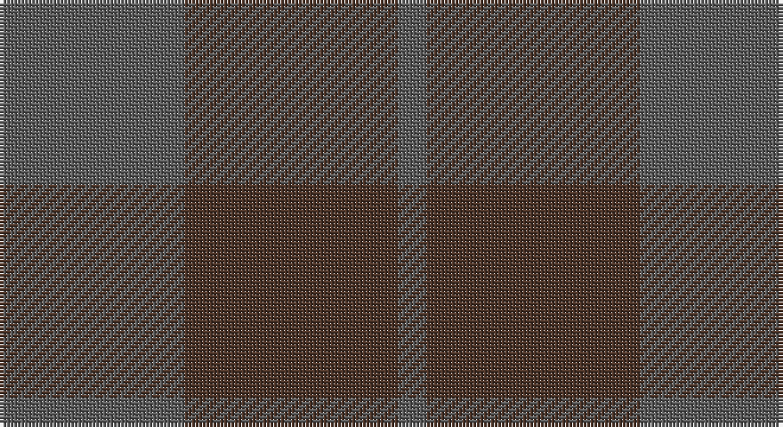

This page is one **sett** — a single exact thread-count. It belongs to the [tartan](/setts/n13do15n2/)
(the same proportion at any scale), whose colour order is pattern [BBB](/stripes/bbb/).

Part of the [Outlander](/tartans/outlander/) tartan — the named design grouping this sett with its other cloths.

Sourced from register-of-tartans.  It is a [3 stripe tartan](/stripes/stripes3/).

Original link https://www.tartanregister.gov.uk/tartanDetails.aspx?ref=11117

## Also known as

This cloth is also recorded under:

- Outlander #1
- Outlander #2
- Outlander #3
- Outlander #4
- Outlander #5

## Register references

External register numbers recorded for this tartan.

- Scottish Register of Tartans: [11117](https://www.tartanregister.gov.uk/tartanDetails.aspx?ref=11117)

## Thread count
N/52 T60 N/8

One full sett is **180 threads**.

## Palette

Palette: <strong>Tartan Register</strong> <small style="color:#888">(1 of 2 colours)</small>
<table><thead><tr><th>Colour</th><th>Threads</th><th>Shade</th><th>Base</th><th>OKLCh</th></tr></thead><tbody><tr><td>N/</td><td style="text-align:right;font-variant-numeric:tabular-nums">52</td><td><code style="background-color:#5C5C5C;">#5C5C5C</code> <small style="color:#888">#5C5C5C</small></td><td>B <code style="background-color:#2A418A;">#2A418A</code></td><td><small style="color:#888">oklch(47.5% 0.000 89.9)</small></td></tr><tr><td>T</td><td style="text-align:right;font-variant-numeric:tabular-nums">60</td><td><code style="background-color:#4C3428;">#4C3428</code> <small style="color:#888">#4C3428</small></td><td>B <code style="background-color:#2A418A;">#2A418A</code></td><td><small style="color:#888">oklch(34.9% 0.040 47.5)</small></td></tr><tr><td>N/</td><td style="text-align:right;font-variant-numeric:tabular-nums">8</td><td><code style="background-color:#5C5C5C;">#5C5C5C</code> <small style="color:#888">#5C5C5C</small></td><td>B <code style="background-color:#2A418A;">#2A418A</code></td><td><small style="color:#888">oklch(47.5% 0.000 89.9)</small></td></tr></tbody></table>

# Sample pattern

## Nearest tartans

The nearest existing variants by ΔTartan distance, with this tartan at the top so the swatches line up against it.

ΔTartan

Tartan

Sett

—

<a href="/ttd/edit/#slug=n13do15n2~x4">Outlander #5</a> <a class="nn-out" href="/variants/s3/n13do15n2~x4/" title="open its dictionary page">↗</a>

1.96

<a href="/ttd/edit/#slug=do11n1do4n8r1~x8&amp;base=n13do15n2~x4">Cairns, David (Personal)</a> <a class="nn-out" href="/variants/s5/do11n1do4n8r1~x8/" title="open its dictionary page">↗</a>

2.20

<a href="/ttd/edit/#slug=y14n7lo6n2~x8&amp;base=n13do15n2~x4">Outlander #3</a> <a class="nn-out" href="/variants/s4/y14n7lo6n2~x8/" title="open its dictionary page">↗</a>

2.33

<a href="/ttd/edit/#slug=o14n7lo7n2~x8&amp;base=n13do15n2~x4">Outlander #3</a> <a class="nn-out" href="/variants/s4/o14n7lo7n2~x8/" title="open its dictionary page">↗</a>

2.35

<a href="/ttd/edit/#slug=dg3dy30dg40r3~x2&amp;base=n13do15n2~x4">Sanix Muted</a> <a class="nn-out" href="/variants/s4/dg3dy30dg40r3~x2/" title="open its dictionary page">↗</a>

2.66

<a href="/ttd/edit/#slug=r5n35r46o5~x2&amp;base=n13do15n2~x4">Bryce</a> <a class="nn-out" href="/variants/s4/r5n35r46o5~x2/" title="open its dictionary page">↗</a>

2.79

<a href="/ttd/edit/#slug=do7k2do12k10dg12k3~x2&amp;base=n13do15n2~x4">Brown Watch (single) (Fashion)</a> <a class="nn-out" href="/variants/s6/do7k2do12k10dg12k3~x2/" title="open its dictionary page">↗</a>

2.85

<a href="/ttd/edit/#slug=n11o1n4o8r1~x8&amp;base=n13do15n2~x4">Cairns, David (Personal)</a> <a class="nn-out" href="/variants/s5/n11o1n4o8r1~x8/" title="open its dictionary page">↗</a>

2.87

<a href="/ttd/edit/#slug=k20dp3k20dp20~x2&amp;base=n13do15n2~x4">Wcwm 9275-1333-1</a> <a class="nn-out" href="/variants/s4/k20dp3k20dp20~x2/" title="open its dictionary page">↗</a>

2.90

<a href="/ttd/edit/#slug=do1dy6do6dy1n6dy1~x8&amp;base=n13do15n2~x4">Brown Heather (Fashion)</a> <a class="nn-out" href="/variants/s6/do1dy6do6dy1n6dy1~x8/" title="open its dictionary page">↗</a>

3.02

<a href="/ttd/edit/#slug=k46dg6k6dg6k42dg47k12&amp;base=n13do15n2~x4">Taiheiyo Club, Inc.</a> <a class="nn-out" href="/variants/s7/k46dg6k6dg6k42dg47k12/" title="open its dictionary page">↗</a>

## Neighbour map

Every grey dot is one of 14360 variants placed by the first two principal components of the ΔTartan feature space (44% of its variance). Red is this tartan; blue dots are its nearest — click one to open its page.

<svg viewBox="0 0 640 380" role="img" style="max-width:100%;height:auto;border:1px solid #e0e0e0;border-radius:4px;display:block" xmlns="http://www.w3.org/2000/svg"><image href="/nn/cloud.v1.png" width="640" height="380"/><a href="/variants/s5/do11n1do4n8r1~x8/"><circle cx="545.4" cy="340.3" r="4" fill="#3465a4"><title>Cairns, David (Personal)</title></circle></a><a href="/variants/s4/y14n7lo6n2~x8/"><circle cx="437.4" cy="366.0" r="4" fill="#3465a4"><title>Outlander #3</title></circle></a><a href="/variants/s4/o14n7lo7n2~x8/"><circle cx="407.3" cy="366.0" r="4" fill="#3465a4"><title>Outlander #3</title></circle></a><a href="/variants/s4/dg3dy30dg40r3~x2/"><circle cx="537.0" cy="335.5" r="4" fill="#3465a4"><title>Sanix Muted</title></circle></a><a href="/variants/s4/r5n35r46o5~x2/"><circle cx="529.2" cy="338.0" r="4" fill="#3465a4"><title>Bryce</title></circle></a><a href="/variants/s6/do7k2do12k10dg12k3~x2/"><circle cx="377.9" cy="366.0" r="4" fill="#3465a4"><title>Brown Watch (single) (Fashion)</title></circle></a><a href="/variants/s5/n11o1n4o8r1~x8/"><circle cx="504.6" cy="311.7" r="4" fill="#3465a4"><title>Cairns, David (Personal)</title></circle></a><a href="/variants/s4/k20dp3k20dp20~x2/"><circle cx="531.9" cy="366.0" r="4" fill="#3465a4"><title>Wcwm 9275-1333-1</title></circle></a><a href="/variants/s6/do1dy6do6dy1n6dy1~x8/"><circle cx="365.8" cy="341.2" r="4" fill="#3465a4"><title>Brown Heather (Fashion)</title></circle></a><a href="/variants/s7/k46dg6k6dg6k42dg47k12/"><circle cx="576.6" cy="366.0" r="4" fill="#3465a4"><title>Taiheiyo Club, Inc.</title></circle></a><circle cx="522.8" cy="366.0" r="5" fill="#c00000"/></svg>

ID: /variants/s3/n13do15n2~x4/
