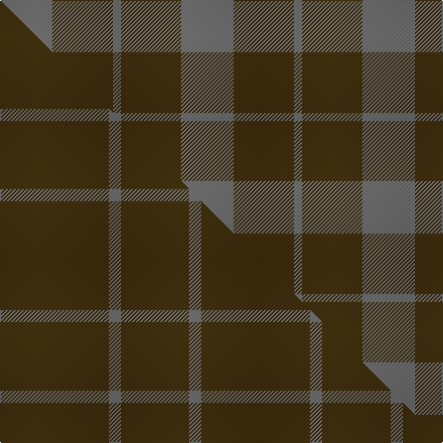

This is one **variant** — a specific cloth: this exact thread count and colourway, with its own
provenance below. It is one weaving of the [sett](/setts/n13dy15n2/) (the scale-free proportion — the
same cloth at any scale or shade), whose colour order is pattern [BGB](/stripes/bgb/).

Part of the [Outlander](/tartans/o/ou/outlander-4/) tartan — the named design grouping this sett with its other cloths.

Sourced from register-of-tartans.  It is a [3 stripe tartan](/stripes/stripes3/).

Original link [https://www.tartanregister.gov.uk/tartanDetails.aspx?ref=11117](https://www.tartanregister.gov.uk/tartanDetails.aspx?ref=11117)

2 attestations — the source records this cloth was collapsed from (oldest owns this page)

<ul>
<li>01/08/2014 — Outlander #5 (register-of-tartans, <a href="https://www.tartanregister.gov.uk/tartanDetails.aspx?ref=11117">record</a>)  <em>Created for the television series Outlander. Ancient and weathered colours were used to simulate the natural wools and dyes available in the time period of the story.</em></li>
<li>2014 — Outlander #5 (tartans-authority, <a href="https://www.tartanregister.gov.uk/tartanDetails.aspx?ref=11117">record</a>)  <em>Created for the television series 'Outlander'. Ancient and weathered colours were used to simulate the natural wools and dyes available in the time period of the story. Created for the sole use of Sony Pictures Television Inc. Attn: Television Legal / Gregory K. Boone Address: Sony Pictures Entertainment 10202 West Washington Boulevard Harry Cohn Building, #111 Culver City, CA 90232 Only to be woven by Anthony Haines Textiles Ltd</em></li>
</ul>

Dataset <small>— provenance for this record, inherited from the source manifest</small>

<dl class="dataset-prov">
<dt>source</dt><dd><a href="/sources/register-of-tartans/">Scottish Register of Tartans</a></dd>
<dt>data captured from</dt><dd><a href="https://github.com/thetartan/tartan-database/blob/master/data/register-of-tartans/data.csv">https://github.com/thetartan/tartan-database/blob/master/data/register-of-tartans/data.csv</a></dd>
<dt>data date</dt><dd>01/08/2014 <small>(this record)</small></dd>
<dt>licence</dt><dd><a href="https://www.tartanregister.gov.uk/copyright">Crown copyright</a></dd>
</dl>

Capture chain <small>— the hands this data passed through, oldest first; each capture carries its own licence</small>

<ol class="capture-chain">
<li><a href="https://www.tartanregister.gov.uk/">Scottish Register of Tartans</a> · <a href="https://www.tartanregister.gov.uk/copyright">Crown copyright</a> <small>the living register — still published by National Records of Scotland</small></li>
<li><a href="https://github.com/thetartan/tartan-database">thetartan/tartan-database</a> <small>2016-2017</small> · <a href="https://creativecommons.org/licenses/by-nc-nd/4.0/">CC BY-NC-ND 4.0</a> <small>Levko Kravets's frozen compilation — the capture we vendored, and where its CC licence text came from</small></li>
<li>this dictionary <small>captured 2026-06-10 · commit 5bf86c7566</small> <small>each re-capture is a git commit to data/sources</small></li>
</ol>

## Register references

External register numbers recorded for this tartan.

- Scottish Register of Tartans: [11117](https://www.tartanregister.gov.uk/tartanDetails?ref=11117)
- Scottish Tartans Authority (ITI): 11117

## Thread count
N/52 DY60 N/8

One full sett is **180 threads**.

## Palette
<table><thead><tr><th>Colour</th><th>Shade</th><th>OKLCh</th></tr></thead><tbody><tr><td>N</td><td><code style="background-color:#636363;">#636363</code> <small style="color:#888">#636363</small></td><td><small style="color:#888">oklch(50.0% 0.000 89.9)</small></td></tr><tr><td>DY</td><td><code style="background-color:#3A2B0D;">#3A2B0D</code> <small style="color:#888">#3A2B0D</small></td><td><small style="color:#888">oklch(30.0% 0.049 82.0)</small></td></tr></tbody></table>

# Sample pattern

## Compared to the master

This cloth is one sett of its design; the master sett (the exemplar the design is anchored on) is below for comparison.

Its **ΔTartan distance** from the master is **1.58** — the same measure the nearest-tartans table ranks by (0 is identical; a re-scale of the same cloth is near 0, a recolour or a different proportion further).

<figure class="master-compare" style="margin:0">

this sett
master sett ★

<figcaption style="color:#888;font-size:smaller">One weave of this sett against the <a href="/setts/dy27n3dy17/">master sett ★</a>, split on the diagonal: a shared proportion runs seamlessly across it with only the shades shifting; a different proportion breaks on it.</figcaption>
</figure>

## Nearest tartan variants

The nearest existing variants by ΔTartan distance, with this cloth at the top so the swatches line up against it.

ΔTartan

Threads

Variant

Sett

—

180

<a href="/variants/s3/n13dy15n2~x4/">Outlander #5</a>

<a href="/ttd/edit/#slug=n60g13n9dr8y4~x2&amp;base=n13dy15n2~x4" title="compare in the TTD">1.39</a>

248

<a href="/variants/s5/n60g13n9dr8y4~x2/">Ballantyne (Personal)</a>

<a href="/ttd/edit/#slug=o14n7ly7n2~x8~o2500000-n1900000&amp;base=n13dy15n2~x4" title="compare in the TTD">1.74</a>

352

<a href="/variants/s4/o14n7ly7n2~x8~o2500000-n1900000/">Outlander #3</a>

<a href="/ttd/edit/#slug=g9n4dy1~x8&amp;base=n13dy15n2~x4" title="compare in the TTD">1.95</a>

144

<a href="/variants/s3/g9n4dy1~x8/">Ledford</a>

<a href="/ttd/edit/#slug=g9n4dy1~x4&amp;base=n13dy15n2~x4" title="compare in the TTD">1.95</a>

72

<a href="/variants/s3/g9n4dy1~x4/">Ledford Family Tartan</a>

<a href="/ttd/edit/#slug=g9n4ly1~x16&amp;base=n13dy15n2~x4" title="compare in the TTD">1.95</a>

288

<a href="/variants/s3/g9n4ly1~x16/">Ledford (Name)</a>

<a href="/ttd/edit/#slug=g56dy13y13n5~x2&amp;base=n13dy15n2~x4" title="compare in the TTD">2.03</a>

226

<a href="/variants/s4/g56dy13y13n5~x2/">Colonial Marine (Aliens Legacy)</a>

<a href="/ttd/edit/#slug=n57w5g20n5y10&amp;base=n13dy15n2~x4" title="compare in the TTD">2.57</a>

127

<a href="/variants/s5/n57w5g20n5y10/">Jahore District Tartan</a>

<a href="/ttd/edit/#slug=w4n28t48y3~x2~t2503227&amp;base=n13dy15n2~x4" title="compare in the TTD">2.58</a>

318

<a href="/variants/s4/w4n28t48y3~x2~t2503227/">MacKerrell of Hillhouse Dress Personal Tartan</a>

<a href="/ttd/edit/#slug=dg8dr1db1n1~x10&amp;base=n13dy15n2~x4" title="compare in the TTD">3.25</a>

130

<a href="/variants/s4/dg8dr1db1n1~x10/">Jodi Williams (Personal)</a>

<a href="/ttd/edit/#slug=dy5dt32dy32w5~x2&amp;base=n13dy15n2~x4" title="compare in the TTD">3.31</a>

276

<a href="/variants/s4/dy5dt32dy32w5~x2/">Barclay Dress</a>

## Neighbour map

Every grey dot is one of 13621 variants placed by the first two principal components of the ΔTartan feature space (42% of its variance). Red is this tartan; blue dots are its nearest — click one to open its page. The map is a flat projection of a many-dimensional space — [how to read it](/posts/neighbourhood-maps/).

<svg viewBox="0 0 640 380" role="img" style="max-width:100%;height:auto;border:1px solid #e0e0e0;border-radius:4px;display:block" xmlns="http://www.w3.org/2000/svg"><image href="/nn/cloud.v1.png" width="640" height="380"/><a href="/variants/s5/n60g13n9dr8y4~x2/"><circle cx="626.0" cy="257.8" r="4" fill="#3465a4"><title>Ballantyne (Personal)</title></circle></a><a href="/variants/s4/o14n7ly7n2~x8~o2500000-n1900000/"><circle cx="358.6" cy="324.3" r="4" fill="#3465a4"><title>Outlander #3</title></circle></a><a href="/variants/s3/g9n4dy1~x8/"><circle cx="544.6" cy="341.3" r="4" fill="#3465a4"><title>Ledford</title></circle></a><a href="/variants/s3/g9n4dy1~x4/"><circle cx="544.6" cy="341.3" r="4" fill="#3465a4"><title>Ledford Family Tartan</title></circle></a><a href="/variants/s3/g9n4ly1~x16/"><circle cx="536.4" cy="340.1" r="4" fill="#3465a4"><title>Ledford (Name)</title></circle></a><a href="/variants/s4/g56dy13y13n5~x2/"><circle cx="505.0" cy="280.8" r="4" fill="#3465a4"><title>Colonial Marine (Aliens Legacy)</title></circle></a><a href="/variants/s5/n57w5g20n5y10/"><circle cx="500.2" cy="258.5" r="4" fill="#3465a4"><title>Jahore District Tartan</title></circle></a><a href="/variants/s4/w4n28t48y3~x2~t2503227/"><circle cx="531.7" cy="281.4" r="4" fill="#3465a4"><title>MacKerrell of Hillhouse Dress Personal Tartan</title></circle></a><a href="/variants/s4/dg8dr1db1n1~x10/"><circle cx="622.9" cy="292.3" r="4" fill="#3465a4"><title>Jodi Williams (Personal)</title></circle></a><a href="/variants/s4/dy5dt32dy32w5~x2/"><circle cx="395.0" cy="313.5" r="4" fill="#3465a4"><title>Barclay Dress</title></circle></a><circle cx="513.2" cy="366.0" r="5" fill="#c00000"/><text x="320" y="376" text-anchor="middle" font-size="11" fill="#999">ground</text><text x="11" y="190" text-anchor="middle" font-size="11" fill="#999" transform="rotate(-90 11 190)">complexity</text></svg>

ID: /variants/s3/n13dy15n2~x4/
