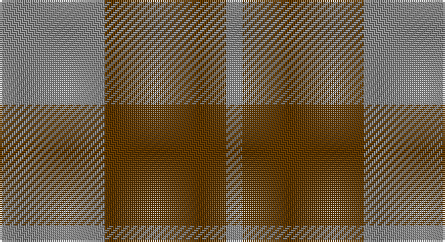

This page is one **sett** — a single exact thread-count. It belongs to the [tartan](/setts/o13dy15o2/)
(the same proportion at any scale), whose colour order is pattern [RGR](/stripes/rgr/).

Sourced from tartans-authority.  It is a [3 stripe tartan](/stripes/stripes3/).

Original link http://www.tartansauthority.com/tartan-ferret/display/11117/

## Register references

External register numbers recorded for this tartan.

- Scottish Register of Tartans: [11117](https://www.tartanregister.gov.uk/tartanDetails?ref=11117)
- Scottish Tartans Authority (ITI): 11117

## Thread count
N/52 T60 N/8

One full sett is **180 threads**.

## Palette

Palette: <strong>Tartan Register</strong>
<table><thead><tr><th>Colour</th><th>Threads</th><th>Shade</th><th>Base</th><th>OKLCh</th></tr></thead><tbody><tr><td>N/</td><td style="text-align:right;font-variant-numeric:tabular-nums">52</td><td><code style="background-color:#888888;">#888888</code> <small style="color:#888">#888888</small></td><td>R <code style="background-color:#CC0000;">#CC0000</code></td><td><small style="color:#888">oklch(62.7% 0.000 89.9)</small></td></tr><tr><td>T</td><td style="text-align:right;font-variant-numeric:tabular-nums">60</td><td><code style="background-color:#603800;">#603800</code> <small style="color:#888">#603800</small></td><td>G <code style="background-color:#006100;">#006100</code></td><td><small style="color:#888">oklch(38.1% 0.084 66.7)</small></td></tr><tr><td>N/</td><td style="text-align:right;font-variant-numeric:tabular-nums">8</td><td><code style="background-color:#888888;">#888888</code> <small style="color:#888">#888888</small></td><td>R <code style="background-color:#CC0000;">#CC0000</code></td><td><small style="color:#888">oklch(62.7% 0.000 89.9)</small></td></tr></tbody></table>

# Sample pattern

## Nearest tartans

The nearest existing variants by ΔTartan distance, with this tartan at the top so the swatches line up against it.

ΔTartan

Tartan

Sett

—

<a href="/ttd/edit/#slug=o13dy15o2~x4">Outlander #5</a> <a class="nn-out" href="/variants/s3/o13dy15o2~x4/" title="open its dictionary page">↗</a>

1.71

<a href="/ttd/edit/#slug=r18g7r2g18~x2&amp;base=o13dy15o2~x4">Applecross</a> <a class="nn-out" href="/variants/s4/r18g7r2g18~x2/" title="open its dictionary page">↗</a>

1.71

<a href="/ttd/edit/#slug=r18g7r2g18~x4&amp;base=o13dy15o2~x4">Applecross (District)</a> <a class="nn-out" href="/variants/s4/r18g7r2g18~x4/" title="open its dictionary page">↗</a>

1.86

<a href="/ttd/edit/#slug=dg6dp5r1~x4&amp;base=o13dy15o2~x4">Wilson's No.084</a> <a class="nn-out" href="/variants/s3/dg6dp5r1~x4/" title="open its dictionary page">↗</a>

1.92

<a href="/variants/s4/r17g9r2~x2/">MacGregor of Glenstrae</a>

2.03

<a href="/variants/s4/g28dp10g3~x2/">Elphinstone Clan Tartan</a>

2.07

<a href="/variants/s4/r10dg4lo1~x8/">Lugo (2013)</a>

2.10

<a href="/ttd/edit/#slug=t6lo28dy20t3~x2&amp;base=o13dy15o2~x4">Prince of Orange Tartan</a> <a class="nn-out" href="/variants/s4/t6lo28dy20t3~x2/" title="open its dictionary page">↗</a>

2.13

<a href="/ttd/edit/#slug=g38r24k9r9~x2&amp;base=o13dy15o2~x4">Royal Guard of Oman 4th Band Squadron</a> <a class="nn-out" href="/variants/s4/g38r24k9r9~x2/" title="open its dictionary page">↗</a>

2.15

<a href="/variants/s4/r17dg9r2~x2/">MacGregor of Glenstrae #2</a>

2.16

<a href="/ttd/edit/#slug=db6g5r1~x4&amp;base=o13dy15o2~x4">Ferguson</a> <a class="nn-out" href="/variants/s3/db6g5r1~x4/" title="open its dictionary page">↗</a>

## Neighbour map

Every grey dot is one of 14360 variants placed by the first two principal components of the ΔTartan feature space (44% of its variance). Red is this tartan; blue dots are its nearest — click one to open its page.

<svg viewBox="0 0 640 380" role="img" style="max-width:100%;height:auto;border:1px solid #e0e0e0;border-radius:4px;display:block" xmlns="http://www.w3.org/2000/svg"><image href="/nn/cloud.v1.png" width="640" height="380"/><a href="/variants/s4/r18g7r2g18~x2/"><circle cx="382.0" cy="293.3" r="4" fill="#3465a4"><title>Applecross</title></circle></a><a href="/variants/s4/r18g7r2g18~x4/"><circle cx="382.0" cy="293.3" r="4" fill="#3465a4"><title>Applecross (District)</title></circle></a><a href="/variants/s3/dg6dp5r1~x4/"><circle cx="308.9" cy="324.5" r="4" fill="#3465a4"><title>Wilson's No.084</title></circle></a><a href="/variants/s4/r17g9r2~x2/"><circle cx="354.3" cy="294.5" r="4" fill="#3465a4"><title>MacGregor of Glenstrae</title></circle></a><a href="/variants/s4/g28dp10g3~x2/"><circle cx="407.7" cy="288.6" r="4" fill="#3465a4"><title>Elphinstone Clan Tartan</title></circle></a><a href="/variants/s4/r10dg4lo1~x8/"><circle cx="348.8" cy="264.4" r="4" fill="#3465a4"><title>Lugo (2013)</title></circle></a><a href="/variants/s4/t6lo28dy20t3~x2/"><circle cx="321.9" cy="262.6" r="4" fill="#3465a4"><title>Prince of Orange Tartan</title></circle></a><a href="/variants/s4/g38r24k9r9~x2/"><circle cx="286.4" cy="318.8" r="4" fill="#3465a4"><title>Royal Guard of Oman 4th Band Squadron</title></circle></a><a href="/variants/s4/r17dg9r2~x2/"><circle cx="348.8" cy="288.1" r="4" fill="#3465a4"><title>MacGregor of Glenstrae #2</title></circle></a><a href="/variants/s3/db6g5r1~x4/"><circle cx="293.2" cy="325.0" r="4" fill="#3465a4"><title>Ferguson</title></circle></a><circle cx="382.4" cy="333.1" r="5" fill="#c00000"/></svg>

ID: /variants/s3/o13dy15o2~x4/
