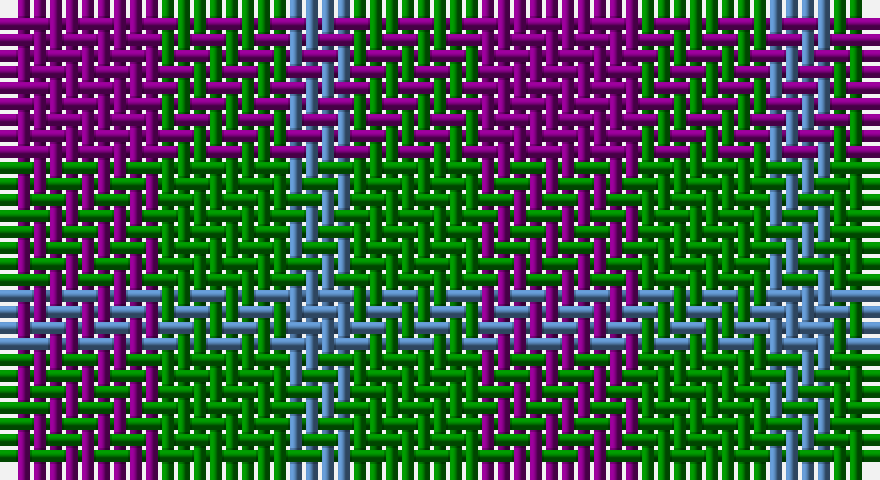

This page is one **sett** — a single exact thread-count. It belongs to the [tartan](/setts/p5g4t2/)
(the same proportion at any scale), whose colour order is pattern [BGB](/stripes/bgb/).

Sourced from weddslist.  It is a [3 stripe tartan](/stripes/stripes3/).

Original link http://www.weddslist.com/cgi-bin/tartans/pg.pl?source=sts

## Thread count
P/10 G8 B/4

One full sett is **30 threads**.

## Palette

Palette: <strong>custom</strong>
<table><thead><tr><th>Colour</th><th>Threads</th><th>Shade</th><th>Base</th><th>OKLCh</th></tr></thead><tbody><tr><td>P/</td><td style="text-align:right;font-variant-numeric:tabular-nums">10</td><td><code style="background-color:#800080;">#800080</code> <small style="color:#888">#800080</small></td><td>B <code style="background-color:#2A418A;">#2A418A</code></td><td><small style="color:#888">oklch(42.1% 0.193 328.4)</small></td></tr><tr><td>G</td><td style="text-align:right;font-variant-numeric:tabular-nums">8</td><td><code style="background-color:#008000;">#008000</code> <small style="color:#888">#008000</small></td><td>G <code style="background-color:#006100;">#006100</code></td><td><small style="color:#888">oklch(52.0% 0.177 142.5)</small></td></tr><tr><td>B/</td><td style="text-align:right;font-variant-numeric:tabular-nums">4</td><td><code style="background-color:#5480B0;">#5480B0</code> <small style="color:#888">#5480B0</small></td><td>B <code style="background-color:#2A418A;">#2A418A</code></td><td><small style="color:#888">oklch(58.8% 0.089 251.5)</small></td></tr></tbody></table>

# Sample pattern

## Nearest tartans

The nearest existing variants by ΔTartan distance, with this tartan at the top so the swatches line up against it.

ΔTartan

Tartan

Sett

—

<a href="/ttd/edit/#slug=p5g4t2~x2">Wilson's, No 209</a> <a class="nn-out" href="/variants/s3/p5g4t2~x2/" title="open its dictionary page">↗</a>

1.13

<a href="/variants/s4/dp3o1g2~x10/">Coleman, Sarah-Louise (Personal)</a>

1.27

<a href="/ttd/edit/#slug=r4dg7t4~x2&amp;base=p5g4t2~x2">Wilson's No.061</a> <a class="nn-out" href="/variants/s3/r4dg7t4~x2/" title="open its dictionary page">↗</a>

1.32

<a href="/ttd/edit/#slug=t3o6k4t2~x2&amp;base=p5g4t2~x2">Bedford Check</a> <a class="nn-out" href="/variants/s4/t3o6k4t2~x2/" title="open its dictionary page">↗</a>

1.45

<a href="/ttd/edit/#slug=db53g42r14~x2&amp;base=p5g4t2~x2">Agnew</a> <a class="nn-out" href="/variants/s3/db53g42r14~x2/" title="open its dictionary page">↗</a>

1.57

<a href="/ttd/edit/#slug=n2r1k1lr1~x10&amp;base=p5g4t2~x2">Kucher, Gregory (Personal)</a> <a class="nn-out" href="/variants/s4/n2r1k1lr1~x10/" title="open its dictionary page">↗</a>

1.57

<a href="/ttd/edit/#slug=r4k7t4~x2&amp;base=p5g4t2~x2">Wilson's No.198</a> <a class="nn-out" href="/variants/s3/r4k7t4~x2/" title="open its dictionary page">↗</a>

1.63

<a href="/ttd/edit/#slug=db53g42r14&amp;base=p5g4t2~x2">Agnew</a> <a class="nn-out" href="/variants/s3/db53g42r14/" title="open its dictionary page">↗</a>

1.78

<a href="/ttd/edit/#slug=g4dp5g4t2~x2&amp;base=p5g4t2~x2">Wilson's No.209</a> <a class="nn-out" href="/variants/s4/g4dp5g4t2~x2/" title="open its dictionary page">↗</a>

1.78

<a href="/ttd/edit/#slug=dt1k2r1~x42&amp;base=p5g4t2~x2">Allen, Nicholas (Personal)</a> <a class="nn-out" href="/variants/s3/dt1k2r1~x42/" title="open its dictionary page">↗</a>

1.78

<a href="/ttd/edit/#slug=b10r10ri3~x2&amp;base=p5g4t2~x2">Masai Shuka 19 (Artefact)</a> <a class="nn-out" href="/variants/s3/b10r10ri3~x2/" title="open its dictionary page">↗</a>

## Neighbour map

Every grey dot is one of 14360 variants placed by the first two principal components of the ΔTartan feature space (44% of its variance). Red is this tartan; blue dots are its nearest — click one to open its page.

<svg viewBox="0 0 640 380" role="img" style="max-width:100%;height:auto;border:1px solid #e0e0e0;border-radius:4px;display:block" xmlns="http://www.w3.org/2000/svg"><image href="/nn/cloud.v1.png" width="640" height="380"/><a href="/variants/s4/dp3o1g2~x10/"><circle cx="195.2" cy="326.2" r="4" fill="#3465a4"><title>Coleman, Sarah-Louise (Personal)</title></circle></a><a href="/variants/s3/r4dg7t4~x2/"><circle cx="161.6" cy="366.0" r="4" fill="#3465a4"><title>Wilson's No.061</title></circle></a><a href="/variants/s4/t3o6k4t2~x2/"><circle cx="149.3" cy="335.6" r="4" fill="#3465a4"><title>Bedford Check</title></circle></a><a href="/variants/s3/db53g42r14~x2/"><circle cx="252.0" cy="349.7" r="4" fill="#3465a4"><title>Agnew</title></circle></a><a href="/variants/s4/n2r1k1lr1~x10/"><circle cx="104.6" cy="340.7" r="4" fill="#3465a4"><title>Kucher, Gregory (Personal)</title></circle></a><a href="/variants/s3/r4k7t4~x2/"><circle cx="141.9" cy="366.0" r="4" fill="#3465a4"><title>Wilson's No.198</title></circle></a><a href="/variants/s3/db53g42r14/"><circle cx="247.8" cy="347.7" r="4" fill="#3465a4"><title>Agnew</title></circle></a><a href="/variants/s4/g4dp5g4t2~x2/"><circle cx="217.3" cy="366.0" r="4" fill="#3465a4"><title>Wilson's No.209</title></circle></a><a href="/variants/s3/dt1k2r1~x42/"><circle cx="207.5" cy="366.0" r="4" fill="#3465a4"><title>Allen, Nicholas (Personal)</title></circle></a><a href="/variants/s3/b10r10ri3~x2/"><circle cx="237.1" cy="339.7" r="4" fill="#3465a4"><title>Masai Shuka 19 (Artefact)</title></circle></a><circle cx="185.4" cy="363.1" r="5" fill="#c00000"/></svg>

ID: /variants/s3/p5g4t2~x2/
