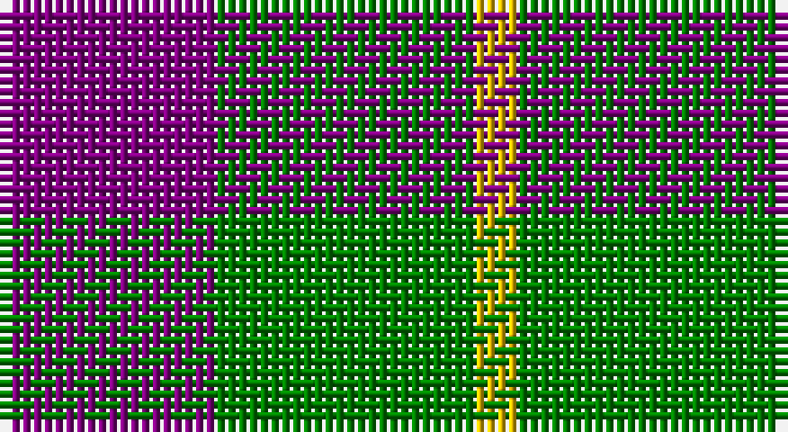

This page is one **sett** — a single exact thread-count. It belongs to the [tartan](/setts/p5g6ly1/)
(the same proportion at any scale), whose colour order is pattern [BGY](/stripes/bgy/).

Sourced from weddslist.  It is a [3 stripe tartan](/stripes/stripes3/).

Original link http://www.weddslist.com/cgi-bin/tartans/pg.pl?source=sts

## Thread count
P/20 G24 Y/4

One full sett is **72 threads**.

## Palette

Palette: <strong>custom</strong>
<table><thead><tr><th>Colour</th><th>Threads</th><th>Shade</th><th>Base</th><th>OKLCh</th></tr></thead><tbody><tr><td>P/</td><td style="text-align:right;font-variant-numeric:tabular-nums">20</td><td><code style="background-color:#800080;">#800080</code> <small style="color:#888">#800080</small></td><td>B <code style="background-color:#2A418A;">#2A418A</code></td><td><small style="color:#888">oklch(42.1% 0.193 328.4)</small></td></tr><tr><td>G</td><td style="text-align:right;font-variant-numeric:tabular-nums">24</td><td><code style="background-color:#008000;">#008000</code> <small style="color:#888">#008000</small></td><td>G <code style="background-color:#006100;">#006100</code></td><td><small style="color:#888">oklch(52.0% 0.177 142.5)</small></td></tr><tr><td>Y/</td><td style="text-align:right;font-variant-numeric:tabular-nums">4</td><td><code style="background-color:#F0C000;">#F0C000</code> <small style="color:#888">#F0C000</small></td><td>Y <code style="background-color:#F2BF00;">#F2BF00</code></td><td><small style="color:#888">oklch(82.7% 0.169 90.5)</small></td></tr></tbody></table>

# Sample pattern

## Nearest tartans

The nearest existing variants by ΔTartan distance, with this tartan at the top so the swatches line up against it.

ΔTartan

Tartan

Sett

—

<a href="/ttd/edit/#slug=p5g6ly1~x4">Wilson's, No 81</a> <a class="nn-out" href="/variants/s3/p5g6ly1~x4/" title="open its dictionary page">↗</a>

0.67

<a href="/ttd/edit/#slug=g6p5t1~x4&amp;base=p5g6ly1~x4">Wilson's, No 55</a> <a class="nn-out" href="/variants/s3/g6p5t1~x4/" title="open its dictionary page">↗</a>

1.28

<a href="/ttd/edit/#slug=p2g4ly1~x4&amp;base=p5g6ly1~x4">Wilson's, No 201</a> <a class="nn-out" href="/variants/s3/p2g4ly1~x4/" title="open its dictionary page">↗</a>

1.33

<a href="/ttd/edit/#slug=dp2g4ly1~x4&amp;base=p5g6ly1~x4">Wilson's No.201</a> <a class="nn-out" href="/variants/s3/dp2g4ly1~x4/" title="open its dictionary page">↗</a>

1.44

<a href="/ttd/edit/#slug=g6dp5t1~x4&amp;base=p5g6ly1~x4">Wilson's No.055</a> <a class="nn-out" href="/variants/s3/g6dp5t1~x4/" title="open its dictionary page">↗</a>

1.52

<a href="/ttd/edit/#slug=w2dg13o13w2~x6&amp;base=p5g6ly1~x4">Dunoon Irish</a> <a class="nn-out" href="/variants/s4/w2dg13o13w2~x6/" title="open its dictionary page">↗</a>

1.53

<a href="/ttd/edit/#slug=g15r3p11t2~x2&amp;base=p5g6ly1~x4">MacNab 7</a> <a class="nn-out" href="/variants/s4/g15r3p11t2~x2/" title="open its dictionary page">↗</a>

1.53

<a href="/ttd/edit/#slug=db21g34r14w6~x2&amp;base=p5g6ly1~x4">Harbison (2015)</a> <a class="nn-out" href="/variants/s4/db21g34r14w6~x2/" title="open its dictionary page">↗</a>

1.56

<a href="/ttd/edit/#slug=db20k5db18ly26k6~x2&amp;base=p5g6ly1~x4">Jahore</a> <a class="nn-out" href="/variants/s5/db20k5db18ly26k6~x2/" title="open its dictionary page">↗</a>

1.56

<a href="/ttd/edit/#slug=db3g6ly1r3~x10&amp;base=p5g6ly1~x4">Delroeux (Personal)</a> <a class="nn-out" href="/variants/s4/db3g6ly1r3~x10/" title="open its dictionary page">↗</a>

1.57

<a href="/ttd/edit/#slug=db3dg6ly1r3~x10&amp;base=p5g6ly1~x4">Delroeux, John Michael (Personal)</a> <a class="nn-out" href="/variants/s4/db3dg6ly1r3~x10/" title="open its dictionary page">↗</a>

## Neighbour map

Every grey dot is one of 14360 variants placed by the first two principal components of the ΔTartan feature space (44% of its variance). Red is this tartan; blue dots are its nearest — click one to open its page.

<svg viewBox="0 0 640 380" role="img" style="max-width:100%;height:auto;border:1px solid #e0e0e0;border-radius:4px;display:block" xmlns="http://www.w3.org/2000/svg"><image href="/nn/cloud.v1.png" width="640" height="380"/><a href="/variants/s3/g6p5t1~x4/"><circle cx="273.3" cy="305.8" r="4" fill="#3465a4"><title>Wilson's, No 55</title></circle></a><a href="/variants/s3/p2g4ly1~x4/"><circle cx="260.9" cy="311.8" r="4" fill="#3465a4"><title>Wilson's, No 201</title></circle></a><a href="/variants/s3/dp2g4ly1~x4/"><circle cx="264.4" cy="318.4" r="4" fill="#3465a4"><title>Wilson's No.201</title></circle></a><a href="/variants/s3/g6dp5t1~x4/"><circle cx="289.6" cy="320.4" r="4" fill="#3465a4"><title>Wilson's No.055</title></circle></a><a href="/variants/s4/w2dg13o13w2~x6/"><circle cx="232.6" cy="250.5" r="4" fill="#3465a4"><title>Dunoon Irish</title></circle></a><a href="/variants/s4/g15r3p11t2~x2/"><circle cx="251.6" cy="249.7" r="4" fill="#3465a4"><title>MacNab 7</title></circle></a><a href="/variants/s4/db21g34r14w6~x2/"><circle cx="178.1" cy="269.4" r="4" fill="#3465a4"><title>Harbison (2015)</title></circle></a><a href="/variants/s5/db20k5db18ly26k6~x2/"><circle cx="205.7" cy="266.2" r="4" fill="#3465a4"><title>Jahore</title></circle></a><a href="/variants/s4/db3g6ly1r3~x10/"><circle cx="194.3" cy="270.5" r="4" fill="#3465a4"><title>Delroeux (Personal)</title></circle></a><a href="/variants/s4/db3dg6ly1r3~x10/"><circle cx="170.4" cy="258.1" r="4" fill="#3465a4"><title>Delroeux, John Michael (Personal)</title></circle></a><circle cx="259.1" cy="296.3" r="5" fill="#c00000"/></svg>

ID: /variants/s3/p5g6ly1~x4/
