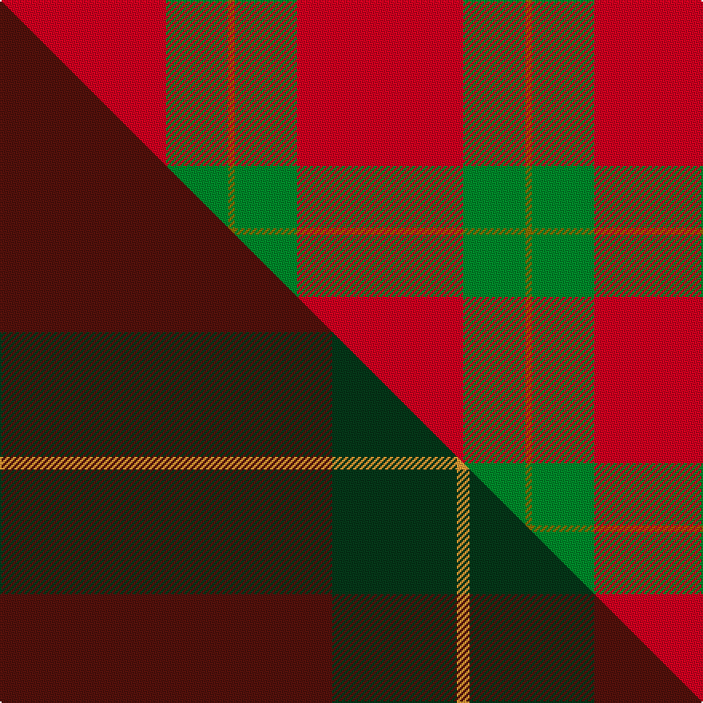

This page is one **sett** — a single exact thread-count. It belongs to the [tartan](/setts/r104g39y4/)
(the same proportion at any scale), whose colour order is pattern [GGR](/stripes/ggr/).

Part of the [Scottish Watch](/tartans/scottish-watch/) tartan — the named design grouping this sett with its other cloths.

Sourced from weddslist.  It is a [3 stripe tartan](/stripes/stripes3/).

Original link http://www.weddslist.com/cgi-bin/tartans/pg.pl?source=sts

## Provenance

Earliest known date: pre 2003 Half actual count

2 attestations — the source records this cloth was collapsed from (oldest owns this page)

<ul>
<li>undated — Scottish Watch (weddslist, <a href="http://www.weddslist.com/cgi-bin/tartans/pg.pl?source=sts">record</a>) </li>
<li>undated — Scottish Watch General Tartan (house-of-tartan, <a href="http://www.house-of-tartan.scotland.net/house/TartanViewjs.asp?colr=Def&tnam=1561">record</a>) </li>
</ul>

## Thread count
R/104 G39 Y/4

One full sett is **186 threads**.

## Palette
<table><thead><tr><th>Colour</th><th>Shade</th><th>OKLCh</th></tr></thead><tbody><tr><td>G</td><td><code style="background-color:#008B2A;">#008B2A</code> <small style="color:#888">#008B2A</small></td><td><small style="color:#888">oklch(55.4% 0.170 145.9)</small></td></tr><tr><td>R</td><td><code style="background-color:#D60020;">#D60020</code> <small style="color:#888">#D60020</small></td><td><small style="color:#888">oklch(55.2% 0.224 25.5)</small></td></tr><tr><td>Y</td><td><code style="background-color:#8B6E00;">#8B6E00</code> <small style="color:#888">#8B6E00</small></td><td><small style="color:#888">oklch(55.1% 0.113 90.4)</small></td></tr></tbody></table>

# Sample pattern

## Compared to the master

This cloth is one sett of its design; the master sett (the exemplar the design is anchored on) is below for comparison.

Its **ΔTartan distance** from the master is **4.37** — the same measure the nearest-tartans table ranks by (0 is identical; a re-scale of the same cloth is near 0, a recolour or a different proportion further).

<figure class="master-compare" style="margin:0">

this sett
master sett ★

<figcaption style="color:#888;font-size:smaller">One weave of this sett against the <a href="/setts/dr104dg39lo4/">master sett ★</a>, split on the diagonal: a shared proportion runs seamlessly across it with only the shades shifting; a different proportion breaks on it.</figcaption>
</figure>

## Nearest variants

The nearest existing variants by ΔTartan distance, with this cloth at the top so the swatches line up against it.

ΔTartan

Threads

Variant

Sett

—

186

<a href="/variants/s3/r104g39y4/">Scottish Watch</a>

<a href="/ttd/edit/#slug=r32g8lb4y1~x2&amp;base=r104g39y4" title="compare in the TTD">0.74</a>

114

<a href="/variants/s4/r32g8lb4y1~x2/">MacLaine of Lochbuie</a>

<a href="/ttd/edit/#slug=r32g8lb4y1&amp;base=r104g39y4" title="compare in the TTD">0.74</a>

57

<a href="/variants/s4/r32g8lb4y1/">MacLaine of Lochbuie</a>

<a href="/ttd/edit/#slug=r32dg8lb4y1~x2&amp;base=r104g39y4" title="compare in the TTD">0.74</a>

114

<a href="/variants/s4/r32dg8lb4y1~x2/">MacLaine of Lochbuie (Coburn)</a>

<a href="/ttd/edit/#slug=r32g8w4y1&amp;base=r104g39y4" title="compare in the TTD">0.74</a>

57

<a href="/variants/s4/r32g8w4y1/">MacLaine of Lochbuie</a>

<a href="/ttd/edit/#slug=db4r50g25w2~x2&amp;base=r104g39y4" title="compare in the TTD">0.87</a>

312

<a href="/variants/s4/db4r50g25w2~x2/">Unidentified Locket</a>

<a href="/ttd/edit/#slug=r35w3r8y2g11~x2&amp;base=r104g39y4" title="compare in the TTD">1.89</a>

144

<a href="/variants/s5/r35w3r8y2g11~x2/">Highlands at Wyomissing, The</a>

<a href="/ttd/edit/#slug=r1g7r9y1~x4&amp;base=r104g39y4" title="compare in the TTD">1.91</a>

136

<a href="/variants/s4/r1g7r9y1~x4/">Bryce</a>

<a href="/ttd/edit/#slug=r80lb40k5lo6&amp;base=r104g39y4" title="compare in the TTD">2.42</a>

176

<a href="/variants/s4/r80lb40k5lo6/">Broberg (Scania) (Personal)</a>

<a href="/ttd/edit/#slug=r38g2r5g16&amp;base=r104g39y4" title="compare in the TTD">2.58</a>

68

<a href="/variants/s4/r38g2r5g16/">MacDonald Lord of the Isles</a>

<a href="/ttd/edit/#slug=r38g2r5g16~x2&amp;base=r104g39y4" title="compare in the TTD">2.58</a>

136

<a href="/variants/s4/r38g2r5g16~x2/">MacDonald Lord of the Isles</a>

## Neighbour map

Every grey dot is one of 13620 variants placed by the first two principal components of the ΔTartan feature space (42% of its variance). Red is this tartan; blue dots are its nearest — click one to open its page.

<svg viewBox="0 0 640 380" role="img" style="max-width:100%;height:auto;border:1px solid #e0e0e0;border-radius:4px;display:block" xmlns="http://www.w3.org/2000/svg"><image href="/nn/cloud.v1.png" width="640" height="380"/><a href="/variants/s4/r32g8lb4y1~x2/"><circle cx="511.8" cy="167.1" r="4" fill="#3465a4"><title>MacLaine of Lochbuie</title></circle></a><a href="/variants/s4/r32g8lb4y1/"><circle cx="511.8" cy="167.1" r="4" fill="#3465a4"><title>MacLaine of Lochbuie</title></circle></a><a href="/variants/s4/r32dg8lb4y1~x2/"><circle cx="495.4" cy="159.6" r="4" fill="#3465a4"><title>MacLaine of Lochbuie (Coburn)</title></circle></a><a href="/variants/s4/r32g8w4y1/"><circle cx="485.5" cy="158.7" r="4" fill="#3465a4"><title>MacLaine of Lochbuie</title></circle></a><a href="/variants/s4/db4r50g25w2~x2/"><circle cx="415.0" cy="182.0" r="4" fill="#3465a4"><title>Unidentified Locket</title></circle></a><a href="/variants/s5/r35w3r8y2g11~x2/"><circle cx="485.7" cy="179.8" r="4" fill="#3465a4"><title>Highlands at Wyomissing, The</title></circle></a><a href="/variants/s4/r1g7r9y1~x4/"><circle cx="386.9" cy="257.4" r="4" fill="#3465a4"><title>Bryce</title></circle></a><a href="/variants/s4/r80lb40k5lo6/"><circle cx="372.8" cy="183.0" r="4" fill="#3465a4"><title>Broberg (Scania) (Personal)</title></circle></a><a href="/variants/s4/r38g2r5g16/"><circle cx="526.4" cy="224.2" r="4" fill="#3465a4"><title>MacDonald Lord of the Isles</title></circle></a><a href="/variants/s4/r38g2r5g16~x2/"><circle cx="526.4" cy="224.2" r="4" fill="#3465a4"><title>MacDonald Lord of the Isles</title></circle></a><circle cx="526.0" cy="219.5" r="5" fill="#c00000"/><text x="320" y="376" text-anchor="middle" font-size="11" fill="#999">ground</text><text x="11" y="190" text-anchor="middle" font-size="11" fill="#999" transform="rotate(-90 11 190)">complexity</text></svg>

ID: /variants/s3/r104g39y4/
