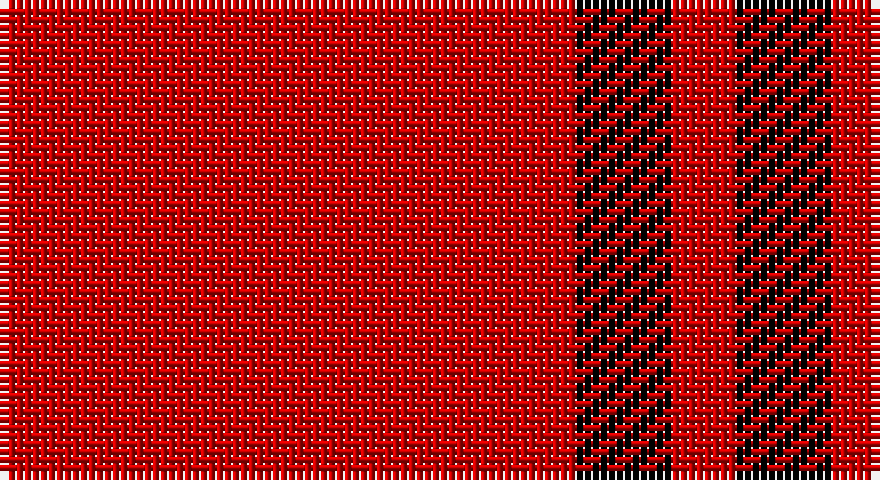

This page is one **sett** — a single exact thread-count. It belongs to the [tartan](/setts/r18k3r2/)
(the same proportion at any scale), whose colour order is pattern [RKR](/stripes/rkr/).

Sourced from register-of-tartans.  It is a [3 stripe tartan](/stripes/stripes3/).

Original link https://www.tartanregister.gov.uk/tartanDetails.aspx?ref=436

## Provenance

Earliest known date: pre 2003 A sample of this tartan was recorded by the Scottish Tartans Society during the period 1970 to 1990.

3 attestations — the source records this cloth was collapsed from (oldest owns this page)

<ul>
<li>01/01/1968 — Buie (register-of-tartans, <a href="https://www.tartanregister.gov.uk/tartanDetails.aspx?ref=436">record</a>)</li>
<li>1968 — Buie (Name) (tartans-authority, <a href="http://www.tartansauthority.com/tartan-ferret/display/1590/">record</a>)</li>
<li>undated — Buie Family Tartan (house-of-tartan, <a href="http://www.house-of-tartan.scotland.net/house/TartanViewjs.asp?colr=Def&tnam=1590">record</a>)</li>
</ul>

## Register references

External register numbers recorded for this tartan.

- Scottish Register of Tartans: [436](https://www.tartanregister.gov.uk/tartanDetails.aspx?ref=436)
- Scottish Tartans Authority (ITI): 1590
- Scottish Tartans World Register: 1590

## Thread count
R/72 K12 R/8

One full sett is **104 threads**.

## Palette

Palette: <strong>Tartan Register</strong>
<table><thead><tr><th>Colour</th><th>Threads</th><th>Shade</th><th>Base</th><th>OKLCh</th></tr></thead><tbody><tr><td>R/</td><td style="text-align:right;font-variant-numeric:tabular-nums">72</td><td><code style="background-color:#C80000;">#C80000</code> <small style="color:#888">#C80000</small></td><td>R <code style="background-color:#CC0000;">#CC0000</code></td><td><small style="color:#888">oklch(52.3% 0.215 29.2)</small></td></tr><tr><td>K</td><td style="text-align:right;font-variant-numeric:tabular-nums">12</td><td><code style="background-color:#000000;">#000000</code> <small style="color:#888">#000000</small></td><td>K <code style="background-color:#000000;">#000000</code></td><td><small style="color:#888">oklch(0.0% 0.000 0.0)</small></td></tr><tr><td>R/</td><td style="text-align:right;font-variant-numeric:tabular-nums">8</td><td><code style="background-color:#C80000;">#C80000</code> <small style="color:#888">#C80000</small></td><td>R <code style="background-color:#CC0000;">#CC0000</code></td><td><small style="color:#888">oklch(52.3% 0.215 29.2)</small></td></tr></tbody></table>

# Sample pattern

## Nearest tartans

The nearest existing variants by ΔTartan distance, with this tartan at the top so the swatches line up against it.

ΔTartan

Tartan

Sett

—

<a href="/ttd/edit/#slug=r18k3r2~x4">Buie</a> <a class="nn-out" href="/variants/s3/r18k3r2~x4/" title="open its dictionary page">↗</a>

1.95

<a href="/ttd/edit/#slug=r8w1k1~x20&amp;base=r18k3r2~x4">International Karate Fed. (Corporat)</a> <a class="nn-out" href="/variants/s3/r8w1k1~x20/" title="open its dictionary page">↗</a>

2.40

<a href="/ttd/edit/#slug=m18k3m2~x4&amp;base=r18k3r2~x4">Buie</a> <a class="nn-out" href="/variants/s3/m18k3m2~x4/" title="open its dictionary page">↗</a>

2.42

<a href="/ttd/edit/#slug=r9lr1~x20&amp;base=r18k3r2~x4">Roddy &quot;Rowdy&quot; Piper (Personal)</a> <a class="nn-out" href="/variants/s2/r9lr1~x20/" title="open its dictionary page">↗</a>

2.57

<a href="/ttd/edit/#slug=r75k15r4k15r4~x2&amp;base=r18k3r2~x4">Masai Shuka 07 (Artefact)</a> <a class="nn-out" href="/variants/s5/r75k15r4k15r4~x2/" title="open its dictionary page">↗</a>

2.58

<a href="/ttd/edit/#slug=r27w3r6w2dg3~x4&amp;base=r18k3r2~x4">Martin, Robert N (Personal)</a> <a class="nn-out" href="/variants/s5/r27w3r6w2dg3~x4/" title="open its dictionary page">↗</a>

2.71

<a href="/variants/s4/r25k5r1~x4/">Masai Shuka 12 (Artefact)</a>

2.81

<a href="/ttd/edit/#slug=r40db2r6db15~x2&amp;base=r18k3r2~x4">Masai Shuka 21 (Artefact)</a> <a class="nn-out" href="/variants/s4/r40db2r6db15~x2/" title="open its dictionary page">↗</a>

2.82

<a href="/ttd/edit/#slug=r30k10ly3~x4&amp;base=r18k3r2~x4">Masai Shuka 20 (Artefact)</a> <a class="nn-out" href="/variants/s3/r30k10ly3~x4/" title="open its dictionary page">↗</a>

2.83

<a href="/ttd/edit/#slug=ly6k3r40w3~x2&amp;base=r18k3r2~x4">Masai Shuka 18 (Artefact)</a> <a class="nn-out" href="/variants/s4/ly6k3r40w3~x2/" title="open its dictionary page">↗</a>

2.89

<a href="/ttd/edit/#slug=r32k2r4k2r2k8r30lb3~x2&amp;base=r18k3r2~x4">University of Chicago (Corporate)</a> <a class="nn-out" href="/variants/s8/r32k2r4k2r2k8r30lb3~x2/" title="open its dictionary page">↗</a>

## Neighbour map

Every grey dot is one of 14360 variants placed by the first two principal components of the ΔTartan feature space (44% of its variance). Red is this tartan; blue dots are its nearest — click one to open its page.

<svg viewBox="0 0 640 380" role="img" style="max-width:100%;height:auto;border:1px solid #e0e0e0;border-radius:4px;display:block" xmlns="http://www.w3.org/2000/svg"><image href="/nn/cloud.v1.png" width="640" height="380"/><a href="/variants/s3/r8w1k1~x20/"><circle cx="521.8" cy="246.8" r="4" fill="#3465a4"><title>International Karate Fed. (Corporat)</title></circle></a><a href="/variants/s3/m18k3m2~x4/"><circle cx="626.0" cy="281.8" r="4" fill="#3465a4"><title>Buie</title></circle></a><a href="/variants/s2/r9lr1~x20/"><circle cx="626.0" cy="314.6" r="4" fill="#3465a4"><title>Roddy &quot;Rowdy&quot; Piper (Personal)</title></circle></a><a href="/variants/s5/r75k15r4k15r4~x2/"><circle cx="538.1" cy="193.9" r="4" fill="#3465a4"><title>Masai Shuka 07 (Artefact)</title></circle></a><a href="/variants/s5/r27w3r6w2dg3~x4/"><circle cx="547.8" cy="196.1" r="4" fill="#3465a4"><title>Martin, Robert N (Personal)</title></circle></a><a href="/variants/s4/r25k5r1~x4/"><circle cx="535.1" cy="201.5" r="4" fill="#3465a4"><title>Masai Shuka 12 (Artefact)</title></circle></a><a href="/variants/s4/r40db2r6db15~x2/"><circle cx="546.2" cy="226.0" r="4" fill="#3465a4"><title>Masai Shuka 21 (Artefact)</title></circle></a><a href="/variants/s3/r30k10ly3~x4/"><circle cx="432.9" cy="241.2" r="4" fill="#3465a4"><title>Masai Shuka 20 (Artefact)</title></circle></a><a href="/variants/s4/ly6k3r40w3~x2/"><circle cx="505.6" cy="173.9" r="4" fill="#3465a4"><title>Masai Shuka 18 (Artefact)</title></circle></a><a href="/variants/s8/r32k2r4k2r2k8r30lb3~x2/"><circle cx="563.1" cy="175.5" r="4" fill="#3465a4"><title>University of Chicago (Corporate)</title></circle></a><circle cx="606.3" cy="252.3" r="5" fill="#c00000"/></svg>

ID: /variants/s3/r18k3r2~x4/
