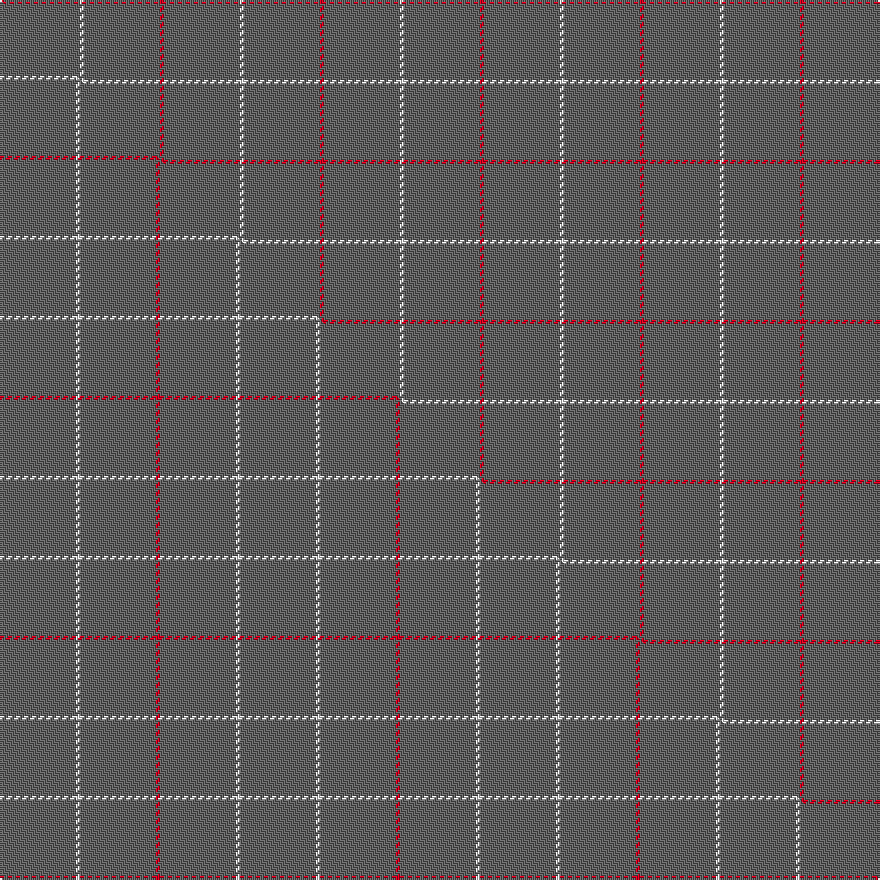

This page is one **sett** — a single exact thread-count. It belongs to the [tartan](/setts/r1n19w1/)
(the same proportion at any scale), whose colour order is pattern [RBW](/stripes/rbw/).

Part of the [Dunbar of Pitgaveny](/tartans/dunbar-of-pitgaveny/) tartan — the named design grouping this sett with its other cloths.

Sourced from tartans-authority.  It is a [3 stripe tartan](/stripes/stripes3/).

Original link http://www.tartansauthority.com/tartan-ferret/display/1634/

## Provenance

Earliest known date: c.1815 In 1815, members of the Highland Society of London resolved to request of each of the Highland chiefs, a sample of their clan tartan. The swatches were to be signed and sealed in the chief's own hand. This sett is one of those delivered to the Society between 1815 and 1822.

3 attestations — the source records this cloth was collapsed from (oldest owns this page)

<ul>
<li>pre 1822 — Dunbar of Pitgaveny (Clan) (tartans-authority, <a href="http://www.tartansauthority.com/tartan-ferret/display/1634/">record</a>)  <em>In 1815, members of the Highland Society of London resolved to request of each of the Highland chiefs, a sample of their clan tartan. The swatches were to be signed and sealed in the chief's own hand. This sett is one of those delivered to the Society between 1815 and 1822.</em></li>
<li>undated — Dunbar of Pitgaveny (weddslist, <a href="http://www.weddslist.com/cgi-bin/tartans/pg.pl?source=sts">record</a>) </li>
<li>undated — Dunbar of Pitgaveny Family Tartan (house-of-tartan, <a href="http://www.house-of-tartan.scotland.net/house/TartanViewjs.asp?colr=Def&tnam=1634">record</a>) </li>
</ul>

## Register references

External register numbers recorded for this tartan.

- Scottish Tartans Authority (ITI): 1634

## Thread count
R/2 N38 W/2

One full sett is **80 threads**.

## Palette
<table><thead><tr><th>Colour</th><th>Shade</th><th>OKLCh</th></tr></thead><tbody><tr><td>N</td><td><code style="background-color:#636363;">#636363</code> <small style="color:#888">#636363</small></td><td><small style="color:#888">oklch(50.0% 0.000 89.9)</small></td></tr><tr><td>R</td><td><code style="background-color:#D60020;">#D60020</code> <small style="color:#888">#D60020</small></td><td><small style="color:#888">oklch(55.2% 0.224 25.5)</small></td></tr><tr><td>W</td><td><code style="background-color:#F7F7F7;">#F7F7F7</code> <small style="color:#888">#F7F7F7</small></td><td><small style="color:#888">oklch(97.6% 0.000 89.9)</small></td></tr></tbody></table>

# Sample pattern

## Compared to the master

This cloth is one sett of its design; the master sett (the exemplar the design is anchored on) is below for comparison.

Its **ΔTartan distance** from the master is **2.03** — the same measure the nearest-tartans table ranks by (0 is identical; a re-scale of the same cloth is near 0, a recolour or a different proportion further).

<figure class="master-compare" style="margin:0">

this sett
master sett ★

<figcaption style="color:#888;font-size:smaller">One weave of this sett against the <a href="/setts/n19w1n19r1/">master sett ★</a>, split on the diagonal: a shared proportion runs seamlessly across it with only the shades shifting; a different proportion breaks on it.</figcaption>
</figure>

## Nearest tartan variants

The nearest existing variants by ΔTartan distance, with this cloth at the top so the swatches line up against it.

ΔTartan

Threads

Variant

Sett

—

80

<a href="/variants/s3/r1n19w1~x2/">Dunbar of Pitgaveny (Clan)</a>

<a href="/ttd/edit/#slug=y2k3dr31w1~x4&amp;base=r1n19w1~x2" title="compare in the TTD">0.89</a>

284

<a href="/variants/s4/y2k3dr31w1~x4/">Riddick Furya</a>

<a href="/ttd/edit/#slug=w1n12dp1w1~x4&amp;base=r1n19w1~x2" title="compare in the TTD">1.00</a>

112

<a href="/variants/s4/w1n12dp1w1~x4/">Lochnagar</a>

<a href="/ttd/edit/#slug=n19w1n19r1~x2&amp;base=r1n19w1~x2" title="compare in the TTD">1.00</a>

120

<a href="/variants/s4/n19w1n19r1~x2/">Dunbar of Pitgaveny</a>

<a href="/ttd/edit/#slug=dr1g22lo1~x4&amp;base=r1n19w1~x2" title="compare in the TTD">1.30</a>

184

<a href="/variants/s3/dr1g22lo1~x4/">Kenmore Hunting</a>

<a href="/ttd/edit/#slug=n88dy3ly2k2lb1~x2&amp;base=r1n19w1~x2" title="compare in the TTD">1.50</a>

206

<a href="/variants/s5/n88dy3ly2k2lb1~x2/">Eternity, Dedicated 2 Weddings</a>

<a href="/ttd/edit/#slug=n30r1n15db4~x2&amp;base=r1n19w1~x2" title="compare in the TTD">1.56</a>

132

<a href="/variants/s4/n30r1n15db4~x2/">Kincardine Tweed</a>

<a href="/ttd/edit/#slug=dr18k3dr2~x4&amp;base=r1n19w1~x2" title="compare in the TTD">1.60</a>

104

<a href="/variants/s3/dr18k3dr2~x4/">Buie</a>

<a href="/ttd/edit/#slug=k1g22dr1~x4&amp;base=r1n19w1~x2" title="compare in the TTD">1.60</a>

184

<a href="/variants/s3/k1g22dr1~x4/">Kenmore Hunting (Fashion)</a>

<a href="/ttd/edit/#slug=ly24r1w1db1~x11&amp;base=r1n19w1~x2" title="compare in the TTD">1.90</a>

319

<a href="/variants/s4/ly24r1w1db1~x11/">Dutch Football (Corporate)</a>

1.90

—

<a href="/variants/s4/ly81dg6lyi8dg8~x2~ly2503076-lyi2705081/">Young in Australia (Name)</a>

## Neighbour map

Every grey dot is one of 13620 variants placed by the first two principal components of the ΔTartan feature space (42% of its variance). Red is this tartan; blue dots are its nearest — click one to open its page.

<svg viewBox="0 0 640 380" role="img" style="max-width:100%;height:auto;border:1px solid #e0e0e0;border-radius:4px;display:block" xmlns="http://www.w3.org/2000/svg"><image href="/nn/cloud.v1.png" width="640" height="380"/><a href="/variants/s4/y2k3dr31w1~x4/"><circle cx="590.4" cy="135.6" r="4" fill="#3465a4"><title>Riddick Furya</title></circle></a><a href="/variants/s4/w1n12dp1w1~x4/"><circle cx="584.1" cy="234.7" r="4" fill="#3465a4"><title>Lochnagar</title></circle></a><a href="/variants/s4/n19w1n19r1~x2/"><circle cx="626.0" cy="246.7" r="4" fill="#3465a4"><title>Dunbar of Pitgaveny</title></circle></a><a href="/variants/s3/dr1g22lo1~x4/"><circle cx="626.0" cy="250.3" r="4" fill="#3465a4"><title>Kenmore Hunting</title></circle></a><a href="/variants/s5/n88dy3ly2k2lb1~x2/"><circle cx="626.0" cy="109.9" r="4" fill="#3465a4"><title>Eternity, Dedicated 2 Weddings</title></circle></a><a href="/variants/s4/n30r1n15db4~x2/"><circle cx="626.0" cy="245.7" r="4" fill="#3465a4"><title>Kincardine Tweed</title></circle></a><a href="/variants/s3/dr18k3dr2~x4/"><circle cx="626.0" cy="264.6" r="4" fill="#3465a4"><title>Buie</title></circle></a><a href="/variants/s3/k1g22dr1~x4/"><circle cx="626.0" cy="200.6" r="4" fill="#3465a4"><title>Kenmore Hunting (Fashion)</title></circle></a><a href="/variants/s4/ly24r1w1db1~x11/"><circle cx="626.0" cy="172.4" r="4" fill="#3465a4"><title>Dutch Football (Corporate)</title></circle></a><a href="/variants/s4/ly81dg6lyi8dg8~x2~ly2503076-lyi2705081/"><circle cx="626.0" cy="249.3" r="4" fill="#3465a4"><title>Young in Australia (Name)</title></circle></a><circle cx="626.0" cy="223.5" r="5" fill="#c00000"/><text x="320" y="376" text-anchor="middle" font-size="11" fill="#999">ground</text><text x="11" y="190" text-anchor="middle" font-size="11" fill="#999" transform="rotate(-90 11 190)">complexity</text></svg>

ID: /variants/s3/r1n19w1~x2/
