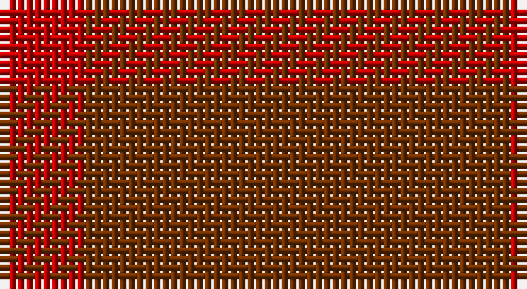

This page is one **sett** — a single exact thread-count. It belongs to the [tartan](/setts/r1o2o1/)
(the same proportion at any scale), whose colour order is pattern [RRR](/stripes/rrr/).

Sourced from weddslist.  It is a [3 stripe tartan](/stripes/stripes3/).

Original link http://www.weddslist.com/cgi-bin/tartans/pg.pl?source=sts

## Thread count
R/10 T20 Ta/10

One full sett is **60 threads**.

## Palette

Palette: <strong>custom</strong>
<table><thead><tr><th>Colour</th><th>Threads</th><th>Shade</th><th>Base</th><th>OKLCh</th></tr></thead><tbody><tr><td>R/</td><td style="text-align:right;font-variant-numeric:tabular-nums">10</td><td><code style="background-color:#C00000;">#C00000</code> <small style="color:#888">#C00000</small></td><td>R <code style="background-color:#CC0000;">#CC0000</code></td><td><small style="color:#888">oklch(50.7% 0.208 29.2)</small></td></tr><tr><td>T</td><td style="text-align:right;font-variant-numeric:tabular-nums">20</td><td><code style="background-color:#703000;">#703000</code> <small style="color:#888">#703000</small></td><td>R <code style="background-color:#CC0000;">#CC0000</code></td><td><small style="color:#888">oklch(39.1% 0.105 49.1)</small></td></tr><tr><td>Ta/</td><td style="text-align:right;font-variant-numeric:tabular-nums">10</td><td><code style="background-color:#703000;">#703000</code> <small style="color:#888">#703000</small></td><td>R <code style="background-color:#CC0000;">#CC0000</code></td><td><small style="color:#888">oklch(39.1% 0.105 49.1)</small></td></tr></tbody></table>

# Sample pattern

## Nearest tartans

The nearest existing variants by ΔTartan distance, with this tartan at the top so the swatches line up against it.

ΔTartan

Tartan

Sett

—

<a href="/ttd/edit/#slug=r1o2o1~x10">Glenmorangie, Check</a> <a class="nn-out" href="/variants/s3/r1o2o1~x10/" title="open its dictionary page">↗</a>

2.09

<a href="/ttd/edit/#slug=r8n13r8r13r8&amp;base=r1o2o1~x10">New Exeter Check (Fashion)</a> <a class="nn-out" href="/variants/s5/r8n13r8r13r8/" title="open its dictionary page">↗</a>

3.34

<a href="/ttd/edit/#slug=oi1o1oi1o1oi4o3lo1~x12&amp;base=r1o2o1~x10">Burns' Birthplace (Commem)</a> <a class="nn-out" href="/variants/s7/oi1o1oi1o1oi4o3lo1~x12/" title="open its dictionary page">↗</a>

4.00

<a href="/variants/s5/n7oi1ni6oi8o1~x8/">Callum (Buchan)</a>

4.08

<a href="/ttd/edit/#slug=y14n7lo6n2~x8&amp;base=r1o2o1~x10">Outlander #3</a> <a class="nn-out" href="/variants/s4/y14n7lo6n2~x8/" title="open its dictionary page">↗</a>

4.23

<a href="/ttd/edit/#slug=r5n35r46o5~x2&amp;base=r1o2o1~x10">Bryce</a> <a class="nn-out" href="/variants/s4/r5n35r46o5~x2/" title="open its dictionary page">↗</a>

4.32

<a href="/ttd/edit/#slug=n13do15n2~x4&amp;base=r1o2o1~x10">Outlander #5</a> <a class="nn-out" href="/variants/s3/n13do15n2~x4/" title="open its dictionary page">↗</a>

4.36

<a href="/ttd/edit/#slug=o14n7lo7n2~x8&amp;base=r1o2o1~x10">Outlander #3</a> <a class="nn-out" href="/variants/s4/o14n7lo7n2~x8/" title="open its dictionary page">↗</a>

4.41

<a href="/ttd/edit/#slug=oi12o6oi2ly1~x4&amp;base=r1o2o1~x10">Loch Garth</a> <a class="nn-out" href="/variants/s4/oi12o6oi2ly1~x4/" title="open its dictionary page">↗</a>

4.49

<a href="/ttd/edit/#slug=do7k2do12k10dg12k3~x2&amp;base=r1o2o1~x10">Brown Watch (single) (Fashion)</a> <a class="nn-out" href="/variants/s6/do7k2do12k10dg12k3~x2/" title="open its dictionary page">↗</a>

4.54

<a href="/ttd/edit/#slug=r3o8r3o20oi20o3oi8oi3~x2&amp;base=r1o2o1~x10">Miyuki, House Check Tan, 1004A</a> <a class="nn-out" href="/variants/s8/r3o8r3o20oi20o3oi8oi3~x2/" title="open its dictionary page">↗</a>

## Neighbour map

Every grey dot is one of 14360 variants placed by the first two principal components of the ΔTartan feature space (44% of its variance). Red is this tartan; blue dots are its nearest — click one to open its page.

<svg viewBox="0 0 640 380" role="img" style="max-width:100%;height:auto;border:1px solid #e0e0e0;border-radius:4px;display:block" xmlns="http://www.w3.org/2000/svg"><image href="/nn/cloud.v1.png" width="640" height="380"/><a href="/variants/s5/r8n13r8r13r8/"><circle cx="422.7" cy="366.0" r="4" fill="#3465a4"><title>New Exeter Check (Fashion)</title></circle></a><a href="/variants/s7/oi1o1oi1o1oi4o3lo1~x12/"><circle cx="513.5" cy="366.0" r="4" fill="#3465a4"><title>Burns' Birthplace (Commem)</title></circle></a><a href="/variants/s5/n7oi1ni6oi8o1~x8/"><circle cx="375.7" cy="338.5" r="4" fill="#3465a4"><title>Callum (Buchan)</title></circle></a><a href="/variants/s4/y14n7lo6n2~x8/"><circle cx="437.4" cy="366.0" r="4" fill="#3465a4"><title>Outlander #3</title></circle></a><a href="/variants/s4/r5n35r46o5~x2/"><circle cx="529.2" cy="338.0" r="4" fill="#3465a4"><title>Bryce</title></circle></a><a href="/variants/s3/n13do15n2~x4/"><circle cx="522.8" cy="366.0" r="4" fill="#3465a4"><title>Outlander #5</title></circle></a><a href="/variants/s4/o14n7lo7n2~x8/"><circle cx="407.3" cy="366.0" r="4" fill="#3465a4"><title>Outlander #3</title></circle></a><a href="/variants/s4/oi12o6oi2ly1~x4/"><circle cx="620.0" cy="354.7" r="4" fill="#3465a4"><title>Loch Garth</title></circle></a><a href="/variants/s6/do7k2do12k10dg12k3~x2/"><circle cx="377.9" cy="366.0" r="4" fill="#3465a4"><title>Brown Watch (single) (Fashion)</title></circle></a><a href="/variants/s8/r3o8r3o20oi20o3oi8oi3~x2/"><circle cx="553.5" cy="366.0" r="4" fill="#3465a4"><title>Miyuki, House Check Tan, 1004A</title></circle></a><circle cx="417.8" cy="366.0" r="5" fill="#c00000"/></svg>

ID: /variants/s3/r1o2o1~x10/
