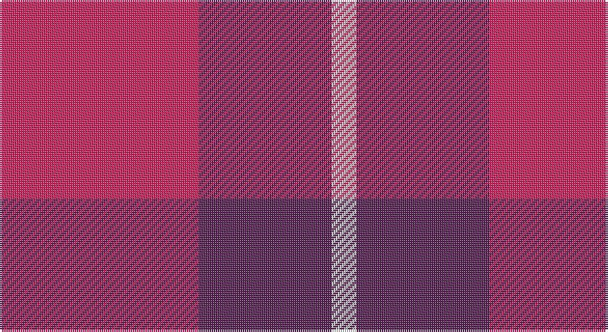

This page is one **sett** — a single exact thread-count. It belongs to the [tartan](/setts/r24dp16w3/)
(the same proportion at any scale), whose colour order is pattern [RBW](/stripes/rbw/).

Sourced from register-of-tartans.  It is a [3 stripe tartan](/stripes/stripes3/).

Original link https://www.tartanregister.gov.uk/tartanDetails.aspx?ref=10685

## Provenance

Earliest known date: 30 August 2012 A simple and bold design using the highly identifiable colours of the National Autistic Society. This tartan is intended for use by the Scottish members of the Society.

## Also known as

This cloth is also recorded under:

- National Autistic Society Scotland

3 attestations — the source records this cloth was collapsed from (oldest owns this page)

<ul>
<li>28/08/2012 — National Autistic Society Scotland (register-of-tartans, <a href="https://www.tartanregister.gov.uk/tartanDetails.aspx?ref=10685">record</a>)</li>
<li>pre 2012 — National Autistic Society Scotland (tartans-authority, <a href="http://www.tartansauthority.com/tartan-ferret/display/10685/">record</a>)</li>
<li>undated — National Autistic Society Scotla Corporate Tartan (house-of-tartan, <a href="http://www.house-of-tartan.scotland.net/house/TartanViewjs.asp?colr=Def&tnam=10685">record</a>)</li>
</ul>

## Register references

External register numbers recorded for this tartan.

- Scottish Register of Tartans: [10685](https://www.tartanregister.gov.uk/tartanDetails?ref=10685)
- Scottish Tartans Authority (ITI): 10685

## Thread count
R/96 DR64 LN/12

One full sett is **236 threads**.

## Palette

Palette: <strong>custom</strong>
<table><thead><tr><th>Colour</th><th>Threads</th><th>Shade</th><th>Base</th><th>OKLCh</th></tr></thead><tbody><tr><td>R/</td><td style="text-align:right;font-variant-numeric:tabular-nums">96</td><td><code style="background-color:#E82460;">#E82460</code> <small style="color:#888">#E82460</small></td><td>R <code style="background-color:#CC0000;">#CC0000</code></td><td><small style="color:#888">oklch(60.7% 0.225 11.0)</small></td></tr><tr><td>DR</td><td style="text-align:right;font-variant-numeric:tabular-nums">64</td><td><code style="background-color:#5C2458;">#5C2458</code> <small style="color:#888">#5C2458</small></td><td>B <code style="background-color:#2A418A;">#2A418A</code></td><td><small style="color:#888">oklch(36.3% 0.108 330.4)</small></td></tr><tr><td>LN/</td><td style="text-align:right;font-variant-numeric:tabular-nums">12</td><td><code style="background-color:#E8E8E8;">#E8E8E8</code> <small style="color:#888">#E8E8E8</small></td><td>W <code style="background-color:#F7F7F7;">#F7F7F7</code></td><td><small style="color:#888">oklch(93.1% 0.000 89.9)</small></td></tr></tbody></table>

# Sample pattern

## Nearest tartans

The nearest existing variants by ΔTartan distance, with this tartan at the top so the swatches line up against it.

ΔTartan

Tartan

Sett

—

<a href="/ttd/edit/#slug=r24dp16w3~x4">National Autistic Society Scotland</a> <a class="nn-out" href="/variants/s3/r24dp16w3~x4/" title="open its dictionary page">↗</a>

1.91

<a href="/ttd/edit/#slug=lb9r20db2~x2&amp;base=r24dp16w3~x4">Masai Shuka 28 (Artefact)</a> <a class="nn-out" href="/variants/s3/lb9r20db2~x2/" title="open its dictionary page">↗</a>

1.93

<a href="/ttd/edit/#slug=db15w2r20db2r4~x2&amp;base=r24dp16w3~x4">Masai Shuka 25 (Artefact)</a> <a class="nn-out" href="/variants/s5/db15w2r20db2r4~x2/" title="open its dictionary page">↗</a>

1.98

<a href="/ttd/edit/#slug=db8r2db8r15w2~x4&amp;base=r24dp16w3~x4">Hamilton (Clan)</a> <a class="nn-out" href="/variants/s5/db8r2db8r15w2~x4/" title="open its dictionary page">↗</a>

2.14

<a href="/ttd/edit/#slug=db6r1db6r9w1~x4&amp;base=r24dp16w3~x4">Hamilton Red Clan Tartan</a> <a class="nn-out" href="/variants/s5/db6r1db6r9w1~x4/" title="open its dictionary page">↗</a>

2.18

<a href="/ttd/edit/#slug=db6r1db6r9w1~x2&amp;base=r24dp16w3~x4">Hamilton, (Red)</a> <a class="nn-out" href="/variants/s5/db6r1db6r9w1~x2/" title="open its dictionary page">↗</a>

2.28

<a href="/ttd/edit/#slug=k13r40o13oi8~x2&amp;base=r24dp16w3~x4">Maryville College</a> <a class="nn-out" href="/variants/s4/k13r40o13oi8~x2/" title="open its dictionary page">↗</a>

2.30

<a href="/ttd/edit/#slug=t15w2r20w3~x4&amp;base=r24dp16w3~x4">Masai Shuka 24 (Artefact)</a> <a class="nn-out" href="/variants/s4/t15w2r20w3~x4/" title="open its dictionary page">↗</a>

2.31

<a href="/ttd/edit/#slug=r12db2r12db17w2r2~x2&amp;base=r24dp16w3~x4">British European</a> <a class="nn-out" href="/variants/s6/r12db2r12db17w2r2~x2/" title="open its dictionary page">↗</a>

2.31

<a href="/ttd/edit/#slug=r12db2r12db17w2r2~x4&amp;base=r24dp16w3~x4">British European (Corporate)</a> <a class="nn-out" href="/variants/s6/r12db2r12db17w2r2~x4/" title="open its dictionary page">↗</a>

2.35

<a href="/ttd/edit/#slug=r15db8r2db8r2db8r15w2~x4&amp;base=r24dp16w3~x4">Hamilton</a> <a class="nn-out" href="/variants/s8/r15db8r2db8r2db8r15w2~x4/" title="open its dictionary page">↗</a>

## Neighbour map

Every grey dot is one of 14360 variants placed by the first two principal components of the ΔTartan feature space (44% of its variance). Red is this tartan; blue dots are its nearest — click one to open its page.

<svg viewBox="0 0 640 380" role="img" style="max-width:100%;height:auto;border:1px solid #e0e0e0;border-radius:4px;display:block" xmlns="http://www.w3.org/2000/svg"><image href="/nn/cloud.v1.png" width="640" height="380"/><a href="/variants/s3/lb9r20db2~x2/"><circle cx="384.9" cy="239.4" r="4" fill="#3465a4"><title>Masai Shuka 28 (Artefact)</title></circle></a><a href="/variants/s5/db15w2r20db2r4~x2/"><circle cx="357.8" cy="219.9" r="4" fill="#3465a4"><title>Masai Shuka 25 (Artefact)</title></circle></a><a href="/variants/s5/db8r2db8r15w2~x4/"><circle cx="294.6" cy="246.3" r="4" fill="#3465a4"><title>Hamilton (Clan)</title></circle></a><a href="/variants/s5/db6r1db6r9w1~x4/"><circle cx="320.0" cy="245.1" r="4" fill="#3465a4"><title>Hamilton Red Clan Tartan</title></circle></a><a href="/variants/s5/db6r1db6r9w1~x2/"><circle cx="331.8" cy="251.8" r="4" fill="#3465a4"><title>Hamilton, (Red)</title></circle></a><a href="/variants/s4/k13r40o13oi8~x2/"><circle cx="276.1" cy="262.3" r="4" fill="#3465a4"><title>Maryville College</title></circle></a><a href="/variants/s4/t15w2r20w3~x4/"><circle cx="299.9" cy="231.3" r="4" fill="#3465a4"><title>Masai Shuka 24 (Artefact)</title></circle></a><a href="/variants/s6/r12db2r12db17w2r2~x2/"><circle cx="347.1" cy="236.0" r="4" fill="#3465a4"><title>British European</title></circle></a><a href="/variants/s6/r12db2r12db17w2r2~x4/"><circle cx="347.1" cy="236.0" r="4" fill="#3465a4"><title>British European (Corporate)</title></circle></a><a href="/variants/s8/r15db8r2db8r2db8r15w2~x4/"><circle cx="331.9" cy="230.5" r="4" fill="#3465a4"><title>Hamilton</title></circle></a><circle cx="342.4" cy="268.4" r="5" fill="#c00000"/></svg>

ID: /variants/s3/r24dp16w3~x4/
