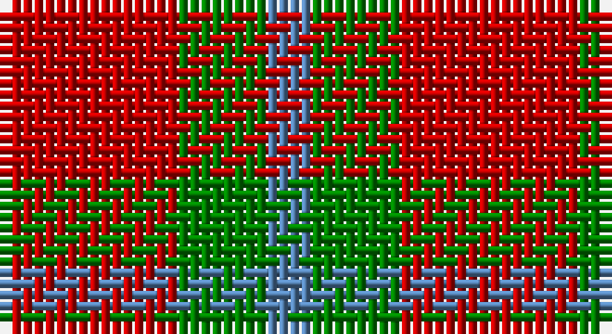

This page is one **sett** — a single exact thread-count. It belongs to the [tartan](/setts/r4g2t1/)
(the same proportion at any scale), whose colour order is pattern [BGR](/stripes/bgr/).

Sourced from weddslist.  It is a [3 stripe tartan](/stripes/stripes3/).

Original link http://www.weddslist.com/cgi-bin/tartans/pg.pl?source=sts

## Thread count
R/16 G8 B/4

One full sett is **36 threads**.

## Palette

Palette: <strong>custom</strong>
<table><thead><tr><th>Colour</th><th>Threads</th><th>Shade</th><th>Base</th><th>OKLCh</th></tr></thead><tbody><tr><td>R/</td><td style="text-align:right;font-variant-numeric:tabular-nums">16</td><td><code style="background-color:#C00000;">#C00000</code> <small style="color:#888">#C00000</small></td><td>R <code style="background-color:#CC0000;">#CC0000</code></td><td><small style="color:#888">oklch(50.7% 0.208 29.2)</small></td></tr><tr><td>G</td><td style="text-align:right;font-variant-numeric:tabular-nums">8</td><td><code style="background-color:#008000;">#008000</code> <small style="color:#888">#008000</small></td><td>G <code style="background-color:#006100;">#006100</code></td><td><small style="color:#888">oklch(52.0% 0.177 142.5)</small></td></tr><tr><td>B/</td><td style="text-align:right;font-variant-numeric:tabular-nums">4</td><td><code style="background-color:#5480B0;">#5480B0</code> <small style="color:#888">#5480B0</small></td><td>B <code style="background-color:#2A418A;">#2A418A</code></td><td><small style="color:#888">oklch(58.8% 0.089 251.5)</small></td></tr></tbody></table>

# Sample pattern

## Nearest tartans

The nearest existing variants by ΔTartan distance, with this tartan at the top so the swatches line up against it.

ΔTartan

Tartan

Sett

—

<a href="/ttd/edit/#slug=r4g2t1~x4">Wilson's, No 188</a> <a class="nn-out" href="/variants/s3/r4g2t1~x4/" title="open its dictionary page">↗</a>

1.43

<a href="/ttd/edit/#slug=g2r4g2t1~x4&amp;base=r4g2t1~x4">Wilson's No.188</a> <a class="nn-out" href="/variants/s4/g2r4g2t1~x4/" title="open its dictionary page">↗</a>

1.63

<a href="/ttd/edit/#slug=r5dg5lr1b2r5~x2&amp;base=r4g2t1~x4">Menzies</a> <a class="nn-out" href="/variants/s5/r5dg5lr1b2r5~x2/" title="open its dictionary page">↗</a>

1.82

<a href="/ttd/edit/#slug=r4db4r1g4r4~x6&amp;base=r4g2t1~x4">MacGowan</a> <a class="nn-out" href="/variants/s5/r4db4r1g4r4~x6/" title="open its dictionary page">↗</a>

1.84

<a href="/ttd/edit/#slug=r3g20r25w3~x4&amp;base=r4g2t1~x4">MacKinnon 11</a> <a class="nn-out" href="/variants/s4/r3g20r25w3~x4/" title="open its dictionary page">↗</a>

1.87

<a href="/variants/s4/r17dg9r2~x2/">MacGregor of Glenstrae #2</a>

1.88

<a href="/ttd/edit/#slug=g7t2r4~x2&amp;base=r4g2t1~x4">Wilson's, No 208</a> <a class="nn-out" href="/variants/s3/g7t2r4~x2/" title="open its dictionary page">↗</a>

1.90

<a href="/variants/s4/r10dg4lo1~x8/">Lugo (2013)</a>

1.92

<a href="/ttd/edit/#slug=r3dg20r25w3~x4&amp;base=r4g2t1~x4">MacKinnon #6</a> <a class="nn-out" href="/variants/s4/r3dg20r25w3~x4/" title="open its dictionary page">↗</a>

1.93

<a href="/ttd/edit/#slug=r1g7r9ly1~x4&amp;base=r4g2t1~x4">Bryce</a> <a class="nn-out" href="/variants/s4/r1g7r9ly1~x4/" title="open its dictionary page">↗</a>

1.94

<a href="/ttd/edit/#slug=r4dg4r1db4r4~x4&amp;base=r4g2t1~x4">Gow</a> <a class="nn-out" href="/variants/s5/r4dg4r1db4r4~x4/" title="open its dictionary page">↗</a>

## Neighbour map

Every grey dot is one of 14360 variants placed by the first two principal components of the ΔTartan feature space (44% of its variance). Red is this tartan; blue dots are its nearest — click one to open its page.

<svg viewBox="0 0 640 380" role="img" style="max-width:100%;height:auto;border:1px solid #e0e0e0;border-radius:4px;display:block" xmlns="http://www.w3.org/2000/svg"><image href="/nn/cloud.v1.png" width="640" height="380"/><a href="/variants/s4/g2r4g2t1~x4/"><circle cx="239.7" cy="315.1" r="4" fill="#3465a4"><title>Wilson's No.188</title></circle></a><a href="/variants/s5/r5dg5lr1b2r5~x2/"><circle cx="274.8" cy="285.0" r="4" fill="#3465a4"><title>Menzies</title></circle></a><a href="/variants/s5/r4db4r1g4r4~x6/"><circle cx="238.5" cy="317.3" r="4" fill="#3465a4"><title>MacGowan</title></circle></a><a href="/variants/s4/r3g20r25w3~x4/"><circle cx="338.6" cy="247.0" r="4" fill="#3465a4"><title>MacKinnon 11</title></circle></a><a href="/variants/s4/r17dg9r2~x2/"><circle cx="348.8" cy="288.1" r="4" fill="#3465a4"><title>MacGregor of Glenstrae #2</title></circle></a><a href="/variants/s3/g7t2r4~x2/"><circle cx="268.2" cy="340.3" r="4" fill="#3465a4"><title>Wilson's, No 208</title></circle></a><a href="/variants/s4/r10dg4lo1~x8/"><circle cx="348.8" cy="264.4" r="4" fill="#3465a4"><title>Lugo (2013)</title></circle></a><a href="/variants/s4/r3dg20r25w3~x4/"><circle cx="333.9" cy="240.8" r="4" fill="#3465a4"><title>MacKinnon #6</title></circle></a><a href="/variants/s4/r1g7r9ly1~x4/"><circle cx="354.9" cy="246.5" r="4" fill="#3465a4"><title>Bryce</title></circle></a><a href="/variants/s5/r4dg4r1db4r4~x4/"><circle cx="244.9" cy="321.8" r="4" fill="#3465a4"><title>Gow</title></circle></a><circle cx="307.7" cy="317.5" r="5" fill="#c00000"/></svg>

ID: /variants/s3/r4g2t1~x4/
