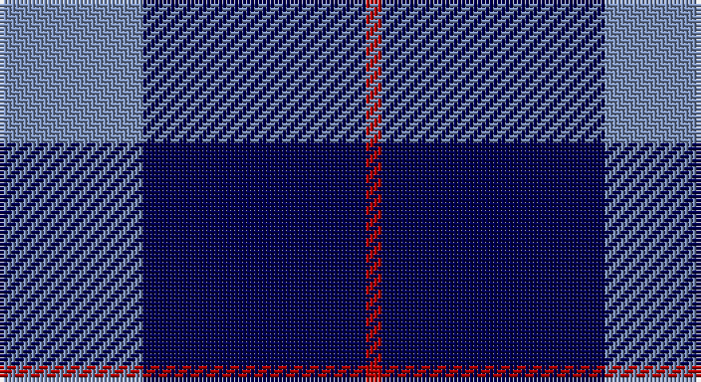

This page is one **sett** — a single exact thread-count. It belongs to the [tartan](/setts/t9db14r1/)
(the same proportion at any scale), whose colour order is pattern [BBR](/stripes/bbr/).

Sourced from tartans-authority.  It is a [3 stripe tartan](/stripes/stripes3/).

Original link http://www.tartansauthority.com/tartan-ferret/display/4169/

## Register references

External register numbers recorded for this tartan.

- Scottish Tartans Authority (ITI): 4169

## Thread count
B/36 DB56 DR/4

One full sett is **152 threads**.

## Palette

Palette: <strong>Tartan Register</strong> <small style="color:#888">(1 of 3 colours)</small>
<table><thead><tr><th>Colour</th><th>Threads</th><th>Shade</th><th>Base</th><th>OKLCh</th></tr></thead><tbody><tr><td>B/</td><td style="text-align:right;font-variant-numeric:tabular-nums">36</td><td><code style="background-color:#788CB4;">#788CB4</code> <small style="color:#888">#788CB4</small></td><td>B <code style="background-color:#2A418A;">#2A418A</code></td><td><small style="color:#888">oklch(63.9% 0.065 264.0)</small></td></tr><tr><td>DB</td><td style="text-align:right;font-variant-numeric:tabular-nums">56</td><td><code style="background-color:#000050;">#000050</code> <small style="color:#888">#000050</small></td><td>B <code style="background-color:#2A418A;">#2A418A</code></td><td><small style="color:#888">oklch(19.5% 0.135 264.1)</small></td></tr><tr><td>DR/</td><td style="text-align:right;font-variant-numeric:tabular-nums">4</td><td><code style="background-color:#B00000;">#B00000</code> <small style="color:#888">#B00000</small></td><td>R <code style="background-color:#CC0000;">#CC0000</code></td><td><small style="color:#888">oklch(47.5% 0.195 29.2)</small></td></tr></tbody></table>

# Sample pattern

## Nearest tartans

The nearest existing variants by ΔTartan distance, with this tartan at the top so the swatches line up against it.

ΔTartan

Tartan

Sett

—

<a href="/ttd/edit/#slug=t9db14r1~x4">Stakis Hotels (Corporate)</a> <a class="nn-out" href="/variants/s3/t9db14r1~x4/" title="open its dictionary page">↗</a>

1.45

<a href="/ttd/edit/#slug=db24t13db4t4w2~x2&amp;base=t9db14r1~x4">Gallaecia (Unofficial) (District)</a> <a class="nn-out" href="/variants/s5/db24t13db4t4w2~x2/" title="open its dictionary page">↗</a>

1.55

<a href="/ttd/edit/#slug=w4t28db49ly3~x2&amp;base=t9db14r1~x4">McKerrell of Hillhouse</a> <a class="nn-out" href="/variants/s4/w4t28db49ly3~x2/" title="open its dictionary page">↗</a>

1.69

<a href="/ttd/edit/#slug=g20r7db40w2~x2&amp;base=t9db14r1~x4">McNiff, Kevin (Personal)</a> <a class="nn-out" href="/variants/s4/g20r7db40w2~x2/" title="open its dictionary page">↗</a>

1.71

<a href="/ttd/edit/#slug=lr3k3lr3k10r1~x6&amp;base=t9db14r1~x4">Burberry Blue</a> <a class="nn-out" href="/variants/s5/lr3k3lr3k10r1~x6/" title="open its dictionary page">↗</a>

1.74

<a href="/ttd/edit/#slug=r4db32k15w2~x2&amp;base=t9db14r1~x4">Scottish Nuclear</a> <a class="nn-out" href="/variants/s4/r4db32k15w2~x2/" title="open its dictionary page">↗</a>

1.75

<a href="/ttd/edit/#slug=r5db26k12w2~x4&amp;base=t9db14r1~x4">Mirror (Corporate)</a> <a class="nn-out" href="/variants/s4/r5db26k12w2~x4/" title="open its dictionary page">↗</a>

1.82

<a href="/ttd/edit/#slug=r21dbi43db86w10&amp;base=t9db14r1~x4">Fong Wedding (Personal)</a> <a class="nn-out" href="/variants/s4/r21dbi43db86w10/" title="open its dictionary page">↗</a>

1.83

<a href="/ttd/edit/#slug=k6db17k6db17k27w3~x2&amp;base=t9db14r1~x4">Swan, Brian E</a> <a class="nn-out" href="/variants/s6/k6db17k6db17k27w3~x2/" title="open its dictionary page">↗</a>

1.86

<a href="/ttd/edit/#slug=db7ly1db7t11r2~x6&amp;base=t9db14r1~x4">Brazell (Personal)</a> <a class="nn-out" href="/variants/s5/db7ly1db7t11r2~x6/" title="open its dictionary page">↗</a>

1.93

<a href="/ttd/edit/#slug=r1db9k4lb1~x4&amp;base=t9db14r1~x4">Scottish Nuclear (Corporate)</a> <a class="nn-out" href="/variants/s4/r1db9k4lb1~x4/" title="open its dictionary page">↗</a>

## Neighbour map

Every grey dot is one of 14360 variants placed by the first two principal components of the ΔTartan feature space (44% of its variance). Red is this tartan; blue dots are its nearest — click one to open its page.

<svg viewBox="0 0 640 380" role="img" style="max-width:100%;height:auto;border:1px solid #e0e0e0;border-radius:4px;display:block" xmlns="http://www.w3.org/2000/svg"><image href="/nn/cloud.v1.png" width="640" height="380"/><a href="/variants/s5/db24t13db4t4w2~x2/"><circle cx="365.3" cy="235.6" r="4" fill="#3465a4"><title>Gallaecia (Unofficial) (District)</title></circle></a><a href="/variants/s4/w4t28db49ly3~x2/"><circle cx="345.4" cy="211.7" r="4" fill="#3465a4"><title>McKerrell of Hillhouse</title></circle></a><a href="/variants/s4/g20r7db40w2~x2/"><circle cx="345.8" cy="212.4" r="4" fill="#3465a4"><title>McNiff, Kevin (Personal)</title></circle></a><a href="/variants/s5/lr3k3lr3k10r1~x6/"><circle cx="351.1" cy="237.5" r="4" fill="#3465a4"><title>Burberry Blue</title></circle></a><a href="/variants/s4/r4db32k15w2~x2/"><circle cx="345.8" cy="209.9" r="4" fill="#3465a4"><title>Scottish Nuclear</title></circle></a><a href="/variants/s4/r5db26k12w2~x4/"><circle cx="329.8" cy="227.5" r="4" fill="#3465a4"><title>Mirror (Corporate)</title></circle></a><a href="/variants/s4/r21dbi43db86w10/"><circle cx="259.0" cy="238.0" r="4" fill="#3465a4"><title>Fong Wedding (Personal)</title></circle></a><a href="/variants/s6/k6db17k6db17k27w3~x2/"><circle cx="291.5" cy="259.5" r="4" fill="#3465a4"><title>Swan, Brian E</title></circle></a><a href="/variants/s5/db7ly1db7t11r2~x6/"><circle cx="265.1" cy="236.9" r="4" fill="#3465a4"><title>Brazell (Personal)</title></circle></a><a href="/variants/s4/r1db9k4lb1~x4/"><circle cx="346.3" cy="244.6" r="4" fill="#3465a4"><title>Scottish Nuclear (Corporate)</title></circle></a><circle cx="346.5" cy="264.5" r="5" fill="#c00000"/></svg>

ID: /variants/s3/t9db14r1~x4/
