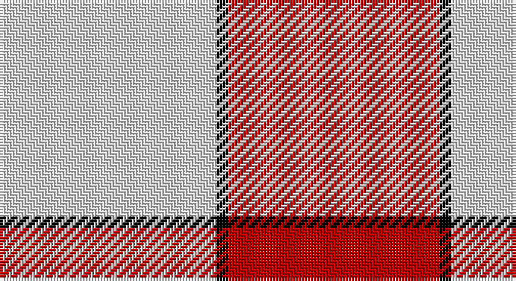

This page is one **sett** — a single exact thread-count. It belongs to the [tartan](/setts/w37k2r36/)
(the same proportion at any scale), whose colour order is pattern [RKW](/stripes/rkw/).

Part of the [Hose](/tartans/hose/) tartan — the named design grouping this sett with its other cloths.

Sourced from weddslist.  It is a [3 stripe tartan](/stripes/stripes3/).

Original link http://www.weddslist.com/cgi-bin/tartans/pg.pl?source=sts

## Also known as

This cloth is also recorded under:

- Cameron Hose #2
- Hose #2
- Hose Artifact

## Thread count
LN/74 K4 R/72

One full sett is **154 threads**.

## Palette

Palette: <strong>Tartan Register</strong> <small style="color:#888">(2 of 3 colours)</small>
<table><thead><tr><th>Colour</th><th>Threads</th><th>Shade</th><th>Base</th><th>OKLCh</th></tr></thead><tbody><tr><td>LN/</td><td style="text-align:right;font-variant-numeric:tabular-nums">74</td><td><code style="background-color:#E0E0E0;">#E0E0E0</code> <small style="color:#888">#E0E0E0</small></td><td>W <code style="background-color:#F7F7F7;">#F7F7F7</code></td><td><small style="color:#888">oklch(90.7% 0.000 89.9)</small></td></tr><tr><td>K</td><td style="text-align:right;font-variant-numeric:tabular-nums">4</td><td><code style="background-color:#000000;">#000000</code> <small style="color:#888">#000000</small></td><td>K <code style="background-color:#000000;">#000000</code></td><td><small style="color:#888">oklch(0.0% 0.000 0.0)</small></td></tr><tr><td>R/</td><td style="text-align:right;font-variant-numeric:tabular-nums">72</td><td><code style="background-color:#C00000;">#C00000</code> <small style="color:#888">#C00000</small></td><td>R <code style="background-color:#CC0000;">#CC0000</code></td><td><small style="color:#888">oklch(50.7% 0.208 29.2)</small></td></tr></tbody></table>

# Sample pattern

## Compared to the master

This cloth is one sett of its design; the master sett (the exemplar the design is anchored on) is below for comparison.

<figure style="margin:0"><figcaption style="color:#888;font-size:smaller">this sett</figcaption></figure>
<figure style="margin:0"><figcaption style="color:#888;font-size:smaller"><a href="/setts/r2g2w2r23w2g2w23g2r2w2/">master sett →</a></figcaption></figure>

## Nearest tartans

The nearest existing variants by ΔTartan distance, with this tartan at the top so the swatches line up against it.

ΔTartan

Tartan

Sett

—

<a href="/ttd/edit/#slug=w37k2r36~x2">Hose</a> <a class="nn-out" href="/variants/s3/w37k2r36~x2/" title="open its dictionary page">↗</a>

0.72

<a href="/ttd/edit/#slug=r13k1lb13~x4&amp;base=w37k2r36~x2">Hose (Dunmore)</a> <a class="nn-out" href="/variants/s3/r13k1lb13~x4/" title="open its dictionary page">↗</a>

1.59

<a href="/ttd/edit/#slug=k5w37r37w5~x2&amp;base=w37k2r36~x2">MacRae of Conchra #2</a> <a class="nn-out" href="/variants/s4/k5w37r37w5~x2/" title="open its dictionary page">↗</a>

1.78

<a href="/ttd/edit/#slug=w4m31w35lg4~x2&amp;base=w37k2r36~x2">Lewis, Magenta (Dance)</a> <a class="nn-out" href="/variants/s4/w4m31w35lg4~x2/" title="open its dictionary page">↗</a>

1.85

<a href="/ttd/edit/#slug=r4w35r31w4~x2&amp;base=w37k2r36~x2">Lewis, Red (Dance)</a> <a class="nn-out" href="/variants/s4/r4w35r31w4~x2/" title="open its dictionary page">↗</a>

1.87

<a href="/ttd/edit/#slug=lb45r2g9lb2r30~x2&amp;base=w37k2r36~x2">Malaysian Unknown (Artefact)</a> <a class="nn-out" href="/variants/s5/lb45r2g9lb2r30~x2/" title="open its dictionary page">↗</a>

1.95

<a href="/ttd/edit/#slug=k2w28r13w2r13w2~x2&amp;base=w37k2r36~x2">Buchanan #5</a> <a class="nn-out" href="/variants/s6/k2w28r13w2r13w2~x2/" title="open its dictionary page">↗</a>

1.96

<a href="/ttd/edit/#slug=lb9r20db2~x2&amp;base=w37k2r36~x2">Masai Shuka 28 (Artefact)</a> <a class="nn-out" href="/variants/s3/lb9r20db2~x2/" title="open its dictionary page">↗</a>

1.96

<a href="/ttd/edit/#slug=t15w2r20w3~x4&amp;base=w37k2r36~x2">Masai Shuka 24 (Artefact)</a> <a class="nn-out" href="/variants/s4/t15w2r20w3~x4/" title="open its dictionary page">↗</a>

2.01

<a href="/ttd/edit/#slug=lb2r4lb2r4lb9k1~x2&amp;base=w37k2r36~x2">Buchanan VS</a> <a class="nn-out" href="/variants/s6/lb2r4lb2r4lb9k1~x2/" title="open its dictionary page">↗</a>

2.06

<a href="/ttd/edit/#slug=r8ri3r28w32ri3w4~x2&amp;base=w37k2r36~x2">Ailsa, Red V2 (Dance)</a> <a class="nn-out" href="/variants/s6/r8ri3r28w32ri3w4~x2/" title="open its dictionary page">↗</a>

## Neighbour map

Every grey dot is one of 14360 variants placed by the first two principal components of the ΔTartan feature space (44% of its variance). Red is this tartan; blue dots are its nearest — click one to open its page.

<svg viewBox="0 0 640 380" role="img" style="max-width:100%;height:auto;border:1px solid #e0e0e0;border-radius:4px;display:block" xmlns="http://www.w3.org/2000/svg"><image href="/nn/cloud.v1.png" width="640" height="380"/><a href="/variants/s3/r13k1lb13~x4/"><circle cx="304.0" cy="235.5" r="4" fill="#3465a4"><title>Hose (Dunmore)</title></circle></a><a href="/variants/s4/k5w37r37w5~x2/"><circle cx="279.9" cy="222.5" r="4" fill="#3465a4"><title>MacRae of Conchra #2</title></circle></a><a href="/variants/s4/w4m31w35lg4~x2/"><circle cx="305.5" cy="218.6" r="4" fill="#3465a4"><title>Lewis, Magenta (Dance)</title></circle></a><a href="/variants/s4/r4w35r31w4~x2/"><circle cx="347.5" cy="233.9" r="4" fill="#3465a4"><title>Lewis, Red (Dance)</title></circle></a><a href="/variants/s5/lb45r2g9lb2r30~x2/"><circle cx="334.3" cy="164.6" r="4" fill="#3465a4"><title>Malaysian Unknown (Artefact)</title></circle></a><a href="/variants/s6/k2w28r13w2r13w2~x2/"><circle cx="321.5" cy="171.3" r="4" fill="#3465a4"><title>Buchanan #5</title></circle></a><a href="/variants/s3/lb9r20db2~x2/"><circle cx="384.9" cy="239.4" r="4" fill="#3465a4"><title>Masai Shuka 28 (Artefact)</title></circle></a><a href="/variants/s4/t15w2r20w3~x4/"><circle cx="299.9" cy="231.3" r="4" fill="#3465a4"><title>Masai Shuka 24 (Artefact)</title></circle></a><a href="/variants/s6/lb2r4lb2r4lb9k1~x2/"><circle cx="320.3" cy="206.4" r="4" fill="#3465a4"><title>Buchanan VS</title></circle></a><a href="/variants/s6/r8ri3r28w32ri3w4~x2/"><circle cx="291.5" cy="179.9" r="4" fill="#3465a4"><title>Ailsa, Red V2 (Dance)</title></circle></a><circle cx="315.2" cy="214.5" r="5" fill="#c00000"/></svg>

ID: /variants/s3/w37k2r36~x2/
