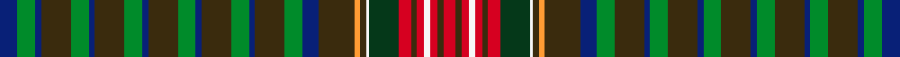

This is one **variant** — a specific cloth: this exact thread count and colourway, with its own
provenance below. It is one weaving of the [sett](/tartans/u/un/unidentified-victorian-fancy/) (the scale-free proportion — the
same cloth at any scale or shade), whose colour order is pattern [BGBGGBGGBGGBGGBGGBGYGWGRGRWRGR](/stripes/bgbggbggbggbggbggbgygwgrgrwrgr/).

Part of the [Unidentified Victorian fancy](/tartans/u/un/unidentified-victorian-fancy/) tartan — the named design grouping this sett with its other cloths.

Sourced from register-of-tartans.  It is a [30 stripe tartan](/stripes/stripes30/).

Original link [https://www.tartanregister.gov.uk/tartanDetails.aspx?ref=4391](https://www.tartanregister.gov.uk/tartanDetails.aspx?ref=4391)

Dataset <small>— provenance for this record, inherited from the source manifest</small>

<dl class="dataset-prov">
<dt>source</dt><dd><a href="/sources/register-of-tartans/">Scottish Register of Tartans</a></dd>
<dt>data captured from</dt><dd><a href="https://github.com/thetartan/tartan-database/blob/master/data/register-of-tartans/data.csv">https://github.com/thetartan/tartan-database/blob/master/data/register-of-tartans/data.csv</a></dd>
<dt>data date</dt><dd>2017-01-06 <small>(dataset default)</small></dd>
<dt>licence</dt><dd><a href="https://www.tartanregister.gov.uk/copyright">Crown copyright</a></dd>
</dl>

Capture chain <small>— the hands this data passed through, oldest first; each capture carries its own licence</small>

<ol class="capture-chain">
<li><a href="https://www.tartanregister.gov.uk/">Scottish Register of Tartans</a> · <a href="https://www.tartanregister.gov.uk/copyright">Crown copyright</a> <small>the living register — still published by National Records of Scotland</small></li>
<li><a href="https://github.com/thetartan/tartan-database">thetartan/tartan-database</a> <small>2016-2017</small> · <a href="https://creativecommons.org/licenses/by-nc-nd/4.0/">CC BY-NC-ND 4.0</a> <small>Levko Kravets's frozen compilation — the capture we vendored, and where its CC licence text came from</small></li>
<li>this dictionary <small>captured 2026-06-10 · commit 5bf86c7566</small> <small>each re-capture is a git commit to data/sources</small></li>
</ol>

## Register references

External register numbers recorded for this tartan.

- Scottish Register of Tartans: [4391](https://www.tartanregister.gov.uk/tartanDetails.aspx?ref=4391)
- Scottish Tartans World Register: 1919

## Thread count
DB/12 G12 DB4 DY20 G12 DB4 DY20 G12 DB4 DY20 G12 DB4 DY20 G12 DB4 DY20 G12 DB11 DY24 LO4 DY4 W2 DG20 R8 DY4 R5 W4 R5 DY4 R/8

One full sett is **594 threads**.

## Palette
<table><thead><tr><th>Colour</th><th>Shade</th><th>OKLCh</th></tr></thead><tbody><tr><td>DB</td><td><code style="background-color:#082077;">#082077</code> <small style="color:#888">#082077</small></td><td><small style="color:#888">oklch(30.0% 0.149 265.1)</small></td></tr><tr><td>DG</td><td><code style="background-color:#053819;">#053819</code> <small style="color:#888">#053819</small></td><td><small style="color:#888">oklch(30.0% 0.075 151.3)</small></td></tr><tr><td>G</td><td><code style="background-color:#008B2A;">#008B2A</code> <small style="color:#888">#008B2A</small></td><td><small style="color:#888">oklch(55.4% 0.170 145.9)</small></td></tr><tr><td>W</td><td><code style="background-color:#F7F7F7;">#F7F7F7</code> <small style="color:#888">#F7F7F7</small></td><td><small style="color:#888">oklch(97.6% 0.000 89.9)</small></td></tr><tr><td>LO</td><td><code style="background-color:#FF9C34;">#FF9C34</code> <small style="color:#888">#FF9C34</small></td><td><small style="color:#888">oklch(77.9% 0.161 61.8)</small></td></tr><tr><td>R</td><td><code style="background-color:#D60020;">#D60020</code> <small style="color:#888">#D60020</small></td><td><small style="color:#888">oklch(55.2% 0.224 25.5)</small></td></tr><tr><td>DY</td><td><code style="background-color:#3A2B0D;">#3A2B0D</code> <small style="color:#888">#3A2B0D</small></td><td><small style="color:#888">oklch(30.0% 0.049 82.0)</small></td></tr></tbody></table>

# Sample pattern

[Sample sheet (PDF)](swatch.pdf) — the woven sample, thread count and palette on one printable A4, rendered on demand (the same sheet the TTD print page downloads).

## Nearest tartan variants

The nearest existing variants by ΔTartan distance, with this cloth at the top so the swatches line up against it.

ΔTartan

Threads

Variant

Sett

—

594

<a href="/variants/s30/db12g12db4dy20g12db4dy20g12db4dy20g12db4dy20g12db4dy20g12db11dy24lo4dy4w2dg20r8dy4r5w4r5dy4r8/">Unidentified Victorian fancy</a>

<a href="/ttd/edit/#slug=db12g12db4o20g12db4o20g12db4o20g12db4o20g12db4o20g12db11o24b4o4w2dg20r8o4r5w4r5o4r8~g6119141-dg2709141&amp;base=db12g12db4dy20g12db4dy20g12db4dy20g12db4dy20g12db4dy20g12db11dy24lo4dy4w2dg20r8dy4r5w4r5dy4r8" title="compare in the TTD">2.53</a>

594

<a href="/variants/s30/db12g12db4o20g12db4o20g12db4o20g12db4o20g12db4o20g12db11o24b4o4w2dg20r8o4r5w4r5o4r8~g6119141-dg2709141/">Unidentified, Victorian fancy</a>

<a href="/ttd/edit/#slug=g4db4r4db2g12db2g12db2r4g4w1ri4dbi2r4db4dbi4db4r4db2dbi12db2~x2~db3409246-r4315012-ri6016021-dbi3514276&amp;base=db12g12db4dy20g12db4dy20g12db4dy20g12db4dy20g12db4dy20g12db11dy24lo4dy4w2dg20r8dy4r5w4r5dy4r8" title="compare in the TTD">3.75</a>

360

<a href="/variants/s21/g4db4r4db2g12db2g12db2r4g4w1ri4dbi2r4db4dbi4db4r4db2dbi12db2~x2~db3409246-r4315012-ri6016021-dbi3514276/">Otago Peninsula Corporate Tartan</a>

<a href="/ttd/edit/#slug=dy3t12g6y3g6t12dy3t12g6y3g6y3g6t12dy6t12dy3w1dy3r3dy3w1dy3r3dy3w1~x2&amp;base=db12g12db4dy20g12db4dy20g12db4dy20g12db4dy20g12db4dy20g12db11dy24lo4dy4w2dg20r8dy4r5w4r5dy4r8" title="compare in the TTD">3.84</a>

532

<a href="/variants/s26/dy3t12g6y3g6t12dy3t12g6y3g6y3g6t12dy6t12dy3w1dy3r3dy3w1dy3r3dy3w1~x2/">Sprouston</a>

<a href="/ttd/edit/#slug=dr5db3dr3r2db2y2db2y1db14g2db7g4db4g7db2g9y1n2g5~x2~db3514276-r5221030&amp;base=db12g12db4dy20g12db4dy20g12db4dy20g12db4dy20g12db4dy20g12db11dy24lo4dy4w2dg20r8dy4r5w4r5dy4r8" title="compare in the TTD">3.87</a>

288

<a href="/variants/s19/dr5db3dr3r2db2y2db2y1db14g2db7g4db4g7db2g9y1n2g5~x2~db3514276-r5221030/">Hart of Scotland</a>

<a href="/ttd/edit/#slug=r2g4n2g11dt9ri12dt2ri12dt9g2dt2g2dt2g6r2g6dt2g2dt2g2dt9ri12lo2ri12dt9g11n2g4r2~x2~ri3916030&amp;base=db12g12db4dy20g12db4dy20g12db4dy20g12db4dy20g12db4dy20g12db11dy24lo4dy4w2dg20r8dy4r5w4r5dy4r8" title="compare in the TTD">3.93</a>

616

<a href="/variants/s29/r2g4n2g11dt9ri12dt2ri12dt9g2dt2g2dt2g6r2g6dt2g2dt2g2dt9ri12lo2ri12dt9g11n2g4r2~x2~ri3916030/">Shearer</a>

## Neighbour map

Every grey dot is one of 13662 variants placed by the first two principal components of the ΔTartan feature space (42% of its variance). Red is this tartan; blue dots are its nearest — click one to open its page. The map is a flat projection of a many-dimensional space — [how to read it](/posts/neighbourhood-maps/).

<svg viewBox="0 0 640 380" role="img" style="max-width:100%;height:auto;border:1px solid #e0e0e0;border-radius:4px;display:block" xmlns="http://www.w3.org/2000/svg"><image href="/nn/cloud.v1.png" width="640" height="380"/><a href="/variants/s30/db12g12db4o20g12db4o20g12db4o20g12db4o20g12db4o20g12db11o24b4o4w2dg20r8o4r5w4r5o4r8~g6119141-dg2709141/"><circle cx="146.9" cy="129.3" r="4" fill="#3465a4"><title>Unidentified, Victorian fancy</title></circle></a><a href="/variants/s21/g4db4r4db2g12db2g12db2r4g4w1ri4dbi2r4db4dbi4db4r4db2dbi12db2~x2~db3409246-r4315012-ri6016021-dbi3514276/"><circle cx="157.1" cy="162.5" r="4" fill="#3465a4"><title>Otago Peninsula Corporate Tartan</title></circle></a><a href="/variants/s26/dy3t12g6y3g6t12dy3t12g6y3g6y3g6t12dy6t12dy3w1dy3r3dy3w1dy3r3dy3w1~x2/"><circle cx="209.6" cy="164.2" r="4" fill="#3465a4"><title>Sprouston</title></circle></a><a href="/variants/s19/dr5db3dr3r2db2y2db2y1db14g2db7g4db4g7db2g9y1n2g5~x2~db3514276-r5221030/"><circle cx="227.1" cy="124.9" r="4" fill="#3465a4"><title>Hart of Scotland</title></circle></a><a href="/variants/s29/r2g4n2g11dt9ri12dt2ri12dt9g2dt2g2dt2g6r2g6dt2g2dt2g2dt9ri12lo2ri12dt9g11n2g4r2~x2~ri3916030/"><circle cx="136.8" cy="170.0" r="4" fill="#3465a4"><title>Shearer</title></circle></a><circle cx="152.3" cy="134.2" r="5" fill="#c00000"/><text x="320" y="376" text-anchor="middle" font-size="11" fill="#999">ground</text><text x="11" y="190" text-anchor="middle" font-size="11" fill="#999" transform="rotate(-90 11 190)">complexity</text></svg>

ID: /variants/s30/db12g12db4dy20g12db4dy20g12db4dy20g12db4dy20g12db4dy20g12db11dy24lo4dy4w2dg20r8dy4r5w4r5dy4r8/
