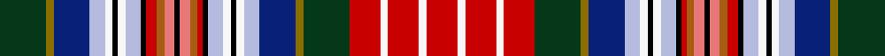

This is one **variant** — a specific cloth: this exact thread count and colourway, with its own
provenance below. It is one weaving of the [sett](/setts/dg18y3db14lb6w3k2w3lb6k2r4o3ri4k2ri4o3r2k2lb6w3k2w3lb6db14y3dg18r12w3r12w3r12/) (the scale-free proportion — the
same cloth at any scale or shade), whose colour order is pattern [GGBWWKWWKRRRKRRRKWWKWWBGGRWRWR](/stripes/ggbwwkwwkrrrkrrrkwwkwwbggrwrwr/).

Part of the [Unidentified Cant](/tartans/u/un/unidentified-cant-4/) tartan — the named design grouping this sett with its other cloths.

Sourced from register-of-tartans.  It is a [30 stripe tartan](/stripes/stripes30/).

Original link [https://www.tartanregister.gov.uk/tartanDetails.aspx?ref=4286](https://www.tartanregister.gov.uk/tartanDetails.aspx?ref=4286)

Dataset <small>— provenance for this record, inherited from the source manifest</small>

<dl class="dataset-prov">
<dt>source</dt><dd><a href="/sources/register-of-tartans/">Scottish Register of Tartans</a></dd>
<dt>data captured from</dt><dd><a href="https://github.com/thetartan/tartan-database/blob/master/data/register-of-tartans/data.csv">https://github.com/thetartan/tartan-database/blob/master/data/register-of-tartans/data.csv</a></dd>
<dt>data date</dt><dd>2002 <small>(this record)</small></dd>
<dt>licence</dt><dd><a href="https://www.tartanregister.gov.uk/copyright">Crown copyright</a></dd>
</dl>

Capture chain <small>— the hands this data passed through, oldest first; each capture carries its own licence</small>

<ol class="capture-chain">
<li><a href="https://www.tartanregister.gov.uk/">Scottish Register of Tartans</a> · <a href="https://www.tartanregister.gov.uk/copyright">Crown copyright</a> <small>the living register — still published by National Records of Scotland</small></li>
<li><a href="https://github.com/thetartan/tartan-database">thetartan/tartan-database</a> <small>2016-2017</small> · <a href="https://creativecommons.org/licenses/by-nc-nd/4.0/">CC BY-NC-ND 4.0</a> <small>Levko Kravets's frozen compilation — the capture we vendored, and where its CC licence text came from</small></li>
<li>this dictionary <small>captured 2026-06-10 · commit 5bf86c7566</small> <small>each re-capture is a git commit to data/sources</small></li>
</ol>

## Register references

External register numbers recorded for this tartan.

- Scottish Register of Tartans: [4286](https://www.tartanregister.gov.uk/tartanDetails.aspx?ref=4286)
- Scottish Tartans Authority (ITI): 5723

## Thread count
DG/36 Y6 DB28 LB12 W6 K4 W6 LB12 K4 R8 O6 Ri8 K4 Ri8 O6 R4 K4 LB12 W6 K4 W6 LB12 DB28 Y6 DG36 R24 W6 R24 W6 R/24

One full sett is **652 threads**.

## Palette
<table><thead><tr><th>Colour</th><th>Shade</th><th>OKLCh</th></tr></thead><tbody><tr><td>LB</td><td><code style="background-color:#B5BBDE;">#B5BBDE</code> <small style="color:#888">#B5BBDE</small></td><td><small style="color:#888">oklch(79.9% 0.050 277.6)</small></td></tr><tr><td>DB</td><td><code style="background-color:#082077;">#082077</code> <small style="color:#888">#082077</small></td><td><small style="color:#888">oklch(30.0% 0.149 265.1)</small></td></tr><tr><td>DG</td><td><code style="background-color:#053819;">#053819</code> <small style="color:#888">#053819</small></td><td><small style="color:#888">oklch(30.0% 0.075 151.3)</small></td></tr><tr><td>K</td><td><code style="background-color:#000000;">#000000</code> <small style="color:#888">#000000</small></td><td><small style="color:#888">oklch(0.0% 0.000 0.0)</small></td></tr><tr><td>W</td><td><code style="background-color:#F7F7F7;">#F7F7F7</code> <small style="color:#888">#F7F7F7</small></td><td><small style="color:#888">oklch(97.6% 0.000 89.9)</small></td></tr><tr><td>O</td><td><code style="background-color:#A65C11;">#A65C11</code> <small style="color:#888">#A65C11</small></td><td><small style="color:#888">oklch(55.0% 0.125 58.3)</small></td></tr><tr><td>R</td><td><code style="background-color:#E87878;">#E87878</code> <small style="color:#888">#E87878</small></td><td><small style="color:#888">oklch(70.0% 0.139 21.2)</small></td></tr><tr><td>R</td><td><code style="background-color:#C80000;">#C80000</code> <small style="color:#888">#C80000</small></td><td><small style="color:#888">oklch(52.3% 0.215 29.2)</small></td></tr><tr><td>Y</td><td><code style="background-color:#8B6E00;">#8B6E00</code> <small style="color:#888">#8B6E00</small></td><td><small style="color:#888">oklch(55.1% 0.113 90.4)</small></td></tr></tbody></table>

# Sample pattern

## Nearest tartan variants

The nearest existing variants by ΔTartan distance, with this cloth at the top so the swatches line up against it.

ΔTartan

Threads

Variant

Sett

—

652

<a href="/variants/s30/dg18y3db14lb6w3k2w3lb6k2r4o3ri4k2ri4o3r2k2lb6w3k2w3lb6db14y3dg18r12w3r12w3r12~x2~r2109032-ri2806019/">Unidentified Cant #01 (Cumming)</a>

<a href="/ttd/edit/#slug=dp11k1lo4r1lo1r1lo3w2k2y2k3dy2w3dy3db3dy2w2~x2&amp;base=dg18y3db14lb6w3k2w3lb6k2r4o3ri4k2ri4o3r2k2lb6w3k2w3lb6db14y3dg18r12w3r12w3r12~x2~r2109032-ri2806019" title="compare in the TTD">3.30</a>

158

<a href="/variants/s17/dp11k1lo4r1lo1r1lo3w2k2y2k3dy2w3dy3db3dy2w2~x2/">York Puppet Tartan</a>

<a href="/ttd/edit/#slug=dp11k1lo4r1lo1r1lo1w2k2y2dy2k3w3dy3db3dy2w2~x2&amp;base=dg18y3db14lb6w3k2w3lb6k2r4o3ri4k2ri4o3r2k2lb6w3k2w3lb6db14y3dg18r12w3r12w3r12~x2~r2109032-ri2806019" title="compare in the TTD">3.38</a>

150

<a href="/variants/s17/dp11k1lo4r1lo1r1lo1w2k2y2dy2k3w3dy3db3dy2w2~x2/">York Puppet</a>

<a href="/ttd/edit/#slug=db8k2db3dg3k3r3dg10g3k3w3k3m16dg6k3db8ly13k2m2~x2~r2109032-m2610337&amp;base=dg18y3db14lb6w3k2w3lb6k2r4o3ri4k2ri4o3r2k2lb6w3k2w3lb6db14y3dg18r12w3r12w3r12~x2~r2109032-ri2806019" title="compare in the TTD">3.49</a>

356

<a href="/variants/s18/db8k2db3dg3k3r3dg10g3k3w3k3m16dg6k3db8ly13k2m2~x2~r2109032-m2610337/">Kukri</a>

<a href="/ttd/edit/#slug=dp11k1b4r1b1r1b3w2k2y2k3o2w3o3db3o2w2~x2&amp;base=dg18y3db14lb6w3k2w3lb6k2r4o3ri4k2ri4o3r2k2lb6w3k2w3lb6db14y3dg18r12w3r12w3r12~x2~r2109032-ri2806019" title="compare in the TTD">3.62</a>

158

<a href="/variants/s17/dp11k1b4r1b1r1b3w2k2y2k3o2w3o3db3o2w2~x2/">York Puppet</a>

<a href="/ttd/edit/#slug=ri4w1r11ri2w2dp11lb4w2lb4dp11w2g4y4w1dp5w1y4g4w2dg10g4w2g4dg10w2lb2dp6w1dp6lb2w2ri2r11w1ri4w1~x2~ri2406019-r2109032-g2408144-dg1806142&amp;base=dg18y3db14lb6w3k2w3lb6k2r4o3ri4k2ri4o3r2k2lb6w3k2w3lb6db14y3dg18r12w3r12w3r12~x2~r2109032-ri2806019" title="compare in the TTD">3.72</a>

586

<a href="/variants/s36/ri4w1r11ri2w2dp11lb4w2lb4dp11w2g4y4w1dp5w1y4g4w2dg10g4w2g4dg10w2lb2dp6w1dp6lb2w2ri2r11w1ri4w1~x2~ri2406019-r2109032-g2408144-dg1806142/">Waggrall Family Tartan</a>

<a href="/ttd/edit/#slug=g18r1k18r1n18r1o18r1dr18r1dy18r1lr18r1ly18r1dy18r1dr18r1o18r1n18r1k18r1g18~x2~n1900000-o2500000&amp;base=dg18y3db14lb6w3k2w3lb6k2r4o3ri4k2ri4o3r2k2lb6w3k2w3lb6db14y3dg18r12w3r12w3r12~x2~r2109032-ri2806019" title="compare in the TTD">3.74</a>

988

<a href="/variants/s27/g18r1k18r1n18r1o18r1dr18r1dy18r1lr18r1ly18r1dy18r1dr18r1o18r1n18r1k18r1g18~x2~n1900000-o2500000/">MacKay of Strathnaver Clan Tartan</a>

## Neighbour map

Every grey dot is one of 13621 variants placed by the first two principal components of the ΔTartan feature space (42% of its variance). Red is this tartan; blue dots are its nearest — click one to open its page. The map is a flat projection of a many-dimensional space — [how to read it](/posts/neighbourhood-maps/).

<svg viewBox="0 0 640 380" role="img" style="max-width:100%;height:auto;border:1px solid #e0e0e0;border-radius:4px;display:block" xmlns="http://www.w3.org/2000/svg"><image href="/nn/cloud.v1.png" width="640" height="380"/><a href="/variants/s17/dp11k1lo4r1lo1r1lo3w2k2y2k3dy2w3dy3db3dy2w2~x2/"><circle cx="14.0" cy="91.6" r="4" fill="#3465a4"><title>York Puppet Tartan</title></circle></a><a href="/variants/s17/dp11k1lo4r1lo1r1lo1w2k2y2dy2k3w3dy3db3dy2w2~x2/"><circle cx="14.0" cy="87.7" r="4" fill="#3465a4"><title>York Puppet</title></circle></a><a href="/variants/s18/db8k2db3dg3k3r3dg10g3k3w3k3m16dg6k3db8ly13k2m2~x2~r2109032-m2610337/"><circle cx="14.0" cy="107.7" r="4" fill="#3465a4"><title>Kukri</title></circle></a><a href="/variants/s17/dp11k1b4r1b1r1b3w2k2y2k3o2w3o3db3o2w2~x2/"><circle cx="14.0" cy="94.3" r="4" fill="#3465a4"><title>York Puppet</title></circle></a><a href="/variants/s36/ri4w1r11ri2w2dp11lb4w2lb4dp11w2g4y4w1dp5w1y4g4w2dg10g4w2g4dg10w2lb2dp6w1dp6lb2w2ri2r11w1ri4w1~x2~ri2406019-r2109032-g2408144-dg1806142/"><circle cx="14.0" cy="88.9" r="4" fill="#3465a4"><title>Waggrall Family Tartan</title></circle></a><a href="/variants/s27/g18r1k18r1n18r1o18r1dr18r1dy18r1lr18r1ly18r1dy18r1dr18r1o18r1n18r1k18r1g18~x2~n1900000-o2500000/"><circle cx="14.0" cy="52.5" r="4" fill="#3465a4"><title>MacKay of Strathnaver Clan Tartan</title></circle></a><circle cx="14.0" cy="66.8" r="5" fill="#c00000"/><text x="320" y="376" text-anchor="middle" font-size="11" fill="#999">ground</text><text x="11" y="190" text-anchor="middle" font-size="11" fill="#999" transform="rotate(-90 11 190)">complexity</text></svg>

ID: /variants/s30/dg18y3db14lb6w3k2w3lb6k2r4o3ri4k2ri4o3r2k2lb6w3k2w3lb6db14y3dg18r12w3r12w3r12~x2~r2109032-ri2806019/
