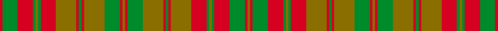

This is one **variant** — a specific cloth: this exact thread count and colourway, with its own
provenance below. It is one weaving of the [sett](/setts/r1g6r6g1y1g1r6y8r1g1r1y8g6r1y1r1g6y8r1g1r1y8r6g1y1g1r6g6r1y1/) (the scale-free proportion — the
same cloth at any scale or shade), whose colour order is pattern [GRGRGGGRGRGRGGRGRGGRGRGRGGGRGR](/stripes/grgrgggrgrgrggrgrggrgrgrgggrgr/).

Sourced from register-of-tartans.  It is a [30 stripe tartan](/stripes/stripes30/).

Original link [https://www.tartanregister.gov.uk/tartanDetails.aspx?ref=3984](https://www.tartanregister.gov.uk/tartanDetails.aspx?ref=3984)

Dataset <small>— provenance for this record, inherited from the source manifest</small>

<dl class="dataset-prov">
<dt>source</dt><dd><a href="/sources/register-of-tartans/">Scottish Register of Tartans</a></dd>
<dt>data captured from</dt><dd><a href="https://github.com/thetartan/tartan-database/blob/master/data/register-of-tartans/data.csv">https://github.com/thetartan/tartan-database/blob/master/data/register-of-tartans/data.csv</a></dd>
<dt>data date</dt><dd>1820 <small>(this record)</small></dd>
<dt>licence</dt><dd><a href="https://www.tartanregister.gov.uk/copyright">Crown copyright</a></dd>
</dl>

Capture chain <small>— the hands this data passed through, oldest first; each capture carries its own licence</small>

<ol class="capture-chain">
<li><a href="https://www.tartanregister.gov.uk/">Scottish Register of Tartans</a> · <a href="https://www.tartanregister.gov.uk/copyright">Crown copyright</a> <small>the living register — still published by National Records of Scotland</small></li>
<li><a href="https://github.com/thetartan/tartan-database">thetartan/tartan-database</a> <small>2016-2017</small> · <a href="https://creativecommons.org/licenses/by-nc-nd/4.0/">CC BY-NC-ND 4.0</a> <small>Levko Kravets's frozen compilation — the capture we vendored, and where its CC licence text came from</small></li>
<li>this dictionary <small>captured 2026-06-10 · commit 5bf86c7566</small> <small>each re-capture is a git commit to data/sources</small></li>
</ol>

## Register references

External register numbers recorded for this tartan.

- Scottish Register of Tartans: [3984](https://www.tartanregister.gov.uk/tartanDetails.aspx?ref=3984)
- Scottish Tartans Authority (ITI): 1890
- Scottish Tartans World Register: 1890

## Thread count
R/2 G12 R12 G2 Y2 G2 R12 Y16 R2 G2 R2 Y16 G12 R2 Y2 R2 G12 Y16 R2 G2 R2 Y16 R12 G2 Y2 G2 R12 G12 R2 Y/2

One full sett is **388 threads**.

## Palette
<table><thead><tr><th>Colour</th><th>Shade</th><th>OKLCh</th></tr></thead><tbody><tr><td>G</td><td><code style="background-color:#008B2A;">#008B2A</code> <small style="color:#888">#008B2A</small></td><td><small style="color:#888">oklch(55.4% 0.170 145.9)</small></td></tr><tr><td>R</td><td><code style="background-color:#D60020;">#D60020</code> <small style="color:#888">#D60020</small></td><td><small style="color:#888">oklch(55.2% 0.224 25.5)</small></td></tr><tr><td>Y</td><td><code style="background-color:#8B6E00;">#8B6E00</code> <small style="color:#888">#8B6E00</small></td><td><small style="color:#888">oklch(55.1% 0.113 90.4)</small></td></tr></tbody></table>

# Sample pattern

## Nearest tartan variants

The nearest existing variants by ΔTartan distance, with this cloth at the top so the swatches line up against it.

ΔTartan

Threads

Variant

Sett

—

388

<a href="/variants/s30/r1g6r6g1y1g1r6y8r1g1r1y8g6r1y1r1g6y8r1g1r1y8r6g1y1g1r6g6r1y1~x2/">Strathearn</a>

<a href="/ttd/edit/#slug=y1r1g6y8r1g1r1y8r6g1y1g1r6g6r1y1~x2&amp;base=r1g6r6g1y1g1r6y8r1g1r1y8g6r1y1r1g6y8r1g1r1y8r6g1y1g1r6g6r1y1~x2" title="compare in the TTD">2.75</a>

196

<a href="/variants/s16/y1r1g6y8r1g1r1y8r6g1y1g1r6g6r1y1~x2/">Strathearn District Tartan</a>

<a href="/ttd/edit/#slug=r1g6r6ri6r1ri6r6g1r1g1r1g1r1g6r1g1r1g1r6ri6r1ri6r6g6r1g1~x8~r1707016-ri2109032&amp;base=r1g6r6g1y1g1r6y8r1g1r1y8g6r1y1r1g6y8r1g1r1y8r6g1y1g1r6g6r1y1~x2" title="compare in the TTD">3.99</a>

1280

<a href="/variants/s26/r1g6r6ri6r1ri6r6g1r1g1r1g1r1g6r1g1r1g1r6ri6r1ri6r6g6r1g1~x8~r1707016-ri2109032/">MacNab</a>

## Neighbour map

Every grey dot is one of 13621 variants placed by the first two principal components of the ΔTartan feature space (42% of its variance). Red is this tartan; blue dots are its nearest — click one to open its page.

<svg viewBox="0 0 640 380" role="img" style="max-width:100%;height:auto;border:1px solid #e0e0e0;border-radius:4px;display:block" xmlns="http://www.w3.org/2000/svg"><image href="/nn/cloud.v1.png" width="640" height="380"/><a href="/variants/s16/y1r1g6y8r1g1r1y8r6g1y1g1r6g6r1y1~x2/"><circle cx="316.1" cy="228.5" r="4" fill="#3465a4"><title>Strathearn District Tartan</title></circle></a><a href="/variants/s26/r1g6r6ri6r1ri6r6g1r1g1r1g1r1g6r1g1r1g1r6ri6r1ri6r6g6r1g1~x8~r1707016-ri2109032/"><circle cx="262.8" cy="207.0" r="4" fill="#3465a4"><title>MacNab</title></circle></a><circle cx="292.7" cy="205.9" r="5" fill="#c00000"/><text x="320" y="376" text-anchor="middle" font-size="11" fill="#999">ground</text><text x="11" y="190" text-anchor="middle" font-size="11" fill="#999" transform="rotate(-90 11 190)">complexity</text></svg>

ID: /variants/s30/r1g6r6g1y1g1r6y8r1g1r1y8g6r1y1r1g6y8r1g1r1y8r6g1y1g1r6g6r1y1~x2/
