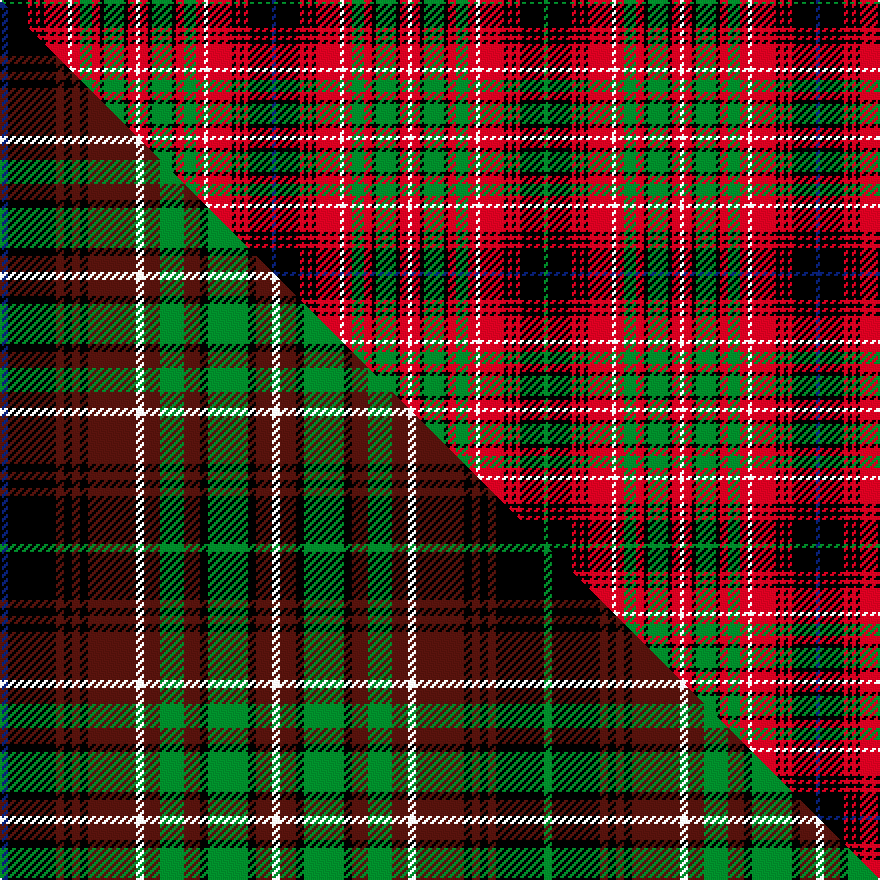

This page is one **sett** — a single exact thread-count. It belongs to the [tartan](/setts/db1k6r1k1r1k1r6w1r2g3r2k1g5k1r2w1r2k1g5k1r2g3r2w1r6k1r1k1r1k6g1/)
(the same proportion at any scale), whose colour order is pattern [BKRKRKRWRGRKGKRWRKGKRGRWRKRKRKG](/stripes/bkrkrkrwrgrkgkrwrkgkrgrwrkrkrkg/).

Part of the [Innes of Cowie](/tartans/innes-of-cowie/) tartan — the named design grouping this sett with its other cloths.

Sourced from weddslist.  It is a [31 stripe tartan](/stripes/stripes31/).

Original link http://www.weddslist.com/cgi-bin/tartans/pg.pl?source=sts

## Thread count
G/2 K12 R2 K2 R2 K2 R12 W2 R4 G6 R4 K2 G10 K2 R4 W2 R4 K2 G10 K2 R4 G6 R4 W2 R12 K2 R2 K2 R2 K12 DB/2

One full sett is **272 threads**.

## Palette
<table><thead><tr><th>Colour</th><th>Shade</th><th>OKLCh</th></tr></thead><tbody><tr><td>DB</td><td><code style="background-color:#082077;">#082077</code> <small style="color:#888">#082077</small></td><td><small style="color:#888">oklch(30.0% 0.149 265.1)</small></td></tr><tr><td>G</td><td><code style="background-color:#008B2A;">#008B2A</code> <small style="color:#888">#008B2A</small></td><td><small style="color:#888">oklch(55.4% 0.170 145.9)</small></td></tr><tr><td>K</td><td><code style="background-color:#000000;">#000000</code> <small style="color:#888">#000000</small></td><td><small style="color:#888">oklch(0.0% 0.000 0.0)</small></td></tr><tr><td>W</td><td><code style="background-color:#F7F7F7;">#F7F7F7</code> <small style="color:#888">#F7F7F7</small></td><td><small style="color:#888">oklch(97.6% 0.000 89.9)</small></td></tr><tr><td>R</td><td><code style="background-color:#D60020;">#D60020</code> <small style="color:#888">#D60020</small></td><td><small style="color:#888">oklch(55.2% 0.224 25.5)</small></td></tr></tbody></table>

# Sample pattern

## Compared to the master

This cloth is one sett of its design; the master sett (the exemplar the design is anchored on) is below for comparison.

Its **ΔTartan distance** from the master is **0.17** — the same measure the nearest-tartans table ranks by (0 is identical; a re-scale of the same cloth is near 0, a recolour or a different proportion further).

<figure class="master-compare" style="margin:0">

this sett
master sett ★

<figcaption style="color:#888;font-size:smaller">One weave of this sett against the <a href="/setts/db1k6dr1k1dr1k1dr6w1dr2g3dr2k1g5k1dr2w1dr2k1g5k1dr2g3dr2w1dr6k1dr1k1dr1k6g1/">master sett ★</a>, split on the diagonal: a shared proportion runs seamlessly across it with only the shades shifting; a different proportion breaks on it.</figcaption>
</figure>

## Nearest tartan variants

The nearest existing variants by ΔTartan distance, with this cloth at the top so the swatches line up against it.

ΔTartan

Threads

Variant

Sett

—

272

<a href="/variants/s31/db1k6r1k1r1k1r6w1r2g3r2k1g5k1r2w1r2k1g5k1r2g3r2w1r6k1r1k1r1k6g1~x2/">Innes, of Cowie</a>

<a href="/ttd/edit/#slug=db1k6dr1k1dr1k1dr6w1dr2g3dr2k1g5k1dr2w1dr2k1g5k1dr2g3dr2w1dr6k1dr1k1dr1k6g1~x4&amp;base=db1k6r1k1r1k1r6w1r2g3r2k1g5k1r2w1r2k1g5k1r2g3r2w1r6k1r1k1r1k6g1~x2" title="compare in the TTD">0.17</a>

544

<a href="/variants/s31/db1k6dr1k1dr1k1dr6w1dr2g3dr2k1g5k1dr2w1dr2k1g5k1dr2g3dr2w1dr6k1dr1k1dr1k6g1~x4/">Innes of Cowie (Clan?)</a>

<a href="/ttd/edit/#slug=r4k4r6g24r4k3r6g3r4k24r6g4r4lb4r4g4r6k24r4g3r6k3r4g24r6k4r4lb4~x2&amp;base=db1k6r1k1r1k1r6w1r2g3r2k1g5k1r2w1r2k1g5k1r2g3r2w1r6k1r1k1r1k6g1~x2" title="compare in the TTD">2.78</a>

784

<a href="/variants/s28/r4k4r6g24r4k3r6g3r4k24r6g4r4lb4r4g4r6k24r4g3r6k3r4g24r6k4r4lb4~x2/">Kilbarchan Unidentified No. 7</a>

<a href="/ttd/edit/#slug=k6r1k1r1k1r6w1r2g3r2k1g5k1r2w1r2k1g5k1r2g3r2w1r6k1r1k1r1k6g1k6r1k1r1k1r6w1r2g3r2k1g5k1r2w1r2k1g5k1r2g3r2w1r6k1r1k1r1k6db1~x4&amp;base=db1k6r1k1r1k1r6w1r2g3r2k1g5k1r2w1r2k1g5k1r2g3r2w1r6k1r1k1r1k6g1~x2" title="compare in the TTD">2.87</a>

1060

<a href="/variants/s60/k6r1k1r1k1r6w1r2g3r2k1g5k1r2w1r2k1g5k1r2g3r2w1r6k1r1k1r1k6g1k6r1k1r1k1r6w1r2g3r2k1g5k1r2w1r2k1g5k1r2g3r2w1r6k1r1k1r1k6db1~x4/">Innes of Cowie</a>

<a href="/ttd/edit/#slug=k10n2k2n2k3n10r16lb2r2lb2r2lb2r16n10k3n2k2n2k10y2~x2&amp;base=db1k6r1k1r1k1r6w1r2g3r2k1g5k1r2w1r2k1g5k1r2g3r2w1r6k1r1k1r1k6g1~x2" title="compare in the TTD">3.07</a>

384

<a href="/variants/s20/k10n2k2n2k3n10r16lb2r2lb2r2lb2r16n10k3n2k2n2k10y2~x2/">Dryburgh Clan Tartan</a>

<a href="/ttd/edit/#slug=k3y2k13w2lb11r12w2r12k12y2g12r12w2r12lb11w2k13y2k3~x2&amp;base=db1k6r1k1r1k1r6w1r2g3r2k1g5k1r2w1r2k1g5k1r2g3r2w1r6k1r1k1r1k6g1~x2" title="compare in the TTD">3.07</a>

548

<a href="/variants/s19/k3y2k13w2lb11r12w2r12k12y2g12r12w2r12lb11w2k13y2k3~x2/">Wilson's No.190</a>

<a href="/ttd/edit/#slug=r21y9k2y2k2y9k18ly3dg21r13k3r13w2r13~x2&amp;base=db1k6r1k1r1k1r6w1r2g3r2k1g5k1r2w1r2k1g5k1r2g3r2w1r6k1r1k1r1k6g1~x2" title="compare in the TTD">3.14</a>

456

<a href="/variants/s14/r21y9k2y2k2y9k18ly3dg21r13k3r13w2r13~x2/">Wilson's No.155</a>

<a href="/ttd/edit/#slug=r18k3r3k11g9k2g9k11r2k11r3k3r9g2k3g2r9k3r3k11r2k11r3k3r18db2r3db2~x2&amp;base=db1k6r1k1r1k1r6w1r2g3r2k1g5k1r2w1r2k1g5k1r2g3r2w1r6k1r1k1r1k6g1~x2" title="compare in the TTD">3.17</a>

644

<a href="/variants/s28/r18k3r3k11g9k2g9k11r2k11r3k3r9g2k3g2r9k3r3k11r2k11r3k3r18db2r3db2~x2/">MacInroy #2</a>

<a href="/ttd/edit/#slug=db3r2g4r7k2y2k2y2k5db4r21db4k5y2k2y2k2r7g4r2db3y2~x4&amp;base=db1k6r1k1r1k1r6w1r2g3r2k1g5k1r2w1r2k1g5k1r2g3r2w1r6k1r1k1r1k6g1~x2" title="compare in the TTD">3.28</a>

692

<a href="/variants/s22/db3r2g4r7k2y2k2y2k5db4r21db4k5y2k2y2k2r7g4r2db3y2~x4/">Hepburn</a>

<a href="/ttd/edit/#slug=k1r1g8r1k6lb1r6g6r1k8r1lb1k1r1k8r1g6r6lb1k6r1g8r1~x4&amp;base=db1k6r1k1r1k1r6w1r2g3r2k1g5k1r2w1r2k1g5k1r2g3r2w1r6k1r1k1r1k6g1~x2" title="compare in the TTD">3.28</a>

640

<a href="/variants/s23/k1r1g8r1k6lb1r6g6r1k8r1lb1k1r1k8r1g6r6lb1k6r1g8r1~x4/">Cumming Hunting</a>

<a href="/ttd/edit/#slug=g12k1r6db1r1lb1r1db1r6k12r1db12r6k1r6db12r1k12r6lb1g12r6k1r6g12r6db1r1lb1r1db1r6k12r1db12r6k1~x2&amp;base=db1k6r1k1r1k1r6w1r2g3r2k1g5k1r2w1r2k1g5k1r2g3r2w1r6k1r1k1r1k6g1~x2" title="compare in the TTD">3.32</a>

718

<a href="/variants/s37/g12k1r6db1r1lb1r1db1r6k12r1db12r6k1r6db12r1k12r6lb1g12r6k1r6g12r6db1r1lb1r1db1r6k12r1db12r6k1~x2/">Unidentified #38</a>

## Neighbour map

Every grey dot is one of 13620 variants placed by the first two principal components of the ΔTartan feature space (42% of its variance). Red is this tartan; blue dots are its nearest — click one to open its page.

<svg viewBox="0 0 640 380" role="img" style="max-width:100%;height:auto;border:1px solid #e0e0e0;border-radius:4px;display:block" xmlns="http://www.w3.org/2000/svg"><image href="/nn/cloud.v1.png" width="640" height="380"/><a href="/variants/s31/db1k6dr1k1dr1k1dr6w1dr2g3dr2k1g5k1dr2w1dr2k1g5k1dr2g3dr2w1dr6k1dr1k1dr1k6g1~x4/"><circle cx="105.3" cy="136.4" r="4" fill="#3465a4"><title>Innes of Cowie (Clan?)</title></circle></a><a href="/variants/s28/r4k4r6g24r4k3r6g3r4k24r6g4r4lb4r4g4r6k24r4g3r6k3r4g24r6k4r4lb4~x2/"><circle cx="110.6" cy="123.9" r="4" fill="#3465a4"><title>Kilbarchan Unidentified No. 7</title></circle></a><a href="/variants/s60/k6r1k1r1k1r6w1r2g3r2k1g5k1r2w1r2k1g5k1r2g3r2w1r6k1r1k1r1k6g1k6r1k1r1k1r6w1r2g3r2k1g5k1r2w1r2k1g5k1r2g3r2w1r6k1r1k1r1k6db1~x4/"><circle cx="78.4" cy="100.6" r="4" fill="#3465a4"><title>Innes of Cowie</title></circle></a><a href="/variants/s20/k10n2k2n2k3n10r16lb2r2lb2r2lb2r16n10k3n2k2n2k10y2~x2/"><circle cx="111.8" cy="125.9" r="4" fill="#3465a4"><title>Dryburgh Clan Tartan</title></circle></a><a href="/variants/s19/k3y2k13w2lb11r12w2r12k12y2g12r12w2r12lb11w2k13y2k3~x2/"><circle cx="23.0" cy="120.0" r="4" fill="#3465a4"><title>Wilson's No.190</title></circle></a><a href="/variants/s14/r21y9k2y2k2y9k18ly3dg21r13k3r13w2r13~x2/"><circle cx="83.0" cy="105.8" r="4" fill="#3465a4"><title>Wilson's No.155</title></circle></a><a href="/variants/s28/r18k3r3k11g9k2g9k11r2k11r3k3r9g2k3g2r9k3r3k11r2k11r3k3r18db2r3db2~x2/"><circle cx="154.3" cy="127.2" r="4" fill="#3465a4"><title>MacInroy #2</title></circle></a><a href="/variants/s22/db3r2g4r7k2y2k2y2k5db4r21db4k5y2k2y2k2r7g4r2db3y2~x4/"><circle cx="144.8" cy="105.8" r="4" fill="#3465a4"><title>Hepburn</title></circle></a><a href="/variants/s23/k1r1g8r1k6lb1r6g6r1k8r1lb1k1r1k8r1g6r6lb1k6r1g8r1~x4/"><circle cx="114.2" cy="142.2" r="4" fill="#3465a4"><title>Cumming Hunting</title></circle></a><a href="/variants/s37/g12k1r6db1r1lb1r1db1r6k12r1db12r6k1r6db12r1k12r6lb1g12r6k1r6g12r6db1r1lb1r1db1r6k12r1db12r6k1~x2/"><circle cx="93.3" cy="91.9" r="4" fill="#3465a4"><title>Unidentified #38</title></circle></a><circle cx="91.0" cy="125.8" r="5" fill="#c00000"/><text x="320" y="376" text-anchor="middle" font-size="11" fill="#999">ground</text><text x="11" y="190" text-anchor="middle" font-size="11" fill="#999" transform="rotate(-90 11 190)">complexity</text></svg>

ID: /variants/s31/db1k6r1k1r1k1r6w1r2g3r2k1g5k1r2w1r2k1g5k1r2g3r2w1r6k1r1k1r1k6g1~x2/
