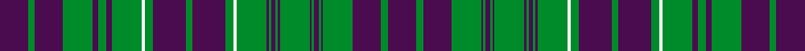

This is one **variant** — a specific cloth: this exact thread count and colourway, with its own
provenance below. It is one weaving of the [sett](/tartans/m/ma/macrae-12/) (the scale-free proportion — the
same cloth at any scale or shade), whose colour order is pattern [BGBGBGBGBGBGBGBGWGBGBGWGBGBGBGB](/stripes/bgbgbgbgbgbgbgbgwgbgbgwgbgbgbgb/).

Part of the [MacRae](/tartans/m/ma/macrae-12/) tartan — the named design grouping this sett with its other cloths.

Sourced from register-of-tartans.  It is a [31 stripe tartan](/stripes/stripes31/).

Original link [https://www.tartanregister.gov.uk/tartanDetails.aspx?ref=2740](https://www.tartanregister.gov.uk/tartanDetails.aspx?ref=2740)

2 attestations — the source records this cloth was collapsed from (oldest owns this page)

<ul>
<li>undated — MacRae (MacCrae) (register-of-tartans, <a href="https://www.tartanregister.gov.uk/tartanDetails.aspx?ref=2740">record</a>)  <em>Wilson's of Bannockburn made two patterns, 'Rae' and 'MacCrae'; Rae was Ross with green for red and all the other stripes in purple; in MacCrae the same treatment was applied to the red MacRae tartan except for the white overchecks which remained. (Scarlett-1990). Wilsons of Bannockburn a weaving firm founded c1770 near Stirling. The Pattern books are in the National Museum of Antiquities, Edinburgh. Copys of the Pattern books and letters in the Scottish Tartans Society archive</em></li>
<li>undated — MacRae, (MacCrae) (weddslist, <a href="http://www.weddslist.com/cgi-bin/tartans/pg.pl?source=sts">record</a>) </li>
</ul>

Dataset <small>— provenance for this record, inherited from the source manifest</small>

<dl class="dataset-prov">
<dt>source</dt><dd><a href="/sources/register-of-tartans/">Scottish Register of Tartans</a></dd>
<dt>data captured from</dt><dd><a href="https://github.com/thetartan/tartan-database/blob/master/data/register-of-tartans/data.csv">https://github.com/thetartan/tartan-database/blob/master/data/register-of-tartans/data.csv</a></dd>
<dt>data date</dt><dd>2017-01-06 <small>(dataset default)</small></dd>
<dt>licence</dt><dd><a href="https://www.tartanregister.gov.uk/copyright">Crown copyright</a></dd>
</dl>

Capture chain <small>— the hands this data passed through, oldest first; each capture carries its own licence</small>

<ol class="capture-chain">
<li><a href="https://www.tartanregister.gov.uk/">Scottish Register of Tartans</a> · <a href="https://www.tartanregister.gov.uk/copyright">Crown copyright</a> <small>the living register — still published by National Records of Scotland</small></li>
<li><a href="https://github.com/thetartan/tartan-database">thetartan/tartan-database</a> <small>2016-2017</small> · <a href="https://creativecommons.org/licenses/by-nc-nd/4.0/">CC BY-NC-ND 4.0</a> <small>Levko Kravets's frozen compilation — the capture we vendored, and where its CC licence text came from</small></li>
<li>this dictionary <small>captured 2026-06-10 · commit 5bf86c7566</small> <small>each re-capture is a git commit to data/sources</small></li>
</ol>

## Register references

External register numbers recorded for this tartan.

- Scottish Register of Tartans: [2740](https://www.tartanregister.gov.uk/tartanDetails.aspx?ref=2740)
- Scottish Tartans World Register: 101

## Thread count
DP/50 G12 DP50 G52 DP10 G14 DP10 G52 W6 G14 DP58 G12 DP58 G14 W6 G52 DP4 G4 DP8 G4 DP4 G52 DP4 G4 DP8 G4 DP4 G52 DP50 G12 DP/50

One full sett is **1368 threads**.

## Palette
<table><thead><tr><th>Colour</th><th>Shade</th><th>OKLCh</th></tr></thead><tbody><tr><td>G</td><td><code style="background-color:#008B2A;">#008B2A</code> <small style="color:#888">#008B2A</small></td><td><small style="color:#888">oklch(55.4% 0.170 145.9)</small></td></tr><tr><td>W</td><td><code style="background-color:#F7F7F7;">#F7F7F7</code> <small style="color:#888">#F7F7F7</small></td><td><small style="color:#888">oklch(97.6% 0.000 89.9)</small></td></tr><tr><td>DP</td><td><code style="background-color:#4B0B4F;">#4B0B4F</code> <small style="color:#888">#4B0B4F</small></td><td><small style="color:#888">oklch(30.1% 0.125 325.4)</small></td></tr></tbody></table>

# Sample pattern

[Sample sheet (PDF)](swatch.pdf) — the woven sample, thread count and palette on one printable A4, rendered on demand (the same sheet the TTD print page downloads).

## Nearest tartan variants

The nearest existing variants by ΔTartan distance, with this cloth at the top so the swatches line up against it.

ΔTartan

Threads

Variant

Sett

—

1368

<a href="/variants/s31/dp25g6dp25g26dp5g7dp5g26w3g7dp29g6dp29g7w3g26dp2g2dp4g2dp2g26dp2g2dp4g2dp2g26dp25g6dp25~x2/">MacRae (MacCrae)</a>

<a href="/ttd/edit/#slug=dp27g6dp27g28dp5g7dp5g28dp31g6dp31g28dp2g2dp4g2dp2g28dp2g2dp4g2dp2g28dp27g6dp27~x2&amp;base=dp25g6dp25g26dp5g7dp5g26w3g7dp29g6dp29g7w3g26dp2g2dp4g2dp2g26dp2g2dp4g2dp2g26dp25g6dp25~x2" title="compare in the TTD">2.55</a>

1368

<a href="/variants/s27/dp27g6dp27g28dp5g7dp5g28dp31g6dp31g28dp2g2dp4g2dp2g28dp2g2dp4g2dp2g28dp27g6dp27~x2/">MacRae/Rae</a>

<a href="/ttd/edit/#slug=dp14g3dp14g14dp3g3dp3g14dp16g3dp16g14dp1g1dp2g1dp1g14dp1g1dp2g1dp1g14dp14g3dp14~x2&amp;base=dp25g6dp25g26dp5g7dp5g26w3g7dp29g6dp29g7w3g26dp2g2dp4g2dp2g26dp2g2dp4g2dp2g26dp25g6dp25~x2" title="compare in the TTD">2.59</a>

696

<a href="/variants/s27/dp14g3dp14g14dp3g3dp3g14dp16g3dp16g14dp1g1dp2g1dp1g14dp1g1dp2g1dp1g14dp14g3dp14~x2/">MacRae (Rae)</a>

<a href="/ttd/edit/#slug=g4dr4g2dr2g2dr18db4g4dr2g2dr2g3dr4g2dr2g2dr2db4g4dr2g4~x2&amp;base=dp25g6dp25g26dp5g7dp5g26w3g7dp29g6dp29g7w3g26dp2g2dp4g2dp2g26dp2g2dp4g2dp2g26dp25g6dp25~x2" title="compare in the TTD">3.55</a>

284

<a href="/variants/s21/g4dr4g2dr2g2dr18db4g4dr2g2dr2g3dr4g2dr2g2dr2db4g4dr2g4~x2/">Matheson (WCWM)</a>

## Neighbour map

Every grey dot is one of 13662 variants placed by the first two principal components of the ΔTartan feature space (42% of its variance). Red is this tartan; blue dots are its nearest — click one to open its page. The map is a flat projection of a many-dimensional space — [how to read it](/posts/neighbourhood-maps/).

<svg viewBox="0 0 640 380" role="img" style="max-width:100%;height:auto;border:1px solid #e0e0e0;border-radius:4px;display:block" xmlns="http://www.w3.org/2000/svg"><image href="/nn/cloud.v1.png" width="640" height="380"/><a href="/variants/s27/dp27g6dp27g28dp5g7dp5g28dp31g6dp31g28dp2g2dp4g2dp2g28dp2g2dp4g2dp2g28dp27g6dp27~x2/"><circle cx="374.9" cy="180.3" r="4" fill="#3465a4"><title>MacRae/Rae</title></circle></a><a href="/variants/s27/dp14g3dp14g14dp3g3dp3g14dp16g3dp16g14dp1g1dp2g1dp1g14dp1g1dp2g1dp1g14dp14g3dp14~x2/"><circle cx="380.3" cy="178.5" r="4" fill="#3465a4"><title>MacRae (Rae)</title></circle></a><a href="/variants/s21/g4dr4g2dr2g2dr18db4g4dr2g2dr2g3dr4g2dr2g2dr2db4g4dr2g4~x2/"><circle cx="330.0" cy="197.1" r="4" fill="#3465a4"><title>Matheson (WCWM)</title></circle></a><circle cx="331.8" cy="161.3" r="5" fill="#c00000"/><text x="320" y="376" text-anchor="middle" font-size="11" fill="#999">ground</text><text x="11" y="190" text-anchor="middle" font-size="11" fill="#999" transform="rotate(-90 11 190)">complexity</text></svg>

ID: /variants/s31/dp25g6dp25g26dp5g7dp5g26w3g7dp29g6dp29g7w3g26dp2g2dp4g2dp2g26dp2g2dp4g2dp2g26dp25g6dp25~x2/
