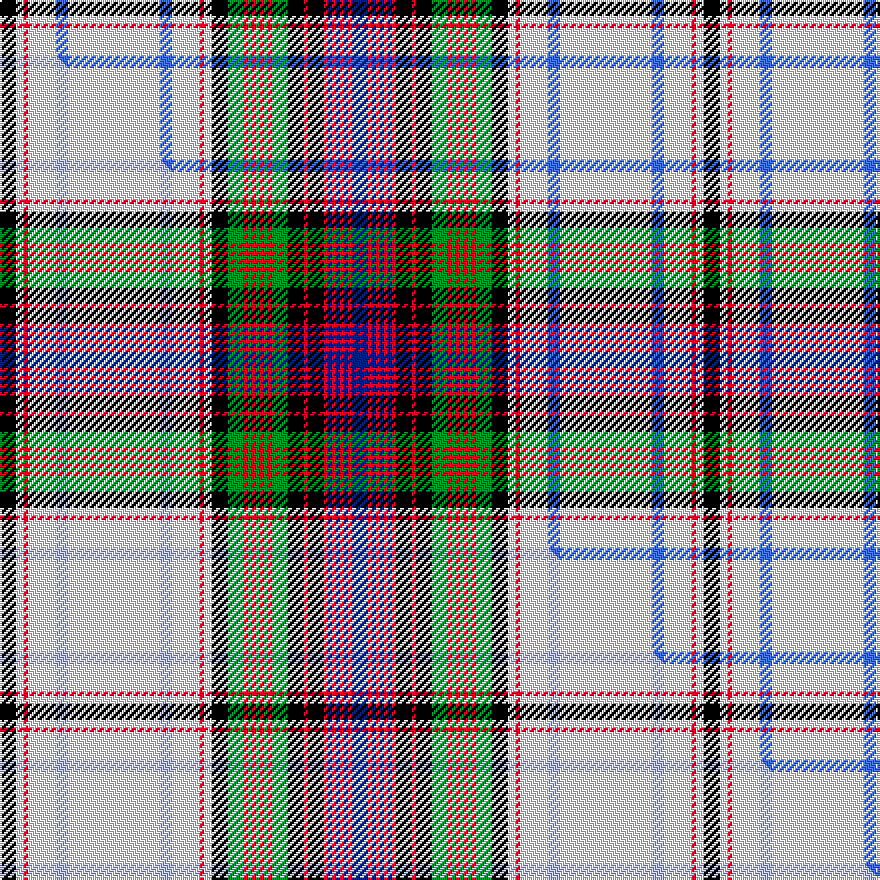

This is one **variant** — a specific cloth: this exact thread count and colourway, with its own
provenance below. It is one weaving of the [sett](/setts/k4w2r1w7b3w23b3w7r1w2k4g4r1g1r1g1r1g1r1g4k4r1k4r1db1r1db1r1db1r1db4/) (the scale-free proportion — the
same cloth at any scale or shade), whose colour order is pattern [BRBRBRBRKRKGRGRGRGRGKWRWBWBWRWK](/stripes/brbrbrbrkrkgrgrgrgrgkwrwbwbwrwk/).

Part of the [MacDonald Dress](/tartans/m/ma/macdonald-dress-4/) tartan — the named design grouping this sett with its other cloths.

Sourced from weddslist.  It is a [31 stripe tartan](/stripes/stripes31/).

Original link [http://www.weddslist.com/cgi-bin/tartans/pg.pl?source=sts](http://www.weddslist.com/cgi-bin/tartans/pg.pl?source=sts)

Dataset <small>— provenance for this record, inherited from the source manifest</small>

<dl class="dataset-prov">
<dt>source</dt><dd><a href="/sources/weddslist/">Weddslist</a></dd>
<dt>data captured from</dt><dd><a href="https://github.com/thetartan/tartan-database/blob/master/data/weddslist/data.csv">https://github.com/thetartan/tartan-database/blob/master/data/weddslist/data.csv</a></dd>
<dt>data date</dt><dd>2016-11-17 <small>(dataset default)</small></dd>
<dt>licence</dt><dd><a href="https://creativecommons.org/licenses/by-nc-nd/4.0/">CC BY-NC-ND 4.0</a></dd>
</dl>

Capture chain <small>— the hands this data passed through, oldest first; each capture carries its own licence</small>

<ol class="capture-chain">
<li><a href="https://www.weddslist.com/tartans/">Weddslist</a> <small>the living privately compiled reference</small></li>
<li><a href="https://github.com/thetartan/tartan-database">thetartan/tartan-database</a> <small>2016-2017</small> · <a href="https://creativecommons.org/licenses/by-nc-nd/4.0/">CC BY-NC-ND 4.0</a> <small>Levko Kravets's frozen compilation — the capture we vendored, and where its CC licence text came from</small></li>
<li>this dictionary <small>captured 2026-06-10 · commit 5bf86c7566</small> <small>each re-capture is a git commit to data/sources</small></li>
</ol>

## Thread count
K/8 W4 R2 W14 B6 W46 B6 W14 R2 W4 K8 G8 R2 G2 R2 G2 R2 G2 R2 G8 K8 R2 K8 R2 DB2 R2 DB2 R2 DB2 R2 DB/8

One full sett is **352 threads**.

## Palette
<table><thead><tr><th>Colour</th><th>Shade</th><th>OKLCh</th></tr></thead><tbody><tr><td>B</td><td><code style="background-color:#466CC8;">#466CC8</code> <small style="color:#888">#466CC8</small></td><td><small style="color:#888">oklch(55.1% 0.149 265.0)</small></td></tr><tr><td>DB</td><td><code style="background-color:#082077;">#082077</code> <small style="color:#888">#082077</small></td><td><small style="color:#888">oklch(30.0% 0.149 265.1)</small></td></tr><tr><td>G</td><td><code style="background-color:#008B2A;">#008B2A</code> <small style="color:#888">#008B2A</small></td><td><small style="color:#888">oklch(55.4% 0.170 145.9)</small></td></tr><tr><td>K</td><td><code style="background-color:#000000;">#000000</code> <small style="color:#888">#000000</small></td><td><small style="color:#888">oklch(0.0% 0.000 0.0)</small></td></tr><tr><td>W</td><td><code style="background-color:#F7F7F7;">#F7F7F7</code> <small style="color:#888">#F7F7F7</small></td><td><small style="color:#888">oklch(97.6% 0.000 89.9)</small></td></tr><tr><td>R</td><td><code style="background-color:#D60020;">#D60020</code> <small style="color:#888">#D60020</small></td><td><small style="color:#888">oklch(55.2% 0.224 25.5)</small></td></tr></tbody></table>

# Sample pattern

## Compared to the master

This cloth is one sett of its design; the master sett (the exemplar the design is anchored on) is below for comparison.

Its **ΔTartan distance** from the master is **0.04** — the same measure the nearest-tartans table ranks by (0 is identical; a re-scale of the same cloth is near 0, a recolour or a different proportion further).

<figure class="master-compare" style="margin:0">

this sett
master sett ★

<figcaption style="color:#888;font-size:smaller">One weave of this sett against the <a href="/setts/k4w2r1w7lb3w23lb3w7r1w2k4g4r1g1r1g1r1g1r1g4k4r1k4r1db1r1db1r1db1r1db4/">master sett ★</a>, split on the diagonal: a shared proportion runs seamlessly across it with only the shades shifting; a different proportion breaks on it.</figcaption>
</figure>

## Nearest tartan variants

The nearest existing variants by ΔTartan distance, with this cloth at the top so the swatches line up against it.

ΔTartan

Threads

Variant

Sett

—

352

<a href="/variants/s31/k4w2r1w7b3w23b3w7r1w2k4g4r1g1r1g1r1g1r1g4k4r1k4r1db1r1db1r1db1r1db4~x2/">MacDonald, dress</a>

<a href="/ttd/edit/#slug=k4w2r1w7lb3w23lb3w7r1w2k4g4r1g1r1g1r1g1r1g4k4r1k4r1db1r1db1r1db1r1db4~x2&amp;base=k4w2r1w7b3w23b3w7r1w2k4g4r1g1r1g1r1g1r1g4k4r1k4r1db1r1db1r1db1r1db4~x2" title="compare in the TTD">0.04</a>

352

<a href="/variants/s31/k4w2r1w7lb3w23lb3w7r1w2k4g4r1g1r1g1r1g1r1g4k4r1k4r1db1r1db1r1db1r1db4~x2/">MacDonald Dress Clan Tartan</a>

<a href="/ttd/edit/#slug=r4k3r15g42w5db3lo3db13k13w66r4w2r2w10r2w2r4w66k13db13lo3db3w5g42r15k3r4w2&amp;base=k4w2r1w7b3w23b3w7r1w2k4g4r1g1r1g1r1g1r1g4k4r1k4r1db1r1db1r1db1r1db4~x2" title="compare in the TTD">1.85</a>

718

<a href="/variants/s28/r4k3r15g42w5db3lo3db13k13w66r4w2r2w10r2w2r4w66k13db13lo3db3w5g42r15k3r4w2/">Stewart/Stuart Dress (Four red lines)</a>

<a href="/ttd/edit/#slug=lb24t3lb3k6lo1k1lb1k1g8dr4k1dr2lb1dr2k1dr4g8k1lb1k1lo1k6lb3t3lb24dr2~x4&amp;base=k4w2r1w7b3w23b3w7r1w2k4g4r1g1r1g1r1g1r1g4k4r1k4r1db1r1db1r1db1r1db4~x2" title="compare in the TTD">2.23</a>

800

<a href="/variants/s26/lb24t3lb3k6lo1k1lb1k1g8dr4k1dr2lb1dr2k1dr4g8k1lb1k1lo1k6lb3t3lb24dr2~x4/">Stewart Victoria</a>

<a href="/ttd/edit/#slug=dr4w25t4k6ly2k2w2k2g8dr4k2dr4w2~x2&amp;base=k4w2r1w7b3w23b3w7r1w2k4g4r1g1r1g1r1g1r1g4k4r1k4r1db1r1db1r1db1r1db4~x2" title="compare in the TTD">2.75</a>

256

<a href="/variants/s13/dr4w25t4k6ly2k2w2k2g8dr4k2dr4w2~x2/">Hay-Stewart</a>

<a href="/ttd/edit/#slug=r3g6k1r2k1g6db5r1k3y1k1y1k3w3k3w18k1r2k1w6r3&amp;base=k4w2r1w7b3w23b3w7r1w2k4g4r1g1r1g1r1g1r1g4k4r1k4r1db1r1db1r1db1r1db4~x2" title="compare in the TTD">2.82</a>

136

<a href="/variants/s21/r3g6k1r2k1g6db5r1k3y1k1y1k3w3k3w18k1r2k1w6r3/">Anderson P</a>

<a href="/ttd/edit/#slug=w2db2w53db2w2k15g15k2w3k2g15k15db14k2r3k2db14k15w2db2w53db2w2~x2&amp;base=k4w2r1w7b3w23b3w7r1w2k4g4r1g1r1g1r1g1r1g4k4r1k4r1db1r1db1r1db1r1db4~x2" title="compare in the TTD">2.91</a>

948

<a href="/variants/s23/w2db2w53db2w2k15g15k2w3k2g15k15db14k2r3k2db14k15w2db2w53db2w2~x2/">MacKenzie Dress #3</a>

<a href="/ttd/edit/#slug=k6w40lb5w2lb5w5g12w5r5dr5g2dr5r5w5g10w5r5dr5g2dr5r5w5g12w5lb5w2lb5w40r6~x2&amp;base=k4w2r1w7b3w23b3w7r1w2k4g4r1g1r1g1r1g1r1g4k4r1k4r1db1r1db1r1db1r1db4~x2" title="compare in the TTD">3.12</a>

872

<a href="/variants/s29/k6w40lb5w2lb5w5g12w5r5dr5g2dr5r5w5g10w5r5dr5g2dr5r5w5g12w5lb5w2lb5w40r6~x2/">MacBean, Meta (Personal)</a>

<a href="/ttd/edit/#slug=r16g2w24g2r6k6r6g2w66ly2k12ly2w12ly2k4ly4k4ly4k7r2k7r6g20r6g20r12&amp;base=k4w2r1w7b3w23b3w7r1w2k4g4r1g1r1g1r1g1r1g4k4r1k4r1db1r1db1r1db1r1db4~x2" title="compare in the TTD">3.13</a>

484

<a href="/variants/s26/r16g2w24g2r6k6r6g2w66ly2k12ly2w12ly2k4ly4k4ly4k7r2k7r6g20r6g20r12/">Anderson</a>

<a href="/ttd/edit/#slug=k1dp4w13dp1k5b4w1b4k5w1k3r5n3w1n3r5k13r1w20n3r1~x2&amp;base=k4w2r1w7b3w23b3w7r1w2k4g4r1g1r1g1r1g1r1g4k4r1k4r1db1r1db1r1db1r1db4~x2" title="compare in the TTD">3.25</a>

384

<a href="/variants/s21/k1dp4w13dp1k5b4w1b4k5w1k3r5n3w1n3r5k13r1w20n3r1~x2/">Aberdeen Dress (Dance)</a>

<a href="/ttd/edit/#slug=k4r1k1r2w24db2w3r8g2r2g2r2k8g2k2g2k2g8y2~x2&amp;base=k4w2r1w7b3w23b3w7r1w2k4g4r1g1r1g1r1g1r1g4k4r1k4r1db1r1db1r1db1r1db4~x2" title="compare in the TTD">3.32</a>

304

<a href="/variants/s19/k4r1k1r2w24db2w3r8g2r2g2r2k8g2k2g2k2g8y2~x2/">Princess Beatrice Dress Royal Family Tartan</a>

## Neighbour map

Every grey dot is one of 13621 variants placed by the first two principal components of the ΔTartan feature space (42% of its variance). Red is this tartan; blue dots are its nearest — click one to open its page.

<svg viewBox="0 0 640 380" role="img" style="max-width:100%;height:auto;border:1px solid #e0e0e0;border-radius:4px;display:block" xmlns="http://www.w3.org/2000/svg"><image href="/nn/cloud.v1.png" width="640" height="380"/><a href="/variants/s31/k4w2r1w7lb3w23lb3w7r1w2k4g4r1g1r1g1r1g1r1g4k4r1k4r1db1r1db1r1db1r1db4~x2/"><circle cx="127.6" cy="26.9" r="4" fill="#3465a4"><title>MacDonald Dress Clan Tartan</title></circle></a><a href="/variants/s28/r4k3r15g42w5db3lo3db13k13w66r4w2r2w10r2w2r4w66k13db13lo3db3w5g42r15k3r4w2/"><circle cx="149.7" cy="21.0" r="4" fill="#3465a4"><title>Stewart/Stuart Dress (Four red lines)</title></circle></a><a href="/variants/s26/lb24t3lb3k6lo1k1lb1k1g8dr4k1dr2lb1dr2k1dr4g8k1lb1k1lo1k6lb3t3lb24dr2~x4/"><circle cx="185.2" cy="37.4" r="4" fill="#3465a4"><title>Stewart Victoria</title></circle></a><a href="/variants/s13/dr4w25t4k6ly2k2w2k2g8dr4k2dr4w2~x2/"><circle cx="107.6" cy="75.1" r="4" fill="#3465a4"><title>Hay-Stewart</title></circle></a><a href="/variants/s21/r3g6k1r2k1g6db5r1k3y1k1y1k3w3k3w18k1r2k1w6r3/"><circle cx="88.5" cy="68.0" r="4" fill="#3465a4"><title>Anderson P</title></circle></a><a href="/variants/s23/w2db2w53db2w2k15g15k2w3k2g15k15db14k2r3k2db14k15w2db2w53db2w2~x2/"><circle cx="185.0" cy="46.3" r="4" fill="#3465a4"><title>MacKenzie Dress #3</title></circle></a><a href="/variants/s29/k6w40lb5w2lb5w5g12w5r5dr5g2dr5r5w5g10w5r5dr5g2dr5r5w5g12w5lb5w2lb5w40r6~x2/"><circle cx="174.1" cy="52.8" r="4" fill="#3465a4"><title>MacBean, Meta (Personal)</title></circle></a><a href="/variants/s26/r16g2w24g2r6k6r6g2w66ly2k12ly2w12ly2k4ly4k4ly4k7r2k7r6g20r6g20r12/"><circle cx="144.7" cy="38.4" r="4" fill="#3465a4"><title>Anderson</title></circle></a><a href="/variants/s21/k1dp4w13dp1k5b4w1b4k5w1k3r5n3w1n3r5k13r1w20n3r1~x2/"><circle cx="90.6" cy="66.6" r="4" fill="#3465a4"><title>Aberdeen Dress (Dance)</title></circle></a><a href="/variants/s19/k4r1k1r2w24db2w3r8g2r2g2r2k8g2k2g2k2g8y2~x2/"><circle cx="96.4" cy="52.4" r="4" fill="#3465a4"><title>Princess Beatrice Dress Royal Family Tartan</title></circle></a><circle cx="127.4" cy="26.9" r="5" fill="#c00000"/><text x="320" y="376" text-anchor="middle" font-size="11" fill="#999">ground</text><text x="11" y="190" text-anchor="middle" font-size="11" fill="#999" transform="rotate(-90 11 190)">complexity</text></svg>

ID: /variants/s31/k4w2r1w7b3w23b3w7r1w2k4g4r1g1r1g1r1g1r1g4k4r1k4r1db1r1db1r1db1r1db4~x2/
