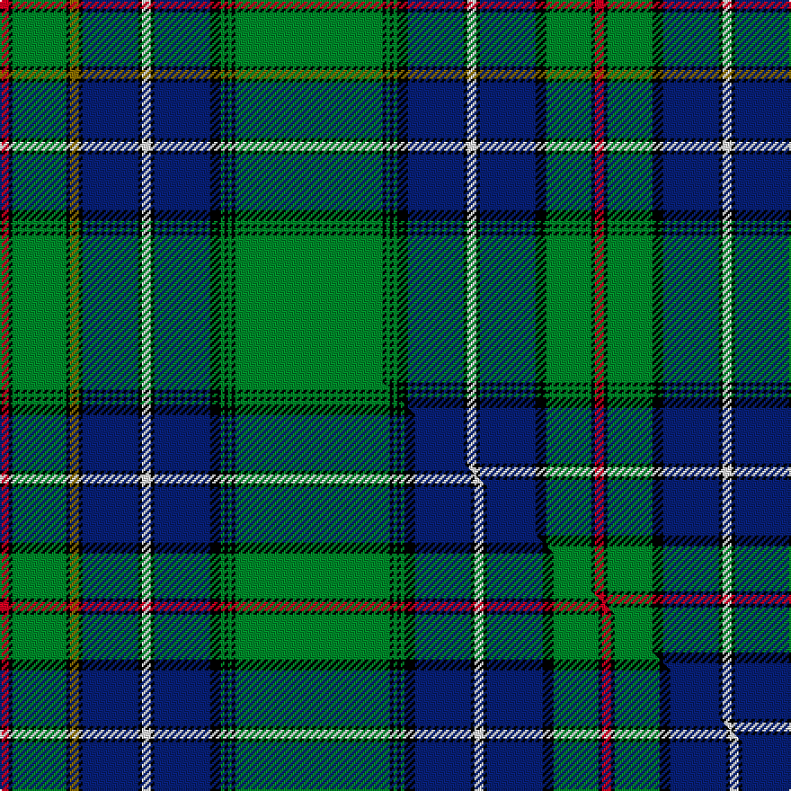

This is one **variant** — a specific cloth: this exact thread count and colourway, with its own
provenance below. It is one weaving of the [sett](/tartans/c/co/cockburn-2/) (the scale-free proportion — the
same cloth at any scale or shade), whose colour order is pattern [RKGKBKWKBKGKGKGKGKGKBKWKBKGKGKR](/stripes/rkgkbkwkbkgkgkgkgkgkbkwkbkgkgkr/).

Part of the [Cockburn](/tartans/c/co/cockburn-2/) tartan — the named design grouping this sett with its other cloths.

Sourced from register-of-tartans.  It is a [31 stripe tartan](/stripes/stripes31/).

Original link [https://www.tartanregister.gov.uk/tartanDetails.aspx?ref=701](https://www.tartanregister.gov.uk/tartanDetails.aspx?ref=701)

Dataset <small>— provenance for this record, inherited from the source manifest</small>

<dl class="dataset-prov">
<dt>source</dt><dd><a href="/sources/register-of-tartans/">Scottish Register of Tartans</a></dd>
<dt>data captured from</dt><dd><a href="https://github.com/thetartan/tartan-database/blob/master/data/register-of-tartans/data.csv">https://github.com/thetartan/tartan-database/blob/master/data/register-of-tartans/data.csv</a></dd>
<dt>data date</dt><dd>2017-01-06 <small>(dataset default)</small></dd>
<dt>licence</dt><dd><a href="https://www.tartanregister.gov.uk/copyright">Crown copyright</a></dd>
</dl>

Capture chain <small>— the hands this data passed through, oldest first; each capture carries its own licence</small>

<ol class="capture-chain">
<li><a href="https://www.tartanregister.gov.uk/">Scottish Register of Tartans</a> · <a href="https://www.tartanregister.gov.uk/copyright">Crown copyright</a> <small>the living register — still published by National Records of Scotland</small></li>
<li><a href="https://github.com/thetartan/tartan-database">thetartan/tartan-database</a> <small>2016-2017</small> · <a href="https://creativecommons.org/licenses/by-nc-nd/4.0/">CC BY-NC-ND 4.0</a> <small>Levko Kravets's frozen compilation — the capture we vendored, and where its CC licence text came from</small></li>
<li>this dictionary <small>captured 2026-06-10 · commit 5bf86c7566</small> <small>each re-capture is a git commit to data/sources</small></li>
</ol>

## Register references

External register numbers recorded for this tartan.

- Scottish Register of Tartans: [701](https://www.tartanregister.gov.uk/tartanDetails.aspx?ref=701)
- Scottish Tartans World Register: 1573

## Thread count
R/5 K2 G30 K2 Y5 K2 DB31 K2 W5 K2 DB31 K6 G2 K2 G2 K2 G82 K2 G2 K2 G2 K6 DB31 K2 W5 K2 DB31 K6 G25 K2 R/5

One full sett is **662 threads**.

## Palette
<table><thead><tr><th>Colour</th><th>Shade</th><th>OKLCh</th></tr></thead><tbody><tr><td>DB</td><td><code style="background-color:#082077;">#082077</code> <small style="color:#888">#082077</small></td><td><small style="color:#888">oklch(30.0% 0.149 265.1)</small></td></tr><tr><td>G</td><td><code style="background-color:#008B2A;">#008B2A</code> <small style="color:#888">#008B2A</small></td><td><small style="color:#888">oklch(55.4% 0.170 145.9)</small></td></tr><tr><td>K</td><td><code style="background-color:#000000;">#000000</code> <small style="color:#888">#000000</small></td><td><small style="color:#888">oklch(0.0% 0.000 0.0)</small></td></tr><tr><td>W</td><td><code style="background-color:#F7F7F7;">#F7F7F7</code> <small style="color:#888">#F7F7F7</small></td><td><small style="color:#888">oklch(97.6% 0.000 89.9)</small></td></tr><tr><td>R</td><td><code style="background-color:#D60020;">#D60020</code> <small style="color:#888">#D60020</small></td><td><small style="color:#888">oklch(55.2% 0.224 25.5)</small></td></tr><tr><td>Y</td><td><code style="background-color:#8B6E00;">#8B6E00</code> <small style="color:#888">#8B6E00</small></td><td><small style="color:#888">oklch(55.1% 0.113 90.4)</small></td></tr></tbody></table>

# Sample pattern

## Compared to the master

This cloth is one sett of its design; the master sett (the exemplar the design is anchored on) is below for comparison.

Its **ΔTartan distance** from the master is **0.03** — the same measure the nearest-tartans table ranks by (0 is identical; a re-scale of the same cloth is near 0, a recolour or a different proportion further).

<figure class="master-compare" style="margin:0">

this sett
master sett ★

<figcaption style="color:#888;font-size:smaller">One weave of this sett against the <a href="/setts/r5k2g30k2y5k2db31k2w5k2db31k6g2k2g2k2g86k2g2k2g2k6db31k2w5k2db31k6g25k2r5/">master sett ★</a>, split on the diagonal: a shared proportion runs seamlessly across it with only the shades shifting; a different proportion breaks on it.</figcaption>
</figure>

## Nearest tartan variants

The nearest existing variants by ΔTartan distance, with this cloth at the top so the swatches line up against it.

ΔTartan

Threads

Variant

Sett

—

662

<a href="/variants/s31/r5k2g30k2y5k2db31k2w5k2db31k6g2k2g2k2g82k2g2k2g2k6db31k2w5k2db31k6g25k2r5/">Cockburn #3</a>

<a href="/ttd/edit/#slug=r5k2g30k2y5k2db31k2w5k2db31k6g2k2g2k2g86k2g2k2g2k6db31k2w5k2db31k6g25k2r5~x2&amp;base=r5k2g30k2y5k2db31k2w5k2db31k6g2k2g2k2g82k2g2k2g2k6db31k2w5k2db31k6g25k2r5" title="compare in the TTD">0.03</a>

1340

<a href="/variants/s31/r5k2g30k2y5k2db31k2w5k2db31k6g2k2g2k2g86k2g2k2g2k6db31k2w5k2db31k6g25k2r5~x2/">Cockburn</a>

<a href="/ttd/edit/#slug=r5k2g30k2y5k2db31k2w5k2db31k6g2k2g2k2g86k2g2k2g2k6db31k2w5k2db31k6g25k2r5&amp;base=r5k2g30k2y5k2db31k2w5k2db31k6g2k2g2k2g82k2g2k2g2k6db31k2w5k2db31k6g25k2r5" title="compare in the TTD">0.03</a>

670

<a href="/variants/s31/r5k2g30k2y5k2db31k2w5k2db31k6g2k2g2k2g86k2g2k2g2k6db31k2w5k2db31k6g25k2r5/">Cockburn #4</a>

<a href="/ttd/edit/#slug=g82k2g2k2g2k8db28k2w6k2db28k2y6k2g32k2r5k2g15w6&amp;base=r5k2g30k2y5k2db31k2w5k2db31k6g2k2g2k2g82k2g2k2g2k6db31k2w5k2db31k6g25k2r5" title="compare in the TTD">1.52</a>

384

<a href="/variants/s20/g82k2g2k2g2k8db28k2w6k2db28k2y6k2g32k2r5k2g15w6/">Ayre Personal Tartan</a>

<a href="/ttd/edit/#slug=r6k1g34k2y4k5db5k1w5k1db34k5g2k2g2k2g86k2g2k2g2k5db34k1w5~x2&amp;base=r5k2g30k2y5k2db31k2w5k2db31k6g2k2g2k2g82k2g2k2g2k6db31k2w5k2db31k6g25k2r5" title="compare in the TTD">2.35</a>

978

<a href="/variants/s25/r6k1g34k2y4k5db5k1w5k1db34k5g2k2g2k2g86k2g2k2g2k5db34k1w5~x2/">Cockburn, Old pattern</a>

<a href="/ttd/edit/#slug=r6k1g34k2ly4k5db5k1w5k1db34k5g2k2g2k2g86k2g2k2g2k5db34k1w5&amp;base=r5k2g30k2y5k2db31k2w5k2db31k6g2k2g2k2g82k2g2k2g2k6db31k2w5k2db31k6g25k2r5" title="compare in the TTD">2.38</a>

489

<a href="/variants/s25/r6k1g34k2ly4k5db5k1w5k1db34k5g2k2g2k2g86k2g2k2g2k5db34k1w5/">Cockburn (Old Pattern)</a>

<a href="/ttd/edit/#slug=r8k31g8k8g56k3y3r3k3r3k12db36k3y8k3g44k2db6k2g44k3w8k3db36k12r3k3r3y3k3g56k8g8k31r8~x2&amp;base=r5k2g30k2y5k2db31k2w5k2db31k6g2k2g2k2g82k2g2k2g2k6db31k2w5k2db31k6g25k2r5" title="compare in the TTD">2.81</a>

1864

<a href="/variants/s35/r8k31g8k8g56k3y3r3k3r3k12db36k3y8k3g44k2db6k2g44k3w8k3db36k12r3k3r3y3k3g56k8g8k31r8~x2/">Unidentified Plaid 14</a>

<a href="/ttd/edit/#slug=r8w2db34k1db5k2db4k3db3k4db2k5db1k36g1k5g2k4g3k3g4k2g5k1g34k4ri8~r5221030-ri6914021&amp;base=r5k2g30k2y5k2db31k2w5k2db31k6g2k2g2k2g82k2g2k2g2k6db31k2w5k2db31k6g25k2r5" title="compare in the TTD">2.90</a>

356

<a href="/variants/s27/r8w2db34k1db5k2db4k3db3k4db2k5db1k36g1k5g2k4g3k3g4k2g5k1g34k4ri8~r5221030-ri6914021/">St. Andrews Soc. of New York (Corp)</a>

<a href="/ttd/edit/#slug=g64k4db9dy2db4dy2db4g11r8db2r4w3~x2~w98&amp;base=r5k2g30k2y5k2db31k2w5k2db31k6g2k2g2k2g82k2g2k2g2k6db31k2w5k2db31k6g25k2r5" title="compare in the TTD">3.15</a>

334

<a href="/variants/s12/g64k4db9dy2db4dy2db4g11r8db2r4w3~x2~w98/">Sillars</a>

<a href="/ttd/edit/#slug=r3k2g9db12w3db12g2k2g2k2g36k2g2k2g2db12w3db12k3y3k2g12k2r3k2g6w3~x2&amp;base=r5k2g30k2y5k2db31k2w5k2db31k6g2k2g2k2g82k2g2k2g2k6db31k2w5k2db31k6g25k2r5" title="compare in the TTD">3.19</a>

612

<a href="/variants/s27/r3k2g9db12w3db12g2k2g2k2g36k2g2k2g2db12w3db12k3y3k2g12k2r3k2g6w3~x2/">Cockburn #2</a>

<a href="/ttd/edit/#slug=g10y3g3y1k2r2k2y1g3y3g10db21k2db2k2db21k15g15r2g15k15db2k2db2k2db31k2db2k2db2~x2&amp;base=r5k2g30k2y5k2db31k2w5k2db31k6g2k2g2k2g82k2g2k2g2k6db31k2w5k2db31k6g25k2r5" title="compare in the TTD">3.23</a>

764

<a href="/variants/s30/g10y3g3y1k2r2k2y1g3y3g10db21k2db2k2db21k15g15r2g15k15db2k2db2k2db31k2db2k2db2~x2/">Dundee Discovery</a>

## Neighbour map

Every grey dot is one of 13662 variants placed by the first two principal components of the ΔTartan feature space (42% of its variance). Red is this tartan; blue dots are its nearest — click one to open its page. The map is a flat projection of a many-dimensional space — [how to read it](/posts/neighbourhood-maps/).

<svg viewBox="0 0 640 380" role="img" style="max-width:100%;height:auto;border:1px solid #e0e0e0;border-radius:4px;display:block" xmlns="http://www.w3.org/2000/svg"><image href="/nn/cloud.v1.png" width="640" height="380"/><a href="/variants/s31/r5k2g30k2y5k2db31k2w5k2db31k6g2k2g2k2g86k2g2k2g2k6db31k2w5k2db31k6g25k2r5~x2/"><circle cx="204.5" cy="14.0" r="4" fill="#3465a4"><title>Cockburn</title></circle></a><a href="/variants/s31/r5k2g30k2y5k2db31k2w5k2db31k6g2k2g2k2g86k2g2k2g2k6db31k2w5k2db31k6g25k2r5/"><circle cx="193.6" cy="14.0" r="4" fill="#3465a4"><title>Cockburn #4</title></circle></a><a href="/variants/s20/g82k2g2k2g2k8db28k2w6k2db28k2y6k2g32k2r5k2g15w6/"><circle cx="200.5" cy="14.0" r="4" fill="#3465a4"><title>Ayre Personal Tartan</title></circle></a><a href="/variants/s25/r6k1g34k2y4k5db5k1w5k1db34k5g2k2g2k2g86k2g2k2g2k5db34k1w5~x2/"><circle cx="251.6" cy="14.0" r="4" fill="#3465a4"><title>Cockburn, Old pattern</title></circle></a><a href="/variants/s25/r6k1g34k2ly4k5db5k1w5k1db34k5g2k2g2k2g86k2g2k2g2k5db34k1w5/"><circle cx="249.7" cy="14.0" r="4" fill="#3465a4"><title>Cockburn (Old Pattern)</title></circle></a><a href="/variants/s35/r8k31g8k8g56k3y3r3k3r3k12db36k3y8k3g44k2db6k2g44k3w8k3db36k12r3k3r3y3k3g56k8g8k31r8~x2/"><circle cx="157.1" cy="33.3" r="4" fill="#3465a4"><title>Unidentified Plaid 14</title></circle></a><a href="/variants/s27/r8w2db34k1db5k2db4k3db3k4db2k5db1k36g1k5g2k4g3k3g4k2g5k1g34k4ri8~r5221030-ri6914021/"><circle cx="151.6" cy="20.2" r="4" fill="#3465a4"><title>St. Andrews Soc. of New York (Corp)</title></circle></a><a href="/variants/s12/g64k4db9dy2db4dy2db4g11r8db2r4w3~x2~w98/"><circle cx="244.7" cy="31.6" r="4" fill="#3465a4"><title>Sillars</title></circle></a><a href="/variants/s27/r3k2g9db12w3db12g2k2g2k2g36k2g2k2g2db12w3db12k3y3k2g12k2r3k2g6w3~x2/"><circle cx="157.8" cy="61.3" r="4" fill="#3465a4"><title>Cockburn #2</title></circle></a><a href="/variants/s30/g10y3g3y1k2r2k2y1g3y3g10db21k2db2k2db21k15g15r2g15k15db2k2db2k2db31k2db2k2db2~x2/"><circle cx="185.5" cy="55.9" r="4" fill="#3465a4"><title>Dundee Discovery</title></circle></a><circle cx="199.0" cy="14.0" r="5" fill="#c00000"/><text x="320" y="376" text-anchor="middle" font-size="11" fill="#999">ground</text><text x="11" y="190" text-anchor="middle" font-size="11" fill="#999" transform="rotate(-90 11 190)">complexity</text></svg>

ID: /variants/s31/r5k2g30k2y5k2db31k2w5k2db31k6g2k2g2k2g82k2g2k2g2k6db31k2w5k2db31k6g25k2r5/
