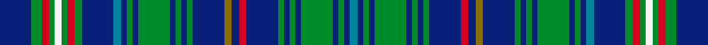

This is one **variant** — a specific cloth: this exact thread count and colourway, with its own
provenance below. It is one weaving of the [sett](/tartans/f/fr/franconian-2/) (the scale-free proportion — the
same cloth at any scale or shade), whose colour order is pattern [BBGBGBGBGBRBGBGBGBGBGBBBGRGWGRGB](/stripes/bbgbgbgbgbrbgbgbgbgbgbbbgrgwgrgb/).

Part of the [Franconian](/tartans/f/fr/franconian-2/) tartan — the named design grouping this sett with its other cloths.

Sourced from register-of-tartans.  It is a [32 stripe tartan](/stripes/stripes32/).

Original link [https://www.tartanregister.gov.uk/tartanDetails.aspx?ref=1244](https://www.tartanregister.gov.uk/tartanDetails.aspx?ref=1244)

## Provenance

Earliest known date: Aug 1997 August 1997. Designed by (or for?) the Highland Circle - a group of Malt Whisky drinkers in Franconia, Germany. Sample in STA's Johnston Collection + Lochcarron swatch. STS notes say designed by members of the Highland Circle and produced by Hugh MacPherson of Edinburgh. Blue & green lightened to show sett.

3 attestations — the source records this cloth was collapsed from (oldest owns this page)

<ul>
<li>01/08/1997 — Franconian (register-of-tartans, <a href="https://www.tartanregister.gov.uk/tartanDetails.aspx?ref=1244">record</a>)  <em>August 1997. Designed by (or for?) the Highland Circle - a group of Malt Whisky drinkers in Franconia, Germany. Sample in Scottish Tartans Authority's Johnston Collection and Lochcarron swatch. Scottish Tartans Society notes say designed by members of the Highland Circle and produced by Hugh MacPherson of Edinburgh. Blue & green lightened to show sett.</em></li>
<li>Aug 1997 — Franconian (Corporate) (tartans-authority, <a href="https://web.archive.org/web/*/http://www.tartansauthority.com/tartan-ferret/display/2305/*">record</a>)  <em>Asymmetric. August 1997. Designed by (or for?) the Highland Circle - a group of Malt Whisky drinkers in Franconia, Germany. Sample in STA's Johnston Collection + Lochcarron swatch. STS notes say designed by members of the Highland Circle and produced by Hugh MacPherson of Edinburgh. Blue & green lightened to show sett.</em></li>
<li>Aug 1997 — Franconian District Ger Tartan (house-of-tartan, <a href="http://www.house-of-tartan.scotland.net/house/TartanViewjs.asp?colr=Def&tnam=2305">record</a>) </li>
</ul>

Dataset <small>— provenance for this record, inherited from the source manifest</small>

<dl class="dataset-prov">
<dt>source</dt><dd><a href="/sources/register-of-tartans/">Scottish Register of Tartans</a></dd>
<dt>data captured from</dt><dd><a href="https://github.com/thetartan/tartan-database/blob/master/data/register-of-tartans/data.csv">https://github.com/thetartan/tartan-database/blob/master/data/register-of-tartans/data.csv</a></dd>
<dt>data date</dt><dd>01/08/1997 <small>(this record)</small></dd>
<dt>licence</dt><dd><a href="https://www.tartanregister.gov.uk/copyright">Crown copyright</a></dd>
</dl>

Capture chain <small>— the hands this data passed through, oldest first; each capture carries its own licence</small>

<ol class="capture-chain">
<li><a href="https://www.tartanregister.gov.uk/">Scottish Register of Tartans</a> · <a href="https://www.tartanregister.gov.uk/copyright">Crown copyright</a> <small>the living register — still published by National Records of Scotland</small></li>
<li><a href="https://github.com/thetartan/tartan-database">thetartan/tartan-database</a> <small>2016-2017</small> · <a href="https://creativecommons.org/licenses/by-nc-nd/4.0/">CC BY-NC-ND 4.0</a> <small>Levko Kravets's frozen compilation — the capture we vendored, and where its CC licence text came from</small></li>
<li>this dictionary <small>captured 2026-06-10 · commit 5bf86c7566</small> <small>each re-capture is a git commit to data/sources</small></li>
</ol>

## Register references

External register numbers recorded for this tartan.

- Scottish Register of Tartans: [1244](https://www.tartanregister.gov.uk/tartanDetails.aspx?ref=1244)
- Scottish Tartans Authority (ITI): 2305
- Scottish Tartans World Register: 2305

## Thread count
DB/44 G14 R10 G8 W10 G8 R10 G10 DB44 T10 DB8 G8 DB8 G44 DB8 G8 DB8 G8 DB44 Y10 DB10 R10 DB44 G8 DB8 G8 DB8 G44 DB8 G8 DB8 T/10

One full sett is **938 threads**.

## Palette
<table><thead><tr><th>Colour</th><th>Shade</th><th>OKLCh</th></tr></thead><tbody><tr><td>T</td><td><code style="background-color:#00879F;">#00879F</code> <small style="color:#888">#00879F</small></td><td><small style="color:#888">oklch(57.4% 0.102 216.1)</small></td></tr><tr><td>DB</td><td><code style="background-color:#082077;">#082077</code> <small style="color:#888">#082077</small></td><td><small style="color:#888">oklch(30.0% 0.149 265.1)</small></td></tr><tr><td>G</td><td><code style="background-color:#008B2A;">#008B2A</code> <small style="color:#888">#008B2A</small></td><td><small style="color:#888">oklch(55.4% 0.170 145.9)</small></td></tr><tr><td>R</td><td><code style="background-color:#D60020;">#D60020</code> <small style="color:#888">#D60020</small></td><td><small style="color:#888">oklch(55.2% 0.224 25.5)</small></td></tr><tr><td>W</td><td><code style="background-color:#F7F7F7;">#F7F7F7</code> <small style="color:#888">#F7F7F7</small></td><td><small style="color:#888">oklch(97.6% 0.000 89.9)</small></td></tr><tr><td>Y</td><td><code style="background-color:#8B6E00;">#8B6E00</code> <small style="color:#888">#8B6E00</small></td><td><small style="color:#888">oklch(55.1% 0.113 90.4)</small></td></tr></tbody></table>

# Sample pattern

[Sample sheet (PDF)](swatch.pdf) — the woven sample, thread count and palette on one printable A4, rendered on demand (the same sheet the TTD print page downloads).

## Nearest tartan variants

The nearest existing variants by ΔTartan distance, with this cloth at the top so the swatches line up against it.

ΔTartan

Threads

Variant

Sett

—

938

<a href="/variants/s32/db22g7r5g4w5g4r5g5db22t5db4g4db4g22db4g4db4g4db22y5db5r5db22g4db4g4db4g22db4g4db4t5~x2/">Franconian</a>

<a href="/ttd/edit/#slug=g4r2g14w2db14r2db14g14db2g5db2g14db14r2db14w2g14r2g4lo3~x2~db3514276&amp;base=db22g7r5g4w5g4r5g5db22t5db4g4db4g22db4g4db4g4db22y5db5r5db22g4db4g4db4g22db4g4db4t5~x2" title="compare in the TTD">3.40</a>

562

<a href="/variants/s20/g4r2g14w2db14r2db14g14db2g5db2g14db14r2db14w2g14r2g4lo3~x2~db3514276/">Hunter of Hunterston</a>

<a href="/ttd/edit/#slug=dg3r3dg3db3g13db5g3db5k9dg3db3dg3g6db3k3db16y3db3dg3db3r3db16k3db3g6dg3db3dg3k9db5g3db5g13db3~x2&amp;base=db22g7r5g4w5g4r5g5db22t5db4g4db4g22db4g4db4g4db22y5db5r5db22g4db4g4db4g22db4g4db4t5~x2" title="compare in the TTD">3.88</a>

684

<a href="/variants/s34/dg3r3dg3db3g13db5g3db5k9dg3db3dg3g6db3k3db16y3db3dg3db3r3db16k3db3g6dg3db3dg3k9db5g3db5g13db3~x2/">Shipley, Ian (Personal)</a>

<a href="/ttd/edit/#slug=dr5db3dr3r2db2y2db2y1db14g2db7g4db4g7db2g9y1n2g5~x2~db3514276-r5221030&amp;base=db22g7r5g4w5g4r5g5db22t5db4g4db4g22db4g4db4g4db22y5db5r5db22g4db4g4db4g22db4g4db4t5~x2" title="compare in the TTD">3.94</a>

288

<a href="/variants/s19/dr5db3dr3r2db2y2db2y1db14g2db7g4db4g7db2g9y1n2g5~x2~db3514276-r5221030/">Hart of Scotland</a>

<a href="/ttd/edit/#slug=t4db6g1w1r1db6t4db2ly1db1ly1db1ly1db2ly3db3~x4&amp;base=db22g7r5g4w5g4r5g5db22t5db4g4db4g22db4g4db4g4db22y5db5r5db22g4db4g4db4g22db4g4db4t5~x2" title="compare in the TTD">3.94</a>

276

<a href="/variants/s16/t4db6g1w1r1db6t4db2ly1db1ly1db1ly1db2ly3db3~x4/">De Baseggio (Personal)</a>

## Neighbour map

Every grey dot is one of 13662 variants placed by the first two principal components of the ΔTartan feature space (42% of its variance). Red is this tartan; blue dots are its nearest — click one to open its page. The map is a flat projection of a many-dimensional space — [how to read it](/posts/neighbourhood-maps/).

<svg viewBox="0 0 640 380" role="img" style="max-width:100%;height:auto;border:1px solid #e0e0e0;border-radius:4px;display:block" xmlns="http://www.w3.org/2000/svg"><image href="/nn/cloud.v1.png" width="640" height="380"/><a href="/variants/s20/g4r2g14w2db14r2db14g14db2g5db2g14db14r2db14w2g14r2g4lo3~x2~db3514276/"><circle cx="223.0" cy="179.9" r="4" fill="#3465a4"><title>Hunter of Hunterston</title></circle></a><a href="/variants/s34/dg3r3dg3db3g13db5g3db5k9dg3db3dg3g6db3k3db16y3db3dg3db3r3db16k3db3g6dg3db3dg3k9db5g3db5g13db3~x2/"><circle cx="103.7" cy="143.2" r="4" fill="#3465a4"><title>Shipley, Ian (Personal)</title></circle></a><a href="/variants/s19/dr5db3dr3r2db2y2db2y1db14g2db7g4db4g7db2g9y1n2g5~x2~db3514276-r5221030/"><circle cx="227.1" cy="124.9" r="4" fill="#3465a4"><title>Hart of Scotland</title></circle></a><a href="/variants/s16/t4db6g1w1r1db6t4db2ly1db1ly1db1ly1db2ly3db3~x4/"><circle cx="198.5" cy="177.1" r="4" fill="#3465a4"><title>De Baseggio (Personal)</title></circle></a><circle cx="192.1" cy="145.8" r="5" fill="#c00000"/><text x="320" y="376" text-anchor="middle" font-size="11" fill="#999">ground</text><text x="11" y="190" text-anchor="middle" font-size="11" fill="#999" transform="rotate(-90 11 190)">complexity</text></svg>

ID: /variants/s32/db22g7r5g4w5g4r5g5db22t5db4g4db4g22db4g4db4g4db22y5db5r5db22g4db4g4db4g22db4g4db4t5~x2/
