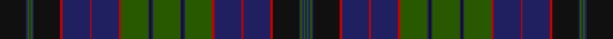

This page is one **sett** — a single exact thread-count. It belongs to the [tartan](/setts/dg34db2k2db2dg34r3db34r2db34r3k33db2dg2db2dg2db2k33/)
(the same proportion at any scale), whose colour order is pattern [BGBGBKRBRBRGBKBGBKBGRBRBRKBGBGBK](/stripes/bgbgbkrbrbrgbkbgbkbgrbrbrkbgbgbk/).

Sourced from house-of-tartan.  It is a [32 stripe tartan](/stripes/stripes32/).

Original link http://www.house-of-tartan.scotland.net/house/TartanViewjs.asp?colr=Def&tnam=2366

## Provenance

Earliest known date: 1997 Designed by Peter MacDonald at the request of David Lumsden of Cushnie to provide a hunting tartan for the clan. Can be worn by all in the Lumsden clan ( House of Lumsden). Medium green used here to show graphic instead of required dark green.

## Also known as

This cloth is also recorded under:

- Lumsden Green

## Thread count
K/66 DB4 G4 DB4 G4 DB4 K66 R6 DB68 R4 DB68 R6 G68 DB4 K4 DB4 G68 DB4 K4 DB4 G68 R6 DB68 R4 DB68 R6 K66 DB4 G4 DB4 G4 DB/4

One full sett is **1470 threads**.

## Palette

Palette: <strong>Tartan Register</strong>
<table><thead><tr><th>Colour</th><th>Threads</th><th>Shade</th><th>Base</th><th>OKLCh</th></tr></thead><tbody><tr><td>K/</td><td style="text-align:right;font-variant-numeric:tabular-nums">66</td><td><code style="background-color:#101010;">#101010</code> <small style="color:#888">#101010</small></td><td>K <code style="background-color:#000000;">#000000</code></td><td><small style="color:#888">oklch(17.3% 0.000 89.9)</small></td></tr><tr><td>DB</td><td style="text-align:right;font-variant-numeric:tabular-nums">4</td><td><code style="background-color:#202060;">#202060</code> <small style="color:#888">#202060</small></td><td>B <code style="background-color:#2A418A;">#2A418A</code></td><td><small style="color:#888">oklch(28.9% 0.111 276.9)</small></td></tr><tr><td>G</td><td style="text-align:right;font-variant-numeric:tabular-nums">4</td><td><code style="background-color:#285800;">#285800</code> <small style="color:#888">#285800</small></td><td>G <code style="background-color:#006100;">#006100</code></td><td><small style="color:#888">oklch(41.0% 0.122 135.8)</small></td></tr><tr><td>DB</td><td style="text-align:right;font-variant-numeric:tabular-nums">4</td><td><code style="background-color:#202060;">#202060</code> <small style="color:#888">#202060</small></td><td>B <code style="background-color:#2A418A;">#2A418A</code></td><td><small style="color:#888">oklch(28.9% 0.111 276.9)</small></td></tr><tr><td>G</td><td style="text-align:right;font-variant-numeric:tabular-nums">4</td><td><code style="background-color:#285800;">#285800</code> <small style="color:#888">#285800</small></td><td>G <code style="background-color:#006100;">#006100</code></td><td><small style="color:#888">oklch(41.0% 0.122 135.8)</small></td></tr><tr><td>DB</td><td style="text-align:right;font-variant-numeric:tabular-nums">4</td><td><code style="background-color:#202060;">#202060</code> <small style="color:#888">#202060</small></td><td>B <code style="background-color:#2A418A;">#2A418A</code></td><td><small style="color:#888">oklch(28.9% 0.111 276.9)</small></td></tr><tr><td>K</td><td style="text-align:right;font-variant-numeric:tabular-nums">66</td><td><code style="background-color:#101010;">#101010</code> <small style="color:#888">#101010</small></td><td>K <code style="background-color:#000000;">#000000</code></td><td><small style="color:#888">oklch(17.3% 0.000 89.9)</small></td></tr><tr><td>R</td><td style="text-align:right;font-variant-numeric:tabular-nums">6</td><td><code style="background-color:#C80000;">#C80000</code> <small style="color:#888">#C80000</small></td><td>R <code style="background-color:#CC0000;">#CC0000</code></td><td><small style="color:#888">oklch(52.3% 0.215 29.2)</small></td></tr><tr><td>DB</td><td style="text-align:right;font-variant-numeric:tabular-nums">68</td><td><code style="background-color:#202060;">#202060</code> <small style="color:#888">#202060</small></td><td>B <code style="background-color:#2A418A;">#2A418A</code></td><td><small style="color:#888">oklch(28.9% 0.111 276.9)</small></td></tr><tr><td>R</td><td style="text-align:right;font-variant-numeric:tabular-nums">4</td><td><code style="background-color:#C80000;">#C80000</code> <small style="color:#888">#C80000</small></td><td>R <code style="background-color:#CC0000;">#CC0000</code></td><td><small style="color:#888">oklch(52.3% 0.215 29.2)</small></td></tr><tr><td>DB</td><td style="text-align:right;font-variant-numeric:tabular-nums">68</td><td><code style="background-color:#202060;">#202060</code> <small style="color:#888">#202060</small></td><td>B <code style="background-color:#2A418A;">#2A418A</code></td><td><small style="color:#888">oklch(28.9% 0.111 276.9)</small></td></tr><tr><td>R</td><td style="text-align:right;font-variant-numeric:tabular-nums">6</td><td><code style="background-color:#C80000;">#C80000</code> <small style="color:#888">#C80000</small></td><td>R <code style="background-color:#CC0000;">#CC0000</code></td><td><small style="color:#888">oklch(52.3% 0.215 29.2)</small></td></tr><tr><td>G</td><td style="text-align:right;font-variant-numeric:tabular-nums">68</td><td><code style="background-color:#285800;">#285800</code> <small style="color:#888">#285800</small></td><td>G <code style="background-color:#006100;">#006100</code></td><td><small style="color:#888">oklch(41.0% 0.122 135.8)</small></td></tr><tr><td>DB</td><td style="text-align:right;font-variant-numeric:tabular-nums">4</td><td><code style="background-color:#202060;">#202060</code> <small style="color:#888">#202060</small></td><td>B <code style="background-color:#2A418A;">#2A418A</code></td><td><small style="color:#888">oklch(28.9% 0.111 276.9)</small></td></tr><tr><td>K</td><td style="text-align:right;font-variant-numeric:tabular-nums">4</td><td><code style="background-color:#101010;">#101010</code> <small style="color:#888">#101010</small></td><td>K <code style="background-color:#000000;">#000000</code></td><td><small style="color:#888">oklch(17.3% 0.000 89.9)</small></td></tr><tr><td>DB</td><td style="text-align:right;font-variant-numeric:tabular-nums">4</td><td><code style="background-color:#202060;">#202060</code> <small style="color:#888">#202060</small></td><td>B <code style="background-color:#2A418A;">#2A418A</code></td><td><small style="color:#888">oklch(28.9% 0.111 276.9)</small></td></tr><tr><td>G</td><td style="text-align:right;font-variant-numeric:tabular-nums">68</td><td><code style="background-color:#285800;">#285800</code> <small style="color:#888">#285800</small></td><td>G <code style="background-color:#006100;">#006100</code></td><td><small style="color:#888">oklch(41.0% 0.122 135.8)</small></td></tr><tr><td>DB</td><td style="text-align:right;font-variant-numeric:tabular-nums">4</td><td><code style="background-color:#202060;">#202060</code> <small style="color:#888">#202060</small></td><td>B <code style="background-color:#2A418A;">#2A418A</code></td><td><small style="color:#888">oklch(28.9% 0.111 276.9)</small></td></tr><tr><td>K</td><td style="text-align:right;font-variant-numeric:tabular-nums">4</td><td><code style="background-color:#101010;">#101010</code> <small style="color:#888">#101010</small></td><td>K <code style="background-color:#000000;">#000000</code></td><td><small style="color:#888">oklch(17.3% 0.000 89.9)</small></td></tr><tr><td>DB</td><td style="text-align:right;font-variant-numeric:tabular-nums">4</td><td><code style="background-color:#202060;">#202060</code> <small style="color:#888">#202060</small></td><td>B <code style="background-color:#2A418A;">#2A418A</code></td><td><small style="color:#888">oklch(28.9% 0.111 276.9)</small></td></tr><tr><td>G</td><td style="text-align:right;font-variant-numeric:tabular-nums">68</td><td><code style="background-color:#285800;">#285800</code> <small style="color:#888">#285800</small></td><td>G <code style="background-color:#006100;">#006100</code></td><td><small style="color:#888">oklch(41.0% 0.122 135.8)</small></td></tr><tr><td>R</td><td style="text-align:right;font-variant-numeric:tabular-nums">6</td><td><code style="background-color:#C80000;">#C80000</code> <small style="color:#888">#C80000</small></td><td>R <code style="background-color:#CC0000;">#CC0000</code></td><td><small style="color:#888">oklch(52.3% 0.215 29.2)</small></td></tr><tr><td>DB</td><td style="text-align:right;font-variant-numeric:tabular-nums">68</td><td><code style="background-color:#202060;">#202060</code> <small style="color:#888">#202060</small></td><td>B <code style="background-color:#2A418A;">#2A418A</code></td><td><small style="color:#888">oklch(28.9% 0.111 276.9)</small></td></tr><tr><td>R</td><td style="text-align:right;font-variant-numeric:tabular-nums">4</td><td><code style="background-color:#C80000;">#C80000</code> <small style="color:#888">#C80000</small></td><td>R <code style="background-color:#CC0000;">#CC0000</code></td><td><small style="color:#888">oklch(52.3% 0.215 29.2)</small></td></tr><tr><td>DB</td><td style="text-align:right;font-variant-numeric:tabular-nums">68</td><td><code style="background-color:#202060;">#202060</code> <small style="color:#888">#202060</small></td><td>B <code style="background-color:#2A418A;">#2A418A</code></td><td><small style="color:#888">oklch(28.9% 0.111 276.9)</small></td></tr><tr><td>R</td><td style="text-align:right;font-variant-numeric:tabular-nums">6</td><td><code style="background-color:#C80000;">#C80000</code> <small style="color:#888">#C80000</small></td><td>R <code style="background-color:#CC0000;">#CC0000</code></td><td><small style="color:#888">oklch(52.3% 0.215 29.2)</small></td></tr><tr><td>K</td><td style="text-align:right;font-variant-numeric:tabular-nums">66</td><td><code style="background-color:#101010;">#101010</code> <small style="color:#888">#101010</small></td><td>K <code style="background-color:#000000;">#000000</code></td><td><small style="color:#888">oklch(17.3% 0.000 89.9)</small></td></tr><tr><td>DB</td><td style="text-align:right;font-variant-numeric:tabular-nums">4</td><td><code style="background-color:#202060;">#202060</code> <small style="color:#888">#202060</small></td><td>B <code style="background-color:#2A418A;">#2A418A</code></td><td><small style="color:#888">oklch(28.9% 0.111 276.9)</small></td></tr><tr><td>G</td><td style="text-align:right;font-variant-numeric:tabular-nums">4</td><td><code style="background-color:#285800;">#285800</code> <small style="color:#888">#285800</small></td><td>G <code style="background-color:#006100;">#006100</code></td><td><small style="color:#888">oklch(41.0% 0.122 135.8)</small></td></tr><tr><td>DB</td><td style="text-align:right;font-variant-numeric:tabular-nums">4</td><td><code style="background-color:#202060;">#202060</code> <small style="color:#888">#202060</small></td><td>B <code style="background-color:#2A418A;">#2A418A</code></td><td><small style="color:#888">oklch(28.9% 0.111 276.9)</small></td></tr><tr><td>G</td><td style="text-align:right;font-variant-numeric:tabular-nums">4</td><td><code style="background-color:#285800;">#285800</code> <small style="color:#888">#285800</small></td><td>G <code style="background-color:#006100;">#006100</code></td><td><small style="color:#888">oklch(41.0% 0.122 135.8)</small></td></tr><tr><td>DB/</td><td style="text-align:right;font-variant-numeric:tabular-nums">4</td><td><code style="background-color:#202060;">#202060</code> <small style="color:#888">#202060</small></td><td>B <code style="background-color:#2A418A;">#2A418A</code></td><td><small style="color:#888">oklch(28.9% 0.111 276.9)</small></td></tr></tbody></table>

## Nearest tartans

The nearest existing variants by ΔTartan distance, with this tartan at the top so the swatches line up against it.

ΔTartan

Tartan

Sett

—

<a href="/ttd/edit/#slug=dg34db2k2db2dg34r3db34r2db34r3k33db2dg2db2dg2db2k33~x2">Lumsden Green Clan Tartan</a> <a class="nn-out" href="/variants/s32/dg34db2k2db2dg34r3db34r2db34r3k33db2dg2db2dg2db2k33~x2/" title="open its dictionary page">↗</a>

1.40

<a href="/ttd/edit/#slug=dg34db2k2db2dg34r3db34r2db34r3k33db2dg2db2dg2db2k33~x2">Lumsden Hunting</a> <a class="nn-out" href="/variants/s17/dg34db2k2db2dg34r3db34r2db34r3k33db2dg2db2dg2db2k33~x2/" title="open its dictionary page">↗</a>

1.42

<a href="/ttd/edit/#slug=k16dg8k1ly2k1dg8k8db8k1db1k1db8k8dg8k1w2k1dg8k8db1k1db1k1db8k1db1k1db1~x2&amp;base=dg34db2k2db2dg34r3db34r2db34r3k33db2dg2db2dg2db2k33~x2">Campbell of Argyll</a> <a class="nn-out" href="/variants/s28/k16dg8k1ly2k1dg8k8db8k1db1k1db8k8dg8k1w2k1dg8k8db1k1db1k1db8k1db1k1db1~x2/" title="open its dictionary page">↗</a>

1.42

<a href="/ttd/edit/#slug=r6k6r2db24r2db2k2r2db24r2k6db6r2k27r2db2r2k27r2db6k2~x2&amp;base=dg34db2k2db2dg34r3db34r2db34r3k33db2dg2db2dg2db2k33~x2">Buchan (Clan)</a> <a class="nn-out" href="/variants/s21/r6k6r2db24r2db2k2r2db24r2k6db6r2k27r2db2r2k27r2db6k2~x2/" title="open its dictionary page">↗</a>

1.44

<a href="/ttd/edit/#slug=db18k2db2k2db2k6dg18w2dg18k6db18k1db4k1db18k6dg18r2dg18k6db2k2db2k2~x2&amp;base=dg34db2k2db2dg34r3db34r2db34r3k33db2dg2db2dg2db2k33~x2">MacKenzie (Vestiarium Scoticum)</a> <a class="nn-out" href="/variants/s24/db18k2db2k2db2k6dg18w2dg18k6db18k1db4k1db18k6dg18r2dg18k6db2k2db2k2~x2/" title="open its dictionary page">↗</a>

1.45

<a href="/ttd/edit/#slug=r2db24k16g3k2g2k2g12k2g2k2g3db8g2db8g3k2g2k2g12k2g2k2g3k16db22lo2~x2&amp;base=dg34db2k2db2dg34r3db34r2db34r3k33db2dg2db2dg2db2k33~x2">Duchess of Albany</a> <a class="nn-out" href="/variants/s27/r2db24k16g3k2g2k2g12k2g2k2g3db8g2db8g3k2g2k2g12k2g2k2g3k16db22lo2~x2/" title="open its dictionary page">↗</a>

1.51

<a href="/ttd/edit/#slug=db15k3db3k3db3k15dg15r1dg1r4dg1r1dg15k15db15k3db4k3db15k15dg15ly1dg1ly4dg1ly1dg15k15db3k3db3k3~x2&amp;base=dg34db2k2db2dg34r3db34r2db34r3k33db2dg2db2dg2db2k33~x2">Gordon #4</a> <a class="nn-out" href="/variants/s32/db15k3db3k3db3k15dg15r1dg1r4dg1r1dg15k15db15k3db4k3db15k15dg15ly1dg1ly4dg1ly1dg15k15db3k3db3k3~x2/" title="open its dictionary page">↗</a>

1.52

<a href="/ttd/edit/#slug=k3dp1o2dp1dt6dp1o2dp1k16dt16o1dp2o1k6o1dp2o1dt3~x2&amp;base=dg34db2k2db2dg34r3db34r2db34r3k33db2dg2db2dg2db2k33~x2">Asile</a> <a class="nn-out" href="/variants/s18/k3dp1o2dp1dt6dp1o2dp1k16dt16o1dp2o1k6o1dp2o1dt3~x2/" title="open its dictionary page">↗</a>

1.57

<a href="/ttd/edit/#slug=dt16k3dt3k3dt3k16g15k1t3k1g15k16dt15k3dt3k3dt15k16g15k1lr3k1g15k16dt3k3dt3k3dt3~x4&amp;base=dg34db2k2db2dg34r3db34r2db34r3k33db2dg2db2dg2db2k33~x2">Broun Hunting (Personal?)</a> <a class="nn-out" href="/variants/s29/dt16k3dt3k3dt3k16g15k1t3k1g15k16dt15k3dt3k3dt15k16g15k1lr3k1g15k16dt3k3dt3k3dt3~x4/" title="open its dictionary page">↗</a>

1.57

<a href="/ttd/edit/#slug=g34k2db2k2g34r3k34r2k34r3db33k2g2k2g2k2db33&amp;base=dg34db2k2db2dg34r3db34r2db34r3k33db2dg2db2dg2db2k33~x2">Stewart/Stuart</a> <a class="nn-out" href="/variants/s17/g34k2db2k2g34r3k34r2k34r3db33k2g2k2g2k2db33/" title="open its dictionary page">↗</a>

1.58

<a href="/ttd/edit/#slug=k36dg22k1r4k1dg22k19db16k2db3k2db16k19dg22k1ly4k1dg22k19db3k2db3k2db28k2db3k2db3~x2&amp;base=dg34db2k2db2dg34r3db34r2db34r3k33db2dg2db2dg2db2k33~x2">Farquharson (Vestiarium Scoticum) or MacEwen/MacEwan</a> <a class="nn-out" href="/variants/s28/k36dg22k1r4k1dg22k19db16k2db3k2db16k19dg22k1ly4k1dg22k19db3k2db3k2db28k2db3k2db3~x2/" title="open its dictionary page">↗</a>

## Neighbour map

Every grey dot is one of 14360 variants placed by the first two principal components of the ΔTartan feature space (44% of its variance). Red is this tartan; blue dots are its nearest — click one to open its page.

<svg viewBox="0 0 640 380" role="img" style="max-width:100%;height:auto;border:1px solid #e0e0e0;border-radius:4px;display:block" xmlns="http://www.w3.org/2000/svg"><image href="/nn/cloud.v1.png" width="640" height="380"/><a href="/variants/s17/dg34db2k2db2dg34r3db34r2db34r3k33db2dg2db2dg2db2k33~x2/"><circle cx="266.4" cy="165.1" r="4" fill="#3465a4"><title>Lumsden Hunting</title></circle></a><a href="/variants/s28/k16dg8k1ly2k1dg8k8db8k1db1k1db8k8dg8k1w2k1dg8k8db1k1db1k1db8k1db1k1db1~x2/"><circle cx="237.8" cy="131.7" r="4" fill="#3465a4"><title>Campbell of Argyll</title></circle></a><a href="/variants/s21/r6k6r2db24r2db2k2r2db24r2k6db6r2k27r2db2r2k27r2db6k2~x2/"><circle cx="295.4" cy="158.3" r="4" fill="#3465a4"><title>Buchan (Clan)</title></circle></a><a href="/variants/s24/db18k2db2k2db2k6dg18w2dg18k6db18k1db4k1db18k6dg18r2dg18k6db2k2db2k2~x2/"><circle cx="265.4" cy="148.8" r="4" fill="#3465a4"><title>MacKenzie (Vestiarium Scoticum)</title></circle></a><a href="/variants/s27/r2db24k16g3k2g2k2g12k2g2k2g3db8g2db8g3k2g2k2g12k2g2k2g3k16db22lo2~x2/"><circle cx="217.6" cy="133.1" r="4" fill="#3465a4"><title>Duchess of Albany</title></circle></a><a href="/variants/s32/db15k3db3k3db3k15dg15r1dg1r4dg1r1dg15k15db15k3db4k3db15k15dg15ly1dg1ly4dg1ly1dg15k15db3k3db3k3~x2/"><circle cx="194.8" cy="131.7" r="4" fill="#3465a4"><title>Gordon #4</title></circle></a><a href="/variants/s18/k3dp1o2dp1dt6dp1o2dp1k16dt16o1dp2o1k6o1dp2o1dt3~x2/"><circle cx="265.9" cy="145.5" r="4" fill="#3465a4"><title>Asile</title></circle></a><a href="/variants/s29/dt16k3dt3k3dt3k16g15k1t3k1g15k16dt15k3dt3k3dt15k16g15k1lr3k1g15k16dt3k3dt3k3dt3~x4/"><circle cx="233.5" cy="152.9" r="4" fill="#3465a4"><title>Broun Hunting (Personal?)</title></circle></a><a href="/variants/s17/g34k2db2k2g34r3k34r2k34r3db33k2g2k2g2k2db33/"><circle cx="248.0" cy="156.6" r="4" fill="#3465a4"><title>Stewart/Stuart</title></circle></a><a href="/variants/s28/k36dg22k1r4k1dg22k19db16k2db3k2db16k19dg22k1ly4k1dg22k19db3k2db3k2db28k2db3k2db3~x2/"><circle cx="268.8" cy="107.5" r="4" fill="#3465a4"><title>Farquharson (Vestiarium Scoticum) or MacEwen/MacEwan</title></circle></a><circle cx="280.7" cy="133.8" r="5" fill="#c00000"/></svg>

ID: /variants/s32/dg34db2k2db2dg34r3db34r2db34r3k33db2dg2db2dg2db2k33~x2/
