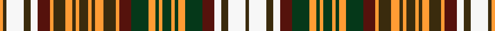

This is one **variant** — a specific cloth: this exact thread count and colourway, with its own
provenance below. It is one weaving of the [sett](/tartans/s/st/strathearn-dress/) (the scale-free proportion — the
same cloth at any scale or shade), whose colour order is pattern [GWGWBGYGYGYGYGBYGYGYGYGYGYBWGWGY](/stripes/gwgwbgygygygygbygygygygygybwgwgy/).

Part of the [Strathearn Dress](/tartans/s/st/strathearn-dress/) tartan — the named design grouping this sett with its other cloths.

Sourced from tartans-authority.  It is a [32 stripe tartan](/stripes/stripes32/).

Original link <code>http://www.tartansauthority.com/tartan-ferret/display/8823/</code> — retired · [Internet Archive copy](https://web.archive.org/web/*/http://www.tartansauthority.com/tartan-ferret/display/8823/*)

Dataset <small>— provenance for this record, inherited from the source manifest</small>

<dl class="dataset-prov">
<dt>source</dt><dd><a href="/sources/tartans-authority/">Scottish Tartans Authority</a></dd>
<dt>data captured from</dt><dd><a href="https://github.com/thetartan/tartan-database/blob/master/data/tartans-authority/data.csv">https://github.com/thetartan/tartan-database/blob/master/data/tartans-authority/data.csv</a></dd>
<dt>data date</dt><dd>pre 2014 <small>(this record)</small></dd>
<dt>licence</dt><dd><a href="https://creativecommons.org/licenses/by-nc-nd/4.0/">CC BY-NC-ND 4.0</a></dd>
</dl>

Capture chain <small>— the hands this data passed through, oldest first; each capture carries its own licence</small>

<ol class="capture-chain">
<li><a href="https://www.tartansauthority.com/">Scottish Tartans Authority</a> <small>the heritage body’s archive — its tartan-ferret record browser is retired; dead record links are shown unlinked, with an Internet Archive copy (ITI numbers are not SRT references)</small></li>
<li><a href="https://github.com/thetartan/tartan-database">thetartan/tartan-database</a> <small>2016-2017</small> · <a href="https://creativecommons.org/licenses/by-nc-nd/4.0/">CC BY-NC-ND 4.0</a> <small>Levko Kravets's frozen compilation — the capture we vendored, and where its CC licence text came from</small></li>
<li>this dictionary <small>captured 2026-06-10 · commit 5bf86c7566</small> <small>each re-capture is a git commit to data/sources</small></li>
</ol>

## Register references

External register numbers recorded for this tartan.

- Scottish Register of Tartans: [8823](https://www.tartanregister.gov.uk/tartanDetails?ref=8823)
- Scottish Tartans Authority (ITI): 8823

## Thread count
LO/4 DY4 W20 DY8 W8 DR14 LO4 DY14 LO8 DY4 LO4 DY10 LO4 DY4 LO10 DY14 LO4 DR14 DG20 LO8 DG4 LO4 DG10 LO4 DG4 LO8 DG20 DR14 W8 DY8 W20 DY/4

One full sett is **568 threads**.

## Palette
<table><thead><tr><th>Colour</th><th>Shade</th><th>OKLCh</th></tr></thead><tbody><tr><td>DR</td><td><code style="background-color:#55120C;">#55120C</code> <small style="color:#888">#55120C</small></td><td><small style="color:#888">oklch(30.0% 0.099 29.3)</small></td></tr><tr><td>DG</td><td><code style="background-color:#053819;">#053819</code> <small style="color:#888">#053819</small></td><td><small style="color:#888">oklch(30.0% 0.075 151.3)</small></td></tr><tr><td>W</td><td><code style="background-color:#F7F7F7;">#F7F7F7</code> <small style="color:#888">#F7F7F7</small></td><td><small style="color:#888">oklch(97.6% 0.000 89.9)</small></td></tr><tr><td>LO</td><td><code style="background-color:#FF9C34;">#FF9C34</code> <small style="color:#888">#FF9C34</small></td><td><small style="color:#888">oklch(77.9% 0.161 61.8)</small></td></tr><tr><td>DY</td><td><code style="background-color:#3A2B0D;">#3A2B0D</code> <small style="color:#888">#3A2B0D</small></td><td><small style="color:#888">oklch(30.0% 0.049 82.0)</small></td></tr></tbody></table>

# Sample pattern

## Nearest tartan variants

The nearest existing variants by ΔTartan distance, with this cloth at the top so the swatches line up against it.

ΔTartan

Threads

Variant

Sett

—

568

<a href="/variants/s32/dy2w10dy4w4dr7dg10lo4dg2lo2dg5lo2dg2lo4dg10dr7lo2dy7lo5dy2lo2dy5lo2dy2lo4dy7lo2dr7w4dy4w10dy2lo2~x2/">Strathearn Dress (Fashion?)</a>

<a href="/ttd/edit/#slug=db2n1ly1dg6lr3ly3dy6ly1n1db2n1ly1dg6lr3ly3dy6ly1n1db2n1ly1dg6lr3ly3dy6ly3lr3dg6lr3ly3dy6ly1n1&amp;base=dy2w10dy4w4dr7dg10lo4dg2lo2dg5lo2dg2lo4dg10dr7lo2dy7lo5dy2lo2dy5lo2dy2lo4dy7lo2dr7w4dy4w10dy2lo2~x2" title="compare in the TTD">2.51</a>

189

<a href="/variants/s33/db2n1ly1dg6lr3ly3dy6ly1n1db2n1ly1dg6lr3ly3dy6ly1n1db2n1ly1dg6lr3ly3dy6ly3lr3dg6lr3ly3dy6ly1n1/">Equorian Olympic Commemorative Tartan</a>

<a href="/ttd/edit/#slug=w3db1w1g5w1db1r2w1r2db1w1lo4w1db1w3~x8&amp;base=dy2w10dy4w4dr7dg10lo4dg2lo2dg5lo2dg2lo4dg10dr7lo2dy7lo5dy2lo2dy5lo2dy2lo4dy7lo2dr7w4dy4w10dy2lo2~x2" title="compare in the TTD">3.92</a>

400

<a href="/variants/s15/w3db1w1g5w1db1r2w1r2db1w1lo4w1db1w3~x8/">Womble</a>

## Neighbour map

Every grey dot is one of 13657 variants placed by the first two principal components of the ΔTartan feature space (42% of its variance). Red is this tartan; blue dots are its nearest — click one to open its page. The map is a flat projection of a many-dimensional space — [how to read it](/posts/neighbourhood-maps/).

<svg viewBox="0 0 640 380" role="img" style="max-width:100%;height:auto;border:1px solid #e0e0e0;border-radius:4px;display:block" xmlns="http://www.w3.org/2000/svg"><image href="/nn/cloud.v1.png" width="640" height="380"/><a href="/variants/s33/db2n1ly1dg6lr3ly3dy6ly1n1db2n1ly1dg6lr3ly3dy6ly1n1db2n1ly1dg6lr3ly3dy6ly3lr3dg6lr3ly3dy6ly1n1/"><circle cx="53.5" cy="176.9" r="4" fill="#3465a4"><title>Equorian Olympic Commemorative Tartan</title></circle></a><a href="/variants/s15/w3db1w1g5w1db1r2w1r2db1w1lo4w1db1w3~x8/"><circle cx="60.1" cy="176.6" r="4" fill="#3465a4"><title>Womble</title></circle></a><circle cx="38.5" cy="195.1" r="5" fill="#c00000"/><text x="320" y="376" text-anchor="middle" font-size="11" fill="#999">ground</text><text x="11" y="190" text-anchor="middle" font-size="11" fill="#999" transform="rotate(-90 11 190)">complexity</text></svg>

ID: /variants/s32/dy2w10dy4w4dr7dg10lo4dg2lo2dg5lo2dg2lo4dg10dr7lo2dy7lo5dy2lo2dy5lo2dy2lo4dy7lo2dr7w4dy4w10dy2lo2~x2/
