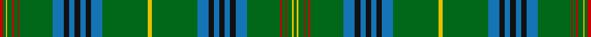

This page is one **sett** — a single exact thread-count. It belongs to the [tartan](/setts/ly8g84b21k10b10k10b10k10b21g62r3g6r3g10ly3g5r6/)
(the same proportion at any scale), whose colour order is pattern [GYGRGRGBKBKBKBGYGBKBKBKBGRGRGYGR](/stripes/gygrgrgbkbkbkbgygbkbkbkbgrgrgygr/).

Part of the [King Edward](/tartans/king-edward/) tartan — the named design grouping this sett with its other cloths.

Sourced from register-of-tartans.  It is a [32 stripe tartan](/stripes/stripes32/).

Original link https://www.tartanregister.gov.uk/tartanDetails.aspx?ref=1981

## Also known as

This cloth is also recorded under:

- King Edward VII
- King Edward VII Royal

## Register references

External register numbers recorded for this tartan.

- Scottish Register of Tartans: [1981](https://www.tartanregister.gov.uk/tartanDetails.aspx?ref=1981)
- Scottish Tartans Authority (ITI): 1559
- Scottish Tartans World Register: 1559

## Thread count
R/6 G5 Y3 G10 R3 G6 R3 G62 B21 K10 B10 K10 B10 K10 B21 G84 Y8 G84 B21 K10 B10 K10 B10 K10 B21 G62 R3 G6 R3 G10 Y3 G/5

One full sett is **1089 threads**.

## Palette

Palette: <strong>Tartan Register</strong> <small style="color:#888">(7 of 9 colours)</small>
<table><thead><tr><th>Colour</th><th>Threads</th><th>Shade</th><th>Base</th><th>OKLCh</th></tr></thead><tbody><tr><td>R/</td><td style="text-align:right;font-variant-numeric:tabular-nums">6</td><td><code style="background-color:#C80000;">#C80000</code> <small style="color:#888">#C80000</small></td><td>R <code style="background-color:#CC0000;">#CC0000</code></td><td><small style="color:#888">oklch(52.3% 0.215 29.2)</small></td></tr><tr><td>G</td><td style="text-align:right;font-variant-numeric:tabular-nums">5</td><td><code style="background-color:#006818;">#006818</code> <small style="color:#888">#006818</small></td><td>G <code style="background-color:#006100;">#006100</code></td><td><small style="color:#888">oklch(45.0% 0.142 145.0)</small></td></tr><tr><td>Y</td><td style="text-align:right;font-variant-numeric:tabular-nums">3</td><td><code style="background-color:#E8C000;">#E8C000</code> <small style="color:#888">#E8C000</small></td><td>Y <code style="background-color:#F2BF00;">#F2BF00</code></td><td><small style="color:#888">oklch(81.9% 0.168 93.7)</small></td></tr><tr><td>G</td><td style="text-align:right;font-variant-numeric:tabular-nums">10</td><td><code style="background-color:#006818;">#006818</code> <small style="color:#888">#006818</small></td><td>G <code style="background-color:#006100;">#006100</code></td><td><small style="color:#888">oklch(45.0% 0.142 145.0)</small></td></tr><tr><td>R</td><td style="text-align:right;font-variant-numeric:tabular-nums">3</td><td><code style="background-color:#C80000;">#C80000</code> <small style="color:#888">#C80000</small></td><td>R <code style="background-color:#CC0000;">#CC0000</code></td><td><small style="color:#888">oklch(52.3% 0.215 29.2)</small></td></tr><tr><td>G</td><td style="text-align:right;font-variant-numeric:tabular-nums">6</td><td><code style="background-color:#006818;">#006818</code> <small style="color:#888">#006818</small></td><td>G <code style="background-color:#006100;">#006100</code></td><td><small style="color:#888">oklch(45.0% 0.142 145.0)</small></td></tr><tr><td>R</td><td style="text-align:right;font-variant-numeric:tabular-nums">3</td><td><code style="background-color:#C80000;">#C80000</code> <small style="color:#888">#C80000</small></td><td>R <code style="background-color:#CC0000;">#CC0000</code></td><td><small style="color:#888">oklch(52.3% 0.215 29.2)</small></td></tr><tr><td>G</td><td style="text-align:right;font-variant-numeric:tabular-nums">62</td><td><code style="background-color:#006818;">#006818</code> <small style="color:#888">#006818</small></td><td>G <code style="background-color:#006100;">#006100</code></td><td><small style="color:#888">oklch(45.0% 0.142 145.0)</small></td></tr><tr><td>B</td><td style="text-align:right;font-variant-numeric:tabular-nums">21</td><td><code style="background-color:#1474B4;">#1474B4</code> <small style="color:#888">#1474B4</small></td><td>B <code style="background-color:#2A418A;">#2A418A</code></td><td><small style="color:#888">oklch(54.0% 0.129 245.1)</small></td></tr><tr><td>K</td><td style="text-align:right;font-variant-numeric:tabular-nums">10</td><td><code style="background-color:#101010;">#101010</code> <small style="color:#888">#101010</small></td><td>K <code style="background-color:#000000;">#000000</code></td><td><small style="color:#888">oklch(17.3% 0.000 89.9)</small></td></tr><tr><td>B</td><td style="text-align:right;font-variant-numeric:tabular-nums">10</td><td><code style="background-color:#1474B4;">#1474B4</code> <small style="color:#888">#1474B4</small></td><td>B <code style="background-color:#2A418A;">#2A418A</code></td><td><small style="color:#888">oklch(54.0% 0.129 245.1)</small></td></tr><tr><td>K</td><td style="text-align:right;font-variant-numeric:tabular-nums">10</td><td><code style="background-color:#101010;">#101010</code> <small style="color:#888">#101010</small></td><td>K <code style="background-color:#000000;">#000000</code></td><td><small style="color:#888">oklch(17.3% 0.000 89.9)</small></td></tr><tr><td>B</td><td style="text-align:right;font-variant-numeric:tabular-nums">10</td><td><code style="background-color:#1474B4;">#1474B4</code> <small style="color:#888">#1474B4</small></td><td>B <code style="background-color:#2A418A;">#2A418A</code></td><td><small style="color:#888">oklch(54.0% 0.129 245.1)</small></td></tr><tr><td>K</td><td style="text-align:right;font-variant-numeric:tabular-nums">10</td><td><code style="background-color:#101010;">#101010</code> <small style="color:#888">#101010</small></td><td>K <code style="background-color:#000000;">#000000</code></td><td><small style="color:#888">oklch(17.3% 0.000 89.9)</small></td></tr><tr><td>B</td><td style="text-align:right;font-variant-numeric:tabular-nums">21</td><td><code style="background-color:#1474B4;">#1474B4</code> <small style="color:#888">#1474B4</small></td><td>B <code style="background-color:#2A418A;">#2A418A</code></td><td><small style="color:#888">oklch(54.0% 0.129 245.1)</small></td></tr><tr><td>G</td><td style="text-align:right;font-variant-numeric:tabular-nums">84</td><td><code style="background-color:#006818;">#006818</code> <small style="color:#888">#006818</small></td><td>G <code style="background-color:#006100;">#006100</code></td><td><small style="color:#888">oklch(45.0% 0.142 145.0)</small></td></tr><tr><td>Y</td><td style="text-align:right;font-variant-numeric:tabular-nums">8</td><td><code style="background-color:#E8C000;">#E8C000</code> <small style="color:#888">#E8C000</small></td><td>Y <code style="background-color:#F2BF00;">#F2BF00</code></td><td><small style="color:#888">oklch(81.9% 0.168 93.7)</small></td></tr><tr><td>G</td><td style="text-align:right;font-variant-numeric:tabular-nums">84</td><td><code style="background-color:#006818;">#006818</code> <small style="color:#888">#006818</small></td><td>G <code style="background-color:#006100;">#006100</code></td><td><small style="color:#888">oklch(45.0% 0.142 145.0)</small></td></tr><tr><td>B</td><td style="text-align:right;font-variant-numeric:tabular-nums">21</td><td><code style="background-color:#1474B4;">#1474B4</code> <small style="color:#888">#1474B4</small></td><td>B <code style="background-color:#2A418A;">#2A418A</code></td><td><small style="color:#888">oklch(54.0% 0.129 245.1)</small></td></tr><tr><td>K</td><td style="text-align:right;font-variant-numeric:tabular-nums">10</td><td><code style="background-color:#101010;">#101010</code> <small style="color:#888">#101010</small></td><td>K <code style="background-color:#000000;">#000000</code></td><td><small style="color:#888">oklch(17.3% 0.000 89.9)</small></td></tr><tr><td>B</td><td style="text-align:right;font-variant-numeric:tabular-nums">10</td><td><code style="background-color:#1474B4;">#1474B4</code> <small style="color:#888">#1474B4</small></td><td>B <code style="background-color:#2A418A;">#2A418A</code></td><td><small style="color:#888">oklch(54.0% 0.129 245.1)</small></td></tr><tr><td>K</td><td style="text-align:right;font-variant-numeric:tabular-nums">10</td><td><code style="background-color:#101010;">#101010</code> <small style="color:#888">#101010</small></td><td>K <code style="background-color:#000000;">#000000</code></td><td><small style="color:#888">oklch(17.3% 0.000 89.9)</small></td></tr><tr><td>B</td><td style="text-align:right;font-variant-numeric:tabular-nums">10</td><td><code style="background-color:#1474B4;">#1474B4</code> <small style="color:#888">#1474B4</small></td><td>B <code style="background-color:#2A418A;">#2A418A</code></td><td><small style="color:#888">oklch(54.0% 0.129 245.1)</small></td></tr><tr><td>K</td><td style="text-align:right;font-variant-numeric:tabular-nums">10</td><td><code style="background-color:#101010;">#101010</code> <small style="color:#888">#101010</small></td><td>K <code style="background-color:#000000;">#000000</code></td><td><small style="color:#888">oklch(17.3% 0.000 89.9)</small></td></tr><tr><td>B</td><td style="text-align:right;font-variant-numeric:tabular-nums">21</td><td><code style="background-color:#1474B4;">#1474B4</code> <small style="color:#888">#1474B4</small></td><td>B <code style="background-color:#2A418A;">#2A418A</code></td><td><small style="color:#888">oklch(54.0% 0.129 245.1)</small></td></tr><tr><td>G</td><td style="text-align:right;font-variant-numeric:tabular-nums">62</td><td><code style="background-color:#006818;">#006818</code> <small style="color:#888">#006818</small></td><td>G <code style="background-color:#006100;">#006100</code></td><td><small style="color:#888">oklch(45.0% 0.142 145.0)</small></td></tr><tr><td>R</td><td style="text-align:right;font-variant-numeric:tabular-nums">3</td><td><code style="background-color:#C80000;">#C80000</code> <small style="color:#888">#C80000</small></td><td>R <code style="background-color:#CC0000;">#CC0000</code></td><td><small style="color:#888">oklch(52.3% 0.215 29.2)</small></td></tr><tr><td>G</td><td style="text-align:right;font-variant-numeric:tabular-nums">6</td><td><code style="background-color:#006818;">#006818</code> <small style="color:#888">#006818</small></td><td>G <code style="background-color:#006100;">#006100</code></td><td><small style="color:#888">oklch(45.0% 0.142 145.0)</small></td></tr><tr><td>R</td><td style="text-align:right;font-variant-numeric:tabular-nums">3</td><td><code style="background-color:#C80000;">#C80000</code> <small style="color:#888">#C80000</small></td><td>R <code style="background-color:#CC0000;">#CC0000</code></td><td><small style="color:#888">oklch(52.3% 0.215 29.2)</small></td></tr><tr><td>G</td><td style="text-align:right;font-variant-numeric:tabular-nums">10</td><td><code style="background-color:#006818;">#006818</code> <small style="color:#888">#006818</small></td><td>G <code style="background-color:#006100;">#006100</code></td><td><small style="color:#888">oklch(45.0% 0.142 145.0)</small></td></tr><tr><td>Y</td><td style="text-align:right;font-variant-numeric:tabular-nums">3</td><td><code style="background-color:#E8C000;">#E8C000</code> <small style="color:#888">#E8C000</small></td><td>Y <code style="background-color:#F2BF00;">#F2BF00</code></td><td><small style="color:#888">oklch(81.9% 0.168 93.7)</small></td></tr><tr><td>G/</td><td style="text-align:right;font-variant-numeric:tabular-nums">5</td><td><code style="background-color:#006818;">#006818</code> <small style="color:#888">#006818</small></td><td>G <code style="background-color:#006100;">#006100</code></td><td><small style="color:#888">oklch(45.0% 0.142 145.0)</small></td></tr></tbody></table>

## Nearest tartans

The nearest existing variants by ΔTartan distance, with this tartan at the top so the swatches line up against it.

ΔTartan

Tartan

Sett

—

<a href="/ttd/edit/#slug=ly8g84b21k10b10k10b10k10b21g62r3g6r3g10ly3g5r6">King Edward VII</a> <a class="nn-out" href="/variants/s32/ly8g84b21k10b10k10b10k10b21g62r3g6r3g10ly3g5r6/" title="open its dictionary page">↗</a>

1.14

<a href="/variants/s28/ly4g39db9k3db5k3db9g32r2g3r2g5ly2g3r3~x2/">Holmes</a>

1.20

<a href="/ttd/edit/#slug=db3k2db1k2db3lo1g3k2g2k6g2k6g2k2g24r2g4r2g24k2g2k6g2k6g2k2g3lo1db3k2db1k2db3g2~x2&amp;base=ly8g84b21k10b10k10b10k10b21g62r3g6r3g10ly3g5r6">Hislop Hunting (Personal)</a> <a class="nn-out" href="/variants/s34/db3k2db1k2db3lo1g3k2g2k6g2k6g2k2g24r2g4r2g24k2g2k6g2k6g2k2g3lo1db3k2db1k2db3g2~x2/" title="open its dictionary page">↗</a>

1.32

<a href="/ttd/edit/#slug=ly8g84b21k10b10k10b10k10b21g62r3g6r3g10ly3g5r6">King Edward VII (Royal)</a> <a class="nn-out" href="/variants/s17/ly8g84b21k10b10k10b10k10b21g62r3g6r3g10ly3g5r6/" title="open its dictionary page">↗</a>

1.41

<a href="/ttd/edit/#slug=db2g2r1g4r1db6r2g1ly1g1r1g1r1g1t1g1r2db6g26r1g1r1g1db1~x2&amp;base=ly8g84b21k10b10k10b10k10b21g62r3g6r3g10ly3g5r6">Ettrick Forest</a> <a class="nn-out" href="/variants/s24/db2g2r1g4r1db6r2g1ly1g1r1g1r1g1t1g1r2db6g26r1g1r1g1db1~x2/" title="open its dictionary page">↗</a>

1.45

<a href="/ttd/edit/#slug=dp3g3gi32dp2gi4dp4gi3g10dp2r2w1g1r3g1w1r2dp2g10gi3dp4gi4dp2gi32g3dp3lo2~x2&amp;base=ly8g84b21k10b10k10b10k10b21g62r3g6r3g10ly3g5r6">McGran (Personal)</a> <a class="nn-out" href="/variants/s26/dp3g3gi32dp2gi4dp4gi3g10dp2r2w1g1r3g1w1r2dp2g10gi3dp4gi4dp2gi32g3dp3lo2~x2/" title="open its dictionary page">↗</a>

1.46

<a href="/variants/s20/k3w1g29o8m2o2m2o2m8g7k2~x2/">Gray Hunting</a>

1.58

<a href="/ttd/edit/#slug=g4r2g24k2g2k6g2k6g2k2g3lo1db3k2db1k2db3g2~x2&amp;base=ly8g84b21k10b10k10b10k10b21g62r3g6r3g10ly3g5r6">Hyslop Hunting (Name)</a> <a class="nn-out" href="/variants/s18/g4r2g24k2g2k6g2k6g2k2g3lo1db3k2db1k2db3g2~x2/" title="open its dictionary page">↗</a>

1.61

<a href="/ttd/edit/#slug=db6g3lb6g7ly2g36ly2g7lb6g3db6g3dy6g3r6g7ly2g36ly2g7r6g3dy6g3~x2&amp;base=ly8g84b21k10b10k10b10k10b21g62r3g6r3g10ly3g5r6">Sea Bees Regimental Tartan</a> <a class="nn-out" href="/variants/s24/db6g3lb6g7ly2g36ly2g7lb6g3db6g3dy6g3r6g7ly2g36ly2g7r6g3dy6g3~x2/" title="open its dictionary page">↗</a>

1.72

<a href="/ttd/edit/#slug=k2g2ly1g3m1g2m1g12db4k3db3k3db3k3db4g24r2~x2&amp;base=ly8g84b21k10b10k10b10k10b21g62r3g6r3g10ly3g5r6">Kennedy Clan Tartan</a> <a class="nn-out" href="/variants/s17/k2g2ly1g3m1g2m1g12db4k3db3k3db3k3db4g24r2~x2/" title="open its dictionary page">↗</a>

1.80

<a href="/ttd/edit/#slug=g24dt4k3dt3k3dt3k3dt4g12dp2g2dp2g3lo2g2k2g2lo2g3dp2g2dp2g12dt4k3dt3k3dt3k3dt4g24r3~x2&amp;base=ly8g84b21k10b10k10b10k10b21g62r3g6r3g10ly3g5r6">Kennedy #3</a> <a class="nn-out" href="/variants/s32/g24dt4k3dt3k3dt3k3dt4g12dp2g2dp2g3lo2g2k2g2lo2g3dp2g2dp2g12dt4k3dt3k3dt3k3dt4g24r3~x2/" title="open its dictionary page">↗</a>

## Neighbour map

Every grey dot is one of 14360 variants placed by the first two principal components of the ΔTartan feature space (44% of its variance). Red is this tartan; blue dots are its nearest — click one to open its page.

<svg viewBox="0 0 640 380" role="img" style="max-width:100%;height:auto;border:1px solid #e0e0e0;border-radius:4px;display:block" xmlns="http://www.w3.org/2000/svg"><image href="/nn/cloud.v1.png" width="640" height="380"/><a href="/variants/s28/ly4g39db9k3db5k3db9g32r2g3r2g5ly2g3r3~x2/"><circle cx="400.0" cy="103.0" r="4" fill="#3465a4"><title>Holmes</title></circle></a><a href="/variants/s34/db3k2db1k2db3lo1g3k2g2k6g2k6g2k2g24r2g4r2g24k2g2k6g2k6g2k2g3lo1db3k2db1k2db3g2~x2/"><circle cx="320.8" cy="83.4" r="4" fill="#3465a4"><title>Hislop Hunting (Personal)</title></circle></a><a href="/variants/s17/ly8g84b21k10b10k10b10k10b21g62r3g6r3g10ly3g5r6/"><circle cx="353.0" cy="105.9" r="4" fill="#3465a4"><title>King Edward VII (Royal)</title></circle></a><a href="/variants/s24/db2g2r1g4r1db6r2g1ly1g1r1g1r1g1t1g1r2db6g26r1g1r1g1db1~x2/"><circle cx="389.1" cy="76.5" r="4" fill="#3465a4"><title>Ettrick Forest</title></circle></a><a href="/variants/s26/dp3g3gi32dp2gi4dp4gi3g10dp2r2w1g1r3g1w1r2dp2g10gi3dp4gi4dp2gi32g3dp3lo2~x2/"><circle cx="325.7" cy="55.5" r="4" fill="#3465a4"><title>McGran (Personal)</title></circle></a><a href="/variants/s20/k3w1g29o8m2o2m2o2m8g7k2~x2/"><circle cx="342.6" cy="95.3" r="4" fill="#3465a4"><title>Gray Hunting</title></circle></a><a href="/variants/s18/g4r2g24k2g2k6g2k6g2k2g3lo1db3k2db1k2db3g2~x2/"><circle cx="344.4" cy="111.7" r="4" fill="#3465a4"><title>Hyslop Hunting (Name)</title></circle></a><a href="/variants/s24/db6g3lb6g7ly2g36ly2g7lb6g3db6g3dy6g3r6g7ly2g36ly2g7r6g3dy6g3~x2/"><circle cx="362.6" cy="94.2" r="4" fill="#3465a4"><title>Sea Bees Regimental Tartan</title></circle></a><a href="/variants/s17/k2g2ly1g3m1g2m1g12db4k3db3k3db3k3db4g24r2~x2/"><circle cx="332.6" cy="99.7" r="4" fill="#3465a4"><title>Kennedy Clan Tartan</title></circle></a><a href="/variants/s32/g24dt4k3dt3k3dt3k3dt4g12dp2g2dp2g3lo2g2k2g2lo2g3dp2g2dp2g12dt4k3dt3k3dt3k3dt4g24r3~x2/"><circle cx="293.1" cy="108.5" r="4" fill="#3465a4"><title>Kennedy #3</title></circle></a><circle cx="357.3" cy="84.9" r="5" fill="#c00000"/></svg>

ID: /variants/s32/ly8g84b21k10b10k10b10k10b21g62r3g6r3g10ly3g5r6/
