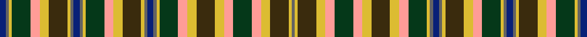

This page is one **sett** — a single exact thread-count. It belongs to the [tartan](/setts/db2n1ly1dg6lr3ly3dy6ly1n1db2n1ly1dg6lr3ly3dy6ly1n1db2n1ly1dg6lr3ly3dy6ly3lr3dg6lr3ly3dy6ly1n1/)
(the same proportion at any scale), whose colour order is pattern [BBYGYYGYBBBYGYYGYBBBYGYYGYYGYYGYB](/stripes/bbygyygybbbygyygybbbygyygyygyygyb/).

Sourced from house-of-tartan.  It is a [33 stripe tartan](/stripes/stripes33/).

Original link http://www.house-of-tartan.scotland.net/house/TartanViewjs.asp?colr=Def&tnam=1996

## Provenance

Earliest known date: 1986 Edinburgh Woollen Mills design to commemorate Britains participation in the 1988 Olympic Games in Korea and to raise money for the British Equestrian Olympic Appeal Fund. The full sett is not shown here for technical reasons.

## Thread count
DB/2 N1 LY1 DG6 LR3 LY3 DY6 LY1 N1 DB2 N1 LY1 DG6 LR3 LY3 DY6 LY1 N1 DB2 N1 LY1 DG6 LR3 LY3 DY6 LY3 LR3 DG6 LR3 LY3 DY6 LY1 N/1

One full sett is **189 threads**.

## Palette
<table><thead><tr><th>Colour</th><th>Shade</th><th>OKLCh</th></tr></thead><tbody><tr><td>DB</td><td><code style="background-color:#082077;">#082077</code> <small style="color:#888">#082077</small></td><td><small style="color:#888">oklch(30.0% 0.149 265.1)</small></td></tr><tr><td>DG</td><td><code style="background-color:#053819;">#053819</code> <small style="color:#888">#053819</small></td><td><small style="color:#888">oklch(30.0% 0.075 151.3)</small></td></tr><tr><td>LY</td><td><code style="background-color:#DCBC32;">#DCBC32</code> <small style="color:#888">#DCBC32</small></td><td><small style="color:#888">oklch(80.0% 0.150 95.2)</small></td></tr><tr><td>N</td><td><code style="background-color:#636363;">#636363</code> <small style="color:#888">#636363</small></td><td><small style="color:#888">oklch(50.0% 0.000 89.9)</small></td></tr><tr><td>LR</td><td><code style="background-color:#FF9C97;">#FF9C97</code> <small style="color:#888">#FF9C97</small></td><td><small style="color:#888">oklch(79.3% 0.119 23.2)</small></td></tr><tr><td>DY</td><td><code style="background-color:#3A2B0D;">#3A2B0D</code> <small style="color:#888">#3A2B0D</small></td><td><small style="color:#888">oklch(30.0% 0.049 82.0)</small></td></tr></tbody></table>

# Sample pattern

ID: /variants/s33/db2n1ly1dg6lr3ly3dy6ly1n1db2n1ly1dg6lr3ly3dy6ly1n1db2n1ly1dg6lr3ly3dy6ly3lr3dg6lr3ly3dy6ly1n1/
