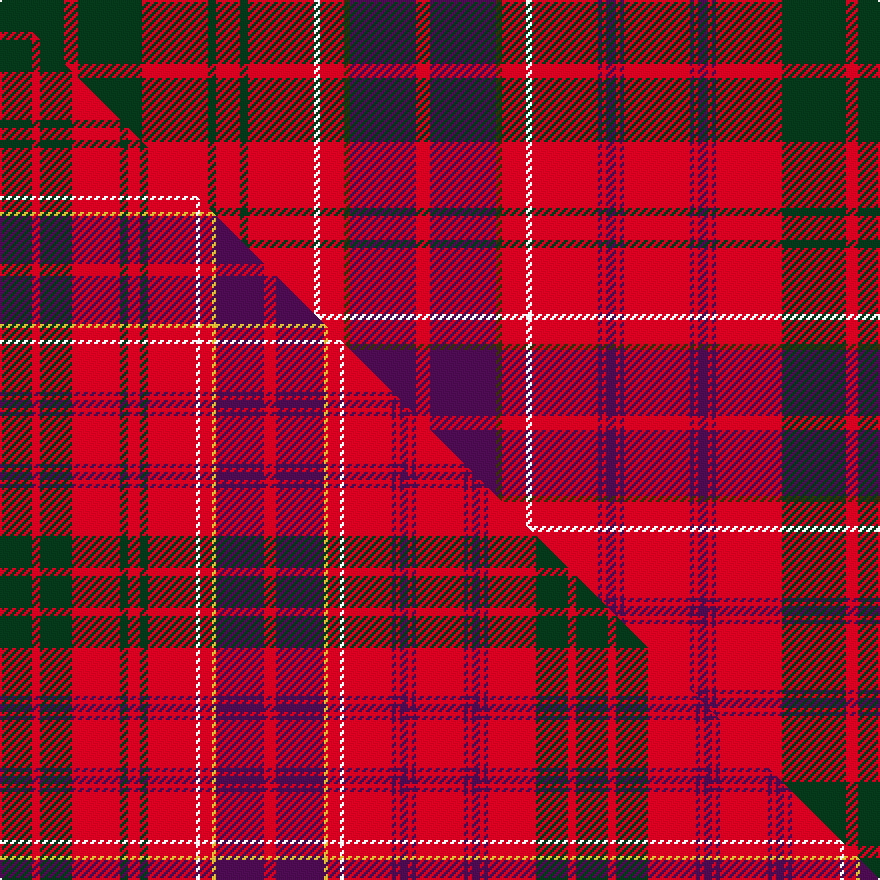

This is one **variant** — a specific cloth: this exact thread count and colourway, with its own
provenance below. It is one weaving of the [sett](/tartans/h/hu/huntly/) (the scale-free proportion — the
same cloth at any scale or shade), whose colour order is pattern [GRGRBRBRBRBRBRBRWRGBRBGRWRGRGRGRG](/stripes/grgrbrbrbrbrbrbrwrgbrbgrwrgrgrgrg/).

Part of the [Huntly](/tartans/h/hu/huntly/) tartan — the named design grouping this sett with its other cloths.

Sourced from tartans-authority.  It is a [33 stripe tartan](/stripes/stripes33/).

Original link <code>http://www.tartansauthority.com/tartan-ferret/display/853/</code> — retired · [Internet Archive copy](https://web.archive.org/web/*/http://www.tartansauthority.com/tartan-ferret/display/853/*)

Dataset <small>— provenance for this record, inherited from the source manifest</small>

<dl class="dataset-prov">
<dt>source</dt><dd><a href="/sources/tartans-authority/">Scottish Tartans Authority</a></dd>
<dt>data captured from</dt><dd><a href="https://github.com/thetartan/tartan-database/blob/master/data/tartans-authority/data.csv">https://github.com/thetartan/tartan-database/blob/master/data/tartans-authority/data.csv</a></dd>
<dt>data date</dt><dd>1819 <small>(this record)</small></dd>
<dt>licence</dt><dd><a href="https://creativecommons.org/licenses/by-nc-nd/4.0/">CC BY-NC-ND 4.0</a></dd>
</dl>

Capture chain <small>— the hands this data passed through, oldest first; each capture carries its own licence</small>

<ol class="capture-chain">
<li><a href="https://www.tartansauthority.com/">Scottish Tartans Authority</a> <small>the heritage body’s archive — its tartan-ferret record browser is retired; dead record links are shown unlinked, with an Internet Archive copy (ITI numbers are not SRT references)</small></li>
<li><a href="https://github.com/thetartan/tartan-database">thetartan/tartan-database</a> <small>2016-2017</small> · <a href="https://creativecommons.org/licenses/by-nc-nd/4.0/">CC BY-NC-ND 4.0</a> <small>Levko Kravets's frozen compilation — the capture we vendored, and where its CC licence text came from</small></li>
<li>this dictionary <small>captured 2026-06-10 · commit 5bf86c7566</small> <small>each re-capture is a git commit to data/sources</small></li>
</ol>

## Register references

External register numbers recorded for this tartan.

- Scottish Tartans Authority (ITI): 853

## Thread count
DG/32 R7 DG32 R33 DG4 R12 DG4 R33 W3 R12 DY3 DP33 R7 DP33 DY3 R12 W3 R33 DP2 R2 DP5 R2 DP2 R33 DP2 R2 DP5 R2 DP2 R33 DG32 R6 DG/23

One full sett is **849 threads**.

## Palette
<table><thead><tr><th>Colour</th><th>Shade</th><th>OKLCh</th></tr></thead><tbody><tr><td>DP</td><td><code style="background-color:#4B0B4F;">#4B0B4F</code> <small style="color:#888">#4B0B4F</small></td><td><small style="color:#888">oklch(30.1% 0.125 325.4)</small></td></tr><tr><td>DG</td><td><code style="background-color:#053819;">#053819</code> <small style="color:#888">#053819</small></td><td><small style="color:#888">oklch(30.0% 0.075 151.3)</small></td></tr><tr><td>R</td><td><code style="background-color:#D60020;">#D60020</code> <small style="color:#888">#D60020</small></td><td><small style="color:#888">oklch(55.2% 0.224 25.5)</small></td></tr><tr><td>W</td><td><code style="background-color:#F7F7F7;">#F7F7F7</code> <small style="color:#888">#F7F7F7</small></td><td><small style="color:#888">oklch(97.6% 0.000 89.9)</small></td></tr><tr><td>DY</td><td><code style="background-color:#3A2B0D;">#3A2B0D</code> <small style="color:#888">#3A2B0D</small></td><td><small style="color:#888">oklch(30.0% 0.049 82.0)</small></td></tr></tbody></table>

# Sample pattern

## Compared to the master

This cloth is one sett of its design; the master sett (the exemplar the design is anchored on) is below for comparison.

Its **ΔTartan distance** from the master is **0.49** — the same measure the nearest-tartans table ranks by (0 is identical; a re-scale of the same cloth is near 0, a recolour or a different proportion further).

<figure class="master-compare" style="margin:0">

this sett
master sett ★

<figcaption style="color:#888;font-size:smaller">One weave of this sett against the <a href="/setts/dg8r2dg8r12dg2r3dg2r12w1r3ly1dp12r3dp12ly1r3w1r12dp1r1dp2r1dp1r12dp1r1dp2r1dp1r12dg8r2dg8/">master sett ★</a>, split on the diagonal: a shared proportion runs seamlessly across it with only the shades shifting; a different proportion breaks on it.</figcaption>
</figure>

## Nearest tartan variants

The nearest existing variants by ΔTartan distance, with this cloth at the top so the swatches line up against it.

ΔTartan

Threads

Variant

Sett

—

849

<a href="/variants/s33/dg32r7dg32r33dg4r12dg4r33w3r12dy3dp33r7dp33dy3r12w3r33dp2r2dp5r2dp2r33dp2r2dp5r2dp2r33dg32r6dg23/">Huntly (District)</a>

<a href="/ttd/edit/#slug=dg8r2dg8r12dg2r3dg2r12w1r3ly1dp12r3dp12ly1r3w1r12dp1r1dp2r1dp1r12dp1r1dp2r1dp1r12dg8r2dg8~x2&amp;base=dg32r7dg32r33dg4r12dg4r33w3r12dy3dp33r7dp33dy3r12w3r33dp2r2dp5r2dp2r33dp2r2dp5r2dp2r33dg32r6dg23" title="compare in the TTD">0.49</a>

576

<a href="/variants/s33/dg8r2dg8r12dg2r3dg2r12w1r3ly1dp12r3dp12ly1r3w1r12dp1r1dp2r1dp1r12dp1r1dp2r1dp1r12dg8r2dg8~x2/">Huntly</a>

<a href="/ttd/edit/#slug=g32r7g32r33g4r12g4r33lb3r12ly3dp33r7dp33ly3r12lb3r33dp2r2dp5r2dp2r33dp2r2dp5r2dp2r33g32r7g32~x2&amp;base=dg32r7dg32r33dg4r12dg4r33w3r12dy3dp33r7dp33dy3r12w3r33dp2r2dp5r2dp2r33dp2r2dp5r2dp2r33dg32r6dg23" title="compare in the TTD">0.71</a>

1720

<a href="/variants/s33/g32r7g32r33g4r12g4r33lb3r12ly3dp33r7dp33ly3r12lb3r33dp2r2dp5r2dp2r33dp2r2dp5r2dp2r33g32r7g32~x2/">Marchioness of Huntly's</a>

<a href="/ttd/edit/#slug=g23r6g23r26g4r9g4r26w3r8dp31r6dp31r8w3r26dp2r2dp4r2dp2r26dp2r2dp4r2dp2r26g23r6g23~x2&amp;base=dg32r7dg32r33dg4r12dg4r33w3r12dy3dp33r7dp33dy3r12w3r33dp2r2dp5r2dp2r33dp2r2dp5r2dp2r33dg32r6dg23" title="compare in the TTD">0.86</a>

1368

<a href="/variants/s31/g23r6g23r26g4r9g4r26w3r8dp31r6dp31r8w3r26dp2r2dp4r2dp2r26dp2r2dp4r2dp2r26g23r6g23~x2/">Ross #3</a>

<a href="/ttd/edit/#slug=r23dg2r3dg2r3dg2r5ly5r5dg2r3dg2r3dg2r23dg23r5dg15r5dg23r23dg2r3dg2r3dg2r5w5r5dg2r3dg2r3dg2r23dp15r5dp15r5dp15~x2&amp;base=dg32r7dg32r33dg4r12dg4r33w3r12dy3dp33r7dp33dy3r12w3r33dp2r2dp5r2dp2r33dp2r2dp5r2dp2r33dg32r6dg23" title="compare in the TTD">1.63</a>

1108

<a href="/variants/s40/r23dg2r3dg2r3dg2r5ly5r5dg2r3dg2r3dg2r23dg23r5dg15r5dg23r23dg2r3dg2r3dg2r5w5r5dg2r3dg2r3dg2r23dp15r5dp15r5dp15~x2/">MacRae of Inverinate</a>

<a href="/ttd/edit/#slug=g8r2g8r12g2r3g2r12w1r3y1db12r3db12y1r3w1r12db1r1db2r1db1r12db1r1db2r1db1r12g8r2g8~x2&amp;base=dg32r7dg32r33dg4r12dg4r33w3r12dy3dp33r7dp33dy3r12w3r33dp2r2dp5r2dp2r33dp2r2dp5r2dp2r33dg32r6dg23" title="compare in the TTD">2.36</a>

576

<a href="/variants/s33/g8r2g8r12g2r3g2r12w1r3y1db12r3db12y1r3w1r12db1r1db2r1db1r12db1r1db2r1db1r12g8r2g8~x2/">Huntly District Tartan</a>

<a href="/ttd/edit/#slug=r24w1dp1r3dg24r3dp1w1r3dp6r3w1dp1r24dg3lr3dg3~x4~r5221030-lr7911024&amp;base=dg32r7dg32r33dg4r12dg4r33w3r12dy3dp33r7dp33dy3r12w3r33dp2r2dp5r2dp2r33dp2r2dp5r2dp2r33dg32r6dg23" title="compare in the TTD">2.77</a>

1440

<a href="/variants/s32/dg3lr3dg3r24dp1w1r3dp6r3w1dp1r3dg24r3dp1w1r24w1dp1r3dg24r3dp1w1r3dp6r3w1dp1r24dg3lr3~x4~lr7911024-r5221030/">King George IV</a>

<a href="/ttd/edit/#slug=r23g2r3g2r3g2r5y5r5g2r3g2r3g2r23g23r5g15r5g23r23g2r3g2r3g2r5w5r5g2r3g2r3g2r23db15r5db15r5db15~x2&amp;base=dg32r7dg32r33dg4r12dg4r33w3r12dy3dp33r7dp33dy3r12w3r33dp2r2dp5r2dp2r33dp2r2dp5r2dp2r33dg32r6dg23" title="compare in the TTD">2.82</a>

1108

<a href="/variants/s40/r23g2r3g2r3g2r5y5r5g2r3g2r3g2r23g23r5g15r5g23r23g2r3g2r3g2r5w5r5g2r3g2r3g2r23db15r5db15r5db15~x2/">MacRae of Inverinate Clan Tartan</a>

<a href="/ttd/edit/#slug=r9db1r1db2r1db1r9w1r4db11r2db11r4w1r9g2r4g2r9g5r3g4r3g3y1g3r3g6w1g6~x2&amp;base=dg32r7dg32r33dg4r12dg4r33w3r12dy3dp33r7dp33dy3r12w3r33dp2r2dp5r2dp2r33dp2r2dp5r2dp2r33dg32r6dg23" title="compare in the TTD">3.13</a>

458

<a href="/variants/s30/r9db1r1db2r1db1r9w1r4db11r2db11r4w1r9g2r4g2r9g5r3g4r3g3y1g3r3g6w1g6~x2/">Lumsden (Short)</a>

<a href="/ttd/edit/#slug=db19r2db2r20g2y1g2r2db18r2g3r2db2r22g3w1r3db17r2g2r24g2y1g2r2db19r3g3r2db2r21g3w1r3~x2&amp;base=dg32r7dg32r33dg4r12dg4r33w3r12dy3dp33r7dp33dy3r12w3r33dp2r2dp5r2dp2r33dp2r2dp5r2dp2r33dg32r6dg23" title="compare in the TTD">3.16</a>

816

<a href="/variants/s34/db19r2db2r20g2y1g2r2db18r2g3r2db2r22g3w1r3db17r2g2r24g2y1g2r2db19r3g3r2db2r21g3w1r3~x2/">Unidentified 18th Centuary plain weave</a>

<a href="/ttd/edit/#slug=dp9r2dp9r9dp1r1dp2r1dp1r9w1r4dp11r2dp11r4w1r9g2r4g2r9g9r2g9~x2&amp;base=dg32r7dg32r33dg4r12dg4r33w3r12dy3dp33r7dp33dy3r12w3r33dp2r2dp5r2dp2r33dp2r2dp5r2dp2r33dg32r6dg23" title="compare in the TTD">3.18</a>

460

<a href="/variants/s25/dp9r2dp9r9dp1r1dp2r1dp1r9w1r4dp11r2dp11r4w1r9g2r4g2r9g9r2g9~x2/">Lumsden of Clova</a>

## Neighbour map

Every grey dot is one of 13662 variants placed by the first two principal components of the ΔTartan feature space (42% of its variance). Red is this tartan; blue dots are its nearest — click one to open its page. The map is a flat projection of a many-dimensional space — [how to read it](/posts/neighbourhood-maps/).

<svg viewBox="0 0 640 380" role="img" style="max-width:100%;height:auto;border:1px solid #e0e0e0;border-radius:4px;display:block" xmlns="http://www.w3.org/2000/svg"><image href="/nn/cloud.v1.png" width="640" height="380"/><a href="/variants/s33/dg8r2dg8r12dg2r3dg2r12w1r3ly1dp12r3dp12ly1r3w1r12dp1r1dp2r1dp1r12dp1r1dp2r1dp1r12dg8r2dg8~x2/"><circle cx="269.6" cy="83.1" r="4" fill="#3465a4"><title>Huntly</title></circle></a><a href="/variants/s33/g32r7g32r33g4r12g4r33lb3r12ly3dp33r7dp33ly3r12lb3r33dp2r2dp5r2dp2r33dp2r2dp5r2dp2r33g32r7g32~x2/"><circle cx="258.3" cy="102.9" r="4" fill="#3465a4"><title>Marchioness of Huntly's</title></circle></a><a href="/variants/s31/g23r6g23r26g4r9g4r26w3r8dp31r6dp31r8w3r26dp2r2dp4r2dp2r26dp2r2dp4r2dp2r26g23r6g23~x2/"><circle cx="266.8" cy="123.2" r="4" fill="#3465a4"><title>Ross #3</title></circle></a><a href="/variants/s40/r23dg2r3dg2r3dg2r5ly5r5dg2r3dg2r3dg2r23dg23r5dg15r5dg23r23dg2r3dg2r3dg2r5w5r5dg2r3dg2r3dg2r23dp15r5dp15r5dp15~x2/"><circle cx="260.1" cy="100.5" r="4" fill="#3465a4"><title>MacRae of Inverinate</title></circle></a><a href="/variants/s33/g8r2g8r12g2r3g2r12w1r3y1db12r3db12y1r3w1r12db1r1db2r1db1r12db1r1db2r1db1r12g8r2g8~x2/"><circle cx="246.2" cy="110.8" r="4" fill="#3465a4"><title>Huntly District Tartan</title></circle></a><a href="/variants/s32/dg3lr3dg3r24dp1w1r3dp6r3w1dp1r3dg24r3dp1w1r24w1dp1r3dg24r3dp1w1r3dp6r3w1dp1r24dg3lr3~x4~lr7911024-r5221030/"><circle cx="302.0" cy="59.9" r="4" fill="#3465a4"><title>King George IV</title></circle></a><a href="/variants/s40/r23g2r3g2r3g2r5y5r5g2r3g2r3g2r23g23r5g15r5g23r23g2r3g2r3g2r5w5r5g2r3g2r3g2r23db15r5db15r5db15~x2/"><circle cx="249.2" cy="102.3" r="4" fill="#3465a4"><title>MacRae of Inverinate Clan Tartan</title></circle></a><a href="/variants/s30/r9db1r1db2r1db1r9w1r4db11r2db11r4w1r9g2r4g2r9g5r3g4r3g3y1g3r3g6w1g6~x2/"><circle cx="215.6" cy="132.5" r="4" fill="#3465a4"><title>Lumsden (Short)</title></circle></a><a href="/variants/s34/db19r2db2r20g2y1g2r2db18r2g3r2db2r22g3w1r3db17r2g2r24g2y1g2r2db19r3g3r2db2r21g3w1r3~x2/"><circle cx="284.0" cy="64.5" r="4" fill="#3465a4"><title>Unidentified 18th Centuary plain weave</title></circle></a><a href="/variants/s25/dp9r2dp9r9dp1r1dp2r1dp1r9w1r4dp11r2dp11r4w1r9g2r4g2r9g9r2g9~x2/"><circle cx="238.4" cy="156.5" r="4" fill="#3465a4"><title>Lumsden of Clova</title></circle></a><circle cx="269.2" cy="101.4" r="5" fill="#c00000"/><text x="320" y="376" text-anchor="middle" font-size="11" fill="#999">ground</text><text x="11" y="190" text-anchor="middle" font-size="11" fill="#999" transform="rotate(-90 11 190)">complexity</text></svg>

ID: /variants/s33/dg32r7dg32r33dg4r12dg4r33w3r12dy3dp33r7dp33dy3r12w3r33dp2r2dp5r2dp2r33dp2r2dp5r2dp2r33dg32r6dg23/
