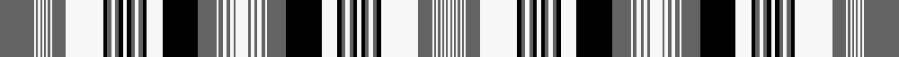

This is one **variant** — a specific cloth: this exact thread count and colourway, with its own
provenance below. It is one weaving of the [sett](/tartans/m/mi/miss-peffer-s/) (the scale-free proportion — the
same cloth at any scale or shade), whose colour order is pattern [BWBWBWBWBWBWKBWBKWKBWBKWKBWBWBWBW](/stripes/bwbwbwbwbwbwkbwbkwkbwbkwkbwbwbwbw/).

Part of the [Miss Peffer's](/tartans/m/mi/miss-peffer-s/) tartan — the named design grouping this sett with its other cloths.

Sourced from register-of-tartans.  It is a [33 stripe tartan](/stripes/stripes33/).

Original link [https://www.tartanregister.gov.uk/tartanDetails.aspx?ref=4814](https://www.tartanregister.gov.uk/tartanDetails.aspx?ref=4814)

## Provenance

Earliest known date: pre 2003 First grey is N270. Shortened for display.

3 attestations — the source records this cloth was collapsed from (oldest owns this page)

<ul>
<li>01/01/2002 — Not Specified #4 (register-of-tartans, <a href="https://www.tartanregister.gov.uk/tartanDetails.aspx?ref=4814">record</a>)  <em>None</em></li>
<li>pre 2003 — Miss Peffer's Plaid Artifact Tartan (house-of-tartan, <a href="http://www.house-of-tartan.scotland.net/house/TartanViewjs.asp?colr=Def&tnam=1313">record</a>) </li>
<li>undated — Miss Peffer's, Plaid (weddslist, <a href="http://www.weddslist.com/cgi-bin/tartans/pg.pl?source=sts">record</a>) </li>
</ul>

Dataset <small>— provenance for this record, inherited from the source manifest</small>

<dl class="dataset-prov">
<dt>source</dt><dd><a href="/sources/register-of-tartans/">Scottish Register of Tartans</a></dd>
<dt>data captured from</dt><dd><a href="https://github.com/thetartan/tartan-database/blob/master/data/register-of-tartans/data.csv">https://github.com/thetartan/tartan-database/blob/master/data/register-of-tartans/data.csv</a></dd>
<dt>data date</dt><dd>2002 <small>(this record)</small></dd>
<dt>licence</dt><dd><a href="https://www.tartanregister.gov.uk/copyright">Crown copyright</a></dd>
</dl>

Capture chain <small>— the hands this data passed through, oldest first; each capture carries its own licence</small>

<ol class="capture-chain">
<li><a href="https://www.tartanregister.gov.uk/">Scottish Register of Tartans</a> · <a href="https://www.tartanregister.gov.uk/copyright">Crown copyright</a> <small>the living register — still published by National Records of Scotland</small></li>
<li><a href="https://github.com/thetartan/tartan-database">thetartan/tartan-database</a> <small>2016-2017</small> · <a href="https://creativecommons.org/licenses/by-nc-nd/4.0/">CC BY-NC-ND 4.0</a> <small>Levko Kravets's frozen compilation — the capture we vendored, and where its CC licence text came from</small></li>
<li>this dictionary <small>captured 2026-06-10 · commit 5bf86c7566</small> <small>each re-capture is a git commit to data/sources</small></li>
</ol>

## Register references

External register numbers recorded for this tartan.

- Scottish Register of Tartans: [4814](https://www.tartanregister.gov.uk/tartanDetails.aspx?ref=4814)
- Scottish Tartans Authority (ITI): 1313
- Scottish Tartans World Register: 1313

## Thread count
N/70 W4 N4 W4 N4 W4 N4 W4 N4 W4 N28 W76 K8 N8 W8 N8 K8 W8 K8 N8 W8 N8 K8 W32 K72 N38 W4 N8 W8 N6 W8 N4 W/26

One full sett is **912 threads**.

The source recorded this cloth as N/70 W4 N4 W4 N4 W4 N4 W4 N4 W4 N28 W76 K8 N8 W8 N8 K8 W8 K8 N8 W8 N8 K8 W32 K72 N38 W4 N8 W8 N6 W8 N4 W26 N4 W8 N6 W8 N8 W4 N38 K72 W32 K8 N8 W8 N8 K8 W8 K8 N8 W8 N8 K8 W76 N28 W4 N4 W4 N4 W4 N4 W4 N4 W/4 — 1750 threads; it folds to the canonical 912-thread sett above.

## Palette
<table><thead><tr><th>Colour</th><th>Shade</th><th>OKLCh</th></tr></thead><tbody><tr><td>K</td><td><code style="background-color:#000000;">#000000</code> <small style="color:#888">#000000</small></td><td><small style="color:#888">oklch(0.0% 0.000 0.0)</small></td></tr><tr><td>W</td><td><code style="background-color:#F7F7F7;">#F7F7F7</code> <small style="color:#888">#F7F7F7</small></td><td><small style="color:#888">oklch(97.6% 0.000 89.9)</small></td></tr><tr><td>N</td><td><code style="background-color:#636363;">#636363</code> <small style="color:#888">#636363</small></td><td><small style="color:#888">oklch(50.0% 0.000 89.9)</small></td></tr><tr><td>DO</td><td><code style="background-color:#412714;">#412714</code> <small style="color:#888">#412714</small></td><td><small style="color:#888">oklch(30.1% 0.050 55.7)</small></td></tr></tbody></table>

# Sample pattern

[Sample sheet (PDF)](swatch.pdf) — the woven sample, thread count and palette on one printable A4, rendered on demand (the same sheet the TTD print page downloads).

ID: /variants/s33/n35w2n2w2n2w2n2w2n2w2n14w38k4n4w4n4k4w4k4n4w4n4k4w16k36n19w2n4w4n3w4n2w13~x2/
