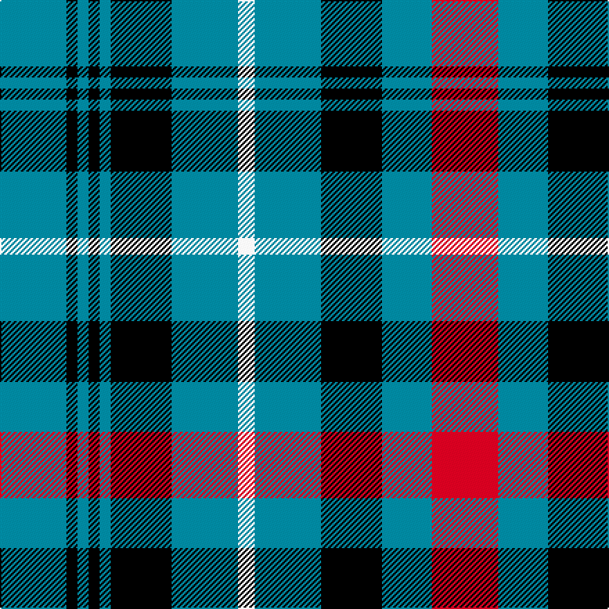

This is one **variant** — a specific cloth: this exact thread count and colourway, with its own
provenance below. It is one weaving of the [sett](/tartans/m/ma/macdonald-flora/) (the scale-free proportion — the
same cloth at any scale or shade), whose colour order is pattern [BKBKBKBWBKBRBKGRGRGKYKGRGRGKBKBKB](/stripes/bkbkbkbwbkbrbkgrgrgkykgrgrgkbkbkb/).

Part of the [MacDonald, Flora](/tartans/m/ma/macdonald-flora/) tartan — the named design grouping this sett with its other cloths.

Sourced from tartans-authority.  It is a [33 stripe tartan](/stripes/stripes33/).

Original link <code>http://www.tartansauthority.com/tartan-ferret/display/217/</code> — retired · [Internet Archive copy](https://web.archive.org/web/*/http://www.tartansauthority.com/tartan-ferret/display/217/*)

Dataset <small>— provenance for this record, inherited from the source manifest</small>

<dl class="dataset-prov">
<dt>source</dt><dd><a href="/sources/tartans-authority/">Scottish Tartans Authority</a></dd>
<dt>data captured from</dt><dd><a href="https://github.com/thetartan/tartan-database/blob/master/data/tartans-authority/data.csv">https://github.com/thetartan/tartan-database/blob/master/data/tartans-authority/data.csv</a></dd>
<dt>data date</dt><dd>1819? <small>(this record)</small></dd>
<dt>licence</dt><dd><a href="https://creativecommons.org/licenses/by-nc-nd/4.0/">CC BY-NC-ND 4.0</a></dd>
</dl>

Capture chain <small>— the hands this data passed through, oldest first; each capture carries its own licence</small>

<ol class="capture-chain">
<li><a href="https://www.tartansauthority.com/">Scottish Tartans Authority</a> <small>the heritage body’s archive — its tartan-ferret record browser is retired; dead record links are shown unlinked, with an Internet Archive copy (ITI numbers are not SRT references)</small></li>
<li><a href="https://github.com/thetartan/tartan-database">thetartan/tartan-database</a> <small>2016-2017</small> · <a href="https://creativecommons.org/licenses/by-nc-nd/4.0/">CC BY-NC-ND 4.0</a> <small>Levko Kravets's frozen compilation — the capture we vendored, and where its CC licence text came from</small></li>
<li>this dictionary <small>captured 2026-06-10 · commit 5bf86c7566</small> <small>each re-capture is a git commit to data/sources</small></li>
</ol>

## Register references

External register numbers recorded for this tartan.

- Scottish Tartans Authority (ITI): 217

## Thread count
T/48 K8 T8 K8 T8 K44 T48 W12 T48 K44 T36 R48 T36 K44 G28 R8 G8 R8 G16 K2 LY12 K2 G16 R8 G8 R8 G28 K44 T8 K8 T8 K8 T/48

One full sett is **1336 threads**.

## Palette
<table><thead><tr><th>Colour</th><th>Shade</th><th>OKLCh</th></tr></thead><tbody><tr><td>G</td><td><code style="background-color:#008B2A;">#008B2A</code> <small style="color:#888">#008B2A</small></td><td><small style="color:#888">oklch(55.4% 0.170 145.9)</small></td></tr><tr><td>T</td><td><code style="background-color:#00879F;">#00879F</code> <small style="color:#888">#00879F</small></td><td><small style="color:#888">oklch(57.4% 0.102 216.1)</small></td></tr><tr><td>LY</td><td><code style="background-color:#DCBC32;">#DCBC32</code> <small style="color:#888">#DCBC32</small></td><td><small style="color:#888">oklch(80.0% 0.150 95.2)</small></td></tr><tr><td>W</td><td><code style="background-color:#F7F7F7;">#F7F7F7</code> <small style="color:#888">#F7F7F7</small></td><td><small style="color:#888">oklch(97.6% 0.000 89.9)</small></td></tr><tr><td>R</td><td><code style="background-color:#D60020;">#D60020</code> <small style="color:#888">#D60020</small></td><td><small style="color:#888">oklch(55.2% 0.224 25.5)</small></td></tr><tr><td>K</td><td><code style="background-color:#000000;">#000000</code> <small style="color:#888">#000000</small></td><td><small style="color:#888">oklch(0.0% 0.000 0.0)</small></td></tr></tbody></table>

# Sample pattern

## Compared to the master

This cloth is one sett of its design; the master sett (the exemplar the design is anchored on) is below for comparison.

Its **ΔTartan distance** from the master is **0.30** — the same measure the nearest-tartans table ranks by (0 is identical; a re-scale of the same cloth is near 0, a recolour or a different proportion further).

<figure class="master-compare" style="margin:0">

this sett
master sett ★

<figcaption style="color:#888;font-size:smaller">One weave of this sett against the <a href="/setts/t24k4t4k4t4k22t24w6t24k22t18r24t18k22g14r4g4r4g8k1w6k1g8r4g4r4g14k22t4k4t4k4t24/">master sett ★</a>, split on the diagonal: a shared proportion runs seamlessly across it with only the shades shifting; a different proportion breaks on it.</figcaption>
</figure>

## Nearest tartan variants

The nearest existing variants by ΔTartan distance, with this cloth at the top so the swatches line up against it.

ΔTartan

Threads

Variant

Sett

—

1336

<a href="/variants/s33/t24k4t4k4t4k22t24w6t24k22t18r24t18k22g14r4g4r4g8k1ly6k1g8r4g4r4g14k22t4k4t4k4t24~x2/">MacDonald, Flora (Artefact)</a>

<a href="/ttd/edit/#slug=t24k4t4k4t4k22t24w6t24k22t18r24t18k22g14r4g4r4g8k1w6k1g8r4g4r4g14k22t4k4t4k4t24~x2&amp;base=t24k4t4k4t4k22t24w6t24k22t18r24t18k22g14r4g4r4g8k1ly6k1g8r4g4r4g14k22t4k4t4k4t24~x2" title="compare in the TTD">0.30</a>

1336

<a href="/variants/s33/t24k4t4k4t4k22t24w6t24k22t18r24t18k22g14r4g4r4g8k1w6k1g8r4g4r4g14k22t4k4t4k4t24~x2/">MacDonald, Flora (Plaid)</a>

<a href="/ttd/edit/#slug=db24k4db4k4db4k22db24w6db24k22db18r24db18k22g14r4g4r4g8k1w6k1g8r4g4r4g14k22db4k4db4k4db24~x2&amp;base=t24k4t4k4t4k22t24w6t24k22t18r24t18k22g14r4g4r4g8k1ly6k1g8r4g4r4g14k22t4k4t4k4t24~x2" title="compare in the TTD">0.42</a>

1336

<a href="/variants/s33/db24k4db4k4db4k22db24w6db24k22db18r24db18k22g14r4g4r4g8k1w6k1g8r4g4r4g14k22db4k4db4k4db24~x2/">Flora, MacDonald Plaid</a>

<a href="/ttd/edit/#slug=db26k3db3k3db3k24db26k1w5k1db26k24db17r26db17k24g15r4g4r4g8k1y5k1g8r4g4r4g15k24db3k3db3k3db26~x2&amp;base=t24k4t4k4t4k22t24w6t24k22t18r24t18k22g14r4g4r4g8k1ly6k1g8r4g4r4g14k22t4k4t4k4t24~x2" title="compare in the TTD">2.15</a>

1368

<a href="/variants/s35/db26k3db3k3db3k24db26k1w5k1db26k24db17r26db17k24g15r4g4r4g8k1y5k1g8r4g4r4g15k24db3k3db3k3db26~x2/">Unidentified Wilson sample</a>

<a href="/ttd/edit/#slug=w2g26db3g5db3k11y2db3r5db3k13db3lb5db3g12db3w5db3g12db3lb5db3k13db3r5db3y2k11db3g5db3g25w2&amp;base=t24k4t4k4t4k22t24w6t24k22t18r24t18k22g14r4g4r4g8k1ly6k1g8r4g4r4g14k22t4k4t4k4t24~x2" title="compare in the TTD">3.07</a>

412

<a href="/variants/s33/w2g26db3g5db3k11y2db3r5db3k13db3lb5db3g12db3w5db3g12db3lb5db3k13db3r5db3y2k11db3g5db3g25w2/">Kumikyoku - Tone of Forest</a>

<a href="/ttd/edit/#slug=dy29g17k1w3k1y2k10t8dy4t8k10y2k1w3dy29~x2~w98-t6107234&amp;base=t24k4t4k4t4k22t24w6t24k22t18r24t18k22g14r4g4r4g8k1ly6k1g8r4g4r4g14k22t4k4t4k4t24~x2" title="compare in the TTD">3.11</a>

396

<a href="/variants/s15/dy29g17k1w3k1y2k10t8dy4t8k10y2k1w3dy29~x2~w98-t6107234/">Wilson's No.017 #2</a>

<a href="/ttd/edit/#slug=dy29g17k1w3k1ly2k10lb8dy4lb8k10ly2k1w3dy29~x2~w98&amp;base=t24k4t4k4t4k22t24w6t24k22t18r24t18k22g14r4g4r4g8k1ly6k1g8r4g4r4g14k22t4k4t4k4t24~x2" title="compare in the TTD">3.12</a>

396

<a href="/variants/s15/dy29g17k1w3k1ly2k10lb8dy4lb8k10ly2k1w3dy29~x2~w98/">Wilson's No.171</a>

<a href="/ttd/edit/#slug=k7t20lb2r6lb2k20y3g20t27r3g6~x2&amp;base=t24k4t4k4t4k22t24w6t24k22t18r24t18k22g14r4g4r4g8k1ly6k1g8r4g4r4g14k22t4k4t4k4t24~x2" title="compare in the TTD">3.13</a>

438

<a href="/variants/s11/k7t20lb2r6lb2k20y3g20t27r3g6~x2/">Stinson</a>

<a href="/ttd/edit/#slug=db2w1db15k5g11k1r3k1g11k5db17w1db17k5g11k1r3k1g11k5db15w1db2y2~x2&amp;base=t24k4t4k4t4k22t24w6t24k22t18r24t18k22g14r4g4r4g8k1ly6k1g8r4g4r4g14k22t4k4t4k4t24~x2" title="compare in the TTD">3.13</a>

580

<a href="/variants/s24/db2w1db15k5g11k1r3k1g11k5db17w1db17k5g11k1r3k1g11k5db15w1db2y2~x2/">Sacramento City Fire Department</a>

<a href="/ttd/edit/#slug=k14g12dr2g12k14db20k2db4k2db20g12lo3g3lo1k3dr2k3lo1g3lo3g12db4k2db4k2db22k2db4k2db4~x2&amp;base=t24k4t4k4t4k22t24w6t24k22t18r24t18k22g14r4g4r4g8k1ly6k1g8r4g4r4g14k22t4k4t4k4t24~x2" title="compare in the TTD">3.15</a>

740

<a href="/variants/s30/k14g12dr2g12k14db20k2db4k2db20g12lo3g3lo1k3dr2k3lo1g3lo3g12db4k2db4k2db22k2db4k2db4~x2/">Dundee Discovery (Corporate)</a>

<a href="/ttd/edit/#slug=r8k31g8k8g56k3y3r3k3r3k12db36k3y8k3g44k2db6k2g44k3w8k3db36k12r3k3r3y3k3g56k8g8k31r8~x2&amp;base=t24k4t4k4t4k22t24w6t24k22t18r24t18k22g14r4g4r4g8k1ly6k1g8r4g4r4g14k22t4k4t4k4t24~x2" title="compare in the TTD">3.22</a>

1864

<a href="/variants/s35/r8k31g8k8g56k3y3r3k3r3k12db36k3y8k3g44k2db6k2g44k3w8k3db36k12r3k3r3y3k3g56k8g8k31r8~x2/">Unidentified Plaid 14</a>

## Neighbour map

Every grey dot is one of 13662 variants placed by the first two principal components of the ΔTartan feature space (42% of its variance). Red is this tartan; blue dots are its nearest — click one to open its page. The map is a flat projection of a many-dimensional space — [how to read it](/posts/neighbourhood-maps/).

<svg viewBox="0 0 640 380" role="img" style="max-width:100%;height:auto;border:1px solid #e0e0e0;border-radius:4px;display:block" xmlns="http://www.w3.org/2000/svg"><image href="/nn/cloud.v1.png" width="640" height="380"/><a href="/variants/s33/t24k4t4k4t4k22t24w6t24k22t18r24t18k22g14r4g4r4g8k1w6k1g8r4g4r4g14k22t4k4t4k4t24~x2/"><circle cx="127.7" cy="86.0" r="4" fill="#3465a4"><title>MacDonald, Flora (Plaid)</title></circle></a><a href="/variants/s33/db24k4db4k4db4k22db24w6db24k22db18r24db18k22g14r4g4r4g8k1w6k1g8r4g4r4g14k22db4k4db4k4db24~x2/"><circle cx="137.9" cy="84.8" r="4" fill="#3465a4"><title>Flora, MacDonald Plaid</title></circle></a><a href="/variants/s35/db26k3db3k3db3k24db26k1w5k1db26k24db17r26db17k24g15r4g4r4g8k1y5k1g8r4g4r4g15k24db3k3db3k3db26~x2/"><circle cx="133.4" cy="57.0" r="4" fill="#3465a4"><title>Unidentified Wilson sample</title></circle></a><a href="/variants/s33/w2g26db3g5db3k11y2db3r5db3k13db3lb5db3g12db3w5db3g12db3lb5db3k13db3r5db3y2k11db3g5db3g25w2/"><circle cx="76.3" cy="70.6" r="4" fill="#3465a4"><title>Kumikyoku - Tone of Forest</title></circle></a><a href="/variants/s15/dy29g17k1w3k1y2k10t8dy4t8k10y2k1w3dy29~x2~w98-t6107234/"><circle cx="98.9" cy="53.0" r="4" fill="#3465a4"><title>Wilson's No.017 #2</title></circle></a><a href="/variants/s15/dy29g17k1w3k1ly2k10lb8dy4lb8k10ly2k1w3dy29~x2~w98/"><circle cx="88.5" cy="49.3" r="4" fill="#3465a4"><title>Wilson's No.171</title></circle></a><a href="/variants/s11/k7t20lb2r6lb2k20y3g20t27r3g6~x2/"><circle cx="121.8" cy="114.9" r="4" fill="#3465a4"><title>Stinson</title></circle></a><a href="/variants/s24/db2w1db15k5g11k1r3k1g11k5db17w1db17k5g11k1r3k1g11k5db15w1db2y2~x2/"><circle cx="157.4" cy="88.9" r="4" fill="#3465a4"><title>Sacramento City Fire Department</title></circle></a><a href="/variants/s30/k14g12dr2g12k14db20k2db4k2db20g12lo3g3lo1k3dr2k3lo1g3lo3g12db4k2db4k2db22k2db4k2db4~x2/"><circle cx="164.9" cy="83.6" r="4" fill="#3465a4"><title>Dundee Discovery (Corporate)</title></circle></a><a href="/variants/s35/r8k31g8k8g56k3y3r3k3r3k12db36k3y8k3g44k2db6k2g44k3w8k3db36k12r3k3r3y3k3g56k8g8k31r8~x2/"><circle cx="157.1" cy="33.3" r="4" fill="#3465a4"><title>Unidentified Plaid 14</title></circle></a><circle cx="112.2" cy="73.0" r="5" fill="#c00000"/><text x="320" y="376" text-anchor="middle" font-size="11" fill="#999">ground</text><text x="11" y="190" text-anchor="middle" font-size="11" fill="#999" transform="rotate(-90 11 190)">complexity</text></svg>

ID: /variants/s33/t24k4t4k4t4k22t24w6t24k22t18r24t18k22g14r4g4r4g8k1ly6k1g8r4g4r4g14k22t4k4t4k4t24~x2/
