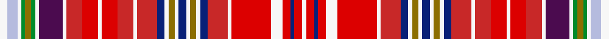

This is one **variant** — a specific cloth: this exact thread count and colourway, with its own
provenance below. It is one weaving of the [sett](/setts/w4lb5w2g2y3g2w2dp12w2r8ri8w2ri8r8w2r10db4w2y3w2db4w2y3w2db4r10w2ri20w6ri4db2ri4w2/) (the scale-free proportion — the
same cloth at any scale or shade), whose colour order is pattern [WRBRWRWRBWGWBWGWBRWRRWRRWBWGGGWWW](/stripes/wrbrwrwrbwgwbwgwbrwrrwrrwbwgggwww/).

Part of the [Culloden House Bed Hangings](/tartans/c/cu/culloden-house-bed-hangings/) tartan — the named design grouping this sett with its other cloths.

Sourced from register-of-tartans.  It is a [33 stripe tartan](/stripes/stripes33/).

Original link [https://www.tartanregister.gov.uk/tartanDetails.aspx?ref=826](https://www.tartanregister.gov.uk/tartanDetails.aspx?ref=826)

Dataset <small>— provenance for this record, inherited from the source manifest</small>

<dl class="dataset-prov">
<dt>source</dt><dd><a href="/sources/register-of-tartans/">Scottish Register of Tartans</a></dd>
<dt>data captured from</dt><dd><a href="https://github.com/thetartan/tartan-database/blob/master/data/register-of-tartans/data.csv">https://github.com/thetartan/tartan-database/blob/master/data/register-of-tartans/data.csv</a></dd>
<dt>data date</dt><dd>2017-01-06 <small>(dataset default)</small></dd>
<dt>licence</dt><dd><a href="https://www.tartanregister.gov.uk/copyright">Crown copyright</a></dd>
</dl>

Capture chain <small>— the hands this data passed through, oldest first; each capture carries its own licence</small>

<ol class="capture-chain">
<li><a href="https://www.tartanregister.gov.uk/">Scottish Register of Tartans</a> · <a href="https://www.tartanregister.gov.uk/copyright">Crown copyright</a> <small>the living register — still published by National Records of Scotland</small></li>
<li><a href="https://github.com/thetartan/tartan-database">thetartan/tartan-database</a> <small>2016-2017</small> · <a href="https://creativecommons.org/licenses/by-nc-nd/4.0/">CC BY-NC-ND 4.0</a> <small>Levko Kravets's frozen compilation — the capture we vendored, and where its CC licence text came from</small></li>
<li>this dictionary <small>captured 2026-06-10 · commit 5bf86c7566</small> <small>each re-capture is a git commit to data/sources</small></li>
</ol>

## Register references

External register numbers recorded for this tartan.

- Scottish Register of Tartans: [826](https://www.tartanregister.gov.uk/tartanDetails.aspx?ref=826)
- Scottish Tartans World Register: 1696

## Thread count
W/8 LB10 W4 G4 Y6 G4 W4 DP24 W4 R16 Ri16 W4 Ri16 R16 W4 R20 DB8 W4 Y6 W4 DB8 W4 Y6 W4 DB8 R20 W4 Ri40 W12 Ri8 DB4 Ri8 W/4

One full sett is **612 threads**.

## Palette
<table><thead><tr><th>Colour</th><th>Shade</th><th>OKLCh</th></tr></thead><tbody><tr><td>DB</td><td><code style="background-color:#082077;">#082077</code> <small style="color:#888">#082077</small></td><td><small style="color:#888">oklch(30.0% 0.149 265.1)</small></td></tr><tr><td>LB</td><td><code style="background-color:#B5BBDE;">#B5BBDE</code> <small style="color:#888">#B5BBDE</small></td><td><small style="color:#888">oklch(79.9% 0.050 277.6)</small></td></tr><tr><td>G</td><td><code style="background-color:#008B2A;">#008B2A</code> <small style="color:#888">#008B2A</small></td><td><small style="color:#888">oklch(55.4% 0.170 145.9)</small></td></tr><tr><td>W</td><td><code style="background-color:#F7F7F7;">#F7F7F7</code> <small style="color:#888">#F7F7F7</small></td><td><small style="color:#888">oklch(97.6% 0.000 89.9)</small></td></tr><tr><td>DP</td><td><code style="background-color:#4B0B4F;">#4B0B4F</code> <small style="color:#888">#4B0B4F</small></td><td><small style="color:#888">oklch(30.1% 0.125 325.4)</small></td></tr><tr><td>R</td><td><code style="background-color:#DC0000;">#DC0000</code> <small style="color:#888">#DC0000</small></td><td><small style="color:#888">oklch(56.2% 0.230 29.2)</small></td></tr><tr><td>R</td><td><code style="background-color:#C82828;">#C82828</code> <small style="color:#888">#C82828</small></td><td><small style="color:#888">oklch(54.2% 0.196 26.8)</small></td></tr><tr><td>Y</td><td><code style="background-color:#8B6E00;">#8B6E00</code> <small style="color:#888">#8B6E00</small></td><td><small style="color:#888">oklch(55.1% 0.113 90.4)</small></td></tr></tbody></table>

# Sample pattern

## Nearest tartan variants

The nearest existing variants by ΔTartan distance, with this cloth at the top so the swatches line up against it.

ΔTartan

Threads

Variant

Sett

—

612

<a href="/variants/s33/w4lb5w2g2y3g2w2dp12w2r8ri8w2ri8r8w2r10db4w2y3w2db4w2y3w2db4r10w2ri20w6ri4db2ri4w2~x2~r2208029-ri2209032/">Culloden House Bed Hangings</a>

<a href="/ttd/edit/#slug=ri4w1r11ri2w2dp11lb4w2lb4dp11w2g4y4w1dp5w1y4g4w2dg10g4w2g4dg10w2lb2dp6w1dp6lb2w2ri2r11w1ri4w1~x2~ri2406019-r2109032-g2408144-dg1806142&amp;base=w4lb5w2g2y3g2w2dp12w2r8ri8w2ri8r8w2r10db4w2y3w2db4w2y3w2db4r10w2ri20w6ri4db2ri4w2~x2~r2208029-ri2209032" title="compare in the TTD">3.17</a>

586

<a href="/variants/s36/ri4w1r11ri2w2dp11lb4w2lb4dp11w2g4y4w1dp5w1y4g4w2dg10g4w2g4dg10w2lb2dp6w1dp6lb2w2ri2r11w1ri4w1~x2~ri2406019-r2109032-g2408144-dg1806142/">Waggrall Family Tartan</a>

<a href="/ttd/edit/#slug=w4lb5w2g2y3g2w2dp12w2b8r8w2r8b8w2b10db4w2y3w2db4w2y3w2db4b10w2r20w6r4db2r4w2~x2&amp;base=w4lb5w2g2y3g2w2dp12w2r8ri8w2ri8r8w2r10db4w2y3w2db4w2y3w2db4r10w2ri20w6ri4db2ri4w2~x2~r2208029-ri2209032" title="compare in the TTD">3.28</a>

612

<a href="/variants/s33/w4lb5w2g2y3g2w2dp12w2b8r8w2r8b8w2b10db4w2y3w2db4w2y3w2db4b10w2r20w6r4db2r4w2~x2/">Culloden, House Bed Hangings</a>

<a href="/ttd/edit/#slug=r4w1ri11r2w2dp11lb4w2lb4dp11w2g4dy4w1dp5w1dy4g4w2dg10g4w2g4dg10w2lb2dp6w1dp6lb2w2r2ri11w1r4w1ri11r2w2lb2dp6w1dp6lb2w2dg6g2dy2w1dy2g2dg6w2r2ri11w1r4~x2~r2109013-ri2109032&amp;base=w4lb5w2g2y3g2w2dp12w2r8ri8w2ri8r8w2r10db4w2y3w2db4w2y3w2db4r10w2ri20w6ri4db2ri4w2~x2~r2208029-ri2209032" title="compare in the TTD">3.72</a>

880

<a href="/variants/s57/r4w1ri11r2w2dp11lb4w2lb4dp11w2g4dy4w1dp5w1dy4g4w2dg10g4w2g4dg10w2lb2dp6w1dp6lb2w2r2ri11w1r4w1ri11r2w2lb2dp6w1dp6lb2w2dg6g2dy2w1dy2g2dg6w2r2ri11w1r4~x2~r2109013-ri2109032/">Waggrall (Clan)</a>

<a href="/ttd/edit/#slug=b4w1r11b2w2dp11lb4w2lb4dp11w2dg4y4w1dp5w1y4dg4w2g10dg4w2dg4g10w2lb2dp6w1dp6lb2w2b2r11w1b4w1~x2&amp;base=w4lb5w2g2y3g2w2dp12w2r8ri8w2ri8r8w2r10db4w2y3w2db4w2y3w2db4r10w2ri20w6ri4db2ri4w2~x2~r2208029-ri2209032" title="compare in the TTD">3.91</a>

586

<a href="/variants/s36/b4w1r11b2w2dp11lb4w2lb4dp11w2dg4y4w1dp5w1y4dg4w2g10dg4w2dg4g10w2lb2dp6w1dp6lb2w2b2r11w1b4w1~x2/">Waggrall</a>

## Neighbour map

Every grey dot is one of 13621 variants placed by the first two principal components of the ΔTartan feature space (42% of its variance). Red is this tartan; blue dots are its nearest — click one to open its page.

<svg viewBox="0 0 640 380" role="img" style="max-width:100%;height:auto;border:1px solid #e0e0e0;border-radius:4px;display:block" xmlns="http://www.w3.org/2000/svg"><image href="/nn/cloud.v1.png" width="640" height="380"/><a href="/variants/s36/ri4w1r11ri2w2dp11lb4w2lb4dp11w2g4y4w1dp5w1y4g4w2dg10g4w2g4dg10w2lb2dp6w1dp6lb2w2ri2r11w1ri4w1~x2~ri2406019-r2109032-g2408144-dg1806142/"><circle cx="14.0" cy="88.9" r="4" fill="#3465a4"><title>Waggrall Family Tartan</title></circle></a><a href="/variants/s33/w4lb5w2g2y3g2w2dp12w2b8r8w2r8b8w2b10db4w2y3w2db4w2y3w2db4b10w2r20w6r4db2r4w2~x2/"><circle cx="28.6" cy="92.3" r="4" fill="#3465a4"><title>Culloden, House Bed Hangings</title></circle></a><a href="/variants/s57/r4w1ri11r2w2dp11lb4w2lb4dp11w2g4dy4w1dp5w1dy4g4w2dg10g4w2g4dg10w2lb2dp6w1dp6lb2w2r2ri11w1r4w1ri11r2w2lb2dp6w1dp6lb2w2dg6g2dy2w1dy2g2dg6w2r2ri11w1r4~x2~r2109013-ri2109032/"><circle cx="14.0" cy="67.2" r="4" fill="#3465a4"><title>Waggrall (Clan)</title></circle></a><a href="/variants/s36/b4w1r11b2w2dp11lb4w2lb4dp11w2dg4y4w1dp5w1y4dg4w2g10dg4w2dg4g10w2lb2dp6w1dp6lb2w2b2r11w1b4w1~x2/"><circle cx="14.0" cy="92.7" r="4" fill="#3465a4"><title>Waggrall</title></circle></a><circle cx="34.0" cy="87.4" r="5" fill="#c00000"/><text x="320" y="376" text-anchor="middle" font-size="11" fill="#999">ground</text><text x="11" y="190" text-anchor="middle" font-size="11" fill="#999" transform="rotate(-90 11 190)">complexity</text></svg>

ID: /variants/s33/w4lb5w2g2y3g2w2dp12w2r8ri8w2ri8r8w2r10db4w2y3w2db4w2y3w2db4r10w2ri20w6ri4db2ri4w2~x2~r2208029-ri2209032/
