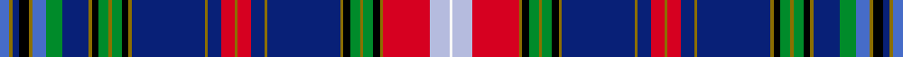

This page is one **sett** — a single exact thread-count. It belongs to the [tartan](/setts/b3y1db2k3y1b4g5db8y1k2g3y1g3k2y1db22y1db4r4y1r4db4y1db22y1k2g3y1g3k2y1r14lb6w1/)
(the same proportion at any scale), whose colour order is pattern [BGBKGBGBGKGGGKGBGBRGRBGBGKGGGKGRWW](/stripes/bgbkgbgbgkgggkgbgbrgrbgbgkgggkgrww/).

Part of the [Hebrides, Inner](/tartans/hebrides-inner/) tartan — the named design grouping this sett with its other cloths.

Sourced from weddslist.  It is a [34 stripe tartan](/stripes/stripes34/).

Original link http://www.weddslist.com/cgi-bin/tartans/pg.pl?source=sts

## Thread count
B/6 Y2 DB4 K6 Y2 B8 G10 DB16 Y2 K4 G6 Y2 G6 K4 Y2 DB44 Y2 DB8 R8 Y2 R8 DB8 Y2 DB44 Y2 K4 G6 Y2 G6 K4 Y2 R28 LB12 W/2

One full sett is **540 threads**.

## Palette
<table><thead><tr><th>Colour</th><th>Shade</th><th>OKLCh</th></tr></thead><tbody><tr><td>B</td><td><code style="background-color:#082077;">#082077</code> <small style="color:#888">#082077</small></td><td><small style="color:#888">oklch(30.0% 0.149 265.1)</small></td></tr><tr><td>Ba</td><td><code style="background-color:#B5BBDE;">#B5BBDE</code> <small style="color:#888">#B5BBDE</small></td><td><small style="color:#888">oklch(79.9% 0.050 277.6)</small></td></tr><tr><td>G</td><td><code style="background-color:#466CC8;">#466CC8</code> <small style="color:#888">#466CC8</small></td><td><small style="color:#888">oklch(55.1% 0.149 265.0)</small></td></tr><tr><td>Ga</td><td><code style="background-color:#008B2A;">#008B2A</code> <small style="color:#888">#008B2A</small></td><td><small style="color:#888">oklch(55.4% 0.170 145.9)</small></td></tr><tr><td>K</td><td><code style="background-color:#000000;">#000000</code> <small style="color:#888">#000000</small></td><td><small style="color:#888">oklch(0.0% 0.000 0.0)</small></td></tr><tr><td>LN</td><td><code style="background-color:#F7F7F7;">#F7F7F7</code> <small style="color:#888">#F7F7F7</small></td><td><small style="color:#888">oklch(97.6% 0.000 89.9)</small></td></tr><tr><td>R</td><td><code style="background-color:#D60020;">#D60020</code> <small style="color:#888">#D60020</small></td><td><small style="color:#888">oklch(55.2% 0.224 25.5)</small></td></tr><tr><td>Y</td><td><code style="background-color:#8B6E00;">#8B6E00</code> <small style="color:#888">#8B6E00</small></td><td><small style="color:#888">oklch(55.1% 0.113 90.4)</small></td></tr></tbody></table>

# Sample pattern

## Compared to the master

This cloth is one sett of its design; the master sett (the exemplar the design is anchored on) is below for comparison.

Its **ΔTartan distance** from the master is **0.32** — the same measure the nearest-tartans table ranks by (0 is identical; a re-scale of the same cloth is near 0, a recolour or a different proportion further).

<figure style="margin:0"><figcaption style="color:#888;font-size:smaller">this sett</figcaption></figure>
<figure style="margin:0"><figcaption style="color:#888;font-size:smaller"><a href="/setts/g3dy1db2k3dy1g4dg5db8dy1k2dg3dy1dg3k2dy1db22dy1db4r4dy1r4db4dy1db22dy1k2dg3dy1dg3k2dy1r14lb6w1/">master sett →</a></figcaption></figure>

## Nearest variants

The nearest existing variants by ΔTartan distance, with this cloth at the top so the swatches line up against it.

ΔTartan

Threads

Variant

Sett

—

540

<a href="/variants/s34/b3y1db2k3y1b4g5db8y1k2g3y1g3k2y1db22y1db4r4y1r4db4y1db22y1k2g3y1g3k2y1r14lb6w1~x2/">Hebrides Inner</a>

<a href="/ttd/edit/#slug=g3y1db2k3y1g4dg5db8y1k2dg3y1dg3k2y1db22y1db4r4y1r4db4y1db22y1k2dg3y1dg3k2y1r14lb6w1~x2~g2408144-dg1806142&amp;base=b3y1db2k3y1b4g5db8y1k2g3y1g3k2y1db22y1db4r4y1r4db4y1db22y1k2g3y1g3k2y1r14lb6w1~x2" title="compare in the TTD">0.90</a>

540

<a href="/variants/s34/g3y1db2k3y1g4dg5db8y1k2dg3y1dg3k2y1db22y1db4r4y1r4db4y1db22y1k2dg3y1dg3k2y1r14lb6w1~x2~g2408144-dg1806142/">Hebrides Inner.. Artifact Tartan</a>

## Neighbour map

Every grey dot is one of 13620 variants placed by the first two principal components of the ΔTartan feature space (42% of its variance). Red is this tartan; blue dots are its nearest — click one to open its page.

<svg viewBox="0 0 640 380" role="img" style="max-width:100%;height:auto;border:1px solid #e0e0e0;border-radius:4px;display:block" xmlns="http://www.w3.org/2000/svg"><image href="/nn/cloud.v1.png" width="640" height="380"/><a href="/variants/s34/g3y1db2k3y1g4dg5db8y1k2dg3y1dg3k2y1db22y1db4r4y1r4db4y1db22y1k2dg3y1dg3k2y1r14lb6w1~x2~g2408144-dg1806142/"><circle cx="131.6" cy="16.1" r="4" fill="#3465a4"><title>Hebrides Inner.. Artifact Tartan</title></circle></a><circle cx="130.7" cy="15.5" r="5" fill="#c00000"/><text x="320" y="376" text-anchor="middle" font-size="11" fill="#999">ground</text><text x="11" y="190" text-anchor="middle" font-size="11" fill="#999" transform="rotate(-90 11 190)">complexity</text></svg>

ID: /variants/s34/b3y1db2k3y1b4g5db8y1k2g3y1g3k2y1db22y1db4r4y1r4db4y1db22y1k2g3y1g3k2y1r14lb6w1~x2/
