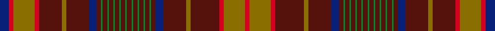

This is one **variant** — a specific cloth: this exact thread count and colourway, with its own
provenance below. It is one weaving of the [sett](/setts/db6r3y14r3dr15y3dr15db5dr3g1dr3g1dr3g1dr3g1dr3g1dr3g1dr3g1dr3g1dr3g1dr3db5dr15y3dr19r3y14r3/) (the scale-free proportion — the
same cloth at any scale or shade), whose colour order is pattern [BRGRBGBBBGBGBGBGBGBGBGBGBGBBBGBRGR](/stripes/brgrbgbbbgbgbgbgbgbgbgbgbgbbbgbrgr/).

Sourced from house-of-tartan.  It is a [34 stripe tartan](/stripes/stripes34/).

Original link [http://www.house-of-tartan.scotland.net/house/TartanViewjs.asp?colr=Def&tnam=5802](http://www.house-of-tartan.scotland.net/house/TartanViewjs.asp?colr=Def&tnam=5802)

## Provenance

Earliest known date: 2003 The Confrerie de Vouvray tartan was created for the French Order of Wine Growers by the Chevaliers Ecossais de la Chantepleure de Vouvray. The red, yellow and maroon are the colours of the french order and the grid pattern of green lines depict the rows of vines of the Chenin Blanc grape. The tartan was presented as a gift to the Grand Council at the 2nd Scottish Confrerie, held in Dundee in May 2003.

Dataset <small>— provenance for this record, inherited from the source manifest</small>

<dl class="dataset-prov">
<dt>source</dt><dd><a href="/sources/house-of-tartan/">House of Tartan</a></dd>
<dt>data captured from</dt><dd><a href="https://github.com/thetartan/tartan-database/blob/master/data/house-of-tartan/data.csv">https://github.com/thetartan/tartan-database/blob/master/data/house-of-tartan/data.csv</a></dd>
<dt>data date</dt><dd>2003 <small>(this record)</small></dd>
<dt>licence</dt><dd><a href="https://creativecommons.org/licenses/by-nc-nd/4.0/">CC BY-NC-ND 4.0</a></dd>
</dl>

Capture chain <small>— the hands this data passed through, oldest first; each capture carries its own licence</small>

<ol class="capture-chain">
<li><a href="http://www.house-of-tartan.scotland.net/">House of Tartan</a> <small>the weaver/retailer's database — the site is now offline; the URL is kept as the ultimate source's identity</small></li>
<li><a href="https://github.com/thetartan/tartan-database">thetartan/tartan-database</a> <small>2016-2017</small> · <a href="https://creativecommons.org/licenses/by-nc-nd/4.0/">CC BY-NC-ND 4.0</a> <small>Levko Kravets's frozen compilation — the capture we vendored, and where its CC licence text came from</small></li>
<li>this dictionary <small>captured 2026-06-10 · commit 5bf86c7566</small> <small>each re-capture is a git commit to data/sources</small></li>
</ol>

## Thread count
DB/12 R6 Y28 R6 DR30 Y6 DR30 DB10 DR6 G2 DR6 G2 DR6 G2 DR6 G2 DR6 G2 DR6 G2 DR6 G2 DR6 G2 DR6 G2 DR6 DB10 DR30 Y6 DR38 R6 Y28 R/6

One full sett is **642 threads**.

## Palette
<table><thead><tr><th>Colour</th><th>Shade</th><th>OKLCh</th></tr></thead><tbody><tr><td>DB</td><td><code style="background-color:#082077;">#082077</code> <small style="color:#888">#082077</small></td><td><small style="color:#888">oklch(30.0% 0.149 265.1)</small></td></tr><tr><td>DR</td><td><code style="background-color:#55120C;">#55120C</code> <small style="color:#888">#55120C</small></td><td><small style="color:#888">oklch(30.0% 0.099 29.3)</small></td></tr><tr><td>G</td><td><code style="background-color:#008B2A;">#008B2A</code> <small style="color:#888">#008B2A</small></td><td><small style="color:#888">oklch(55.4% 0.170 145.9)</small></td></tr><tr><td>R</td><td><code style="background-color:#D60020;">#D60020</code> <small style="color:#888">#D60020</small></td><td><small style="color:#888">oklch(55.2% 0.224 25.5)</small></td></tr><tr><td>Y</td><td><code style="background-color:#8B6E00;">#8B6E00</code> <small style="color:#888">#8B6E00</small></td><td><small style="color:#888">oklch(55.1% 0.113 90.4)</small></td></tr></tbody></table>

# Sample pattern

## Nearest tartan variants

The nearest existing variants by ΔTartan distance, with this cloth at the top so the swatches line up against it.

ΔTartan

Threads

Variant

Sett

—

642

<a href="/variants/s34/db6r3y14r3dr15y3dr15db5dr3g1dr3g1dr3g1dr3g1dr3g1dr3g1dr3g1dr3g1dr3g1dr3db5dr15y3dr19r3y14r3~x2/">Confrerie de Vouvray Corporate Tartan</a>

<a href="/ttd/edit/#slug=db8r4y18r4dr19y4dr19db6dr4g1dr4g1dr4g1dr4g1dr4~x2&amp;base=db6r3y14r3dr15y3dr15db5dr3g1dr3g1dr3g1dr3g1dr3g1dr3g1dr3g1dr3g1dr3g1dr3db5dr15y3dr19r3y14r3~x2" title="compare in the TTD">3.10</a>

400

<a href="/variants/s17/db8r4y18r4dr19y4dr19db6dr4g1dr4g1dr4g1dr4g1dr4~x2/">Confrerie de Vouvray</a>

<a href="/ttd/edit/#slug=dg32r7dg32r33dg4r12dg4r33w3r12dy3dp33r7dp33dy3r12w3r33dp2r2dp5r2dp2r33dp2r2dp5r2dp2r33dg32r6dg23&amp;base=db6r3y14r3dr15y3dr15db5dr3g1dr3g1dr3g1dr3g1dr3g1dr3g1dr3g1dr3g1dr3g1dr3db5dr15y3dr19r3y14r3~x2" title="compare in the TTD">3.54</a>

849

<a href="/variants/s33/dg32r7dg32r33dg4r12dg4r33w3r12dy3dp33r7dp33dy3r12w3r33dp2r2dp5r2dp2r33dp2r2dp5r2dp2r33dg32r6dg23/">Huntly (District)</a>

<a href="/ttd/edit/#slug=g32r7g32r33g4r12g4r33lb3r12ly3dp33r7dp33ly3r12lb3r33dp2r2dp5r2dp2r33dp2r2dp5r2dp2r33g32r7g32~x2&amp;base=db6r3y14r3dr15y3dr15db5dr3g1dr3g1dr3g1dr3g1dr3g1dr3g1dr3g1dr3g1dr3g1dr3db5dr15y3dr19r3y14r3~x2" title="compare in the TTD">3.87</a>

1720

<a href="/variants/s33/g32r7g32r33g4r12g4r33lb3r12ly3dp33r7dp33ly3r12lb3r33dp2r2dp5r2dp2r33dp2r2dp5r2dp2r33g32r7g32~x2/">Marchioness of Huntly's</a>

## Neighbour map

Every grey dot is one of 13621 variants placed by the first two principal components of the ΔTartan feature space (42% of its variance). Red is this tartan; blue dots are its nearest — click one to open its page.

<svg viewBox="0 0 640 380" role="img" style="max-width:100%;height:auto;border:1px solid #e0e0e0;border-radius:4px;display:block" xmlns="http://www.w3.org/2000/svg"><image href="/nn/cloud.v1.png" width="640" height="380"/><a href="/variants/s17/db8r4y18r4dr19y4dr19db6dr4g1dr4g1dr4g1dr4g1dr4~x2/"><circle cx="333.6" cy="137.7" r="4" fill="#3465a4"><title>Confrerie de Vouvray</title></circle></a><a href="/variants/s33/dg32r7dg32r33dg4r12dg4r33w3r12dy3dp33r7dp33dy3r12w3r33dp2r2dp5r2dp2r33dp2r2dp5r2dp2r33dg32r6dg23/"><circle cx="268.9" cy="101.6" r="4" fill="#3465a4"><title>Huntly (District)</title></circle></a><a href="/variants/s33/g32r7g32r33g4r12g4r33lb3r12ly3dp33r7dp33ly3r12lb3r33dp2r2dp5r2dp2r33dp2r2dp5r2dp2r33g32r7g32~x2/"><circle cx="257.9" cy="103.1" r="4" fill="#3465a4"><title>Marchioness of Huntly's</title></circle></a><circle cx="335.3" cy="105.3" r="5" fill="#c00000"/><text x="320" y="376" text-anchor="middle" font-size="11" fill="#999">ground</text><text x="11" y="190" text-anchor="middle" font-size="11" fill="#999" transform="rotate(-90 11 190)">complexity</text></svg>

ID: /variants/s34/db6r3y14r3dr15y3dr15db5dr3g1dr3g1dr3g1dr3g1dr3g1dr3g1dr3g1dr3g1dr3g1dr3db5dr15y3dr19r3y14r3~x2/
