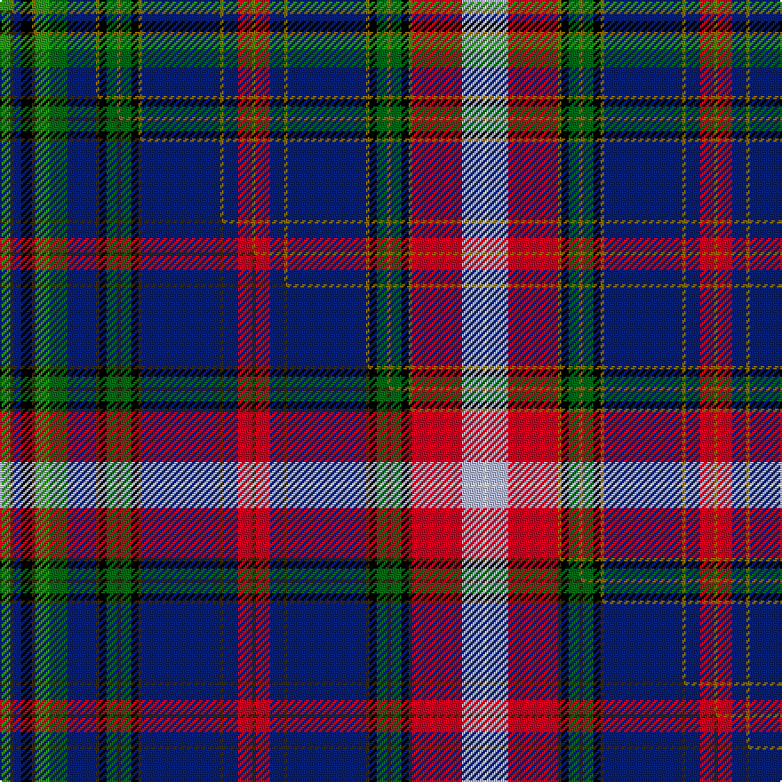

This is one **variant** — a specific cloth: this exact thread count and colourway, with its own
provenance below. It is one weaving of the [sett](/tartans/h/he/hebrides-inner-2/) (the scale-free proportion — the
same cloth at any scale or shade), whose colour order is pattern [GGBKGGGBGKGGGKGBGBRGRBGBGKGGGKGRWW](/stripes/ggbkgggbgkgggkgbgbrgrbgbgkgggkgrww/).

Part of the [Hebrides, Inner](/tartans/h/he/hebrides-inner-2/) tartan — the named design grouping this sett with its other cloths.

Sourced from house-of-tartan.  It is a [34 stripe tartan](/stripes/stripes34/).

Original link [http://www.house-of-tartan.scotland.net/house/TartanViewjs.asp?colr=Def&tnam=957](http://www.house-of-tartan.scotland.net/house/TartanViewjs.asp?colr=Def&tnam=957)

## Provenance

Earliest known date: pre 2003 Alternative count on 1990

Dataset <small>— provenance for this record, inherited from the source manifest</small>

<dl class="dataset-prov">
<dt>source</dt><dd><a href="/sources/house-of-tartan/">House of Tartan</a></dd>
<dt>data captured from</dt><dd><a href="https://github.com/thetartan/tartan-database/blob/master/data/house-of-tartan/data.csv">https://github.com/thetartan/tartan-database/blob/master/data/house-of-tartan/data.csv</a></dd>
<dt>data date</dt><dd>pre 2003 <small>(this record)</small></dd>
<dt>licence</dt><dd><a href="https://creativecommons.org/licenses/by-nc-nd/4.0/">CC BY-NC-ND 4.0</a></dd>
</dl>

Capture chain <small>— the hands this data passed through, oldest first; each capture carries its own licence</small>

<ol class="capture-chain">
<li><a href="http://www.house-of-tartan.scotland.net/">House of Tartan</a> <small>the weaver/retailer's database — the site is now offline; the URL is kept as the ultimate source's identity</small></li>
<li><a href="https://github.com/thetartan/tartan-database">thetartan/tartan-database</a> <small>2016-2017</small> · <a href="https://creativecommons.org/licenses/by-nc-nd/4.0/">CC BY-NC-ND 4.0</a> <small>Levko Kravets's frozen compilation — the capture we vendored, and where its CC licence text came from</small></li>
<li>this dictionary <small>captured 2026-06-10 · commit 5bf86c7566</small> <small>each re-capture is a git commit to data/sources</small></li>
</ol>

## Thread count
G/6 Y2 DB4 K6 Y2 G8 DG10 DB16 Y2 K4 DG6 Y2 DG6 K4 Y2 DB44 Y2 DB8 R8 Y2 R8 DB8 Y2 DB44 Y2 K4 DG6 Y2 DG6 K4 Y2 R28 LB12 W/2

One full sett is **540 threads**.

## Palette
<table><thead><tr><th>Colour</th><th>Shade</th><th>OKLCh</th></tr></thead><tbody><tr><td>LB</td><td><code style="background-color:#B5BBDE;">#B5BBDE</code> <small style="color:#888">#B5BBDE</small></td><td><small style="color:#888">oklch(79.9% 0.050 277.6)</small></td></tr><tr><td>DB</td><td><code style="background-color:#082077;">#082077</code> <small style="color:#888">#082077</small></td><td><small style="color:#888">oklch(30.0% 0.149 265.1)</small></td></tr><tr><td>DG</td><td><code style="background-color:#006818;">#006818</code> <small style="color:#888">#006818</small></td><td><small style="color:#888">oklch(45.0% 0.142 145.0)</small></td></tr><tr><td>G</td><td><code style="background-color:#289C18;">#289C18</code> <small style="color:#888">#289C18</small></td><td><small style="color:#888">oklch(60.6% 0.191 141.6)</small></td></tr><tr><td>K</td><td><code style="background-color:#000000;">#000000</code> <small style="color:#888">#000000</small></td><td><small style="color:#888">oklch(0.0% 0.000 0.0)</small></td></tr><tr><td>W</td><td><code style="background-color:#F7F7F7;">#F7F7F7</code> <small style="color:#888">#F7F7F7</small></td><td><small style="color:#888">oklch(97.6% 0.000 89.9)</small></td></tr><tr><td>R</td><td><code style="background-color:#D60020;">#D60020</code> <small style="color:#888">#D60020</small></td><td><small style="color:#888">oklch(55.2% 0.224 25.5)</small></td></tr><tr><td>Y</td><td><code style="background-color:#8B6E00;">#8B6E00</code> <small style="color:#888">#8B6E00</small></td><td><small style="color:#888">oklch(55.1% 0.113 90.4)</small></td></tr></tbody></table>

# Sample pattern

## Compared to the master

This cloth is one sett of its design; the master sett (the exemplar the design is anchored on) is below for comparison.

Its **ΔTartan distance** from the master is **0.05** — the same measure the nearest-tartans table ranks by (0 is identical; a re-scale of the same cloth is near 0, a recolour or a different proportion further).

<figure class="master-compare" style="margin:0">

this sett
master sett ★

<figcaption style="color:#888;font-size:smaller">One weave of this sett against the <a href="/setts/g3dy1db2k3dy1g4dg5db8dy1k2dg3dy1dg3k2dy1db22dy1db4r4dy1r4db4dy1db22dy1k2dg3dy1dg3k2dy1r14lb6w1/">master sett ★</a>, split on the diagonal: a shared proportion runs seamlessly across it with only the shades shifting; a different proportion breaks on it.</figcaption>
</figure>

## Nearest tartan variants

The nearest existing variants by ΔTartan distance, with this cloth at the top so the swatches line up against it.

ΔTartan

Threads

Variant

Sett

—

540

<a href="/variants/s34/g3y1db2k3y1g4dg5db8y1k2dg3y1dg3k2y1db22y1db4r4y1r4db4y1db22y1k2dg3y1dg3k2y1r14lb6w1~x2~g6019141-dg4514144/">Hebrides Inner.. Artifact Tartan</a>

<a href="/ttd/edit/#slug=g3dy1db2k3dy1g4dg5db8dy1k2dg3dy1dg3k2dy1db22dy1db4r4dy1r4db4dy1db22dy1k2dg3dy1dg3k2dy1r14lb6w1~x2~g6019141-dg4514144&amp;base=g3y1db2k3y1g4dg5db8y1k2dg3y1dg3k2y1db22y1db4r4y1r4db4y1db22y1k2dg3y1dg3k2y1r14lb6w1~x2~g6019141-dg4514144" title="compare in the TTD">0.05</a>

540

<a href="/variants/s34/g3dy1db2k3dy1g4dg5db8dy1k2dg3dy1dg3k2dy1db22dy1db4r4dy1r4db4dy1db22dy1k2dg3dy1dg3k2dy1r14lb6w1~x2~g6019141-dg4514144/">Hebrides, Inner #01</a>

<a href="/ttd/edit/#slug=b3y1db2k3y1b4g5db8y1k2g3y1g3k2y1db22y1db4r4y1r4db4y1db22y1k2g3y1g3k2y1r14lb6w1~x2&amp;base=g3y1db2k3y1g4dg5db8y1k2dg3y1dg3k2y1db22y1db4r4y1r4db4y1db22y1k2dg3y1dg3k2y1r14lb6w1~x2~g6019141-dg4514144" title="compare in the TTD">0.90</a>

540

<a href="/variants/s34/b3y1db2k3y1b4g5db8y1k2g3y1g3k2y1db22y1db4r4y1r4db4y1db22y1k2g3y1g3k2y1r14lb6w1~x2/">Hebrides Inner</a>

<a href="/ttd/edit/#slug=dp7w1dp7w1dp24w1dp2lb2w1lb2dp2w1dg10g3w1dp4lb2w1r3w1lb2dp3w1g3dg10w1dp2lb2w1lb2dp2w1dp6r16k2r2~x2&amp;base=g3y1db2k3y1g4dg5db8y1k2dg3y1dg3k2y1db22y1db4r4y1r4db4y1db22y1k2dg3y1dg3k2y1r14lb6w1~x2~g6019141-dg4514144" title="compare in the TTD">3.37</a>

510

<a href="/variants/s36/dp7w1dp7w1dp24w1dp2lb2w1lb2dp2w1dg10g3w1dp4lb2w1r3w1lb2dp3w1g3dg10w1dp2lb2w1lb2dp2w1dp6r16k2r2~x2/">Mackintosh #7</a>

<a href="/ttd/edit/#slug=dg12y1k2w2k2w2k2w2k2y1dg12dp1dg2dp3dg1dp4r2dp4dg1dp3dg2dp1dg12k1lb4k1lb4k1lb4k1dg12dp1dg2dp3dg1dp4y2dp4dg1dp3dg2dp1~x2&amp;base=g3y1db2k3y1g4dg5db8y1k2dg3y1dg3k2y1db22y1db4r4y1r4db4y1db22y1k2dg3y1dg3k2y1r14lb6w1~x2~g6019141-dg4514144" title="compare in the TTD">3.52</a>

486

<a href="/variants/s42/dg12y1k2w2k2w2k2w2k2y1dg12dp1dg2dp3dg1dp4r2dp4dg1dp3dg2dp1dg12k1lb4k1lb4k1lb4k1dg12dp1dg2dp3dg1dp4y2dp4dg1dp3dg2dp1~x2/">Lodge Dunblane Australis No.966</a>

<a href="/ttd/edit/#slug=dg12ly1k2w2k2w2k2w2k2ly1dg12dp1dg2dp3dg1dp4r2dp4dg1dp3dg2dp1dg12k1lb4k1lb4k1lb4k1dg12dp1dg2dp3dg1dp4ly2dp4dg1dp3dg2dp1~x2&amp;base=g3y1db2k3y1g4dg5db8y1k2dg3y1dg3k2y1db22y1db4r4y1r4db4y1db22y1k2dg3y1dg3k2y1r14lb6w1~x2~g6019141-dg4514144" title="compare in the TTD">3.55</a>

486

<a href="/variants/s42/dg12ly1k2w2k2w2k2w2k2ly1dg12dp1dg2dp3dg1dp4r2dp4dg1dp3dg2dp1dg12k1lb4k1lb4k1lb4k1dg12dp1dg2dp3dg1dp4ly2dp4dg1dp3dg2dp1~x2/">Lodge Dunblane Australis No.966 (Cor</a>

<a href="/ttd/edit/#slug=dg8n12r3n9r3n12lb9db48k8lo2k8db48lb9n12r3n9r3n12dg8lo2~x2&amp;base=g3y1db2k3y1g4dg5db8y1k2dg3y1dg3k2y1db22y1db4r4y1r4db4y1db22y1k2dg3y1dg3k2y1r14lb6w1~x2~g6019141-dg4514144" title="compare in the TTD">3.60</a>

892

<a href="/variants/s20/dg8n12r3n9r3n12lb9db48k8lo2k8db48lb9n12r3n9r3n12dg8lo2~x2/">Heston</a>

<a href="/ttd/edit/#slug=db18ly4k5ly1k1w1k2g8r6k1r3w1r3k1r6g8k2w1k1ly1k5ly4db18lb2~x4&amp;base=g3y1db2k3y1g4dg5db8y1k2dg3y1dg3k2y1db22y1db4r4y1r4db4y1db22y1k2dg3y1dg3k2y1r14lb6w1~x2~g6019141-dg4514144" title="compare in the TTD">3.70</a>

744

<a href="/variants/s24/db18ly4k5ly1k1w1k2g8r6k1r3w1r3k1r6g8k2w1k1ly1k5ly4db18lb2~x4/">Bethune Name Tartan</a>

<a href="/ttd/edit/#slug=db10lb3lbi2lo2db21lo6db31lb2lo2dr11dt12lo2dp2g15dr2lo4g7k2lbi10~x2~lb7609282-lbi80&amp;base=g3y1db2k3y1g4dg5db8y1k2dg3y1dg3k2y1db22y1db4r4y1r4db4y1db22y1k2dg3y1dg3k2y1r14lb6w1~x2~g6019141-dg4514144" title="compare in the TTD">3.85</a>

544

<a href="/variants/s19/db10lb3lbi2lo2db21lo6db31lb2lo2dr11dt12lo2dp2g15dr2lo4g7k2lbi10~x2~lb7609282-lbi80/">Knox #1</a>

<a href="/ttd/edit/#slug=dg84r6dg8r16dg14k8db6k2db6k2db6k2dg4lb3dg16lb3dg4k6db8k3db6k3db8k10y3w3k3w6dg16r8k3r4w4r4&amp;base=g3y1db2k3y1g4dg5db8y1k2dg3y1dg3k2y1db22y1db4r4y1r4db4y1db22y1k2dg3y1dg3k2y1r14lb6w1~x2~g6019141-dg4514144" title="compare in the TTD">3.97</a>

488

<a href="/variants/s34/dg84r6dg8r16dg14k8db6k2db6k2db6k2dg4lb3dg16lb3dg4k6db8k3db6k3db8k10y3w3k3w6dg16r8k3r4w4r4/">Duke of Edinburgh (Fashion)</a>

## Neighbour map

Every grey dot is one of 13662 variants placed by the first two principal components of the ΔTartan feature space (42% of its variance). Red is this tartan; blue dots are its nearest — click one to open its page. The map is a flat projection of a many-dimensional space — [how to read it](/posts/neighbourhood-maps/).

<svg viewBox="0 0 640 380" role="img" style="max-width:100%;height:auto;border:1px solid #e0e0e0;border-radius:4px;display:block" xmlns="http://www.w3.org/2000/svg"><image href="/nn/cloud.v1.png" width="640" height="380"/><a href="/variants/s34/g3dy1db2k3dy1g4dg5db8dy1k2dg3dy1dg3k2dy1db22dy1db4r4dy1r4db4dy1db22dy1k2dg3dy1dg3k2dy1r14lb6w1~x2~g6019141-dg4514144/"><circle cx="125.5" cy="14.0" r="4" fill="#3465a4"><title>Hebrides, Inner #01</title></circle></a><a href="/variants/s34/b3y1db2k3y1b4g5db8y1k2g3y1g3k2y1db22y1db4r4y1r4db4y1db22y1k2g3y1g3k2y1r14lb6w1~x2/"><circle cx="130.5" cy="15.8" r="4" fill="#3465a4"><title>Hebrides Inner</title></circle></a><a href="/variants/s36/dp7w1dp7w1dp24w1dp2lb2w1lb2dp2w1dg10g3w1dp4lb2w1r3w1lb2dp3w1g3dg10w1dp2lb2w1lb2dp2w1dp6r16k2r2~x2/"><circle cx="142.4" cy="15.0" r="4" fill="#3465a4"><title>Mackintosh #7</title></circle></a><a href="/variants/s42/dg12y1k2w2k2w2k2w2k2y1dg12dp1dg2dp3dg1dp4r2dp4dg1dp3dg2dp1dg12k1lb4k1lb4k1lb4k1dg12dp1dg2dp3dg1dp4y2dp4dg1dp3dg2dp1~x2/"><circle cx="128.1" cy="60.4" r="4" fill="#3465a4"><title>Lodge Dunblane Australis No.966</title></circle></a><a href="/variants/s42/dg12ly1k2w2k2w2k2w2k2ly1dg12dp1dg2dp3dg1dp4r2dp4dg1dp3dg2dp1dg12k1lb4k1lb4k1lb4k1dg12dp1dg2dp3dg1dp4ly2dp4dg1dp3dg2dp1~x2/"><circle cx="123.3" cy="59.0" r="4" fill="#3465a4"><title>Lodge Dunblane Australis No.966 (Cor</title></circle></a><a href="/variants/s20/dg8n12r3n9r3n12lb9db48k8lo2k8db48lb9n12r3n9r3n12dg8lo2~x2/"><circle cx="175.9" cy="68.8" r="4" fill="#3465a4"><title>Heston</title></circle></a><a href="/variants/s24/db18ly4k5ly1k1w1k2g8r6k1r3w1r3k1r6g8k2w1k1ly1k5ly4db18lb2~x4/"><circle cx="68.1" cy="54.0" r="4" fill="#3465a4"><title>Bethune Name Tartan</title></circle></a><a href="/variants/s19/db10lb3lbi2lo2db21lo6db31lb2lo2dr11dt12lo2dp2g15dr2lo4g7k2lbi10~x2~lb7609282-lbi80/"><circle cx="84.8" cy="59.8" r="4" fill="#3465a4"><title>Knox #1</title></circle></a><a href="/variants/s34/dg84r6dg8r16dg14k8db6k2db6k2db6k2dg4lb3dg16lb3dg4k6db8k3db6k3db8k10y3w3k3w6dg16r8k3r4w4r4/"><circle cx="210.0" cy="14.0" r="4" fill="#3465a4"><title>Duke of Edinburgh (Fashion)</title></circle></a><circle cx="131.4" cy="16.4" r="5" fill="#c00000"/><text x="320" y="376" text-anchor="middle" font-size="11" fill="#999">ground</text><text x="11" y="190" text-anchor="middle" font-size="11" fill="#999" transform="rotate(-90 11 190)">complexity</text></svg>

ID: /variants/s34/g3y1db2k3y1g4dg5db8y1k2dg3y1dg3k2y1db22y1db4r4y1r4db4y1db22y1k2dg3y1dg3k2y1r14lb6w1~x2~g6019141-dg4514144/
