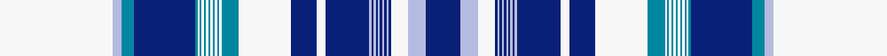

This is one **variant** — a specific cloth: this exact thread count and colourway, with its own
provenance below. It is one weaving of the [sett](/tartans/l/la/lake-superior/) (the scale-free proportion — the
same cloth at any scale or shade), whose colour order is pattern [BWWBWBWBWBWBWBWBWBWBWBWBWBWBWBBBWW](/stripes/bwwbwbwbwbwbwbwbwbwbwbwbwbwbwbbbww/).

Part of the [Lake Superior](/tartans/l/la/lake-superior/) tartan — the named design grouping this sett with its other cloths.

Sourced from register-of-tartans.  It is a [34 stripe tartan](/stripes/stripes34/).

Original link [https://www.tartanregister.gov.uk/tartanDetails.aspx?ref=10198](https://www.tartanregister.gov.uk/tartanDetails.aspx?ref=10198)

2 attestations — the source records this cloth was collapsed from (oldest owns this page)

<ul>
<li>14/11/2007 — Lake Superior Ice Water Mansion (register-of-tartans, <a href="https://www.tartanregister.gov.uk/tartanDetails.aspx?ref=10198">record</a>)  <em>Designed in 2007. The name is taken from the lyrics of 'The Wreck of the Edmund Fitzgerald' by Gordon Lightfoot which commemorates the SS Edmund Fitzgerald, a bulk iron ore carrier wrecked in Lake Superior in 1975.</em></li>
<li>14th Nov. 2007 — Lake Superior (Fashion) (tartans-authority, <a href="https://web.archive.org/web/*/http://www.tartansauthority.com/tartan-ferret/display/10198/*">record</a>)  <em>The full name is taken from the lyrics of 'The Wreck of the Edmund Fitzgerald' by Gordon Lightfoot which commemorates the SS Edmund Fitzgerald, a bulk iron ore carrier wrecked in Lake Superior in 1975. Registrant details: Mr Jamie Mcintyre, 53 1 Royalwood Ct, Stoney Creek, Ontario, Canada, L8E 4Y2 AMCINTYRE7@COGECO.CA</em></li>
</ul>

Dataset <small>— provenance for this record, inherited from the source manifest</small>

<dl class="dataset-prov">
<dt>source</dt><dd><a href="/sources/register-of-tartans/">Scottish Register of Tartans</a></dd>
<dt>data captured from</dt><dd><a href="https://github.com/thetartan/tartan-database/blob/master/data/register-of-tartans/data.csv">https://github.com/thetartan/tartan-database/blob/master/data/register-of-tartans/data.csv</a></dd>
<dt>data date</dt><dd>14/11/2007 <small>(this record)</small></dd>
<dt>licence</dt><dd><a href="https://www.tartanregister.gov.uk/copyright">Crown copyright</a></dd>
</dl>

Capture chain <small>— the hands this data passed through, oldest first; each capture carries its own licence</small>

<ol class="capture-chain">
<li><a href="https://www.tartanregister.gov.uk/">Scottish Register of Tartans</a> · <a href="https://www.tartanregister.gov.uk/copyright">Crown copyright</a> <small>the living register — still published by National Records of Scotland</small></li>
<li><a href="https://github.com/thetartan/tartan-database">thetartan/tartan-database</a> <small>2016-2017</small> · <a href="https://creativecommons.org/licenses/by-nc-nd/4.0/">CC BY-NC-ND 4.0</a> <small>Levko Kravets's frozen compilation — the capture we vendored, and where its CC licence text came from</small></li>
<li>this dictionary <small>captured 2026-06-10 · commit 5bf86c7566</small> <small>each re-capture is a git commit to data/sources</small></li>
</ol>

## Register references

External register numbers recorded for this tartan.

- Scottish Register of Tartans: [10198](https://www.tartanregister.gov.uk/tartanDetails.aspx?ref=10198)
- Scottish Tartans Authority (ITI): 10198

## Thread count
W/104 LB8 T12 DB56 T2 W2 T2 W2 T2 W2 T2 W2 T2 W2 T2 W2 T16 W48 DB24 W8 DB40 LB2 DB2 LB2 DB2 LB2 DB2 LB2 DB2 LB2 DB2 W16 LB16 DB/32

One full sett is **712 threads**.

## Palette
<table><thead><tr><th>Colour</th><th>Shade</th><th>OKLCh</th></tr></thead><tbody><tr><td>LB</td><td><code style="background-color:#B5BBDE;">#B5BBDE</code> <small style="color:#888">#B5BBDE</small></td><td><small style="color:#888">oklch(79.9% 0.050 277.6)</small></td></tr><tr><td>T</td><td><code style="background-color:#00879F;">#00879F</code> <small style="color:#888">#00879F</small></td><td><small style="color:#888">oklch(57.4% 0.102 216.1)</small></td></tr><tr><td>DB</td><td><code style="background-color:#082077;">#082077</code> <small style="color:#888">#082077</small></td><td><small style="color:#888">oklch(30.0% 0.149 265.1)</small></td></tr><tr><td>W</td><td><code style="background-color:#F7F7F7;">#F7F7F7</code> <small style="color:#888">#F7F7F7</small></td><td><small style="color:#888">oklch(97.6% 0.000 89.9)</small></td></tr></tbody></table>

# Sample pattern

ID: /variants/s34/w52lb4t6db28t1w1t1w1t1w1t1w1t1w1t1w1t8w24db12w4db20lb1db1lb1db1lb1db1lb1db1lb1db1w8lb8db16~x2/
