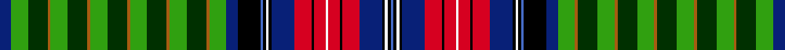

This page is one **sett** — a single exact thread-count. It belongs to the [tartan](/setts/db4g6dg7o1g6dg7o1g6dg7o1g6dg7o1g6dg7o1g6db4k8b1k1w1k1db8r6k1r4w1r4k1r6db8k1w1k1b1/)
(the same proportion at any scale), whose colour order is pattern [BGGRGGRGGRGGRGGRGBKBKWKBRKRWRKRBKWKB](/stripes/bggrggrggrggrggrgbkbkwkbrkrwrkrbkwkb/).

Sourced from weddslist.  It is a [36 stripe tartan](/stripes/stripes36/).

Original link http://www.weddslist.com/cgi-bin/tartans/pg.pl?source=sts

## Thread count
DB/8 G12 DG14 O2 G12 DG14 O2 G12 DG14 O2 G12 DG14 O2 G12 DG14 O2 G12 DB8 K16 B2 K2 W2 K2 DB16 R12 K2 R8 W2 R8 K2 R12 DB16 K2 W2 K2 B/2

One full sett is **546 threads**.

## Palette
<table><thead><tr><th>Colour</th><th>Shade</th><th>OKLCh</th></tr></thead><tbody><tr><td>DB</td><td><code style="background-color:#082077;">#082077</code> <small style="color:#888">#082077</small></td><td><small style="color:#888">oklch(30.0% 0.149 265.1)</small></td></tr><tr><td>DG</td><td><code style="background-color:#003000;">#003000</code> <small style="color:#888">#003000</small></td><td><small style="color:#888">oklch(26.8% 0.091 142.5)</small></td></tr><tr><td>G</td><td><code style="background-color:#30A010;">#30A010</code> <small style="color:#888">#30A010</small></td><td><small style="color:#888">oklch(61.9% 0.195 140.5)</small></td></tr><tr><td>K</td><td><code style="background-color:#000000;">#000000</code> <small style="color:#888">#000000</small></td><td><small style="color:#888">oklch(0.0% 0.000 0.0)</small></td></tr><tr><td>W</td><td><code style="background-color:#F7F7F7;">#F7F7F7</code> <small style="color:#888">#F7F7F7</small></td><td><small style="color:#888">oklch(97.6% 0.000 89.9)</small></td></tr><tr><td>O</td><td><code style="background-color:#A65C11;">#A65C11</code> <small style="color:#888">#A65C11</small></td><td><small style="color:#888">oklch(55.0% 0.125 58.3)</small></td></tr><tr><td>B</td><td><code style="background-color:#466CC8;">#466CC8</code> <small style="color:#888">#466CC8</small></td><td><small style="color:#888">oklch(55.1% 0.149 265.0)</small></td></tr><tr><td>R</td><td><code style="background-color:#D60020;">#D60020</code> <small style="color:#888">#D60020</small></td><td><small style="color:#888">oklch(55.2% 0.224 25.5)</small></td></tr></tbody></table>

# Sample pattern

## Nearest variants

The nearest existing variants by ΔTartan distance, with this cloth at the top so the swatches line up against it.

ΔTartan

Threads

Variant

Sett

—

546

<a href="/variants/s36/db4g6dg7o1g6dg7o1g6dg7o1g6dg7o1g6dg7o1g6db4k8b1k1w1k1db8r6k1r4w1r4k1r6db8k1w1k1b1~x2~g2508144-dg1104144/">Unidentified, Cotton sample</a>

<a href="/ttd/edit/#slug=db4g6dg7dy1g6dg7dy1g6dg7dy1g6dg7dy1g6dg7dy1g6db4k8lo1k1w1k1db8r6k1r4w1r4k1r6db8k1w1k1lo1~x2&amp;base=db4g6dg7o1g6dg7o1g6dg7o1g6dg7o1g6dg7o1g6db4k8b1k1w1k1db8r6k1r4w1r4k1r6db8k1w1k1b1~x2~g2508144-dg1104144" title="compare in the TTD">2.10</a>

546

<a href="/variants/s36/db4g6dg7dy1g6dg7dy1g6dg7dy1g6dg7dy1g6dg7dy1g6db4k8lo1k1w1k1db8r6k1r4w1r4k1r6db8k1w1k1lo1~x2/">Unidentified Cotton sample</a>

## Neighbour map

Every grey dot is one of 13620 variants placed by the first two principal components of the ΔTartan feature space (42% of its variance). Red is this tartan; blue dots are its nearest — click one to open its page.

<svg viewBox="0 0 640 380" role="img" style="max-width:100%;height:auto;border:1px solid #e0e0e0;border-radius:4px;display:block" xmlns="http://www.w3.org/2000/svg"><image href="/nn/cloud.v1.png" width="640" height="380"/><a href="/variants/s36/db4g6dg7dy1g6dg7dy1g6dg7dy1g6dg7dy1g6dg7dy1g6db4k8lo1k1w1k1db8r6k1r4w1r4k1r6db8k1w1k1lo1~x2/"><circle cx="14.0" cy="99.8" r="4" fill="#3465a4"><title>Unidentified Cotton sample</title></circle></a><circle cx="14.0" cy="96.5" r="5" fill="#c00000"/><text x="320" y="376" text-anchor="middle" font-size="11" fill="#999">ground</text><text x="11" y="190" text-anchor="middle" font-size="11" fill="#999" transform="rotate(-90 11 190)">complexity</text></svg>

ID: /variants/s36/db4g6dg7o1g6dg7o1g6dg7o1g6dg7o1g6dg7o1g6db4k8b1k1w1k1db8r6k1r4w1r4k1r6db8k1w1k1b1~x2~g2508144-dg1104144/
