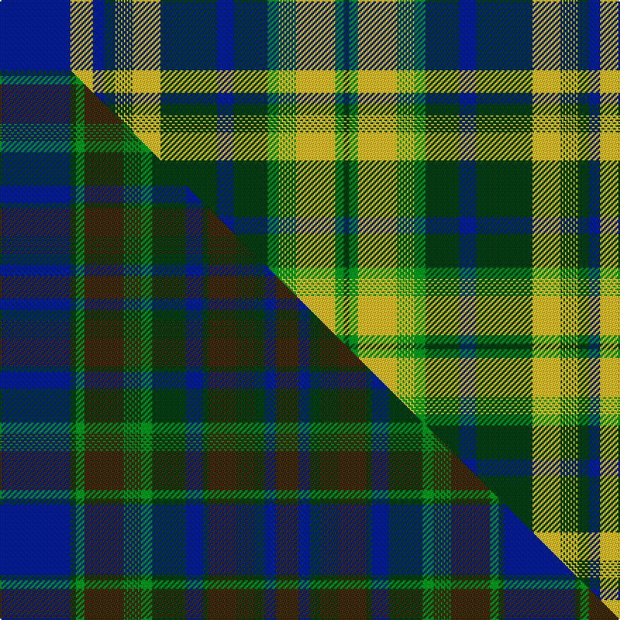

This page is one **sett** — a single exact thread-count. It belongs to the [tartan](/setts/db50ly16db8dg8ly1dg1ly1dg1ly1dg1ly1dg1ly1dg1ly1dg1ly20dg40db12dg24g8ly1g1ly1g1ly1g1ly1g1ly1g1ly1g1ly28g6dg4/)
(the same proportion at any scale), whose colour order is pattern [BYBGYGYGYGYGYGYGYGBGGYGYGYGYGYGYGYGG](/stripes/bybgygygygygygygygbggygygygygygygygg/).

Part of the [Nova Scotia](/tartans/nova-scotia/) tartan — the named design grouping this sett with its other cloths.

Sourced from tartans-authority.  It is a [36 stripe tartan](/stripes/stripes36/).

Original link http://www.tartansauthority.com/tartan-ferret/display/7707/

2 attestations — the source records this cloth was collapsed from (oldest owns this page)

<ul>
<li>16th Feb. 1966 — Nova Scotia (Commemorative) (tartans-authority, <a href="http://www.tartansauthority.com/tartan-ferret/display/7707/">record</a>)  <em>Asymmetric. This replaces #1912 & #1927. In his thorough and painstaking 2008 review of Canadian tartans, John Fitzpatrick pointed out that a series of ten tartans from Pik Mills of Quebec City were probably their contribution to the 'Centennial of Confederation' like the 'Fathers of Confederation' series produced by WCWM/Sainthill-Levine. All ten tartans are complex asymmetric designs each with different warp and weft. The threadcounts (taken from the CIDD) remain the same but colours are changed. JF notes that the yellow is closer to brown in the graphic that he'd seen.</em></li>
<li>undated — Nova Scotia (CIDD 20899) (register-of-tartans, <a href="https://www.tartanregister.gov.uk/tartanDetails.aspx?ref=5699">record</a>)  <em>This replaces #1912 and #1927 (original Scottish Tartans Authority refs) In his thorough and painstaking 2008 review of Canadian tartans, John Fitzpatrick pointed out that a series of ten tartans from Pik Mills of Quebec City were probably their contribution to the 'Centennial of Confederation' like the 'Fathers of Confederation' series produced by WCWM/Sainthill-Levine. All ten tartans are complex asymmetric designs each with different warp and weft. The threadcounts (taken from the CIDD) remain the same but colours are changed. JF notes that the yellow is closer to brown in the graphic that he'd seen.</em></li>
</ul>

## Register references

External register numbers recorded for this tartan.

- Scottish Register of Tartans: [5699](https://www.tartanregister.gov.uk/tartanDetails.aspx?ref=5699)
- Scottish Tartans Authority (ITI): 7707

## Thread count
DB/50 LY16 DB8 DG8 LY1 DG1 LY1 DG1 LY1 DG1 LY1 DG1 LY1 DG1 LY1 DG1 LY20 DG40 DB12 DG24 G8 LY1 G1 LY1 G1 LY1 G1 LY1 G1 LY1 G1 LY1 G1 LY28 G6 DG/4

One full sett is **442 threads**.

## Palette
<table><thead><tr><th>Colour</th><th>Shade</th><th>OKLCh</th></tr></thead><tbody><tr><td>DG</td><td><code style="background-color:#053819;">#053819</code> <small style="color:#888">#053819</small></td><td><small style="color:#888">oklch(30.0% 0.075 151.3)</small></td></tr><tr><td>LY</td><td><code style="background-color:#DCBC32;">#DCBC32</code> <small style="color:#888">#DCBC32</small></td><td><small style="color:#888">oklch(80.0% 0.150 95.2)</small></td></tr><tr><td>G</td><td><code style="background-color:#008B2A;">#008B2A</code> <small style="color:#888">#008B2A</small></td><td><small style="color:#888">oklch(55.4% 0.170 145.9)</small></td></tr><tr><td>DB</td><td><code style="background-color:#082077;">#082077</code> <small style="color:#888">#082077</small></td><td><small style="color:#888">oklch(30.0% 0.149 265.1)</small></td></tr></tbody></table>

# Sample pattern

## Compared to the master

This cloth is one sett of its design; the master sett (the exemplar the design is anchored on) is below for comparison.

Its **ΔTartan distance** from the master is **4.51** — the same measure the nearest-tartans table ranks by (0 is identical; a re-scale of the same cloth is near 0, a recolour or a different proportion further).

<figure class="master-compare" style="margin:0">

this sett
master sett ★

<figcaption style="color:#888;font-size:smaller">One weave of this sett against the <a href="/setts/db50dg4g6dy28g1dy1g1dy1g1dy1g1dy1g1dy1g1dy1g8dg24db12dg4dy20dg1dy1dg1dy1dg1dy1dg1dy1dg1dy1dg1dy1dg8db8dy16/">master sett ★</a>, split on the diagonal: a shared proportion runs seamlessly across it with only the shades shifting; a different proportion breaks on it.</figcaption>
</figure>

ID: /variants/s36/db50ly16db8dg8ly1dg1ly1dg1ly1dg1ly1dg1ly1dg1ly1dg1ly20dg40db12dg24g8ly1g1ly1g1ly1g1ly1g1ly1g1ly1g1ly28g6dg4/
