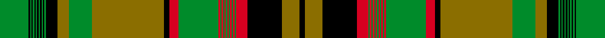
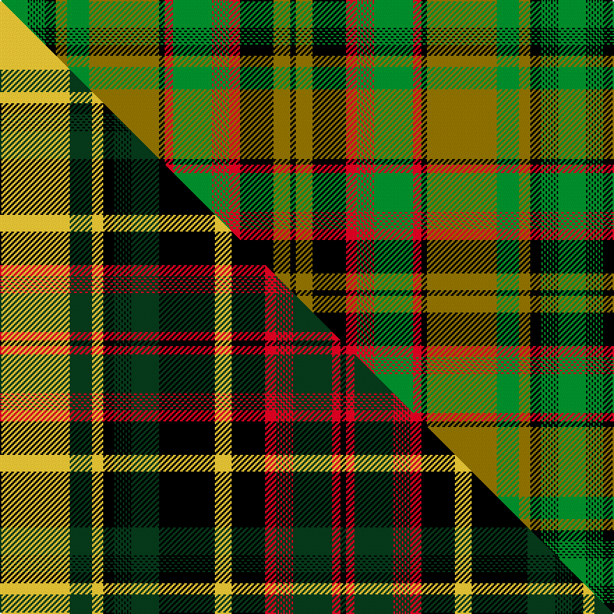

This is one **variant** — a specific cloth: this exact thread count and colourway, with its own
provenance below. It is one weaving of the [sett](/setts/g20k1g1k1g1k1g1k1g1k1g1k1g1k8y8g16y50k4r6g28r1g1r1g1r1g1r1g1r1g1r1g1r8k24y12k4/) (the scale-free proportion — the
same cloth at any scale or shade), whose colour order is pattern [GKGKGKGKGKGKGKGGGKRGRGRGRGRGRGRGRKGK](/stripes/gkgkgkgkgkgkgkgggkrgrgrgrgrgrgrgrkgk/).

Part of the [New Brunswick](/tartans/new-brunswick/) tartan — the named design grouping this sett with its other cloths.

Sourced from register-of-tartans.  It is a [36 stripe tartan](/stripes/stripes36/).

Original link [https://www.tartanregister.gov.uk/tartanDetails.aspx?ref=3111](https://www.tartanregister.gov.uk/tartanDetails.aspx?ref=3111)

2 attestations — the source records this cloth was collapsed from (oldest owns this page)

<ul>
<li>undated — New Brunswick (PIK Mills, Toronto) (register-of-tartans, <a href="https://www.tartanregister.gov.uk/tartanDetails.aspx?ref=3111">record</a>)  <em>This has different warp to weft and both are none repeating (asymetrical) patterns. See also the New Brunswick (CIDD 28101) version, STR #5702.</em></li>
<li>undated — New Brunswick (weddslist, <a href="http://www.weddslist.com/cgi-bin/tartans/pg.pl?source=sts">record</a>) </li>
</ul>

Dataset <small>— provenance for this record, inherited from the source manifest</small>

<dl class="dataset-prov">
<dt>source</dt><dd><a href="/sources/register-of-tartans/">Scottish Register of Tartans</a></dd>
<dt>data captured from</dt><dd><a href="https://github.com/thetartan/tartan-database/blob/master/data/register-of-tartans/data.csv">https://github.com/thetartan/tartan-database/blob/master/data/register-of-tartans/data.csv</a></dd>
<dt>data date</dt><dd>2017-01-06 <small>(dataset default)</small></dd>
<dt>licence</dt><dd><a href="https://www.tartanregister.gov.uk/copyright">Crown copyright</a></dd>
</dl>

Capture chain <small>— the hands this data passed through, oldest first; each capture carries its own licence</small>

<ol class="capture-chain">
<li><a href="https://www.tartanregister.gov.uk/">Scottish Register of Tartans</a> · <a href="https://www.tartanregister.gov.uk/copyright">Crown copyright</a> <small>the living register — still published by National Records of Scotland</small></li>
<li><a href="https://github.com/thetartan/tartan-database">thetartan/tartan-database</a> <small>2016-2017</small> · <a href="https://creativecommons.org/licenses/by-nc-nd/4.0/">CC BY-NC-ND 4.0</a> <small>Levko Kravets's frozen compilation — the capture we vendored, and where its CC licence text came from</small></li>
<li>this dictionary <small>captured 2026-06-10 · commit 5bf86c7566</small> <small>each re-capture is a git commit to data/sources</small></li>
</ol>

## Register references

External register numbers recorded for this tartan.

- Scottish Register of Tartans: [3111](https://www.tartanregister.gov.uk/tartanDetails.aspx?ref=3111)
- Scottish Tartans World Register: 2026

## Thread count
G/20 K1 G1 K1 G1 K1 G1 K1 G1 K1 G1 K1 G1 K8 Y8 G16 Y50 K4 R6 G28 R1 G1 R1 G1 R1 G1 R1 G1 R1 G1 R1 G1 R8 K24 Y12 K/4

One full sett is **400 threads**.

## Palette
<table><thead><tr><th>Colour</th><th>Shade</th><th>OKLCh</th></tr></thead><tbody><tr><td>G</td><td><code style="background-color:#008B2A;">#008B2A</code> <small style="color:#888">#008B2A</small></td><td><small style="color:#888">oklch(55.4% 0.170 145.9)</small></td></tr><tr><td>K</td><td><code style="background-color:#000000;">#000000</code> <small style="color:#888">#000000</small></td><td><small style="color:#888">oklch(0.0% 0.000 0.0)</small></td></tr><tr><td>R</td><td><code style="background-color:#D60020;">#D60020</code> <small style="color:#888">#D60020</small></td><td><small style="color:#888">oklch(55.2% 0.224 25.5)</small></td></tr><tr><td>Y</td><td><code style="background-color:#8B6E00;">#8B6E00</code> <small style="color:#888">#8B6E00</small></td><td><small style="color:#888">oklch(55.1% 0.113 90.4)</small></td></tr></tbody></table>

# Sample pattern

## Compared to the master

This cloth is one sett of its design; the master sett (the exemplar the design is anchored on) is below for comparison.

Its **ΔTartan distance** from the master is **0.49** — the same measure the nearest-tartans table ranks by (0 is identical; a re-scale of the same cloth is near 0, a recolour or a different proportion further).

<figure class="master-compare" style="margin:0">

this sett
master sett ★

<figcaption style="color:#888;font-size:smaller">One weave of this sett against the <a href="/setts/ly50dg16ly8k8dg1k1dg1k1dg1k1dg1k1dg1k1dg1k1dg20k40ly12k24r8dg1r1dg1r1dg1r1dg1r1dg1r1dg1r1dg28r6k4/">master sett ★</a>, split on the diagonal: a shared proportion runs seamlessly across it with only the shades shifting; a different proportion breaks on it.</figcaption>
</figure>

## Nearest tartan variants

The nearest existing variants by ΔTartan distance, with this cloth at the top so the swatches line up against it.

ΔTartan

Threads

Variant

Sett

—

400

<a href="/variants/s36/g20k1g1k1g1k1g1k1g1k1g1k1g1k8y8g16y50k4r6g28r1g1r1g1r1g1r1g1r1g1r1g1r8k24y12k4/">New Brunswick (PIK Mills, Toronto)</a>

<a href="/ttd/edit/#slug=ly50dg16ly8k8dg1k1dg1k1dg1k1dg1k1dg1k1dg1k1dg20k40ly12k24r8dg1r1dg1r1dg1r1dg1r1dg1r1dg1r1dg28r6k4~ly3104101-r2109032&amp;base=g20k1g1k1g1k1g1k1g1k1g1k1g1k8y8g16y50k4r6g28r1g1r1g1r1g1r1g1r1g1r1g1r8k24y12k4" title="compare in the TTD">0.49</a>

442

<a href="/variants/s36/ly50dg16ly8k8dg1k1dg1k1dg1k1dg1k1dg1k1dg1k1dg20k40ly12k24r8dg1r1dg1r1dg1r1dg1r1dg1r1dg1r1dg28r6k4~ly3104101-r2109032/">New Brunswick (CIDD 28101)</a>

<a href="/ttd/edit/#slug=ly50dg16ly8k8dg1k1dg1k1dg1k1dg1k1dg1k1dg1k1dg20k40ly12k24r8dg1r1dg1r1dg1r1dg1r1dg1r1dg1r1dg28r6k4&amp;base=g20k1g1k1g1k1g1k1g1k1g1k1g1k8y8g16y50k4r6g28r1g1r1g1r1g1r1g1r1g1r1g1r8k24y12k4" title="compare in the TTD">0.49</a>

442

<a href="/variants/s36/ly50dg16ly8k8dg1k1dg1k1dg1k1dg1k1dg1k1dg1k1dg20k40ly12k24r8dg1r1dg1r1dg1r1dg1r1dg1r1dg1r1dg28r6k4/">New Brunswick (Commemorative)</a>

<a href="/ttd/edit/#slug=k50ly16k8dy8ly1dy1ly1dy1ly1dy1ly1dy1ly1dy1ly1dy1ly20dy40k12dy24dg8ly1dg1ly1dg1ly1dg1ly1dg1ly1dg1ly1dg1ly28dg6dy4~ly2705081&amp;base=g20k1g1k1g1k1g1k1g1k1g1k1g1k8y8g16y50k4r6g28r1g1r1g1r1g1r1g1r1g1r1g1r8k24y12k4" title="compare in the TTD">2.46</a>

442

<a href="/variants/s36/k50ly16k8dy8ly1dy1ly1dy1ly1dy1ly1dy1ly1dy1ly1dy1ly20dy40k12dy24dg8ly1dg1ly1dg1ly1dg1ly1dg1ly1dg1ly1dg1ly28dg6dy4~ly2705081/">Alberta (Commemorative)</a>

<a href="/ttd/edit/#slug=dg50ly16dg8dy8ly1dy1ly1dy1ly1dy1ly1dy1ly1dy1ly1dy1ly20dy40dg12dy24r8ly1r1ly1r1ly1r1ly1r1ly1r1ly1r1ly28r6dy4&amp;base=g20k1g1k1g1k1g1k1g1k1g1k1g1k8y8g16y50k4r6g28r1g1r1g1r1g1r1g1r1g1r1g1r8k24y12k4" title="compare in the TTD">3.27</a>

442

<a href="/variants/s36/dg50ly16dg8dy8ly1dy1ly1dy1ly1dy1ly1dy1ly1dy1ly1dy1ly20dy40dg12dy24r8ly1r1ly1r1ly1r1ly1r1ly1r1ly1r1ly28r6dy4/">Ontario (CIDD 28103) (Commemorative)</a>

<a href="/ttd/edit/#slug=k50g16k8w8g1w1g1w1g1w1g1w1g1w1g1w1g20w40k12w24ly8g1ly1g1ly1g1ly1g1ly1g1ly1g1ly1g28ly6w4&amp;base=g20k1g1k1g1k1g1k1g1k1g1k1g1k8y8g16y50k4r6g28r1g1r1g1r1g1r1g1r1g1r1g1r8k24y12k4" title="compare in the TTD">3.48</a>

442

<a href="/variants/s36/k50g16k8w8g1w1g1w1g1w1g1w1g1w1g1w1g20w40k12w24ly8g1ly1g1ly1g1ly1g1ly1g1ly1g1ly1g28ly6w4/">Saskatchewan (Commemorative)</a>

<a href="/ttd/edit/#slug=r50ly16r8k8ly1k1ly1k1ly1k1ly1k1ly1k1ly1k1ly20k40r12k24dg8ly1dg1ly1dg1ly1dg1ly1dg1ly1dg1ly1dg1ly28dg6k4&amp;base=g20k1g1k1g1k1g1k1g1k1g1k1g1k8y8g16y50k4r6g28r1g1r1g1r1g1r1g1r1g1r1g1r8k24y12k4" title="compare in the TTD">3.95</a>

442

<a href="/variants/s36/r50ly16r8k8ly1k1ly1k1ly1k1ly1k1ly1k1ly1k1ly20k40r12k24dg8ly1dg1ly1dg1ly1dg1ly1dg1ly1dg1ly1dg1ly28dg6k4/">Prince Edward Island (Commemorative)</a>

## Neighbour map

Every grey dot is one of 13621 variants placed by the first two principal components of the ΔTartan feature space (42% of its variance). Red is this tartan; blue dots are its nearest — click one to open its page.

<svg viewBox="0 0 640 380" role="img" style="max-width:100%;height:auto;border:1px solid #e0e0e0;border-radius:4px;display:block" xmlns="http://www.w3.org/2000/svg"><image href="/nn/cloud.v1.png" width="640" height="380"/><a href="/variants/s36/ly50dg16ly8k8dg1k1dg1k1dg1k1dg1k1dg1k1dg1k1dg20k40ly12k24r8dg1r1dg1r1dg1r1dg1r1dg1r1dg1r1dg28r6k4~ly3104101-r2109032/"><circle cx="175.4" cy="14.0" r="4" fill="#3465a4"><title>New Brunswick (CIDD 28101)</title></circle></a><a href="/variants/s36/ly50dg16ly8k8dg1k1dg1k1dg1k1dg1k1dg1k1dg1k1dg20k40ly12k24r8dg1r1dg1r1dg1r1dg1r1dg1r1dg1r1dg28r6k4/"><circle cx="173.5" cy="14.0" r="4" fill="#3465a4"><title>New Brunswick (Commemorative)</title></circle></a><a href="/variants/s36/k50ly16k8dy8ly1dy1ly1dy1ly1dy1ly1dy1ly1dy1ly1dy1ly20dy40k12dy24dg8ly1dg1ly1dg1ly1dg1ly1dg1ly1dg1ly1dg1ly28dg6dy4~ly2705081/"><circle cx="198.4" cy="17.3" r="4" fill="#3465a4"><title>Alberta (Commemorative)</title></circle></a><a href="/variants/s36/dg50ly16dg8dy8ly1dy1ly1dy1ly1dy1ly1dy1ly1dy1ly1dy1ly20dy40dg12dy24r8ly1r1ly1r1ly1r1ly1r1ly1r1ly1r1ly28r6dy4/"><circle cx="229.3" cy="36.6" r="4" fill="#3465a4"><title>Ontario (CIDD 28103) (Commemorative)</title></circle></a><a href="/variants/s36/k50g16k8w8g1w1g1w1g1w1g1w1g1w1g1w1g20w40k12w24ly8g1ly1g1ly1g1ly1g1ly1g1ly1g1ly1g28ly6w4/"><circle cx="163.5" cy="14.0" r="4" fill="#3465a4"><title>Saskatchewan (Commemorative)</title></circle></a><a href="/variants/s36/r50ly16r8k8ly1k1ly1k1ly1k1ly1k1ly1k1ly1k1ly20k40r12k24dg8ly1dg1ly1dg1ly1dg1ly1dg1ly1dg1ly1dg1ly28dg6k4/"><circle cx="174.0" cy="14.0" r="4" fill="#3465a4"><title>Prince Edward Island (Commemorative)</title></circle></a><circle cx="209.0" cy="19.0" r="5" fill="#c00000"/><text x="320" y="376" text-anchor="middle" font-size="11" fill="#999">ground</text><text x="11" y="190" text-anchor="middle" font-size="11" fill="#999" transform="rotate(-90 11 190)">complexity</text></svg>

ID: /variants/s36/g20k1g1k1g1k1g1k1g1k1g1k1g1k8y8g16y50k4r6g28r1g1r1g1r1g1r1g1r1g1r1g1r8k24y12k4/
