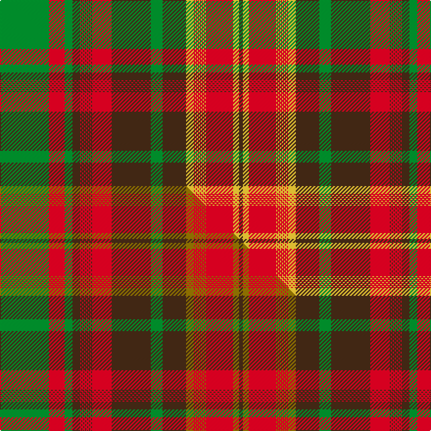

This is one **variant** — a specific cloth: this exact thread count and colourway, with its own
provenance below. It is one weaving of the [sett](/setts/g50r16g8do8r1do1r1do1r1do1r1do1r1do1r1do1r20do40g12do24ly8r1ly1r1ly1r1ly1r1ly1r1ly1r1ly1r28ly6do4/) (the scale-free proportion — the
same cloth at any scale or shade), whose colour order is pattern [BYRYRYRYRYRYRYRYBGBRBRBRBRBRBRBRBGRG](/stripes/byryryryryryryrybgbrbrbrbrbrbrbrbgrg/).

Part of the [Newfoundland](/tartans/newfoundland-3/) tartan — the named design grouping this sett with its other cloths.

Sourced from tartans-authority.  It is a [36 stripe tartan](/stripes/stripes36/).

Original link [https://www.tartanregister.gov.uk/tartanDetails.aspx?ref=7708](https://www.tartanregister.gov.uk/tartanDetails.aspx?ref=7708)

Dataset <small>— provenance for this record, inherited from the source manifest</small>

<dl class="dataset-prov">
<dt>source</dt><dd><a href="/sources/tartans-authority/">Scottish Tartans Authority</a></dd>
<dt>data captured from</dt><dd><a href="https://github.com/thetartan/tartan-database/blob/master/data/tartans-authority/data.csv">https://github.com/thetartan/tartan-database/blob/master/data/tartans-authority/data.csv</a></dd>
<dt>data date</dt><dd>16th Feb. 1966 <small>(this record)</small></dd>
<dt>licence</dt><dd><a href="https://creativecommons.org/licenses/by-nc-nd/4.0/">CC BY-NC-ND 4.0</a></dd>
</dl>

Capture chain <small>— the hands this data passed through, oldest first; each capture carries its own licence</small>

<ol class="capture-chain">
<li><a href="https://www.tartansauthority.com/">Scottish Tartans Authority</a> <small>the heritage body's archive — its tartan-ferret record browser is retired (links repaired to the SRT, above)</small></li>
<li><a href="https://github.com/thetartan/tartan-database">thetartan/tartan-database</a> <small>2016-2017</small> · <a href="https://creativecommons.org/licenses/by-nc-nd/4.0/">CC BY-NC-ND 4.0</a> <small>Levko Kravets's frozen compilation — the capture we vendored, and where its CC licence text came from</small></li>
<li>this dictionary <small>captured 2026-06-10 · commit 5bf86c7566</small> <small>each re-capture is a git commit to data/sources</small></li>
</ol>

## Register references

External register numbers recorded for this tartan.

- Scottish Tartans Authority (ITI): 7708

## Thread count
G/50 R16 G8 DO8 R1 DO1 R1 DO1 R1 DO1 R1 DO1 R1 DO1 R1 DO1 R20 DO40 G12 DO24 LY8 R1 LY1 R1 LY1 R1 LY1 R1 LY1 R1 LY1 R1 LY1 R28 LY6 DO/4

One full sett is **442 threads**.

## Palette
<table><thead><tr><th>Colour</th><th>Shade</th><th>OKLCh</th></tr></thead><tbody><tr><td>DO</td><td><code style="background-color:#412714;">#412714</code> <small style="color:#888">#412714</small></td><td><small style="color:#888">oklch(30.1% 0.050 55.7)</small></td></tr><tr><td>LY</td><td><code style="background-color:#DCBC32;">#DCBC32</code> <small style="color:#888">#DCBC32</small></td><td><small style="color:#888">oklch(80.0% 0.150 95.2)</small></td></tr><tr><td>G</td><td><code style="background-color:#008B2A;">#008B2A</code> <small style="color:#888">#008B2A</small></td><td><small style="color:#888">oklch(55.4% 0.170 145.9)</small></td></tr><tr><td>R</td><td><code style="background-color:#D60020;">#D60020</code> <small style="color:#888">#D60020</small></td><td><small style="color:#888">oklch(55.2% 0.224 25.5)</small></td></tr></tbody></table>

# Sample pattern

## Compared to the master

This cloth is one sett of its design; the master sett (the exemplar the design is anchored on) is below for comparison.

Its **ΔTartan distance** from the master is **0.05** — the same measure the nearest-tartans table ranks by (0 is identical; a re-scale of the same cloth is near 0, a recolour or a different proportion further).

<figure class="master-compare" style="margin:0">

this sett
master sett ★

<figcaption style="color:#888;font-size:smaller">One weave of this sett against the <a href="/setts/g50r16g8do8r1do1r1do1r1do1r1do1r1do1r1do1r20do40g12do24y8r1y1r1y1r1y1r1y1r1y1r1y1r28y6do4/">master sett ★</a>, split on the diagonal: a shared proportion runs seamlessly across it with only the shades shifting; a different proportion breaks on it.</figcaption>
</figure>

## Nearest tartan variants

The nearest existing variants by ΔTartan distance, with this cloth at the top so the swatches line up against it.

ΔTartan

Threads

Variant

Sett

—

442

<a href="/variants/s36/g50r16g8do8r1do1r1do1r1do1r1do1r1do1r1do1r20do40g12do24ly8r1ly1r1ly1r1ly1r1ly1r1ly1r1ly1r28ly6do4/">Newfoundland (Commemorative)</a>

<a href="/ttd/edit/#slug=g50r16g8do8r1do1r1do1r1do1r1do1r1do1r1do1r20do40g12do24y8r1y1r1y1r1y1r1y1r1y1r1y1r28y6do4&amp;base=g50r16g8do8r1do1r1do1r1do1r1do1r1do1r1do1r20do40g12do24ly8r1ly1r1ly1r1ly1r1ly1r1ly1r1ly1r28ly6do4" title="compare in the TTD">0.05</a>

442

<a href="/variants/s36/g50r16g8do8r1do1r1do1r1do1r1do1r1do1r1do1r20do40g12do24y8r1y1r1y1r1y1r1y1r1y1r1y1r28y6do4/">Newfoundland (CIDD 28098)</a>

<a href="/ttd/edit/#slug=dg50ly16dg8dy8ly1dy1ly1dy1ly1dy1ly1dy1ly1dy1ly1dy1ly20dy40dg12dy24r8ly1r1ly1r1ly1r1ly1r1ly1r1ly1r1ly28r6dy4~ly2705081&amp;base=g50r16g8do8r1do1r1do1r1do1r1do1r1do1r1do1r20do40g12do24ly8r1ly1r1ly1r1ly1r1ly1r1ly1r1ly1r28ly6do4" title="compare in the TTD">2.01</a>

442

<a href="/variants/s36/dg50ly16dg8dy8ly1dy1ly1dy1ly1dy1ly1dy1ly1dy1ly1dy1ly20dy40dg12dy24r8ly1r1ly1r1ly1r1ly1r1ly1r1ly1r1ly28r6dy4~ly2705081/">Ontario Centennial</a>

<a href="/ttd/edit/#slug=dg50ly16dg8dy8ly1dy1ly1dy1ly1dy1ly1dy1ly1dy1ly1dy1ly20dy40dg12dy24r8ly1r1ly1r1ly1r1ly1r1ly1r1ly1r1ly28r6dy4&amp;base=g50r16g8do8r1do1r1do1r1do1r1do1r1do1r1do1r20do40g12do24ly8r1ly1r1ly1r1ly1r1ly1r1ly1r1ly1r28ly6do4" title="compare in the TTD">2.09</a>

442

<a href="/variants/s36/dg50ly16dg8dy8ly1dy1ly1dy1ly1dy1ly1dy1ly1dy1ly1dy1ly20dy40dg12dy24r8ly1r1ly1r1ly1r1ly1r1ly1r1ly1r1ly28r6dy4/">Ontario (CIDD 28103) (Commemorative)</a>

<a href="/ttd/edit/#slug=lyi50ly16lyi8dy8ly1dy1ly1dy1ly1dy1ly1dy1ly1dy1ly1dy1ly20dy40lyi12dy24dg8ly1dg1ly1dg1ly1dg1ly1dg1ly1dg1ly1dg1ly28dg6dy4~lyi3104101-ly2705081&amp;base=g50r16g8do8r1do1r1do1r1do1r1do1r1do1r1do1r20do40g12do24ly8r1ly1r1ly1r1ly1r1ly1r1ly1r1ly1r28ly6do4" title="compare in the TTD">3.24</a>

442

<a href="/variants/s36/lyi50ly16lyi8dy8ly1dy1ly1dy1ly1dy1ly1dy1ly1dy1ly1dy1ly20dy40lyi12dy24dg8ly1dg1ly1dg1ly1dg1ly1dg1ly1dg1ly1dg1ly28dg6dy4~lyi3104101-ly2705081/">Alberta (CIDD 28106)</a>

<a href="/ttd/edit/#slug=r10db1r1db1r72t1r1db20r4g1r4g84r1db2r10db1r1g84r4g1r4db20r2t1r72db2r2db1r4~x2&amp;base=g50r16g8do8r1do1r1do1r1do1r1do1r1do1r1do1r20do40g12do24ly8r1ly1r1ly1r1ly1r1ly1r1ly1r1ly1r28ly6do4" title="compare in the TTD">3.50</a>

1620

<a href="/variants/s29/r10db1r1db1r72t1r1db20r4g1r4g84r1db2r10db1r1g84r4g1r4db20r2t1r72db2r2db1r4~x2/">Grant</a>

<a href="/ttd/edit/#slug=dt13r6dt2r6w1g26r2dt26w1r26w1dt6r2g2r2dt13r2g2r2dt6w1r26w1dt26g26w1r6dt2r6~x2&amp;base=g50r16g8do8r1do1r1do1r1do1r1do1r1do1r1do1r20do40g12do24ly8r1ly1r1ly1r1ly1r1ly1r1ly1r1ly1r28ly6do4" title="compare in the TTD">3.80</a>

930

<a href="/variants/s29/dt13r6dt2r6w1g26r2dt26w1r26w1dt6r2g2r2dt13r2g2r2dt6w1r26w1dt26g26w1r6dt2r6~x2/">Unnamed C18/19th - Antigonish (A) #2</a>

<a href="/ttd/edit/#slug=r3g50r3g1r3lb3r3lb45r3lb3r50lb3r3lb3r50lb3r3lb45r3lb3r3g1r3g50r3lb3~x2&amp;base=g50r16g8do8r1do1r1do1r1do1r1do1r1do1r1do1r20do40g12do24ly8r1ly1r1ly1r1ly1r1ly1r1ly1r1ly1r28ly6do4" title="compare in the TTD">3.85</a>

1372

<a href="/variants/s26/r3g50r3g1r3lb3r3lb45r3lb3r50lb3r3lb3r50lb3r3lb45r3lb3r3g1r3g50r3lb3~x2/">Not Specified</a>

## Neighbour map

Every grey dot is one of 13621 variants placed by the first two principal components of the ΔTartan feature space (42% of its variance). Red is this tartan; blue dots are its nearest — click one to open its page.

<svg viewBox="0 0 640 380" role="img" style="max-width:100%;height:auto;border:1px solid #e0e0e0;border-radius:4px;display:block" xmlns="http://www.w3.org/2000/svg"><image href="/nn/cloud.v1.png" width="640" height="380"/><a href="/variants/s36/g50r16g8do8r1do1r1do1r1do1r1do1r1do1r1do1r20do40g12do24y8r1y1r1y1r1y1r1y1r1y1r1y1r28y6do4/"><circle cx="276.5" cy="47.6" r="4" fill="#3465a4"><title>Newfoundland (CIDD 28098)</title></circle></a><a href="/variants/s36/dg50ly16dg8dy8ly1dy1ly1dy1ly1dy1ly1dy1ly1dy1ly1dy1ly20dy40dg12dy24r8ly1r1ly1r1ly1r1ly1r1ly1r1ly1r1ly28r6dy4~ly2705081/"><circle cx="271.7" cy="49.8" r="4" fill="#3465a4"><title>Ontario Centennial</title></circle></a><a href="/variants/s36/dg50ly16dg8dy8ly1dy1ly1dy1ly1dy1ly1dy1ly1dy1ly1dy1ly20dy40dg12dy24r8ly1r1ly1r1ly1r1ly1r1ly1r1ly1r1ly28r6dy4/"><circle cx="229.3" cy="36.6" r="4" fill="#3465a4"><title>Ontario (CIDD 28103) (Commemorative)</title></circle></a><a href="/variants/s36/lyi50ly16lyi8dy8ly1dy1ly1dy1ly1dy1ly1dy1ly1dy1ly1dy1ly20dy40lyi12dy24dg8ly1dg1ly1dg1ly1dg1ly1dg1ly1dg1ly1dg1ly28dg6dy4~lyi3104101-ly2705081/"><circle cx="265.0" cy="56.6" r="4" fill="#3465a4"><title>Alberta (CIDD 28106)</title></circle></a><a href="/variants/s29/r10db1r1db1r72t1r1db20r4g1r4g84r1db2r10db1r1g84r4g1r4db20r2t1r72db2r2db1r4~x2/"><circle cx="340.1" cy="37.3" r="4" fill="#3465a4"><title>Grant</title></circle></a><a href="/variants/s29/dt13r6dt2r6w1g26r2dt26w1r26w1dt6r2g2r2dt13r2g2r2dt6w1r26w1dt26g26w1r6dt2r6~x2/"><circle cx="241.2" cy="96.8" r="4" fill="#3465a4"><title>Unnamed C18/19th - Antigonish (A) #2</title></circle></a><a href="/variants/s26/r3g50r3g1r3lb3r3lb45r3lb3r50lb3r3lb3r50lb3r3lb45r3lb3r3g1r3g50r3lb3~x2/"><circle cx="306.9" cy="77.5" r="4" fill="#3465a4"><title>Not Specified</title></circle></a><circle cx="256.0" cy="41.2" r="5" fill="#c00000"/><text x="320" y="376" text-anchor="middle" font-size="11" fill="#999">ground</text><text x="11" y="190" text-anchor="middle" font-size="11" fill="#999" transform="rotate(-90 11 190)">complexity</text></svg>

ID: /variants/s36/g50r16g8do8r1do1r1do1r1do1r1do1r1do1r1do1r20do40g12do24ly8r1ly1r1ly1r1ly1r1ly1r1ly1r1ly1r28ly6do4/
