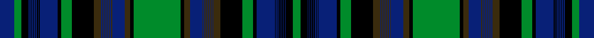

This is one **variant** — a specific cloth: this exact thread count and colourway, with its own
provenance below. It is one weaving of the [sett](/setts/g52k4dy6db14dy1db1dy1db1dy1db1dy1db1dy1db1dy1db1dy8k24g12k4db20k1db1k1db1k1db1k1db1k1db1k1db1k8g8db16/) (the scale-free proportion — the
same cloth at any scale or shade), whose colour order is pattern [BGKBKBKBKBKBKBKBKGKGBGBGBGBGBGBGBGKGKGBGBGBGBGBGBGBGKGKBKBKBKBKBKBKBKG](/stripes/bgkbkbkbkbkbkbkbkgkgbgbgbgbgbgbgbgkgkgbgbgbgbgbgbgbgkgkbkbkbkbkbkbkbkg/).

Part of the [Canadian Centennial](/tartans/c/ca/canadian-centennial-2/) tartan — the named design grouping this sett with its other cloths.

Sourced from register-of-tartans.  It is a [70 stripe tartan](/stripes/stripes70/).

Original link [https://www.tartanregister.gov.uk/tartanDetails.aspx?ref=544](https://www.tartanregister.gov.uk/tartanDetails.aspx?ref=544)

Dataset <small>— provenance for this record, inherited from the source manifest</small>

<dl class="dataset-prov">
<dt>source</dt><dd><a href="/sources/register-of-tartans/">Scottish Register of Tartans</a></dd>
<dt>data captured from</dt><dd><a href="https://github.com/thetartan/tartan-database/blob/master/data/register-of-tartans/data.csv">https://github.com/thetartan/tartan-database/blob/master/data/register-of-tartans/data.csv</a></dd>
<dt>data date</dt><dd>2002 <small>(this record)</small></dd>
<dt>licence</dt><dd><a href="https://www.tartanregister.gov.uk/copyright">Crown copyright</a></dd>
</dl>

Capture chain <small>— the hands this data passed through, oldest first; each capture carries its own licence</small>

<ol class="capture-chain">
<li><a href="https://www.tartanregister.gov.uk/">Scottish Register of Tartans</a> · <a href="https://www.tartanregister.gov.uk/copyright">Crown copyright</a> <small>the living register — still published by National Records of Scotland</small></li>
<li><a href="https://github.com/thetartan/tartan-database">thetartan/tartan-database</a> <small>2016-2017</small> · <a href="https://creativecommons.org/licenses/by-nc-nd/4.0/">CC BY-NC-ND 4.0</a> <small>Levko Kravets's frozen compilation — the capture we vendored, and where its CC licence text came from</small></li>
<li>this dictionary <small>captured 2026-06-10 · commit 5bf86c7566</small> <small>each re-capture is a git commit to data/sources</small></li>
</ol>

## Register references

External register numbers recorded for this tartan.

- Scottish Register of Tartans: [544](https://www.tartanregister.gov.uk/tartanDetails.aspx?ref=544)
- Scottish Tartans Authority (ITI): 1944
- Scottish Tartans World Register: 1944

## Thread count
DB/32 G16 K16 DB2 K2 DB2 K2 DB2 K2 DB2 K2 DB2 K2 DB2 K2 DB40 K8 G24 K48 DY16 DB2 DY2 DB2 DY2 DB2 DY2 DB2 DY2 DB2 DY2 DB2 DY2 DB28 DY12 K8 G104 K8 DY12 DB28 DY2 DB2 DY2 DB2 DY2 DB2 DY2 DB2 DY2 DB2 DY2 DB2 DY16 K48 G24 K8 DB40 K2 DB2 K2 DB2 K2 DB2 K2 DB2 K2 DB2 K2 DB2 K16 G/16

One full sett is **1280 threads**.

## Palette
<table><thead><tr><th>Colour</th><th>Shade</th><th>OKLCh</th></tr></thead><tbody><tr><td>DB</td><td><code style="background-color:#082077;">#082077</code> <small style="color:#888">#082077</small></td><td><small style="color:#888">oklch(30.0% 0.149 265.1)</small></td></tr><tr><td>G</td><td><code style="background-color:#008B2A;">#008B2A</code> <small style="color:#888">#008B2A</small></td><td><small style="color:#888">oklch(55.4% 0.170 145.9)</small></td></tr><tr><td>K</td><td><code style="background-color:#000000;">#000000</code> <small style="color:#888">#000000</small></td><td><small style="color:#888">oklch(0.0% 0.000 0.0)</small></td></tr><tr><td>DY</td><td><code style="background-color:#3A2B0D;">#3A2B0D</code> <small style="color:#888">#3A2B0D</small></td><td><small style="color:#888">oklch(30.0% 0.049 82.0)</small></td></tr></tbody></table>

# Sample pattern

## Nearest tartan variants

The nearest existing variants by ΔTartan distance, with this cloth at the top so the swatches line up against it.

ΔTartan

Threads

Variant

Sett

—

1280

<a href="/variants/s36/g52k4dy6db14dy1db1dy1db1dy1db1dy1db1dy1db1dy1db1dy8k24g12k4db20k1db1k1db1k1db1k1db1k1db1k1db1k8g8db16~x2/">Canadian Centennial #3</a>

<a href="/ttd/edit/#slug=g50k4dy6db28dy1db1dy1db1dy1db1dy1db1dy1db1dy1db1dy8k24g12k4db20k1db1k1db1k1db1k1db1k1db1k1db1k8g8db16~x2&amp;base=g52k4dy6db14dy1db1dy1db1dy1db1dy1db1dy1db1dy1db1dy8k24g12k4db20k1db1k1db1k1db1k1db1k1db1k1db1k8g8db16~x2" title="compare in the TTD">0.22</a>

716

<a href="/variants/s36/g50k4dy6db28dy1db1dy1db1dy1db1dy1db1dy1db1dy1db1dy8k24g12k4db20k1db1k1db1k1db1k1db1k1db1k1db1k8g8db16~x2/">Alberta</a>

<a href="/ttd/edit/#slug=g50db16g8k8db1k1db1k1db1k1db1k1db1k1db1k1db20k40g12k24ly8db1ly1db1ly1db1ly1db1ly1db1ly1db1ly1db28ly6k4&amp;base=g52k4dy6db14dy1db1dy1db1dy1db1dy1db1dy1db1dy1db1dy8k24g12k4db20k1db1k1db1k1db1k1db1k1db1k1db1k8g8db16~x2" title="compare in the TTD">0.48</a>

442

<a href="/variants/s36/g50db16g8k8db1k1db1k1db1k1db1k1db1k1db1k1db20k40g12k24ly8db1ly1db1ly1db1ly1db1ly1db1ly1db1ly1db28ly6k4/">Manitoba (Commemorative)</a>

<a href="/ttd/edit/#slug=g52k4o6db28o1db1o1db1o1db1o1db1o1db1o1db1o8k24g12k4db20k1db1k1db1k1db1k1db1k1db1k1db1k8g8db16~x2&amp;base=g52k4dy6db14dy1db1dy1db1dy1db1dy1db1dy1db1dy1db1dy8k24g12k4db20k1db1k1db1k1db1k1db1k1db1k1db1k8g8db16~x2" title="compare in the TTD">2.72</a>

720

<a href="/variants/s36/g52k4o6db28o1db1o1db1o1db1o1db1o1db1o1db1o8k24g12k4db20k1db1k1db1k1db1k1db1k1db1k1db1k8g8db16~x2/">13, Centennial Warp</a>

## Neighbour map

Every grey dot is one of 13621 variants placed by the first two principal components of the ΔTartan feature space (42% of its variance). Red is this tartan; blue dots are its nearest — click one to open its page.

<svg viewBox="0 0 640 380" role="img" style="max-width:100%;height:auto;border:1px solid #e0e0e0;border-radius:4px;display:block" xmlns="http://www.w3.org/2000/svg"><image href="/nn/cloud.v1.png" width="640" height="380"/><a href="/variants/s36/g50k4dy6db28dy1db1dy1db1dy1db1dy1db1dy1db1dy1db1dy8k24g12k4db20k1db1k1db1k1db1k1db1k1db1k1db1k8g8db16~x2/"><circle cx="216.0" cy="23.2" r="4" fill="#3465a4"><title>Alberta</title></circle></a><a href="/variants/s36/g50db16g8k8db1k1db1k1db1k1db1k1db1k1db1k1db20k40g12k24ly8db1ly1db1ly1db1ly1db1ly1db1ly1db1ly1db28ly6k4/"><circle cx="183.7" cy="17.7" r="4" fill="#3465a4"><title>Manitoba (Commemorative)</title></circle></a><a href="/variants/s36/g52k4o6db28o1db1o1db1o1db1o1db1o1db1o1db1o8k24g12k4db20k1db1k1db1k1db1k1db1k1db1k1db1k8g8db16~x2/"><circle cx="207.4" cy="18.5" r="4" fill="#3465a4"><title>13, Centennial Warp</title></circle></a><circle cx="183.8" cy="14.0" r="5" fill="#c00000"/><text x="320" y="376" text-anchor="middle" font-size="11" fill="#999">ground</text><text x="11" y="190" text-anchor="middle" font-size="11" fill="#999" transform="rotate(-90 11 190)">complexity</text></svg>

ID: /variants/s36/g52k4dy6db14dy1db1dy1db1dy1db1dy1db1dy1db1dy1db1dy8k24g12k4db20k1db1k1db1k1db1k1db1k1db1k1db1k8g8db16~x2/
