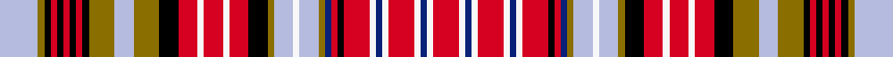

This is one **variant** — a specific cloth: this exact thread count and colourway, with its own
provenance below. It is one weaving of the [sett](/tartans/o/og/ogilvie-3/) (the scale-free proportion — the
same cloth at any scale or shade), whose colour order is pattern [RWBWRWBWRKRBGWWWGKRWRWRKGWGKRKRKRKGW](/stripes/rwbwrwbwrkrbgwwwgkrwrwrkgwgkrkrkrkgw/).

Part of the [Ogilvie 3](/tartans/o/og/ogilvie-3/) tartan — the named design grouping this sett with its other cloths.

Sourced from register-of-tartans.  It is a [36 stripe tartan](/stripes/stripes36/).

Original link [https://www.tartanregister.gov.uk/tartanDetails.aspx?ref=3230](https://www.tartanregister.gov.uk/tartanDetails.aspx?ref=3230)

2 attestations — the source records this cloth was collapsed from (oldest owns this page)

<ul>
<li>undated — Ogilvie (Paton) #2 (register-of-tartans, <a href="https://www.tartanregister.gov.uk/tartanDetails.aspx?ref=3230">record</a>)  <em>Full sett can be seen in Scottish Tartans Society files. Paton collection has been returned to the Paton firm at Alloa.</em></li>
<li>undated — Ogilvie 3 (weddslist, <a href="http://www.weddslist.com/cgi-bin/tartans/pg.pl?source=sts">record</a>) </li>
</ul>

Dataset <small>— provenance for this record, inherited from the source manifest</small>

<dl class="dataset-prov">
<dt>source</dt><dd><a href="/sources/register-of-tartans/">Scottish Register of Tartans</a></dd>
<dt>data captured from</dt><dd><a href="https://github.com/thetartan/tartan-database/blob/master/data/register-of-tartans/data.csv">https://github.com/thetartan/tartan-database/blob/master/data/register-of-tartans/data.csv</a></dd>
<dt>data date</dt><dd>2017-01-06 <small>(dataset default)</small></dd>
<dt>licence</dt><dd><a href="https://www.tartanregister.gov.uk/copyright">Crown copyright</a></dd>
</dl>

Capture chain <small>— the hands this data passed through, oldest first; each capture carries its own licence</small>

<ol class="capture-chain">
<li><a href="https://www.tartanregister.gov.uk/">Scottish Register of Tartans</a> · <a href="https://www.tartanregister.gov.uk/copyright">Crown copyright</a> <small>the living register — still published by National Records of Scotland</small></li>
<li><a href="https://github.com/thetartan/tartan-database">thetartan/tartan-database</a> <small>2016-2017</small> · <a href="https://creativecommons.org/licenses/by-nc-nd/4.0/">CC BY-NC-ND 4.0</a> <small>Levko Kravets's frozen compilation — the capture we vendored, and where its CC licence text came from</small></li>
<li>this dictionary <small>captured 2026-06-10 · commit 5bf86c7566</small> <small>each re-capture is a git commit to data/sources</small></li>
</ol>

## Register references

External register numbers recorded for this tartan.

- Scottish Register of Tartans: [3230](https://www.tartanregister.gov.uk/tartanDetails.aspx?ref=3230)
- Scottish Tartans World Register: 677

## Thread count
LB/24 Y4 K4 R4 K4 R4 K4 R4 K4 Y16 LB12 Y16 K12 R12 W4 R12 W4 R12 K12 Y4 LB12 W4 LB12 Y4 DB4 R4 K4 R16 W4 DB4 W4 R16 W4 DB4 W4 R/16

One full sett is **536 threads**.

## Palette
<table><thead><tr><th>Colour</th><th>Shade</th><th>OKLCh</th></tr></thead><tbody><tr><td>LB</td><td><code style="background-color:#B5BBDE;">#B5BBDE</code> <small style="color:#888">#B5BBDE</small></td><td><small style="color:#888">oklch(79.9% 0.050 277.6)</small></td></tr><tr><td>DB</td><td><code style="background-color:#082077;">#082077</code> <small style="color:#888">#082077</small></td><td><small style="color:#888">oklch(30.0% 0.149 265.1)</small></td></tr><tr><td>K</td><td><code style="background-color:#000000;">#000000</code> <small style="color:#888">#000000</small></td><td><small style="color:#888">oklch(0.0% 0.000 0.0)</small></td></tr><tr><td>W</td><td><code style="background-color:#F7F7F7;">#F7F7F7</code> <small style="color:#888">#F7F7F7</small></td><td><small style="color:#888">oklch(97.6% 0.000 89.9)</small></td></tr><tr><td>R</td><td><code style="background-color:#D60020;">#D60020</code> <small style="color:#888">#D60020</small></td><td><small style="color:#888">oklch(55.2% 0.224 25.5)</small></td></tr><tr><td>Y</td><td><code style="background-color:#8B6E00;">#8B6E00</code> <small style="color:#888">#8B6E00</small></td><td><small style="color:#888">oklch(55.1% 0.113 90.4)</small></td></tr></tbody></table>

# Sample pattern

[Sample sheet (PDF)](swatch.pdf) — the woven sample, thread count and palette on one printable A4, rendered on demand (the same sheet the TTD print page downloads).

## Nearest tartan variants

The nearest existing variants by ΔTartan distance, with this cloth at the top so the swatches line up against it.

ΔTartan

Threads

Variant

Sett

—

536

<a href="/variants/s36/lb6y1k1r1k1r1k1r1k1y4lb3y4k3r3w1r3w1r3k3y1lb3w1lb3y1db1r1k1r4w1db1w1r4w1db1w1r4~x4/">Ogilvie (Paton) #2</a>

<a href="/ttd/edit/#slug=db3lb2r12k2r2db2lo2o6lb2o6lo2k3r6lb2r6lb2r6k3lo4o6lo4k2r2k2r2k2r2k2lo2o6lo2db2lo2db2~x2~db3514276-o62&amp;base=lb6y1k1r1k1r1k1r1k1y4lb3y4k3r3w1r3w1r3k3y1lb3w1lb3y1db1r1k1r4w1db1w1r4w1db1w1r4~x4" title="compare in the TTD">1.08</a>

442

<a href="/variants/s34/db3lb2r12k2r2db2lo2o6lb2o6lo2k3r6lb2r6lb2r6k3lo4o6lo4k2r2k2r2k2r2k2lo2o6lo2db2lo2db2~x2~db3514276-o62/">Ogilvie</a>

<a href="/ttd/edit/#slug=k3y2k13w2lb11r12w2r12k12y2g12r12w2r12lb11w2k13y2k3~x2&amp;base=lb6y1k1r1k1r1k1r1k1y4lb3y4k3r3w1r3w1r3k3y1lb3w1lb3y1db1r1k1r4w1db1w1r4w1db1w1r4~x4" title="compare in the TTD">1.88</a>

548

<a href="/variants/s19/k3y2k13w2lb11r12w2r12k12y2g12r12w2r12lb11w2k13y2k3~x2/">Wilson's No.190</a>

<a href="/ttd/edit/#slug=r14w2db3w2r14k2r2db2y2lb7w2lb7y2k4r7w1r7w1r7k4y5lb7y5k2r2k2r2k2r2k2y2lb7y2db3y2db3~x2&amp;base=lb6y1k1r1k1r1k1r1k1y4lb3y4k3r3w1r3w1r3k3y1lb3w1lb3y1db1r1k1r4w1db1w1r4w1db1w1r4~x4" title="compare in the TTD">2.59</a>

534

<a href="/variants/s36/r14w2db3w2r14k2r2db2y2lb7w2lb7y2k4r7w1r7w1r7k4y5lb7y5k2r2k2r2k2r2k2y2lb7y2db3y2db3~x2/">Ogilvy of Airlie Clan Tartan</a>

<a href="/ttd/edit/#slug=dr7k1dr7w3k1w1k1w1r3w1r3w3k1w1k1w1k1w1r3w1k1w1r3w1k1w3r3w3k1w1dr7k1dr7db7y1db7~x4&amp;base=lb6y1k1r1k1r1k1r1k1y4lb3y4k3r3w1r3w1r3k3y1lb3w1lb3y1db1r1k1r4w1db1w1r4w1db1w1r4~x4" title="compare in the TTD">2.63</a>

664

<a href="/variants/s36/dr7k1dr7w3k1w1k1w1r3w1r3w3k1w1k1w1k1w1r3w1k1w1r3w1k1w3r3w3k1w1dr7k1dr7db7y1db7~x4/">Debian</a>

<a href="/ttd/edit/#slug=k5w4r19lb12k2lb2k2lb12k20ly3g26r19lb5r20lb5r19g26ly3k20lb12k2lb2k2lb12r19w4k5r5~x2~w98-ly8117093&amp;base=lb6y1k1r1k1r1k1r1k1y4lb3y4k3r3w1r3w1r3k3y1lb3w1lb3y1db1r1k1r4w1db1w1r4w1db1w1r4~x4" title="compare in the TTD">3.16</a>

1128

<a href="/variants/s28/k5w4r19lb12k2lb2k2lb12k20ly3g26r19lb5r20lb5r19g26ly3k20lb12k2lb2k2lb12r19w4k5r5~x2~w98-ly8117093/">Wilson's No.043</a>

<a href="/ttd/edit/#slug=db8w21db8w7k2w3y3w3k12w2r8y3k3y3k3y3k3y3k3y3r8w2k12w3y3w3k2w7~x2&amp;base=lb6y1k1r1k1r1k1r1k1y4lb3y4k3r3w1r3w1r3k3y1lb3w1lb3y1db1r1k1r4w1db1w1r4w1db1w1r4~x4" title="compare in the TTD">3.36</a>

546

<a href="/variants/s28/db8w21db8w7k2w3y3w3k12w2r8y3k3y3k3y3k3y3k3y3r8w2k12w3y3w3k2w7~x2/">Znaimer (Canada)</a>

<a href="/ttd/edit/#slug=r6k6r6k6y7db7y7k8r6w5r6w5r6k8y8db8w7db7y7k8r8k8r15w2k2w2r14w2k2w2r14k8r8k8y6db6y6&amp;base=lb6y1k1r1k1r1k1r1k1y4lb3y4k3r3w1r3w1r3k3y1lb3w1lb3y1db1r1k1r4w1db1w1r4w1db1w1r4~x4" title="compare in the TTD">3.62</a>

482

<a href="/variants/s37/r6k6r6k6y7db7y7k8r6w5r6w5r6k8y8db8w7db7y7k8r8k8r15w2k2w2r14w2k2w2r14k8r8k8y6db6y6/">Ogilvie #3</a>

<a href="/ttd/edit/#slug=w2lb2dg8k2lb6dg5r5ly5r4w2r4ly5r5dg5lb6k2r10ly2~x2&amp;base=lb6y1k1r1k1r1k1r1k1y4lb3y4k3r3w1r3w1r3k3y1lb3w1lb3y1db1r1k1r4w1db1w1r4w1db1w1r4~x4" title="compare in the TTD">3.81</a>

312

<a href="/variants/s18/w2lb2dg8k2lb6dg5r5ly5r4w2r4ly5r5dg5lb6k2r10ly2~x2/">Kutztown (Berks Co., PA) (District)</a>

<a href="/ttd/edit/#slug=r18lb10k15ly4k4w6k4g23r26w4~x2~r5221030-ly8117093-w98&amp;base=lb6y1k1r1k1r1k1r1k1y4lb3y4k3r3w1r3w1r3k3y1lb3w1lb3y1db1r1k1r4w1db1w1r4w1db1w1r4~x4" title="compare in the TTD">3.81</a>

412

<a href="/variants/s10/r18lb10k15ly4k4w6k4g23r26w4~x2~r5221030-ly8117093-w98/">Wilson's No.011</a>

<a href="/ttd/edit/#slug=r21y9k2y2k2y9k18ly3dg21r13k3r13w2r13~x2&amp;base=lb6y1k1r1k1r1k1r1k1y4lb3y4k3r3w1r3w1r3k3y1lb3w1lb3y1db1r1k1r4w1db1w1r4w1db1w1r4~x4" title="compare in the TTD">3.83</a>

456

<a href="/variants/s14/r21y9k2y2k2y9k18ly3dg21r13k3r13w2r13~x2/">Wilson's No.155</a>

## Neighbour map

Every grey dot is one of 13662 variants placed by the first two principal components of the ΔTartan feature space (42% of its variance). Red is this tartan; blue dots are its nearest — click one to open its page. The map is a flat projection of a many-dimensional space — [how to read it](/posts/neighbourhood-maps/).

<svg viewBox="0 0 640 380" role="img" style="max-width:100%;height:auto;border:1px solid #e0e0e0;border-radius:4px;display:block" xmlns="http://www.w3.org/2000/svg"><image href="/nn/cloud.v1.png" width="640" height="380"/><a href="/variants/s34/db3lb2r12k2r2db2lo2o6lb2o6lo2k3r6lb2r6lb2r6k3lo4o6lo4k2r2k2r2k2r2k2lo2o6lo2db2lo2db2~x2~db3514276-o62/"><circle cx="26.0" cy="127.8" r="4" fill="#3465a4"><title>Ogilvie</title></circle></a><a href="/variants/s19/k3y2k13w2lb11r12w2r12k12y2g12r12w2r12lb11w2k13y2k3~x2/"><circle cx="23.0" cy="119.7" r="4" fill="#3465a4"><title>Wilson's No.190</title></circle></a><a href="/variants/s36/r14w2db3w2r14k2r2db2y2lb7w2lb7y2k4r7w1r7w1r7k4y5lb7y5k2r2k2r2k2r2k2y2lb7y2db3y2db3~x2/"><circle cx="84.3" cy="77.2" r="4" fill="#3465a4"><title>Ogilvy of Airlie Clan Tartan</title></circle></a><a href="/variants/s36/dr7k1dr7w3k1w1k1w1r3w1r3w3k1w1k1w1k1w1r3w1k1w1r3w1k1w3r3w3k1w1dr7k1dr7db7y1db7~x4/"><circle cx="27.2" cy="101.9" r="4" fill="#3465a4"><title>Debian</title></circle></a><a href="/variants/s28/k5w4r19lb12k2lb2k2lb12k20ly3g26r19lb5r20lb5r19g26ly3k20lb12k2lb2k2lb12r19w4k5r5~x2~w98-ly8117093/"><circle cx="61.2" cy="92.0" r="4" fill="#3465a4"><title>Wilson's No.043</title></circle></a><a href="/variants/s28/db8w21db8w7k2w3y3w3k12w2r8y3k3y3k3y3k3y3k3y3r8w2k12w3y3w3k2w7~x2/"><circle cx="23.4" cy="97.7" r="4" fill="#3465a4"><title>Znaimer (Canada)</title></circle></a><a href="/variants/s37/r6k6r6k6y7db7y7k8r6w5r6w5r6k8y8db8w7db7y7k8r8k8r15w2k2w2r14w2k2w2r14k8r8k8y6db6y6/"><circle cx="28.3" cy="148.4" r="4" fill="#3465a4"><title>Ogilvie #3</title></circle></a><a href="/variants/s18/w2lb2dg8k2lb6dg5r5ly5r4w2r4ly5r5dg5lb6k2r10ly2~x2/"><circle cx="27.1" cy="181.6" r="4" fill="#3465a4"><title>Kutztown (Berks Co., PA) (District)</title></circle></a><a href="/variants/s10/r18lb10k15ly4k4w6k4g23r26w4~x2~r5221030-ly8117093-w98/"><circle cx="37.0" cy="144.2" r="4" fill="#3465a4"><title>Wilson's No.011</title></circle></a><a href="/variants/s14/r21y9k2y2k2y9k18ly3dg21r13k3r13w2r13~x2/"><circle cx="83.1" cy="105.4" r="4" fill="#3465a4"><title>Wilson's No.155</title></circle></a><circle cx="18.3" cy="120.5" r="5" fill="#c00000"/><text x="320" y="376" text-anchor="middle" font-size="11" fill="#999">ground</text><text x="11" y="190" text-anchor="middle" font-size="11" fill="#999" transform="rotate(-90 11 190)">complexity</text></svg>

ID: /variants/s36/lb6y1k1r1k1r1k1r1k1y4lb3y4k3r3w1r3w1r3k3y1lb3w1lb3y1db1r1k1r4w1db1w1r4w1db1w1r4~x4/
