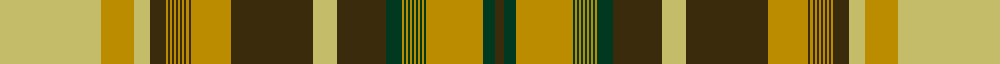

This is one **variant** — a specific cloth: this exact thread count and colourway, with its own
provenance below. It is one weaving of the [sett](/tartans/a/al/alberta-3/) (the scale-free proportion — the
same cloth at any scale or shade), whose colour order is pattern [GGYGYGYGYGYGYGYGGYGYGYGYGYGYGYGYGYYY](/stripes/ggygygygygygygyggygygygygygygygygyyy/).

Part of the [Alberta](/tartans/a/al/alberta-3/) tartan — the named design grouping this sett with its other cloths.

Sourced from register-of-tartans.  It is a [36 stripe tartan](/stripes/stripes36/).

Original link [https://www.tartanregister.gov.uk/tartanDetails.aspx?ref=5704](https://www.tartanregister.gov.uk/tartanDetails.aspx?ref=5704)

Dataset <small>— provenance for this record, inherited from the source manifest</small>

<dl class="dataset-prov">
<dt>source</dt><dd><a href="/sources/register-of-tartans/">Scottish Register of Tartans</a></dd>
<dt>data captured from</dt><dd><a href="https://github.com/thetartan/tartan-database/blob/master/data/register-of-tartans/data.csv">https://github.com/thetartan/tartan-database/blob/master/data/register-of-tartans/data.csv</a></dd>
<dt>data date</dt><dd>2017-01-06 <small>(dataset default)</small></dd>
<dt>licence</dt><dd><a href="https://www.tartanregister.gov.uk/copyright">Crown copyright</a></dd>
</dl>

Capture chain <small>— the hands this data passed through, oldest first; each capture carries its own licence</small>

<ol class="capture-chain">
<li><a href="https://www.tartanregister.gov.uk/">Scottish Register of Tartans</a> · <a href="https://www.tartanregister.gov.uk/copyright">Crown copyright</a> <small>the living register — still published by National Records of Scotland</small></li>
<li><a href="https://github.com/thetartan/tartan-database">thetartan/tartan-database</a> <small>2016-2017</small> · <a href="https://creativecommons.org/licenses/by-nc-nd/4.0/">CC BY-NC-ND 4.0</a> <small>Levko Kravets's frozen compilation — the capture we vendored, and where its CC licence text came from</small></li>
<li>this dictionary <small>captured 2026-06-10 · commit 5bf86c7566</small> <small>each re-capture is a git commit to data/sources</small></li>
</ol>

## Register references

External register numbers recorded for this tartan.

- Scottish Register of Tartans: [5704](https://www.tartanregister.gov.uk/tartanDetails.aspx?ref=5704)
- Scottish Tartans Authority (ITI): 7712

## Thread count
LYi/50 LY16 LYi8 DY8 LY1 DY1 LY1 DY1 LY1 DY1 LY1 DY1 LY1 DY1 LY1 DY1 LY20 DY40 LYi12 DY24 DG8 LY1 DG1 LY1 DG1 LY1 DG1 LY1 DG1 LY1 DG1 LY1 DG1 LY28 DG6 DY/4

One full sett is **442 threads**.

## Palette
<table><thead><tr><th>Colour</th><th>Shade</th><th>OKLCh</th></tr></thead><tbody><tr><td>G</td><td><code style="background-color:#009894;">#009894</code> <small style="color:#888">#009894</small></td><td><small style="color:#888">oklch(61.4% 0.106 191.5)</small></td></tr><tr><td>DB</td><td><code style="background-color:#082077;">#082077</code> <small style="color:#888">#082077</small></td><td><small style="color:#888">oklch(30.0% 0.149 265.1)</small></td></tr><tr><td>DG</td><td><code style="background-color:#003820;">#003820</code> <small style="color:#888">#003820</small></td><td><small style="color:#888">oklch(30.0% 0.070 158.3)</small></td></tr><tr><td>DO</td><td><code style="background-color:#412714;">#412714</code> <small style="color:#888">#412714</small></td><td><small style="color:#888">oklch(30.1% 0.050 55.7)</small></td></tr><tr><td>LY</td><td><code style="background-color:#BC8C00;">#BC8C00</code> <small style="color:#888">#BC8C00</small></td><td><small style="color:#888">oklch(66.8% 0.137 84.1)</small></td></tr><tr><td>G</td><td><code style="background-color:#289C18;">#289C18</code> <small style="color:#888">#289C18</small></td><td><small style="color:#888">oklch(60.6% 0.191 141.6)</small></td></tr><tr><td>DG</td><td><code style="background-color:#006818;">#006818</code> <small style="color:#888">#006818</small></td><td><small style="color:#888">oklch(45.0% 0.142 145.0)</small></td></tr><tr><td>K</td><td><code style="background-color:#000000;">#000000</code> <small style="color:#888">#000000</small></td><td><small style="color:#888">oklch(0.0% 0.000 0.0)</small></td></tr><tr><td>LY</td><td><code style="background-color:#C4BC68;">#C4BC68</code> <small style="color:#888">#C4BC68</small></td><td><small style="color:#888">oklch(78.4% 0.107 103.7)</small></td></tr><tr><td>W</td><td><code style="background-color:#F7F7F7;">#F7F7F7</code> <small style="color:#888">#F7F7F7</small></td><td><small style="color:#888">oklch(97.6% 0.000 89.9)</small></td></tr><tr><td>R</td><td><code style="background-color:#D60020;">#D60020</code> <small style="color:#888">#D60020</small></td><td><small style="color:#888">oklch(55.2% 0.224 25.5)</small></td></tr><tr><td>DY</td><td><code style="background-color:#3A2B0D;">#3A2B0D</code> <small style="color:#888">#3A2B0D</small></td><td><small style="color:#888">oklch(30.0% 0.049 82.0)</small></td></tr></tbody></table>

# Sample pattern

[Sample sheet (PDF)](swatch.pdf) — the woven sample, thread count and palette on one printable A4, rendered on demand (the same sheet the TTD print page downloads).

## Nearest tartan variants

The nearest existing variants by ΔTartan distance, with this cloth at the top so the swatches line up against it.

ΔTartan

Threads

Variant

Sett

—

442

<a href="/variants/s36/lyi50ly16lyi8dy8ly1dy1ly1dy1ly1dy1ly1dy1ly1dy1ly1dy1ly20dy40lyi12dy24dg8ly1dg1ly1dg1ly1dg1ly1dg1ly1dg1ly1dg1ly28dg6dy4~lyi7811105-ly6614084-dg3007159/">Alberta (CIDD 28106)</a>

<a href="/ttd/edit/#slug=dg50ly16dg8dy8ly1dy1ly1dy1ly1dy1ly1dy1ly1dy1ly1dy1ly20dy40dg12dy24r8ly1r1ly1r1ly1r1ly1r1ly1r1ly1r1ly28r6dy4&amp;base=lyi50ly16lyi8dy8ly1dy1ly1dy1ly1dy1ly1dy1ly1dy1ly1dy1ly20dy40lyi12dy24dg8ly1dg1ly1dg1ly1dg1ly1dg1ly1dg1ly1dg1ly28dg6dy4~lyi7811105-ly6614084-dg3007159" title="compare in the TTD">3.05</a>

442

<a href="/variants/s36/dg50ly16dg8dy8ly1dy1ly1dy1ly1dy1ly1dy1ly1dy1ly1dy1ly20dy40dg12dy24r8ly1r1ly1r1ly1r1ly1r1ly1r1ly1r1ly28r6dy4/">Ontario (CIDD 28103) (Commemorative)</a>

<a href="/ttd/edit/#slug=g50r16g8do8r1do1r1do1r1do1r1do1r1do1r1do1r20do40g12do24ly8r1ly1r1ly1r1ly1r1ly1r1ly1r1ly1r28ly6do4&amp;base=lyi50ly16lyi8dy8ly1dy1ly1dy1ly1dy1ly1dy1ly1dy1ly1dy1ly20dy40lyi12dy24dg8ly1dg1ly1dg1ly1dg1ly1dg1ly1dg1ly1dg1ly28dg6dy4~lyi7811105-ly6614084-dg3007159" title="compare in the TTD">3.24</a>

442

<a href="/variants/s36/g50r16g8do8r1do1r1do1r1do1r1do1r1do1r1do1r20do40g12do24ly8r1ly1r1ly1r1ly1r1ly1r1ly1r1ly1r28ly6do4/">Newfoundland (Commemorative)</a>

<a href="/ttd/edit/#slug=dg50ly16dg8dy8ly1dy1ly1dy1ly1dy1ly1dy1ly1dy1ly1dy1ly20dy40dg12dy24r8ly1r1ly1r1ly1r1ly1r1ly1r1ly1r1ly28r6dy4~ly6614084&amp;base=lyi50ly16lyi8dy8ly1dy1ly1dy1ly1dy1ly1dy1ly1dy1ly1dy1ly20dy40lyi12dy24dg8ly1dg1ly1dg1ly1dg1ly1dg1ly1dg1ly1dg1ly28dg6dy4~lyi7811105-ly6614084-dg3007159" title="compare in the TTD">3.69</a>

442

<a href="/variants/s36/dg50ly16dg8dy8ly1dy1ly1dy1ly1dy1ly1dy1ly1dy1ly1dy1ly20dy40dg12dy24r8ly1r1ly1r1ly1r1ly1r1ly1r1ly1r1ly28r6dy4~ly6614084/">Ontario Centennial</a>

<a href="/ttd/edit/#slug=db50ly16db8dg8ly1dg1ly1dg1ly1dg1ly1dg1ly1dg1ly1dg1ly20dg40db12dg24g8ly1g1ly1g1ly1g1ly1g1ly1g1ly1g1ly28g6dg4&amp;base=lyi50ly16lyi8dy8ly1dy1ly1dy1ly1dy1ly1dy1ly1dy1ly1dy1ly20dy40lyi12dy24dg8ly1dg1ly1dg1ly1dg1ly1dg1ly1dg1ly1dg1ly28dg6dy4~lyi7811105-ly6614084-dg3007159" title="compare in the TTD">3.77</a>

442

<a href="/variants/s36/db50ly16db8dg8ly1dg1ly1dg1ly1dg1ly1dg1ly1dg1ly1dg1ly20dg40db12dg24g8ly1g1ly1g1ly1g1ly1g1ly1g1ly1g1ly28g6dg4/">Nova Scotia (Commemorative)</a>

<a href="/ttd/edit/#slug=g50r16g8do8r1do1r1do1r1do1r1do1r1do1r1do1r20do40g12do24y8r1y1r1y1r1y1r1y1r1y1r1y1r28y6do4&amp;base=lyi50ly16lyi8dy8ly1dy1ly1dy1ly1dy1ly1dy1ly1dy1ly1dy1ly20dy40lyi12dy24dg8ly1dg1ly1dg1ly1dg1ly1dg1ly1dg1ly1dg1ly28dg6dy4~lyi7811105-ly6614084-dg3007159" title="compare in the TTD">3.88</a>

442

<a href="/variants/s36/g50r16g8do8r1do1r1do1r1do1r1do1r1do1r1do1r20do40g12do24y8r1y1r1y1r1y1r1y1r1y1r1y1r28y6do4/">Newfoundland (CIDD 28098)</a>

## Neighbour map

Every grey dot is one of 13662 variants placed by the first two principal components of the ΔTartan feature space (42% of its variance). Red is this tartan; blue dots are its nearest — click one to open its page. The map is a flat projection of a many-dimensional space — [how to read it](/posts/neighbourhood-maps/).

<svg viewBox="0 0 640 380" role="img" style="max-width:100%;height:auto;border:1px solid #e0e0e0;border-radius:4px;display:block" xmlns="http://www.w3.org/2000/svg"><image href="/nn/cloud.v1.png" width="640" height="380"/><a href="/variants/s36/dg50ly16dg8dy8ly1dy1ly1dy1ly1dy1ly1dy1ly1dy1ly1dy1ly20dy40dg12dy24r8ly1r1ly1r1ly1r1ly1r1ly1r1ly1r1ly28r6dy4/"><circle cx="229.7" cy="36.9" r="4" fill="#3465a4"><title>Ontario (CIDD 28103) (Commemorative)</title></circle></a><a href="/variants/s36/g50r16g8do8r1do1r1do1r1do1r1do1r1do1r1do1r20do40g12do24ly8r1ly1r1ly1r1ly1r1ly1r1ly1r1ly1r28ly6do4/"><circle cx="256.4" cy="41.5" r="4" fill="#3465a4"><title>Newfoundland (Commemorative)</title></circle></a><a href="/variants/s36/dg50ly16dg8dy8ly1dy1ly1dy1ly1dy1ly1dy1ly1dy1ly1dy1ly20dy40dg12dy24r8ly1r1ly1r1ly1r1ly1r1ly1r1ly1r1ly28r6dy4~ly6614084/"><circle cx="272.0" cy="50.3" r="4" fill="#3465a4"><title>Ontario Centennial</title></circle></a><a href="/variants/s36/db50ly16db8dg8ly1dg1ly1dg1ly1dg1ly1dg1ly1dg1ly1dg1ly20dg40db12dg24g8ly1g1ly1g1ly1g1ly1g1ly1g1ly1g1ly28g6dg4/"><circle cx="237.4" cy="51.1" r="4" fill="#3465a4"><title>Nova Scotia (Commemorative)</title></circle></a><a href="/variants/s36/g50r16g8do8r1do1r1do1r1do1r1do1r1do1r1do1r20do40g12do24y8r1y1r1y1r1y1r1y1r1y1r1y1r28y6do4/"><circle cx="276.9" cy="48.0" r="4" fill="#3465a4"><title>Newfoundland (CIDD 28098)</title></circle></a><circle cx="265.5" cy="57.0" r="5" fill="#c00000"/><text x="320" y="376" text-anchor="middle" font-size="11" fill="#999">ground</text><text x="11" y="190" text-anchor="middle" font-size="11" fill="#999" transform="rotate(-90 11 190)">complexity</text></svg>

ID: /variants/s36/lyi50ly16lyi8dy8ly1dy1ly1dy1ly1dy1ly1dy1ly1dy1ly1dy1ly20dy40lyi12dy24dg8ly1dg1ly1dg1ly1dg1ly1dg1ly1dg1ly1dg1ly28dg6dy4~lyi7811105-ly6614084-dg3007159/
