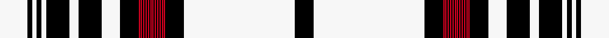

This page is one **sett** — a single exact thread-count. It belongs to the [tartan](/setts/w24k4w4k4w4k20w8k20w16k16r1k1r1k1r1k1r1k1r1k1r1k1r1k1r1k1r1k1r1k1r1k1r1k16w96k16/)
(the same proportion at any scale), whose colour order is pattern [KWKRKRKRKRKRKRKRKRKRKRKRKRKWKWKWKWKW](/stripes/kwkrkrkrkrkrkrkrkrkrkrkrkrkwkwkwkwkw/).

Sourced from register-of-tartans.  It is a [36 stripe tartan](/stripes/stripes36/).

Original link [https://www.tartanregister.gov.uk/tartanDetails.aspx?ref=1019](https://www.tartanregister.gov.uk/tartanDetails.aspx?ref=1019)

2 attestations — the source records this cloth was collapsed from (oldest owns this page)

<ul>
<li>01/01/2002 — Dunbar Plaid (register-of-tartans, <a href="https://www.tartanregister.gov.uk/tartanDetails.aspx?ref=1019">record</a>)  <em>According to the Scottish Tartans Society this is from a plaid owned by Dunbar's, Invereen. Thread count has been reduced for display purposes. The red looks so dark because the count alternates between R1 and K1. See other tartan for same family at #6241 (original Scottish Tartans Authority reference).</em></li>
<li>undated — Dunbar, Plaid (weddslist, <a href="http://www.weddslist.com/cgi-bin/tartans/pg.pl?source=sts">record</a>) </li>
</ul>

Dataset <small>— provenance for this record, inherited from the source manifest</small>

<dl class="dataset-prov">
<dt>source</dt><dd><a href="/sources/register-of-tartans/">Scottish Register of Tartans</a></dd>
<dt>data captured from</dt><dd><a href="https://github.com/thetartan/tartan-database/blob/master/data/register-of-tartans/data.csv">https://github.com/thetartan/tartan-database/blob/master/data/register-of-tartans/data.csv</a></dd>
<dt>data date</dt><dd>2002 <small>(this record)</small></dd>
<dt>licence</dt><dd><a href="https://www.tartanregister.gov.uk/copyright">Crown copyright</a></dd>
</dl>

Capture chain <small>— the hands this data passed through, oldest first; each capture carries its own licence</small>

<ol class="capture-chain">
<li><a href="https://www.tartanregister.gov.uk/">Scottish Register of Tartans</a> · <a href="https://www.tartanregister.gov.uk/copyright">Crown copyright</a> <small>the living register — still published by National Records of Scotland</small></li>
<li><a href="https://github.com/thetartan/tartan-database">thetartan/tartan-database</a> <small>2016-2017</small> · <a href="https://creativecommons.org/licenses/by-nc-nd/4.0/">CC BY-NC-ND 4.0</a> <small>Levko Kravets's frozen compilation — the capture we vendored, and where its CC licence text came from</small></li>
<li>this dictionary <small>captured 2026-06-10 · commit 5bf86c7566</small> <small>each re-capture is a git commit to data/sources</small></li>
</ol>

## Register references

External register numbers recorded for this tartan.

- Scottish Register of Tartans: [1019](https://www.tartanregister.gov.uk/tartanDetails.aspx?ref=1019)
- Scottish Tartans Authority (ITI): 1248
- Scottish Tartans World Register: 1248

## Thread count
W/48 K8 W8 K8 W8 K40 W16 K40 W32 K32 R2 K2 R2 K2 R2 K2 R2 K2 R2 K2 R2 K2 R2 K2 R2 K2 R2 K2 R2 K2 R2 K2 R2 K32 W192 K/32

One full sett is **1004 threads**.

## Palette
<table><thead><tr><th>Colour</th><th>Shade</th><th>OKLCh</th></tr></thead><tbody><tr><td>DR</td><td><code style="background-color:#55120C;">#55120C</code> <small style="color:#888">#55120C</small></td><td><small style="color:#888">oklch(30.0% 0.099 29.3)</small></td></tr><tr><td>K</td><td><code style="background-color:#000000;">#000000</code> <small style="color:#888">#000000</small></td><td><small style="color:#888">oklch(0.0% 0.000 0.0)</small></td></tr><tr><td>R</td><td><code style="background-color:#D60020;">#D60020</code> <small style="color:#888">#D60020</small></td><td><small style="color:#888">oklch(55.2% 0.224 25.5)</small></td></tr><tr><td>W</td><td><code style="background-color:#F7F7F7;">#F7F7F7</code> <small style="color:#888">#F7F7F7</small></td><td><small style="color:#888">oklch(97.6% 0.000 89.9)</small></td></tr></tbody></table>

# Sample pattern

ID: /variants/s36/w24k4w4k4w4k20w8k20w16k16r1k1r1k1r1k1r1k1r1k1r1k1r1k1r1k1r1k1r1k1r1k1r1k16w96k16~x2/
