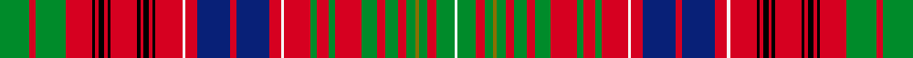

This is one **variant** — a specific cloth: this exact thread count and colourway, with its own
provenance below. It is one weaving of the [sett](/setts/g10r2g10r9k1r1k2r1k1r9k1r1k2r1k1r9w1r4db11r2db11r4w1r9g2r4g2r9g5r3g4r3g3y1g3r3g6w1/) (the scale-free proportion — the
same cloth at any scale or shade), whose colour order is pattern [GRGRKRKRKRKRKRKRWRBRBRWRGRGRGRGRGGGRGW](/stripes/grgrkrkrkrkrkrkrwrbrbrwrgrgrgrgrgggrgw/).

Part of the [MacRae](/tartans/m/ma/macrae-11/) tartan — the named design grouping this sett with its other cloths.

Sourced from register-of-tartans.  It is a [38 stripe tartan](/stripes/stripes38/).

Original link [https://www.tartanregister.gov.uk/tartanDetails.aspx?ref=2752](https://www.tartanregister.gov.uk/tartanDetails.aspx?ref=2752)

2 attestations — the source records this cloth was collapsed from (oldest owns this page)

<ul>
<li>01/01/1745 — MacRae Prince's Own (register-of-tartans, <a href="https://www.tartanregister.gov.uk/tartanDetails.aspx?ref=2752">record</a>)  <em>Scottish Tartans Society notes: Two MacRae setts, of which this is one, are contained in the Highland Society collection and presumably sealed by the Chief around 1815. Unless he recognised both, perhaps one is the clan and the other the Chief's own. Or perhaps they are from different periods of the collection. This one is alternately named 'The Prince's Own' in the Highland Society of London - Peter Eslea MacDonald, Apr 07 D.W. Stewart (1893) has black lines as shown here but the count from Jamie Scarlett MBE (No 307. P140) uses blue which is thought to be an error. D.W. Stewart had this to say of the Princes Own: 'Various circumstances tend to enhance the interest of this design, which is especially associated by Jacobite enthusiasts with the memory of Prince Charles Edward, and which was named during the campaign of 1745-46 from his personal use of it. Authenticated by specimens of contemporary and immediately subsequent dates - invariably bearing the legend of royal adoption - the tartan may be ranked amongst the earliest clan patterns extant in fabric. It is undoubtedly an old pattern of the MacRaes; and it was certainly worn by the Prince in their territory. But whether it was previously used by members of the clan, or whether it was adopted by them as a compliment to the wearer, cannot be determined.' The accepted MacRae does not have the narrow yellow lines and the white contained between them.</em></li>
<li>1810 — MacRae - 1810 (Prince's Own) (tartans-authority, <a href="https://www.tartanregister.gov.uk/tartanDetails.aspx?ref=981">record</a>)  <em>Note in STA entry said "Usual Princes Own but with fine K overstripes for the usual P." but there are no fine black overstirpes to the purple in this graphic or count. K for purple: not K on the purple. This graphic is correct - PEM Apr 07 TS notes: Two MacRae setts, of which this is one, are contained in the Highland Society collection and presumably sealed by the Chief around 1815. Unless he recognised both, perhaps one is the clan and the other the Chief's own. Or perhaps they are from different periods of the collection. This one is alternately named 'The Prince's Own' in the HSL - PEM Apr 07. DW Stewart (1893) has black lines as shown here but the count from Jamie Scarlett (No 307. P140) uses blue which is thought to be an error. D.W. Stewart had this to say of the Princes Own: "Various circumstances tend to enhance the interest of this design, which is especially associated by Jacobite enthusiasts with the memory of Prince Charles Edward, and which was named during the campaign of 1745-46 from his personal use of it. Authenticated by specimens of contemporary and immediately subsequent dates - invariably bearing the legend of royal adoption - the tartan may be ranked amongst the earliest clan patterns extant in fabric. It is undoubtedly an old pattern of the MacRaes; and it was certainly worn by the Prince in their territory. But whether it was previously used by members of the clan, or whether it was adopted by them as a compliment to the wearer, cannot be determined." The accepted MacRae at ITI 859 does not have the narrow yellow lines and the white contained between them. 981</em></li>
</ul>

Dataset <small>— provenance for this record, inherited from the source manifest</small>

<dl class="dataset-prov">
<dt>source</dt><dd><a href="/sources/register-of-tartans/">Scottish Register of Tartans</a></dd>
<dt>data captured from</dt><dd><a href="https://github.com/thetartan/tartan-database/blob/master/data/register-of-tartans/data.csv">https://github.com/thetartan/tartan-database/blob/master/data/register-of-tartans/data.csv</a></dd>
<dt>data date</dt><dd>1745 <small>(this record)</small></dd>
<dt>licence</dt><dd><a href="https://www.tartanregister.gov.uk/copyright">Crown copyright</a></dd>
</dl>

Capture chain <small>— the hands this data passed through, oldest first; each capture carries its own licence</small>

<ol class="capture-chain">
<li><a href="https://www.tartanregister.gov.uk/">Scottish Register of Tartans</a> · <a href="https://www.tartanregister.gov.uk/copyright">Crown copyright</a> <small>the living register — still published by National Records of Scotland</small></li>
<li><a href="https://github.com/thetartan/tartan-database">thetartan/tartan-database</a> <small>2016-2017</small> · <a href="https://creativecommons.org/licenses/by-nc-nd/4.0/">CC BY-NC-ND 4.0</a> <small>Levko Kravets's frozen compilation — the capture we vendored, and where its CC licence text came from</small></li>
<li>this dictionary <small>captured 2026-06-10 · commit 5bf86c7566</small> <small>each re-capture is a git commit to data/sources</small></li>
</ol>

## Register references

External register numbers recorded for this tartan.

- Scottish Register of Tartans: [2752](https://www.tartanregister.gov.uk/tartanDetails.aspx?ref=2752)
- Scottish Tartans Authority (ITI): 981
- Scottish Tartans World Register: 981

## Thread count
G/20 R4 G20 R18 K2 R2 K4 R2 K2 R18 K2 R2 K4 R2 K2 R18 W2 R8 DB22 R4 DB22 R8 W2 R18 G4 R8 G4 R18 G10 R6 G8 R6 G6 Y2 G6 R6 G12 W/2

One full sett is **590 threads**.

## Palette
<table><thead><tr><th>Colour</th><th>Shade</th><th>OKLCh</th></tr></thead><tbody><tr><td>DB</td><td><code style="background-color:#082077;">#082077</code> <small style="color:#888">#082077</small></td><td><small style="color:#888">oklch(30.0% 0.149 265.1)</small></td></tr><tr><td>G</td><td><code style="background-color:#008B2A;">#008B2A</code> <small style="color:#888">#008B2A</small></td><td><small style="color:#888">oklch(55.4% 0.170 145.9)</small></td></tr><tr><td>K</td><td><code style="background-color:#000000;">#000000</code> <small style="color:#888">#000000</small></td><td><small style="color:#888">oklch(0.0% 0.000 0.0)</small></td></tr><tr><td>W</td><td><code style="background-color:#F7F7F7;">#F7F7F7</code> <small style="color:#888">#F7F7F7</small></td><td><small style="color:#888">oklch(97.6% 0.000 89.9)</small></td></tr><tr><td>R</td><td><code style="background-color:#D60020;">#D60020</code> <small style="color:#888">#D60020</small></td><td><small style="color:#888">oklch(55.2% 0.224 25.5)</small></td></tr><tr><td>Y</td><td><code style="background-color:#8B6E00;">#8B6E00</code> <small style="color:#888">#8B6E00</small></td><td><small style="color:#888">oklch(55.1% 0.113 90.4)</small></td></tr></tbody></table>

# Sample pattern

## Nearest tartan variants

The nearest existing variants by ΔTartan distance, with this cloth at the top so the swatches line up against it.

ΔTartan

Threads

Variant

Sett

—

590

<a href="/variants/s38/g10r2g10r9k1r1k2r1k1r9k1r1k2r1k1r9w1r4db11r2db11r4w1r9g2r4g2r9g5r3g4r3g3y1g3r3g6w1~x2/">MacRae Prince's Own</a>

<a href="/ttd/edit/#slug=g29r5g28r22k2r2k4r2k2r22k2r2k4r2k2r20w2r9db26r5db28r9w2r22g3r8g3r22g8r6g8r6g5y3g5r7g12w2~x2&amp;base=g10r2g10r9k1r1k2r1k1r9k1r1k2r1k1r9w1r4db11r2db11r4w1r9g2r4g2r9g5r3g4r3g3y1g3r3g6w1~x2" title="compare in the TTD">0.23</a>

1342

<a href="/variants/s38/g29r5g28r22k2r2k4r2k2r22k2r2k4r2k2r20w2r9db26r5db28r9w2r22g3r8g3r22g8r6g8r6g5y3g5r7g12w2~x2/">MacRae The Princes Own Clan Tartan</a>

<a href="/ttd/edit/#slug=dg24r33k2r2k5r2k2r26k2r2k5r2k2r26w3r12db33r7db33r12w3r26dg4r12dg4r26dg12r8dg12r12dg8g7dg8r12dg9w3dg16w2~x2~dg1806142-g2408144&amp;base=g10r2g10r9k1r1k2r1k1r9k1r1k2r1k1r9w1r4db11r2db11r4w1r9g2r4g2r9g5r3g4r3g3y1g3r3g6w1~x2" title="compare in the TTD">1.81</a>

1624

<a href="/variants/s38/dg24r33k2r2k5r2k2r26k2r2k5r2k2r26w3r12db33r7db33r12w3r26dg4r12dg4r26dg12r8dg12r12dg8g7dg8r12dg9w3dg16w2~x2~dg1806142-g2408144/">Kinnoull (MacRae) Family Tartan</a>

<a href="/ttd/edit/#slug=dg23r6dg23r25k2r2k5r2k2r26k2r2k5r2k2r26w3r12lb33r7lb33r12w3r26dg8r12dg4r26dg12r8dg12r12dg8g7dg8r12dg9w3dg16w2&amp;base=g10r2g10r9k1r1k2r1k1r9k1r1k2r1k1r9w1r4db11r2db11r4w1r9g2r4g2r9g5r3g4r3g3y1g3r3g6w1~x2" title="compare in the TTD">1.98</a>

861

<a href="/variants/s40/dg23r6dg23r25k2r2k5r2k2r26k2r2k5r2k2r26w3r12lb33r7lb33r12w3r26dg8r12dg4r26dg12r8dg12r12dg8g7dg8r12dg9w3dg16w2/">Kinnoull (Clan)</a>

<a href="/ttd/edit/#slug=dg24r7dg24r26k2r2k5r2k2r26k2r2k5r2k2r26w3r12db33r7db33r12w3r26dg4r12dg4r26dg12r8dg12r12dg8g7dg8r12dg9w3dg16w2~x2~dg1504144-g2408144&amp;base=g10r2g10r9k1r1k2r1k1r9k1r1k2r1k1r9w1r4db11r2db11r4w1r9g2r4g2r9g5r3g4r3g3y1g3r3g6w1~x2" title="compare in the TTD">1.99</a>

1720

<a href="/variants/s40/dg24r7dg24r26k2r2k5r2k2r26k2r2k5r2k2r26w3r12db33r7db33r12w3r26dg4r12dg4r26dg12r8dg12r12dg8g7dg8r12dg9w3dg16w2~x2~dg1504144-g2408144/">Kinnoull (MacRae)</a>

<a href="/ttd/edit/#slug=dg24r7dg24r26k2r2k5r2k2r24k2r2k5r2k2r26w3r12db33r12w3r26dg4r12dg4r26dg12r8dg12r12dg8g7dg8r12dg9w3dg16w2~dg1806142-g1904115&amp;base=g10r2g10r9k1r1k2r1k1r9k1r1k2r1k1r9w1r4db11r2db11r4w1r9g2r4g2r9g5r3g4r3g3y1g3r3g6w1~x2" title="compare in the TTD">2.46</a>

776

<a href="/variants/s38/dg24r7dg24r26k2r2k5r2k2r24k2r2k5r2k2r26w3r12db33r12w3r26dg4r12dg4r26dg12r8dg12r12dg8g7dg8r12dg9w3dg16w2~dg1806142-g1904115/">Kinnoull (MacRae) - Error?</a>

<a href="/ttd/edit/#slug=g23r6g23r25g4r10g4r25w3r10b31r6b31r10w3r25k2r2k4r2k2r25k2r2k4r2k2r25g23r6g23~x2&amp;base=g10r2g10r9k1r1k2r1k1r9k1r1k2r1k1r9w1r4db11r2db11r4w1r9g2r4g2r9g5r3g4r3g3y1g3r3g6w1~x2" title="compare in the TTD">2.53</a>

1368

<a href="/variants/s31/g23r6g23r25g4r10g4r25w3r10b31r6b31r10w3r25k2r2k4r2k2r25k2r2k4r2k2r25g23r6g23~x2/">Kinnoull</a>

<a href="/ttd/edit/#slug=g12r12g2r2g2r2g6y2r1y2g6r2g2r2g2r12db8g8k2r4k2r4k2g8db8r12g12lb2~x2&amp;base=g10r2g10r9k1r1k2r1k1r9k1r1k2r1k1r9w1r4db11r2db11r4w1r9g2r4g2r9g5r3g4r3g3y1g3r3g6w1~x2" title="compare in the TTD">2.55</a>

536

<a href="/variants/s28/g12r12g2r2g2r2g6y2r1y2g6r2g2r2g2r12db8g8k2r4k2r4k2g8db8r12g12lb2~x2/">MacMaster (New) Family Tartan</a>

<a href="/ttd/edit/#slug=r2k2w2r22t8k2t2k2t8k12ly2g16r22t4r22t4r22g16ly2k12t8k2t2k2t8r22w1k1r1~x2&amp;base=g10r2g10r9k1r1k2r1k1r9k1r1k2r1k1r9w1r4db11r2db11r4w1r9g2r4g2r9g5r3g4r3g3y1g3r3g6w1~x2" title="compare in the TTD">2.81</a>

918

<a href="/variants/s29/r2k2w2r22t8k2t2k2t8k12ly2g16r22t4r22t4r22g16ly2k12t8k2t2k2t8r22w1k1r1~x2/">MacPherson</a>

<a href="/ttd/edit/#slug=r8w2r8n15y1k15n8k1g1k1n8r8w2k2r3~x2&amp;base=g10r2g10r9k1r1k2r1k1r9k1r1k2r1k1r9w1r4db11r2db11r4w1r9g2r4g2r9g5r3g4r3g3y1g3r3g6w1~x2" title="compare in the TTD">3.02</a>

310

<a href="/variants/s15/r8w2r8n15y1k15n8k1g1k1n8r8w2k2r3~x2/">Unidentified Scarlett #14</a>

<a href="/ttd/edit/#slug=o10y4k2y2k2y2k2y4r1y2r1y4k4y3r7y3r7y1k1y1b7y1k1y1r7y1k1y1r7y3r7y3k4y4k2y2k2y4k4y6k2y6k2y6k2y6k2y6k2y6k10y4o1w2o1y2o1w2o1y4k6y1w2~x2&amp;base=g10r2g10r9k1r1k2r1k1r9k1r1k2r1k1r9w1r4db11r2db11r4w1r9g2r4g2r9g5r3g4r3g3y1g3r3g6w1~x2" title="compare in the TTD">3.18</a>

808

<a href="/variants/s63/o10y4k2y2k2y2k2y4r1y2r1y4k4y3r7y3r7y1k1y1b7y1k1y1r7y1k1y1r7y3r7y3k4y4k2y2k2y4k4y6k2y6k2y6k2y6k2y6k2y6k10y4o1w2o1y2o1w2o1y4k6y1w2~x2/">Murray, Mungo</a>

## Neighbour map

Every grey dot is one of 13621 variants placed by the first two principal components of the ΔTartan feature space (42% of its variance). Red is this tartan; blue dots are its nearest — click one to open its page.

<svg viewBox="0 0 640 380" role="img" style="max-width:100%;height:auto;border:1px solid #e0e0e0;border-radius:4px;display:block" xmlns="http://www.w3.org/2000/svg"><image href="/nn/cloud.v1.png" width="640" height="380"/><a href="/variants/s38/g29r5g28r22k2r2k4r2k2r22k2r2k4r2k2r20w2r9db26r5db28r9w2r22g3r8g3r22g8r6g8r6g5y3g5r7g12w2~x2/"><circle cx="172.6" cy="66.8" r="4" fill="#3465a4"><title>MacRae The Princes Own Clan Tartan</title></circle></a><a href="/variants/s38/dg24r33k2r2k5r2k2r26k2r2k5r2k2r26w3r12db33r7db33r12w3r26dg4r12dg4r26dg12r8dg12r12dg8g7dg8r12dg9w3dg16w2~x2~dg1806142-g2408144/"><circle cx="191.6" cy="65.3" r="4" fill="#3465a4"><title>Kinnoull (MacRae) Family Tartan</title></circle></a><a href="/variants/s40/dg23r6dg23r25k2r2k5r2k2r26k2r2k5r2k2r26w3r12lb33r7lb33r12w3r26dg8r12dg4r26dg12r8dg12r12dg8g7dg8r12dg9w3dg16w2/"><circle cx="164.9" cy="65.2" r="4" fill="#3465a4"><title>Kinnoull (Clan)</title></circle></a><a href="/variants/s40/dg24r7dg24r26k2r2k5r2k2r26k2r2k5r2k2r26w3r12db33r7db33r12w3r26dg4r12dg4r26dg12r8dg12r12dg8g7dg8r12dg9w3dg16w2~x2~dg1504144-g2408144/"><circle cx="178.3" cy="67.9" r="4" fill="#3465a4"><title>Kinnoull (MacRae)</title></circle></a><a href="/variants/s38/dg24r7dg24r26k2r2k5r2k2r24k2r2k5r2k2r26w3r12db33r12w3r26dg4r12dg4r26dg12r8dg12r12dg8g7dg8r12dg9w3dg16w2~dg1806142-g1904115/"><circle cx="200.7" cy="71.0" r="4" fill="#3465a4"><title>Kinnoull (MacRae) - Error?</title></circle></a><a href="/variants/s31/g23r6g23r25g4r10g4r25w3r10b31r6b31r10w3r25k2r2k4r2k2r25k2r2k4r2k2r25g23r6g23~x2/"><circle cx="206.4" cy="94.9" r="4" fill="#3465a4"><title>Kinnoull</title></circle></a><a href="/variants/s28/g12r12g2r2g2r2g6y2r1y2g6r2g2r2g2r12db8g8k2r4k2r4k2g8db8r12g12lb2~x2/"><circle cx="144.5" cy="109.1" r="4" fill="#3465a4"><title>MacMaster (New) Family Tartan</title></circle></a><a href="/variants/s29/r2k2w2r22t8k2t2k2t8k12ly2g16r22t4r22t4r22g16ly2k12t8k2t2k2t8r22w1k1r1~x2/"><circle cx="170.9" cy="57.0" r="4" fill="#3465a4"><title>MacPherson</title></circle></a><a href="/variants/s15/r8w2r8n15y1k15n8k1g1k1n8r8w2k2r3~x2/"><circle cx="116.3" cy="80.4" r="4" fill="#3465a4"><title>Unidentified Scarlett #14</title></circle></a><a href="/variants/s63/o10y4k2y2k2y2k2y4r1y2r1y4k4y3r7y3r7y1k1y1b7y1k1y1r7y1k1y1r7y3r7y3k4y4k2y2k2y4k4y6k2y6k2y6k2y6k2y6k2y6k10y4o1w2o1y2o1w2o1y4k6y1w2~x2/"><circle cx="90.2" cy="82.4" r="4" fill="#3465a4"><title>Murray, Mungo</title></circle></a><circle cx="152.8" cy="86.2" r="5" fill="#c00000"/><text x="320" y="376" text-anchor="middle" font-size="11" fill="#999">ground</text><text x="11" y="190" text-anchor="middle" font-size="11" fill="#999" transform="rotate(-90 11 190)">complexity</text></svg>

ID: /variants/s38/g10r2g10r9k1r1k2r1k1r9k1r1k2r1k1r9w1r4db11r2db11r4w1r9g2r4g2r9g5r3g4r3g3y1g3r3g6w1~x2/
