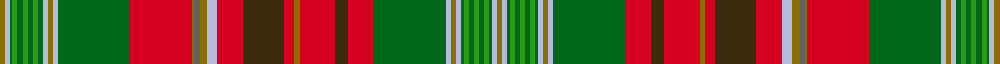

This page is one **sett** — a single exact thread-count. It belongs to the [tartan](/setts/y2lb2dg1g2dg2g2dg2g2dg2lb2y2lb2dg28r24y1n2y3lb4r10dy16r4y2r14dy5r10dg28lb2y2lb2dg1g2dg2g2dg2g2dg1lb2y2/)
(the same proportion at any scale), whose colour order is pattern [GWGGGGGGGWGWGRGBGWRGRGRGRGWGWGGGGGGGWG](/stripes/gwgggggggwgwgrgbgwrgrgrgrgwgwgggggggwg/).

Sourced from house-of-tartan.  It is a [38 stripe tartan](/stripes/stripes38/).

Original link http://www.house-of-tartan.scotland.net/house/TartanViewjs.asp?colr=Def&tnam=1880

## Provenance

Earliest known date: pre 2003 Sent in by Tweedmill for information.

## Thread count
Y/2 LB2 DG1 G2 DG2 G2 DG2 G2 DG2 LB2 Y2 LB2 DG28 R24 Y1 N2 Y3 LB4 R10 DY16 R4 Y2 R14 DY5 R10 DG28 LB2 Y2 LB2 DG1 G2 DG2 G2 DG2 G2 DG1 LB2 Y/2

One full sett is **388 threads**.

## Palette
<table><thead><tr><th>Colour</th><th>Shade</th><th>OKLCh</th></tr></thead><tbody><tr><td>LB</td><td><code style="background-color:#B5BBDE;">#B5BBDE</code> <small style="color:#888">#B5BBDE</small></td><td><small style="color:#888">oklch(79.9% 0.050 277.6)</small></td></tr><tr><td>DG</td><td><code style="background-color:#006818;">#006818</code> <small style="color:#888">#006818</small></td><td><small style="color:#888">oklch(45.0% 0.142 145.0)</small></td></tr><tr><td>G</td><td><code style="background-color:#289C18;">#289C18</code> <small style="color:#888">#289C18</small></td><td><small style="color:#888">oklch(60.6% 0.191 141.6)</small></td></tr><tr><td>N</td><td><code style="background-color:#636363;">#636363</code> <small style="color:#888">#636363</small></td><td><small style="color:#888">oklch(50.0% 0.000 89.9)</small></td></tr><tr><td>R</td><td><code style="background-color:#D60020;">#D60020</code> <small style="color:#888">#D60020</small></td><td><small style="color:#888">oklch(55.2% 0.224 25.5)</small></td></tr><tr><td>DY</td><td><code style="background-color:#3A2B0D;">#3A2B0D</code> <small style="color:#888">#3A2B0D</small></td><td><small style="color:#888">oklch(30.0% 0.049 82.0)</small></td></tr><tr><td>Y</td><td><code style="background-color:#8B6E00;">#8B6E00</code> <small style="color:#888">#8B6E00</small></td><td><small style="color:#888">oklch(55.1% 0.113 90.4)</small></td></tr></tbody></table>

# Sample pattern

## Nearest variants

The nearest existing variants by ΔTartan distance, with this cloth at the top so the swatches line up against it.

ΔTartan

Threads

Variant

Sett

—

388

<a href="/variants/s38/y2lb2dg1g2dg2g2dg2g2dg2lb2y2lb2dg28r24y1n2y3lb4r10dy16r4y2r14dy5r10dg28lb2y2lb2dg1g2dg2g2dg2g2dg1lb2y2~dg1806142-g2408144/">New Brunswick variation Canadian Tartan</a>

<a href="/ttd/edit/#slug=lb1y1lb1dg1g2dg2g2dg2g2dg1lb1y1lb1y1lb1dg28r24y1n2y3lb4r10dy16r4y2r15dy5r9dg28lb1y1lb1y1lb1dg1g2dg2g2dg2g2dg1lb1y1lb1~x2&amp;base=y2lb2dg1g2dg2g2dg2g2dg2lb2y2lb2dg28r24y1n2y3lb4r10dy16r4y2r14dy5r10dg28lb2y2lb2dg1g2dg2g2dg2g2dg1lb2y2~dg1806142-g2408144" title="compare in the TTD">1.93</a>

760

<a href="/variants/s44/lb1y1lb1dg1g2dg2g2dg2g2dg1lb1y1lb1y1lb1dg28r24y1n2y3lb4r10dy16r4y2r15dy5r9dg28lb1y1lb1y1lb1dg1g2dg2g2dg2g2dg1lb1y1lb1~x2/">New Brunswick (Lyon Court Books)</a>

## Neighbour map

Every grey dot is one of 13620 variants placed by the first two principal components of the ΔTartan feature space (42% of its variance). Red is this tartan; blue dots are its nearest — click one to open its page.

<svg viewBox="0 0 640 380" role="img" style="max-width:100%;height:auto;border:1px solid #e0e0e0;border-radius:4px;display:block" xmlns="http://www.w3.org/2000/svg"><image href="/nn/cloud.v1.png" width="640" height="380"/><a href="/variants/s44/lb1y1lb1dg1g2dg2g2dg2g2dg1lb1y1lb1y1lb1dg28r24y1n2y3lb4r10dy16r4y2r15dy5r9dg28lb1y1lb1y1lb1dg1g2dg2g2dg2g2dg1lb1y1lb1~x2/"><circle cx="180.9" cy="17.8" r="4" fill="#3465a4"><title>New Brunswick (Lyon Court Books)</title></circle></a><circle cx="185.4" cy="40.4" r="5" fill="#c00000"/><text x="320" y="376" text-anchor="middle" font-size="11" fill="#999">ground</text><text x="11" y="190" text-anchor="middle" font-size="11" fill="#999" transform="rotate(-90 11 190)">complexity</text></svg>

ID: /variants/s38/y2lb2dg1g2dg2g2dg2g2dg2lb2y2lb2dg28r24y1n2y3lb4r10dy16r4y2r14dy5r10dg28lb2y2lb2dg1g2dg2g2dg2g2dg1lb2y2~dg1806142-g2408144/
