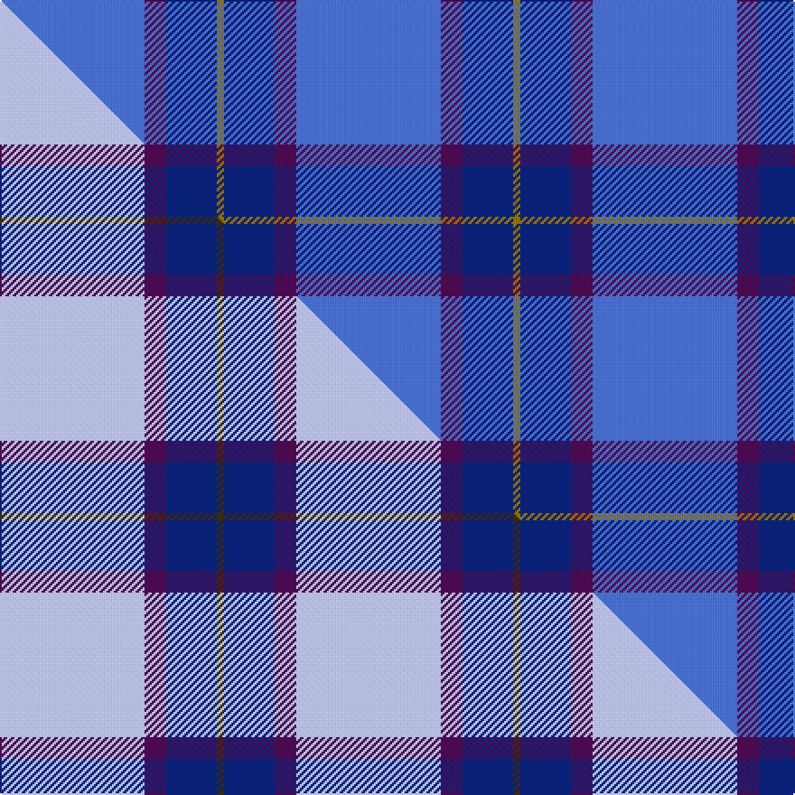

This is one **variant** — a specific cloth: this exact thread count and colourway, with its own
provenance below. It is one weaving of the [sett](/setts/b20dp3db7y1/) (the scale-free proportion — the
same cloth at any scale or shade), whose colour order is pattern [BBBG](/stripes/bbbg/).

Part of the [Peacock](/tartans/p/pe/peacock-2/) tartan — the named design grouping this sett with its other cloths.

Sourced from weddslist.  It is a [4 stripe tartan](/stripes/stripes4/).

Original link [http://www.weddslist.com/cgi-bin/tartans/pg.pl?source=sts](http://www.weddslist.com/cgi-bin/tartans/pg.pl?source=sts)

Dataset <small>— provenance for this record, inherited from the source manifest</small>

<dl class="dataset-prov">
<dt>source</dt><dd><a href="/sources/weddslist/">Weddslist</a></dd>
<dt>data captured from</dt><dd><a href="https://github.com/thetartan/tartan-database/blob/master/data/weddslist/data.csv">https://github.com/thetartan/tartan-database/blob/master/data/weddslist/data.csv</a></dd>
<dt>data date</dt><dd>2016-11-17 <small>(dataset default)</small></dd>
<dt>licence</dt><dd><a href="https://creativecommons.org/licenses/by-nc-nd/4.0/">CC BY-NC-ND 4.0</a></dd>
</dl>

Capture chain <small>— the hands this data passed through, oldest first; each capture carries its own licence</small>

<ol class="capture-chain">
<li><a href="https://www.weddslist.com/tartans/">Weddslist</a> <small>the living privately compiled reference</small></li>
<li><a href="https://github.com/thetartan/tartan-database">thetartan/tartan-database</a> <small>2016-2017</small> · <a href="https://creativecommons.org/licenses/by-nc-nd/4.0/">CC BY-NC-ND 4.0</a> <small>Levko Kravets's frozen compilation — the capture we vendored, and where its CC licence text came from</small></li>
<li>this dictionary <small>captured 2026-06-10 · commit 5bf86c7566</small> <small>each re-capture is a git commit to data/sources</small></li>
</ol>

## Thread count
B/80 DP12 DB28 Y/4

One full sett is **164 threads**.

## Palette
<table><thead><tr><th>Colour</th><th>Shade</th><th>OKLCh</th></tr></thead><tbody><tr><td>B</td><td><code style="background-color:#466CC8;">#466CC8</code> <small style="color:#888">#466CC8</small></td><td><small style="color:#888">oklch(55.1% 0.149 265.0)</small></td></tr><tr><td>DB</td><td><code style="background-color:#082077;">#082077</code> <small style="color:#888">#082077</small></td><td><small style="color:#888">oklch(30.0% 0.149 265.1)</small></td></tr><tr><td>DP</td><td><code style="background-color:#4B0B4F;">#4B0B4F</code> <small style="color:#888">#4B0B4F</small></td><td><small style="color:#888">oklch(30.1% 0.125 325.4)</small></td></tr><tr><td>Y</td><td><code style="background-color:#8B6E00;">#8B6E00</code> <small style="color:#888">#8B6E00</small></td><td><small style="color:#888">oklch(55.1% 0.113 90.4)</small></td></tr></tbody></table>

# Sample pattern

## Compared to the master

This cloth is one sett of its design; the master sett (the exemplar the design is anchored on) is below for comparison.

Its **ΔTartan distance** from the master is **0.21** — the same measure the nearest-tartans table ranks by (0 is identical; a re-scale of the same cloth is near 0, a recolour or a different proportion further).

<figure class="master-compare" style="margin:0">

this sett
master sett ★

<figcaption style="color:#888;font-size:smaller">One weave of this sett against the <a href="/setts/lb20dp3db7dy1/">master sett ★</a>, split on the diagonal: a shared proportion runs seamlessly across it with only the shades shifting; a different proportion breaks on it.</figcaption>
</figure>

## Nearest tartan variants

The nearest existing variants by ΔTartan distance, with this cloth at the top so the swatches line up against it.

ΔTartan

Threads

Variant

Sett

—

164

<a href="/variants/s4/b20dp3db7y1~x4/">Peacock</a>

<a href="/ttd/edit/#slug=o2db19t6b44w2~x2&amp;base=b20dp3db7y1~x4" title="compare in the TTD">1.20</a>

284

<a href="/variants/s5/o2db19t6b44w2~x2/">World Fed. of Bldg Contractors (Corp</a>

<a href="/ttd/edit/#slug=db9dg16b56ly4~x2~dg1304144-ly3608101&amp;base=b20dp3db7y1~x4" title="compare in the TTD">1.82</a>

314

<a href="/variants/s4/db9dg16b56ly4~x2~dg1304144-ly3608101/">Oxford University</a>

<a href="/ttd/edit/#slug=dbi9g16db59ly4~x2~dbi1406275-db1106275&amp;base=b20dp3db7y1~x4" title="compare in the TTD">1.96</a>

326

<a href="/variants/s4/dbi9g16db59ly4~x2~dbi1406275-db1106275/">Oxford University (Corporate)</a>

<a href="/ttd/edit/#slug=t50db15w3db4w2~x2&amp;base=b20dp3db7y1~x4" title="compare in the TTD">2.01</a>

192

<a href="/variants/s5/t50db15w3db4w2~x2/">Scottish Tourist Board (1990) (Corp)</a>

<a href="/ttd/edit/#slug=b10r1y1db3y2~x5~b1611266-db1108266&amp;base=b20dp3db7y1~x4" title="compare in the TTD">2.05</a>

110

<a href="/variants/s5/b10r1y1db3y2~x5~b1511266-db1108266/">Lytley alias Parsons Hunting (Personal)</a>

<a href="/ttd/edit/#slug=db39y8dr3w1~x4&amp;base=b20dp3db7y1~x4" title="compare in the TTD">2.28</a>

248

<a href="/variants/s4/db39y8dr3w1~x4/">Norwich University Regimental Tartan</a>

<a href="/ttd/edit/#slug=dp49g3r5db15y4~x2&amp;base=b20dp3db7y1~x4" title="compare in the TTD">2.63</a>

198

<a href="/variants/s5/dp49g3r5db15y4~x2/">Orion Nebula</a>

<a href="/ttd/edit/#slug=dr10db10lo1~x4&amp;base=b20dp3db7y1~x4" title="compare in the TTD">2.70</a>

124

<a href="/variants/s3/dr10db10lo1~x4/">Mother's Pride</a>

<a href="/ttd/edit/#slug=db3b30db40r3~x2&amp;base=b20dp3db7y1~x4" title="compare in the TTD">2.74</a>

292

<a href="/variants/s4/db3b30db40r3~x2/">Sanix Large Muted</a>

<a href="/ttd/edit/#slug=db62dr24ly5dg3~x2&amp;base=b20dp3db7y1~x4" title="compare in the TTD">2.84</a>

246

<a href="/variants/s4/db62dr24ly5dg3~x2/">Meaux (Personal)</a>

## Neighbour map

Every grey dot is one of 13621 variants placed by the first two principal components of the ΔTartan feature space (42% of its variance). Red is this tartan; blue dots are its nearest — click one to open its page.

<svg viewBox="0 0 640 380" role="img" style="max-width:100%;height:auto;border:1px solid #e0e0e0;border-radius:4px;display:block" xmlns="http://www.w3.org/2000/svg"><image href="/nn/cloud.v1.png" width="640" height="380"/><a href="/variants/s5/o2db19t6b44w2~x2/"><circle cx="429.6" cy="186.9" r="4" fill="#3465a4"><title>World Fed. of Bldg Contractors (Corp</title></circle></a><a href="/variants/s4/db9dg16b56ly4~x2~dg1304144-ly3608101/"><circle cx="441.7" cy="233.4" r="4" fill="#3465a4"><title>Oxford University</title></circle></a><a href="/variants/s4/dbi9g16db59ly4~x2~dbi1406275-db1106275/"><circle cx="437.1" cy="221.0" r="4" fill="#3465a4"><title>Oxford University (Corporate)</title></circle></a><a href="/variants/s5/t50db15w3db4w2~x2/"><circle cx="516.8" cy="213.8" r="4" fill="#3465a4"><title>Scottish Tourist Board (1990) (Corp)</title></circle></a><a href="/variants/s5/b10r1y1db3y2~x5~b1511266-db1108266/"><circle cx="353.8" cy="216.7" r="4" fill="#3465a4"><title>Lytley alias Parsons Hunting (Personal)</title></circle></a><a href="/variants/s4/db39y8dr3w1~x4/"><circle cx="568.8" cy="174.6" r="4" fill="#3465a4"><title>Norwich University Regimental Tartan</title></circle></a><a href="/variants/s5/dp49g3r5db15y4~x2/"><circle cx="462.0" cy="185.6" r="4" fill="#3465a4"><title>Orion Nebula</title></circle></a><a href="/variants/s3/dr10db10lo1~x4/"><circle cx="493.6" cy="328.4" r="4" fill="#3465a4"><title>Mother's Pride</title></circle></a><a href="/variants/s4/db3b30db40r3~x2/"><circle cx="447.5" cy="258.1" r="4" fill="#3465a4"><title>Sanix Large Muted</title></circle></a><a href="/variants/s4/db62dr24ly5dg3~x2/"><circle cx="488.6" cy="218.2" r="4" fill="#3465a4"><title>Meaux (Personal)</title></circle></a><circle cx="506.1" cy="238.6" r="5" fill="#c00000"/><text x="320" y="376" text-anchor="middle" font-size="11" fill="#999">ground</text><text x="11" y="190" text-anchor="middle" font-size="11" fill="#999" transform="rotate(-90 11 190)">complexity</text></svg>

ID: /variants/s4/b20dp3db7y1~x4/
