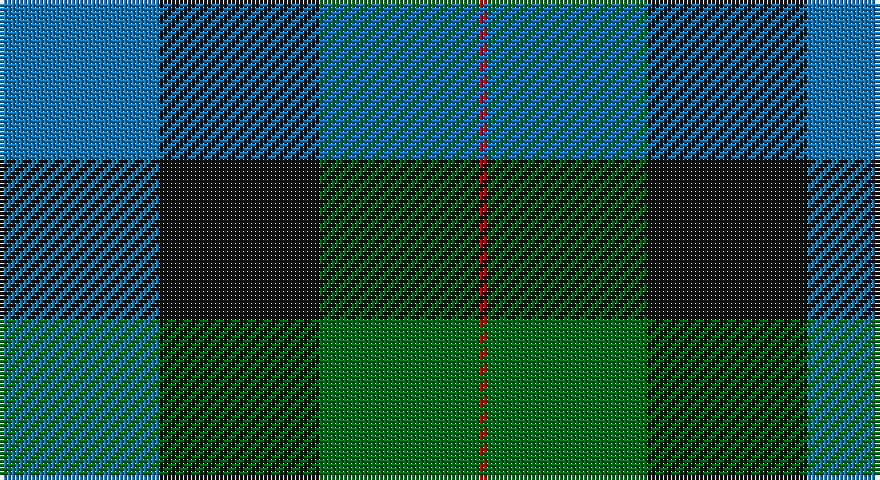

This page is one **sett** — a single exact thread-count. It belongs to the [tartan](/setts/b20k20g20r1/)
(the same proportion at any scale), whose colour order is pattern [BKGR](/stripes/bkgr/).

Part of the [Gunn](/tartans/gunn/) tartan — the named design grouping this sett with its other cloths.

Sourced from house-of-tartan.  It is a [4 stripe tartan](/stripes/stripes4/).

Original link http://www.house-of-tartan.scotland.net/house/TartanViewjs.asp?colr=Def&tnam=10459

## Provenance

Earliest known date: 17th July 2011 This is a variation on the original Gunn tartan, created in memory of the designer's grandfather, William Jesse Gunn and intended principally for the designer and his immediate family.

## Also known as

This cloth is also recorded under:

- Gunn 2011, Robert
- Gunn Personal

## Thread count
B/40 K40 G40 R/2

One full sett is **202 threads**.

## Palette

Palette: <strong>Tartan Register</strong>
<table><thead><tr><th>Colour</th><th>Threads</th><th>Shade</th><th>Base</th><th>OKLCh</th></tr></thead><tbody><tr><td>B/</td><td style="text-align:right;font-variant-numeric:tabular-nums">40</td><td><code style="background-color:#1474B4;">#1474B4</code> <small style="color:#888">#1474B4</small></td><td>B <code style="background-color:#2A418A;">#2A418A</code></td><td><small style="color:#888">oklch(54.0% 0.129 245.1)</small></td></tr><tr><td>K</td><td style="text-align:right;font-variant-numeric:tabular-nums">40</td><td><code style="background-color:#101010;">#101010</code> <small style="color:#888">#101010</small></td><td>K <code style="background-color:#000000;">#000000</code></td><td><small style="color:#888">oklch(17.3% 0.000 89.9)</small></td></tr><tr><td>G</td><td style="text-align:right;font-variant-numeric:tabular-nums">40</td><td><code style="background-color:#006818;">#006818</code> <small style="color:#888">#006818</small></td><td>G <code style="background-color:#006100;">#006100</code></td><td><small style="color:#888">oklch(45.0% 0.142 145.0)</small></td></tr><tr><td>R/</td><td style="text-align:right;font-variant-numeric:tabular-nums">2</td><td><code style="background-color:#C80000;">#C80000</code> <small style="color:#888">#C80000</small></td><td>R <code style="background-color:#CC0000;">#CC0000</code></td><td><small style="color:#888">oklch(52.3% 0.215 29.2)</small></td></tr></tbody></table>

# Sample pattern

## Nearest tartans

The nearest existing variants by ΔTartan distance, with this tartan at the top so the swatches line up against it.

ΔTartan

Tartan

Sett

—

<a href="/ttd/edit/#slug=b20k20g20r1~x2">Gunn (2011) Personal Tartan</a> <a class="nn-out" href="/variants/s4/b20k20g20r1~x2/" title="open its dictionary page">↗</a>

1.01

<a href="/ttd/edit/#slug=db20k20g20r1~x2&amp;base=b20k20g20r1~x2">Gunn (Personal)</a> <a class="nn-out" href="/variants/s4/db20k20g20r1~x2/" title="open its dictionary page">↗</a>

1.13

<a href="/ttd/edit/#slug=t20k20g20r1~x2&amp;base=b20k20g20r1~x2">Gunn 2011, Robert (Personal)</a> <a class="nn-out" href="/variants/s4/t20k20g20r1~x2/" title="open its dictionary page">↗</a>

1.26

<a href="/variants/s6/b12k4g6ly1~x8/">Sinclair of Ulbster</a>

1.27

<a href="/ttd/edit/#slug=k2g12k11b12w1~x2&amp;base=b20k20g20r1~x2">MacKirdy</a> <a class="nn-out" href="/variants/s5/k2g12k11b12w1~x2/" title="open its dictionary page">↗</a>

1.44

<a href="/ttd/edit/#slug=r2g23dbi11db22r2~x2&amp;base=b20k20g20r1~x2">Skibo</a> <a class="nn-out" href="/variants/s5/r2g23dbi11db22r2~x2/" title="open its dictionary page">↗</a>

1.57

<a href="/ttd/edit/#slug=lo4db24g3k21g23k1~x2&amp;base=b20k20g20r1~x2">Glenturret Distillery</a> <a class="nn-out" href="/variants/s6/lo4db24g3k21g23k1~x2/" title="open its dictionary page">↗</a>

1.58

<a href="/ttd/edit/#slug=db31g2k20ly2gi24~x2&amp;base=b20k20g20r1~x2">Landels (Personal)</a> <a class="nn-out" href="/variants/s5/db31g2k20ly2gi24~x2/" title="open its dictionary page">↗</a>

1.63

<a href="/ttd/edit/#slug=k20db50g50r3k3~x2&amp;base=b20k20g20r1~x2">Louisville Spaulding (Personal)</a> <a class="nn-out" href="/variants/s5/k20db50g50r3k3~x2/" title="open its dictionary page">↗</a>

1.65

<a href="/ttd/edit/#slug=t2db29t12g29w2~x2&amp;base=b20k20g20r1~x2">Wallace Blue (Fashion)</a> <a class="nn-out" href="/variants/s5/t2db29t12g29w2~x2/" title="open its dictionary page">↗</a>

1.66

<a href="/ttd/edit/#slug=dg21db10k26ly10r1~x2&amp;base=b20k20g20r1~x2">Charles-Carberry (Personal)</a> <a class="nn-out" href="/variants/s5/dg21db10k26ly10r1~x2/" title="open its dictionary page">↗</a>

## Neighbour map

Every grey dot is one of 14360 variants placed by the first two principal components of the ΔTartan feature space (44% of its variance). Red is this tartan; blue dots are its nearest — click one to open its page.

<svg viewBox="0 0 640 380" role="img" style="max-width:100%;height:auto;border:1px solid #e0e0e0;border-radius:4px;display:block" xmlns="http://www.w3.org/2000/svg"><image href="/nn/cloud.v1.png" width="640" height="380"/><a href="/variants/s4/db20k20g20r1~x2/"><circle cx="227.1" cy="260.4" r="4" fill="#3465a4"><title>Gunn (Personal)</title></circle></a><a href="/variants/s4/t20k20g20r1~x2/"><circle cx="175.0" cy="228.8" r="4" fill="#3465a4"><title>Gunn 2011, Robert (Personal)</title></circle></a><a href="/variants/s6/b12k4g6ly1~x8/"><circle cx="191.9" cy="240.6" r="4" fill="#3465a4"><title>Sinclair of Ulbster</title></circle></a><a href="/variants/s5/k2g12k11b12w1~x2/"><circle cx="179.1" cy="234.0" r="4" fill="#3465a4"><title>MacKirdy</title></circle></a><a href="/variants/s5/r2g23dbi11db22r2~x2/"><circle cx="216.3" cy="232.8" r="4" fill="#3465a4"><title>Skibo</title></circle></a><a href="/variants/s6/lo4db24g3k21g23k1~x2/"><circle cx="226.0" cy="199.4" r="4" fill="#3465a4"><title>Glenturret Distillery</title></circle></a><a href="/variants/s5/db31g2k20ly2gi24~x2/"><circle cx="218.6" cy="214.6" r="4" fill="#3465a4"><title>Landels (Personal)</title></circle></a><a href="/variants/s5/k20db50g50r3k3~x2/"><circle cx="255.5" cy="221.7" r="4" fill="#3465a4"><title>Louisville Spaulding (Personal)</title></circle></a><a href="/variants/s5/t2db29t12g29w2~x2/"><circle cx="248.9" cy="224.0" r="4" fill="#3465a4"><title>Wallace Blue (Fashion)</title></circle></a><a href="/variants/s5/dg21db10k26ly10r1~x2/"><circle cx="198.3" cy="193.7" r="4" fill="#3465a4"><title>Charles-Carberry (Personal)</title></circle></a><circle cx="201.7" cy="248.6" r="5" fill="#c00000"/></svg>

ID: /variants/s4/b20k20g20r1~x2/
